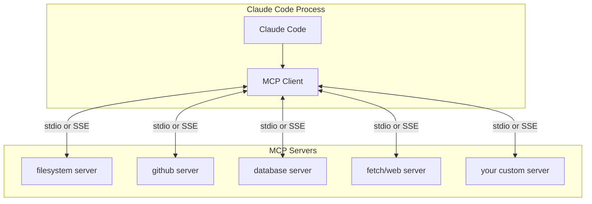
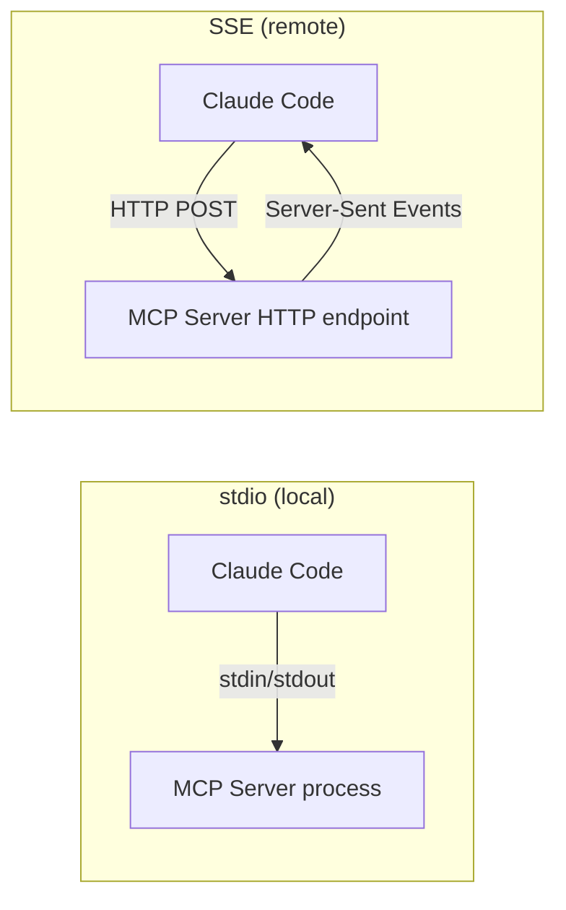

# MCP Servers

## The Story 📖

Think about a power drill. On its own, it drills holes. But with the right attachments — a screwdriver bit, a hole saw, a wire stripper adapter — the same tool can do a dozen different jobs. The drill doesn't need to know how to strip wire; it just needs the right attachment.

Claude Code's built-in tools are the drill: Read, Write, Edit, Bash, Grep. Powerful for coding tasks. But what about querying a live database? Or searching GitHub issues? Or fetching Confluence documentation? Claude can't do those things natively — but with the right MCP server attached, it can.

**MCP (Model Context Protocol)** is the attachment system. Each MCP server adds a new set of tools or data sources to Claude Code. You configure which servers to load, and Claude suddenly has access to databases, APIs, file systems, and external services — all with the same natural-language interface.

The power is in the standardization. Every MCP server speaks the same protocol, so Claude interacts with all of them the same way. The model doesn't need special training to use a new MCP server — it just reads the server's tool descriptions and knows how to use them.

👉 This is why we need **MCP Servers** — they give Claude Code extensible access to any external system, without changing how you interact with Claude.

---

## What is MCP in the Claude Code Context? 🔌

In Claude Code, **MCP (Model Context Protocol)** is a system for adding external tools and data sources to the Claude tool loop. When you register an MCP server, it exposes:

- **Tools** — callable functions Claude can invoke (like `search_github_issues`, `query_database`, `get_confluence_page`)
- **Resources** — data streams Claude can read (like live database content, file system trees)
- **Prompts** — reusable prompt templates the server exposes

Claude Code discovers these from each registered server at startup and can use them alongside its built-in tools throughout a session.

---

## Why It Exists — The Problem It Solves 🎯

### Problem 1: The walled garden problem

Claude Code's built-in tools cover the local file system and shell. But real engineering work involves external systems: databases, code review tools, documentation platforms, CI/CD systems, cloud infrastructure. Without MCP, Claude can't interact with any of these.

### Problem 2: Integration without training

Pre-MCP solutions required either: custom tool definitions per API (brittle), fine-tuning the model on specific APIs (expensive), or copy-pasting data into the conversation (slow). MCP lets Claude use any API through a standardized interface — no special training needed.

### Problem 3: One protocol, many servers

Without a standard protocol, every integration is one-off code. MCP gives the ecosystem a shared language — build once, connect anywhere. Thousands of community-built servers already exist for common tools.

👉 Without MCP: Claude Code is limited to local files and shell. With MCP: Claude Code can reach any system with an MCP server.

---

## MCP Architecture in Claude Code 🏗️



Claude Code acts as an **MCP client**. Each MCP server runs as a separate process. Communication happens over either:
- **stdio** — the server reads from stdin, writes to stdout (best for local processes)
- **SSE (Server-Sent Events)** — HTTP-based transport (best for remote servers)

---

## Adding MCP Servers to Claude Code ⚙️

MCP servers are registered in `settings.json` under the `mcpServers` key:

```json
{
  "mcpServers": {
    "filesystem": {
      "command": "npx",
      "args": ["-y", "@modelcontextprotocol/server-filesystem", "/tmp", "/home/user/docs"],
      "env": {}
    },
    "github": {
      "command": "npx",
      "args": ["-y", "@modelcontextprotocol/server-github"],
      "env": {
        "GITHUB_TOKEN": "${GITHUB_TOKEN}"
      }
    },
    "fetch": {
      "command": "npx",
      "args": ["-y", "@modelcontextprotocol/server-fetch"]
    }
  }
}
```

### Server object fields

| Field | Required | Description |
|-------|----------|-------------|
| `command` | Yes | Executable to run (npx, python, node, etc.) |
| `args` | Yes | Arguments to pass to the command |
| `env` | No | Environment variables for this server |
| `transport` | No | `"stdio"` (default) or `"sse"` |

For SSE (remote) servers:
```json
{
  "mcpServers": {
    "my-remote-server": {
      "transport": "sse",
      "url": "https://my-mcp-server.example.com/mcp"
    }
  }
}
```

---

## Transport Options 🚌



| Transport | When to use |
|-----------|------------|
| stdio | Local MCP servers — low latency, no network |
| SSE | Remote or hosted MCP servers |

Most official servers use stdio. Use SSE for servers you run as a web service or that are hosted by a third party.

---

## Official Anthropic MCP Servers 🛠️

Anthropic maintains a set of reference servers at `@modelcontextprotocol/`:

| Server | npm package | What it adds |
|--------|------------|-------------|
| filesystem | `server-filesystem` | Read/write/search files outside the current project |
| fetch | `server-fetch` | Fetch URLs with more control than WebFetch |
| git | `server-git` | Git operations and history |
| memory | `server-memory` | External knowledge graph / persistent memory |
| sequentialthinking | `server-sequentialthinking` | Structured multi-step reasoning |
| github | `server-github` | GitHub issues, PRs, repos |
| google-drive | `server-gdrive` | Google Drive file access |
| postgres | `server-postgres` | PostgreSQL queries |
| sqlite | `server-sqlite` | SQLite database queries |
| brave-search | `server-brave-search` | Web search via Brave API |

---

## Tools vs Resources vs Prompts 🔧

Every MCP server can expose three types of primitives:

### Tools

Callable functions Claude invokes with arguments:
```
Tool: search_github_issues
Input: {"query": "authentication bug", "repo": "myorg/myapp"}
Output: [list of matching issues with title, body, URL]
```

### Resources

Data streams Claude can read (like a file, database table, or live feed):
```
Resource: postgres://mydb/users
Content: The content of the users table in structured format
```

### Prompts

Pre-defined prompt templates the server exposes:
```
Prompt: github_pr_review
Template: "Review this PR considering the org's coding standards: {pr_url}"
```

In practice, most servers primarily expose tools. Resources and prompts are less common.

---

## Community MCP Servers 🌍

The MCP ecosystem has hundreds of community-built servers:

| Category | Examples |
|----------|---------|
| Databases | PostgreSQL, MySQL, MongoDB, Redis, Supabase |
| Code hosting | GitHub, GitLab, Bitbucket |
| Project management | Jira, Linear, GitHub Issues, Notion |
| Documentation | Confluence, Notion, Google Docs |
| Cloud | AWS, GCP, Terraform Cloud |
| Search | Brave Search, Tavily, Perplexity |
| Communication | Slack, Discord |
| Monitoring | Datadog, PagerDuty, Sentry |

Find them at: `mcp.so` or search GitHub for `model-context-protocol`.

---

## Using MCP Tools in a Session 💬

Once servers are registered, Claude discovers their tools at startup. You can then use them naturally:

```
> Search GitHub issues in myorg/myapp for "payment timeout" bugs
[Claude uses github_search_issues tool from MCP server]

> Query the database for all users who signed up in the last 7 days
[Claude uses postgres_query tool from MCP server]

> Read the Confluence page on our API authentication design
[Claude uses confluence_get_page tool from MCP server]

> What's the current error rate in Datadog?
[Claude uses datadog_metrics_query tool from MCP server]
```

---

## Common Mistakes to Avoid ⚠️

- **Mistake 1 — Registering servers that aren't installed:** If you register an npm-based server and npm isn't installed, the server will fail to start silently. Test each server before relying on it.
- **Mistake 2 — Not scoping filesystem servers:** The filesystem MCP server takes allowed paths as arguments. Give it the narrowest scope needed — don't allow access to `/` or `~`.
- **Mistake 3 — Storing API tokens in settings.json directly:** Use `"${ENV_VAR}"` interpolation for all tokens. Never hardcode them.
- **Mistake 4 — Slow MCP servers degrading the session:** Remote MCP servers with high latency slow down every tool call. Use local stdio servers for performance-sensitive workflows.
- **Mistake 5 — Overlooking the security model:** MCP servers run with your permissions. A compromised MCP server has the same access Claude Code has. Audit community servers before using them.

---

## Connection to Other Concepts 🔗

- Relates to **MCP (Model Context Protocol)** fundamentals covered in Section 11 of this repo
- Relates to **Permissions and Security** because MCP servers inherit your machine's permissions
- Relates to **Agents and Subagents** because subagents can be given different MCP server configurations
- Relates to **Hooks** because both hooks and MCP extend Claude's capabilities, but via different mechanisms

---

✅ **What you just learned:** MCP servers extend Claude Code with tools for external systems (databases, GitHub, web search) via the standardized Model Context Protocol. Registered in `settings.json` under `mcpServers`, they communicate over stdio or SSE, exposing tools, resources, and prompts that Claude uses naturally in conversation.

🔨 **Build this now:** Add the `@modelcontextprotocol/server-fetch` server to your settings.json. Then ask Claude to fetch and summarize a public API documentation page. Observe how Claude uses the MCP tool naturally.

➡️ **Next step:** [Agents and Subagents](../10_Agents_and_Subagents/Theory.md) — learn how Claude Code spawns parallel subagents for complex, parallel work.

---

## 📂 Navigation

**In this folder:**
| File | |
|---|---|
| 📄 **Theory.md** | ← you are here |
| [📄 Cheatsheet.md](./Cheatsheet.md) | Quick reference |
| [📄 Interview_QA.md](./Interview_QA.md) | Interview prep |
| [📄 Architecture_Deep_Dive.md](./Architecture_Deep_Dive.md) | Deep architecture |

⬅️ **Prev:** [Hooks](../08_Hooks/Theory.md) &nbsp;&nbsp;&nbsp; ➡️ **Next:** [Agents and Subagents](../10_Agents_and_Subagents/Theory.md)
