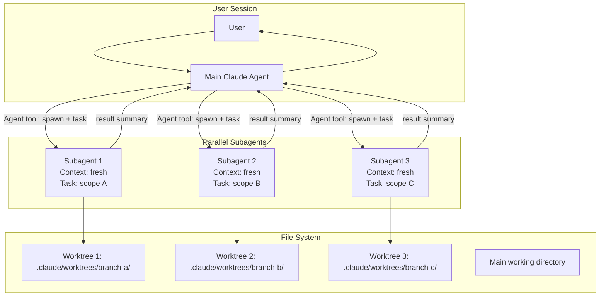
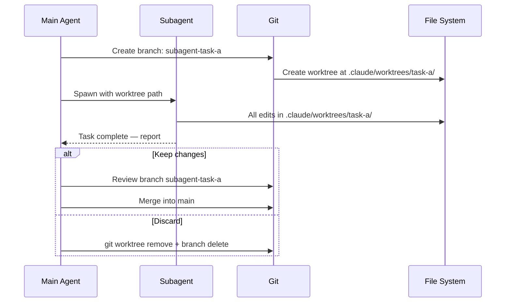
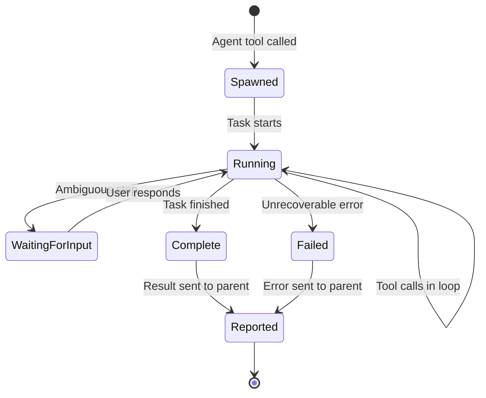

# Agents and Subagents — Architecture Deep Dive

## The Full Orchestration Architecture



---

## Agent Tool Invocation Anatomy

When Claude Code uses the Agent tool internally:

```json
{
  "tool": "Agent",
  "input": {
    "task": "Write Theory.md and Cheatsheet.md for the 01_What_is_Claude_Code topic. Follow style rules in /project/CLAUDE.md. Use 200+ lines for Theory.md. Include Mermaid diagrams.",
    "worktree": true,
    "context_files": [
      "/project/CLAUDE.md",
      "/project/.claude/memory/MEMORY.md"
    ]
  }
}
```

The Agent tool:
1. Creates a new Claude process
2. Seeds it with the task description and optional context files
3. The subagent runs its full agentic loop to completion
4. Returns a result summary to the parent agent

---

## Worktree Lifecycle



---

## Context Isolation Model

```
Main agent context:
┌─────────────────────────────────────────┐
│ CLAUDE.md (loaded)                      │
│ MEMORY.md (loaded)                      │
│ User conversation history               │
│ Subagent result summaries               │
│ [No subagent execution details]         │
└─────────────────────────────────────────┘

Subagent A context (isolated):
┌─────────────────────────────────────────┐
│ CLAUDE.md (loaded from task description)│
│ MEMORY.md (read from file path given)   │
│ Task description from parent            │
│ Files read during execution             │
│ [No parent agent history]               │
└─────────────────────────────────────────┘
```

The isolation means each subagent has clean context for its scope and the main agent context stays clean with just summaries.

---

## Parallel Execution Timeline

```
Timeline:

Time 0:  Main agent spawns SA1, SA2, SA3 simultaneously

         SA1          SA2          SA3
T=0      Start        Start        Start
T=1      Read files   Read files   Read files
T=2      Write 1/3    Write 1/3    Write 1/3
T=3      Write 2/3    Write 2/3    Write 2/3
T=4      Write 3/3    Write 3/3    Complete ✓
T=5      Complete ✓   Complete ✓
T=6      
T=7      Main agent collects all 3 results

Sequential equivalent:
T=0→T=4   SA1 (all work)
T=4→T=8   SA2 (all work)
T=8→T=12  SA3 (all work)

Speedup: ~3x for fully parallel independent tasks
```

---

## Rate Limiting and Cost Considerations

```
API consumption with N parallel agents:
- Input tokens:  N × single_agent_input
- Output tokens: N × single_agent_output
- RPM usage:     N × single_agent_requests

With 5 parallel agents:
- 5× token consumption
- 5× API requests in the same time window
- Subject to rate limits: TPM (tokens/min) and RPM (requests/min)

Practical guidance:
- 2-3 agents: usually fine on all tiers
- 4-5 agents: fine on higher tiers, may throttle on free tier
- 6+ agents: watch for TPM rate limits; add delays if needed
```

---

## Background Agent State Machine



---

## 📂 Navigation

**In this folder:**
| File | |
|---|---|
| [📄 Theory.md](./Theory.md) | Full concept explanation |
| [📄 Cheatsheet.md](./Cheatsheet.md) | Quick reference |
| [📄 Interview_QA.md](./Interview_QA.md) | Interview prep |
| 📄 **Architecture_Deep_Dive.md** | ← you are here |
| [📄 Code_Example.md](./Code_Example.md) | Practical examples |

⬅️ **Prev:** [MCP Servers](../09_MCP_Servers/Theory.md) &nbsp;&nbsp;&nbsp; ➡️ **Next:** [IDE Integration](../11_IDE_Integration/Theory.md)
