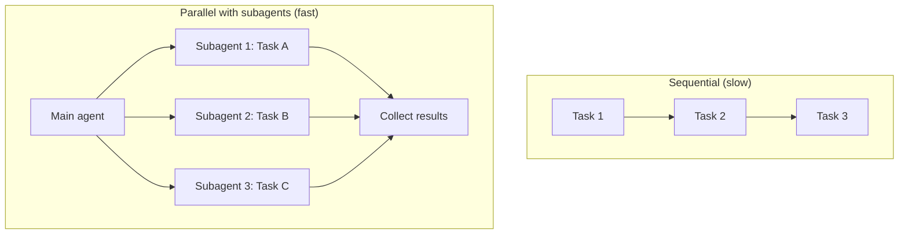
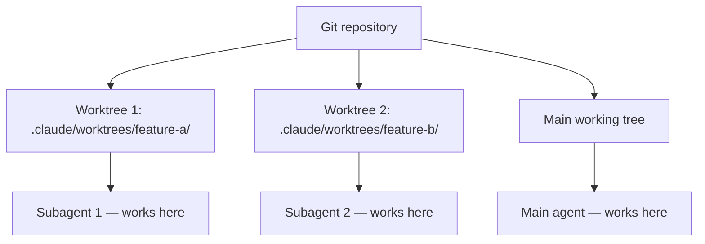
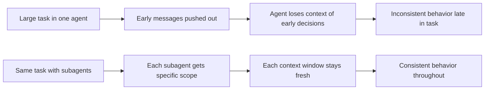
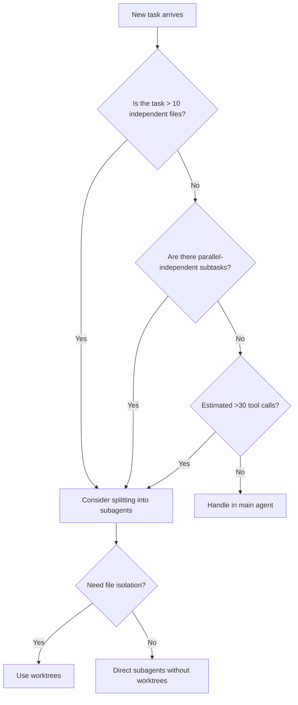

# Agents and Subagents

## The Story 📖

Imagine you're the project manager on a large renovation. There's too much work for one contractor. You need to plumb, rewire, tile, and paint — all before the deadline. You could do everything sequentially: finish plumbing, then wiring, then tiling, then painting. Or you could hire a plumber, an electrician, a tiler, and a painter and run them all in parallel.

The project manager (you) delegates specific tasks to specific specialists. Each specialist works independently in their designated area. You don't micromanage — you brief them, they execute, and they report back when done. You collect the results and assemble the final picture.

That's the Claude Code subagent model. The main Claude session is the project manager. Subagents are the specialist workers. Tasks that are independent of each other can run in parallel. Each subagent gets a specific, bounded task, runs it to completion, and reports back.

The result: complex, multi-part tasks that would take an hour sequentially can finish in minutes when parallelized.

👉 This is why we need **Agents and Subagents** — parallel, isolated workers that let Claude Code tackle complex multi-part tasks far faster than any single sequential agent could.

---

## What are Agents and Subagents? 🤖

In Claude Code, **agents** and **subagents** refer to separate Claude instances (each with their own context window) that can be spawned to work on specific tasks in parallel.

- The **main agent** is your primary Claude Code session
- A **subagent** is a new Claude instance spawned to work on a specific delegated task
- Subagents have their own tool access, their own context, and can run concurrently
- When done, each subagent reports its result back to the main agent (or to you directly)

The mechanism for spawning subagents is the **Agent tool** — a special tool built into Claude Code that creates and manages child agent instances.

---

## Why It Exists — The Problem It Solves 🎯

### Problem 1: Sequential bottlenecks in complex tasks

Writing 12 files for a new feature? Doing it one at a time is 12x slower than doing it in parallel. Subagents eliminate this bottleneck.

### Problem 2: Context window saturation

A single agent trying to refactor 50 files will eventually fill its context window with old messages and lose track of early decisions. Each subagent starts with a clean context, delegated a specific scope.

### Problem 3: Cross-contamination in parallel work

If one Claude session is modifying `src/auth/` and another is modifying `src/payments/`, they might conflict. Worktrees provide isolated file system copies — each subagent works in its own branch without seeing the other's in-progress changes.

👉 Without subagents: complex tasks are sequential and context-limited. With subagents: parallel, isolated, fast.

---

## The Agent Tool 🛠️

The **Agent tool** is Claude Code's mechanism for spawning subagents. When Claude uses it, it:

1. Creates a new Claude Code instance with a specified task
2. Optionally gives it a separate working directory (worktree)
3. Runs the task to completion
4. Returns the result to the calling (parent) agent

```
Parent agent: "Write Theory.md, Cheatsheet.md, and Interview_QA.md 
               for topics 01, 02, and 03 simultaneously."

[Parent spawns 3 subagents in parallel]

Subagent A: Working on topic 01 files...
Subagent B: Working on topic 02 files...
Subagent C: Working on topic 03 files...

[All complete]

Parent agent: Collects results, reports to user.
```

---

## Parallel vs Sequential Agents 🔀



Use parallel subagents when tasks are:
- Independent of each other (no dependencies)
- Roughly equal in complexity
- Too large for one context window together

---

## Background Agents 🌙

Background agents are subagents that run without blocking the main session. You continue working while the background agent completes its task.

```
Main agent: "Spawn a background agent to write the test suite for 
             the new auth module. Report back when done."

[Background agent starts running independently]

User: [Continues working on other tasks in main session]

[Background agent finishes]
Background agent: "Tests written. All 23 tests passing."
```

Background agents are useful for:
- Long-running tasks (migration scripts, large refactors)
- Tasks with uncertain completion time
- Tasks where you don't need to supervise execution

---

## Worktrees for Isolation 🌲

**Worktrees** are separate Git working directories that share the same repository but have independent file states. Claude Code can create a worktree for a subagent so it can modify files without conflicting with other agents.



Each worktree is on its own branch. When subagent work is complete:
- Keep the worktree: merge or review it separately
- Remove the worktree: discard changes

This is the safest pattern for parallel file modification — no risk of merge conflicts mid-task.

---

## Context Window Management 📊

Context window management is the key reason to use subagents for large tasks:



Rule of thumb: If a task will involve more than ~30 file reads and edits, consider breaking it across subagents.

---

## When to Delegate to a Subagent 🤔



---

## Subagent Context Passing 📨

Subagents start with a specific task description and can be given additional context:

```
Subagent task: "Write Theory.md for topic '01_What_is_Claude_Code'.
Cover: CLI for Claude, agentic coding loop, file editing/reading tools,
how it differs from chat, use cases, the agent loop model.
Follow the style rules in CLAUDE.md at /project/CLAUDE.md.
Read MEMORY.md at /project/.claude/memory/MEMORY.md for project context."
```

Key principle: subagents should be self-sufficient. Give them everything they need in the task description — don't rely on shared in-context state with the parent.

---

## Subagent Result Aggregation 🗂️

After parallel subagents complete, the main agent collects and reconciles their work:

```
Main agent collects:
- Subagent A result: "Wrote 3 files in topic 01/"
- Subagent B result: "Wrote 3 files in topic 02/"
- Subagent C result: "Wrote 3 files in topic 03/ — found a naming issue in Q7"

Main agent: Reads the subagent reports, checks for issues, 
            ensures consistency, reports summary to user.
```

The main agent doesn't re-read every file — it trusts the subagents to report accurately and only digs deeper if something looks wrong.

---

## Common Mistakes to Avoid ⚠️

- **Mistake 1 — Using subagents for dependent tasks:** If task B depends on task A's output, they can't run in parallel. Map dependencies before deciding what to parallelize.
- **Mistake 2 — Underbriefing subagents:** A subagent given only "write the tests" with no context about the project will produce generic tests. Include project context in the task description.
- **Mistake 3 — Not using worktrees for parallel file edits:** Two subagents modifying the same directory without worktrees can produce merge conflicts or overwrites.
- **Mistake 4 — Spawning too many subagents:** There are API rate limits and cost implications. 3-5 parallel subagents is a sweet spot. 20+ parallel agents will hit rate limits.
- **Mistake 5 — Assuming subagents share state:** Each subagent has its own context window. They don't share memory with each other or the parent unless explicitly passed via task description.

---

## Connection to Other Concepts 🔗

- Relates to **AI Agents** (Section 10) because the subagent model is an implementation of the orchestrator-worker multi-agent pattern
- Relates to **Memory System** because subagents can read MEMORY.md to bootstrap project context
- Relates to **MCP Servers** because subagents can be configured with different MCP servers than the parent
- Relates to **Permissions and Security** because subagents inherit the parent's permissions by default

---

✅ **What you just learned:** Claude Code can spawn parallel subagents via the Agent tool — each with their own context window, working on independent tasks simultaneously. Worktrees provide file system isolation for parallel file modifications. This turns large sequential tasks into parallel workloads.

🔨 **Build this now:** Give Claude Code a task that has 3 clearly independent parts (e.g., "Write Theory.md for topics 01, 02, and 03"). Watch how it uses the Agent tool to parallelize the work. Compare the time to doing them sequentially.

➡️ **Next step:** [IDE Integration](../11_IDE_Integration/Theory.md) — learn how Claude Code works alongside VS Code and JetBrains.

---

## 📂 Navigation

**In this folder:**
| File | |
|---|---|
| 📄 **Theory.md** | ← you are here |
| [📄 Cheatsheet.md](./Cheatsheet.md) | Quick reference |
| [📄 Interview_QA.md](./Interview_QA.md) | Interview prep |
| [📄 Architecture_Deep_Dive.md](./Architecture_Deep_Dive.md) | Architecture details |
| [📄 Code_Example.md](./Code_Example.md) | Practical examples |

⬅️ **Prev:** [MCP Servers](../09_MCP_Servers/Theory.md) &nbsp;&nbsp;&nbsp; ➡️ **Next:** [IDE Integration](../11_IDE_Integration/Theory.md)
