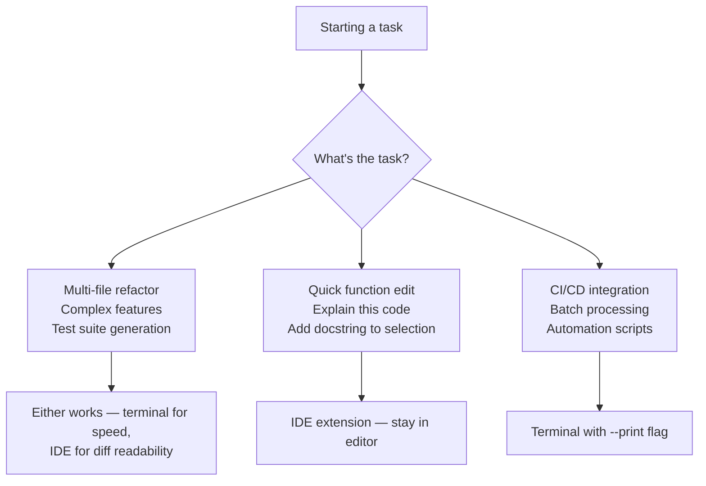

# IDE Integration

## The Story 📖

Think about the difference between working at a construction site and working at an architect's drafting table. The contractor on site can measure walls, test materials, drill and nail and fix things in real time — they're in the physical environment. The architect at the drafting table can see the whole building at once, overlay blueprints, highlight changes, draw precise modifications — they have visual overview and precision tooling.

Claude Code in the terminal is the contractor. The IDE integration is the drafting table. Both get real work done, but they serve different interaction models. Sometimes you want the raw speed of the terminal. Sometimes you want to see changes inline in your editor, next to the code you're reading, with a diff view right there in context.

The IDE extensions for Claude Code (VS Code, JetBrains) don't replace the CLI — they surface the same agentic capabilities through the editor's UI. The same permissions system, the same CLAUDE.md context, the same tool loop — but rendered in a panel alongside your code rather than a separate terminal window.

👉 This is why we need **IDE Integration** — to access Claude Code's power without leaving your editor, with visual diff views and inline editing right where you're working.

---

## What is IDE Integration? 🖥️

**IDE Integration** refers to the official extensions that bring Claude Code into your code editor:

- **VS Code extension:** `@anthropic-ai/vscode-claude-code` — available in the VS Code marketplace
- **JetBrains plugin:** Available for IntelliJ IDEA, PyCharm, WebStorm, etc.

These extensions run Claude Code as a panel inside the IDE, providing:
- A chat-style input panel for tasks
- Inline diff view for file edits (shown directly in the editor)
- Status bar indicators showing Claude's current state
- Keyboard shortcuts for common actions
- Direct integration with the open file and project context

---

## Why It Exists — The Problem It Solves 🎯

### Problem 1: Context-switching between editor and terminal

Using Claude Code in a separate terminal means constant switching: run Claude in terminal, see output in terminal, switch to editor to review changes, switch back to terminal to respond. IDE integration collapses this into one window.

### Problem 2: Diff review friction

Reviewing Claude's proposed file edits in a terminal diff is functional but not ergonomic. IDE integration shows diffs in the editor's native diff viewer — with syntax highlighting, side-by-side view, and familiar navigation.

### Problem 3: File context awareness

Without IDE integration, Claude Code gets file context by reading the file system. With IDE integration, it can also see your currently open file, your cursor position, and your selection — allowing more contextual interactions like "explain this function" or "refactor this selection."

👉 Without IDE integration: you context-switch between editor and terminal. With IDE integration: Claude Code lives in your editor alongside your code.

---

## VS Code Extension 💙

### Installation

```bash
# From VS Code marketplace
ext install anthropic.claude-code

# Or via command line
code --install-extension anthropic.claude-code
```

### Key Features

| Feature | Description |
|---------|-------------|
| Claude panel | Side panel with chat interface and history |
| Inline diffs | File edits shown in VS Code's diff viewer |
| Status bar | Shows active model, session cost, and agent state |
| Command palette | All Claude Code commands accessible via Ctrl+Shift+P |
| Right-click menu | "Ask Claude" option on selected code |
| Terminal integration | Runs Claude Code in embedded terminal |

### Status Bar Indicators

The status bar shows Claude Code state:
- `Claude: Ready` — idle, waiting for input
- `Claude: Thinking...` — planning next action
- `Claude: Editing` — executing a file edit
- `Claude: Running` — executing a bash command
- `$0.04 | claude-sonnet-4-6` — session cost and active model

### Keyboard Shortcuts (VS Code)

| Shortcut | Action |
|----------|--------|
| `Ctrl+Shift+C` | Open Claude Code panel |
| `Ctrl+Shift+K` | Ask Claude about selection |
| `Ctrl+Enter` | Send message to Claude |
| `Escape` | Cancel current Claude action |
| `Ctrl+Z` | Undo Claude's last edit (standard undo) |

---

## JetBrains Plugin 🧠

### Installation

1. Open JetBrains IDE → Settings → Plugins
2. Search for "Claude Code"
3. Install the Anthropic official plugin
4. Restart the IDE

### Key Features

| Feature | Description |
|---------|-------------|
| Tool window | Dockable Claude Code panel |
| Inline suggestions | Claude suggestions appear inline |
| Diff view | Built-in JetBrains diff viewer integration |
| Inspections | Claude can integrate with code inspections |
| File context | Auto-detects current file and project |

---

## Diff View in IDE 📋

When Claude Code proposes a file edit, the IDE integration shows it in the native diff viewer:

```
VS Code diff view:
┌────────────────────────────────┬────────────────────────────────┐
│ Original                       │ Modified                       │
├────────────────────────────────┼────────────────────────────────┤
│  def register(email, password):│  def register(email, password):│
│                                │+    if not email or "@" not in │
│                                │+        raise ValueError(...)  │
│      db.create_user(...)       │      db.create_user(...)       │
└────────────────────────────────┴────────────────────────────────┘
│  [Accept]  [Reject]  [Accept All]  [Reject All]                  │
```

This is significantly more readable than terminal diff output for large changes.

---

## Inline Editing 📝

IDE integration enables inline editing interactions:

```
// Right-click on a function → "Ask Claude to refactor this"
// Or select code → Ctrl+Shift+K → "Add error handling"

// Claude's proposed change appears as an inline diff
// You review and accept/reject without leaving the editor
```

Inline editing is best for:
- Single-function refactors
- Docstring generation
- Adding type hints to selected code
- Explaining a specific code block

---

## CLI vs IDE Integration — When to Use Each 🔀



---

## Switching Between CLI and IDE 🔄

Claude Code in the terminal and the IDE extension share:
- The same CLAUDE.md config
- The same settings.json
- The same session memory
- The same `--continue` functionality

You can start a task in the terminal and continue it in the IDE, or vice versa, using `--continue`. The session state persists across both interfaces.

---

## Common Mistakes to Avoid ⚠️

- **Mistake 1 — Installing both extension and terminal simultaneously with conflicting configs:** Both read the same config files, so there's no real conflict — but launching two Claude Code sessions simultaneously on the same project can cause unexpected behavior.
- **Mistake 2 — Expecting the IDE extension to be faster than terminal:** The agent loop latency is the same — the IDE extension adds a UI layer, not speed.
- **Mistake 3 — Not using keyboard shortcuts:** The Claude panel is much more efficient with keyboard shortcuts. Learn `Ctrl+Shift+C` and `Ctrl+Enter` at minimum.
- **Mistake 4 — Missing the status bar:** The status bar shows you what Claude is doing and how much it's costing. Check it regularly during long sessions.

---

## Connection to Other Concepts 🔗

- Relates to **Basic Usage and Commands** because all the same commands and flags work through the IDE extension
- Relates to **Permissions and Security** because the same permission system applies — you still approve edits in the diff view
- Relates to **CLAUDE.md and Settings** because the same config files are loaded regardless of interface

---

✅ **What you just learned:** Claude Code's VS Code and JetBrains integrations bring the full agentic CLI experience into your editor — with native diff views, inline editing, status bar indicators, and keyboard shortcuts — making it easy to use Claude Code without leaving your development environment.

🔨 **Build this now:** Install the VS Code Claude Code extension. Open a project, launch the Claude Code panel, and ask Claude to explain the current file. Practice accepting a diff from within the IDE.

➡️ **Next step:** [Permissions and Security](../12_Permissions_and_Security/Theory.md) — understand the full permission model and how to configure security for production workflows.

---

## 📂 Navigation

**In this folder:**
| File | |
|---|---|
| 📄 **Theory.md** | ← you are here |
| [📄 Cheatsheet.md](./Cheatsheet.md) | Quick reference |
| [📄 Interview_QA.md](./Interview_QA.md) | Interview prep |

⬅️ **Prev:** [Agents and Subagents](../10_Agents_and_Subagents/Theory.md) &nbsp;&nbsp;&nbsp; ➡️ **Next:** [Permissions and Security](../12_Permissions_and_Security/Theory.md)
