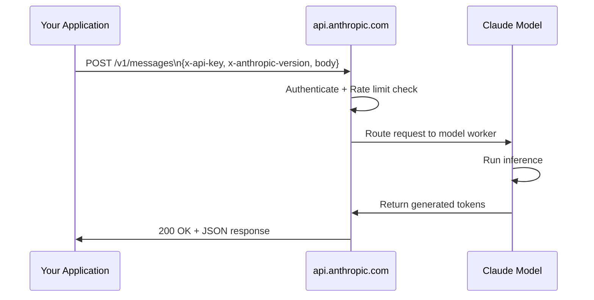
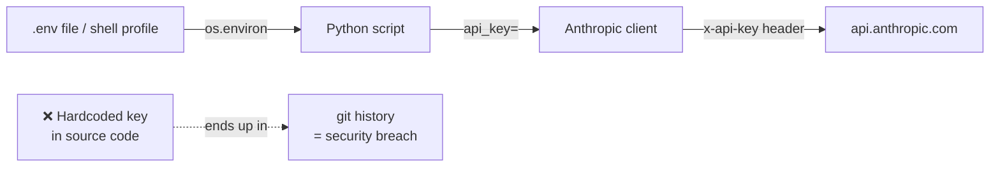
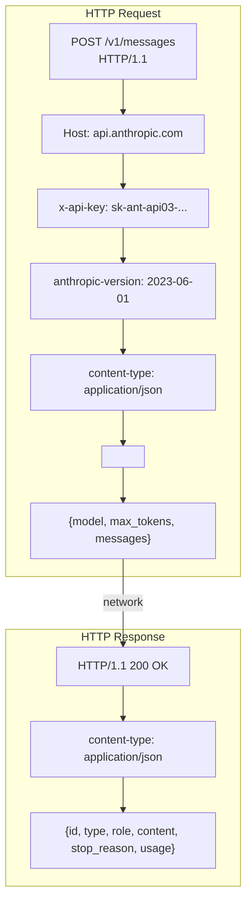

# API Basics

## The Story 📖

Imagine you walk into a restaurant. You don't go into the kitchen, touch the stove, or talk to the chefs directly. Instead, you pick up a menu, tell the waiter what you want, and the kitchen delivers it back to your table. The waiter is the intermediary — they speak your language, carry your request to the back, and return with the result.

An **API (Application Programming Interface)** works exactly like that waiter. Your code is the customer. The Anthropic servers are the kitchen. The API is the standardized protocol that lets them talk without either side needing to know the internal details of the other.

The Anthropic API is a REST API — meaning your code sends HTTP requests over the internet, just like a browser does when you visit a webpage. The difference is that instead of asking for an HTML page, you're asking a world-class AI model to generate text, analyze images, or call tools.

👉 This is why we need the **API** — it gives any application a clean, language-agnostic door to Claude's intelligence.

---

## 📌 Learning Priority

**Must Learn** — core concepts, needed to understand the rest of this file:
[REST API Basics](#what-is-the-anthropic-rest-api-) · [Required Headers](#required-headers-) · [API Versioning](#api-versioning-)

**Should Learn** — important for real projects and interviews:
[Env Variable Best Practices](#environment-variable-best-practices-) · [Rate Limits](#rate-limits-) · [Python SDK Usage](#raw-http-vs-sdk-)

**Good to Know** — useful in specific situations, not needed daily:
[Request Anatomy](#the-full-request-anatomy-) · [Base URL and Endpoints](#the-base-url-and-endpoints-)

**Reference** — skim once, look up when needed:
[Common Mistakes](#common-mistakes-to-avoid-)

---

## What is the Anthropic REST API? 🌐

The **Anthropic REST API** is an HTTP-based interface that lets any program — Python scripts, web apps, mobile apps, data pipelines — send messages to Claude and receive intelligent responses.

Key characteristics:
- **REST (Representational State Transfer):** Uses standard HTTP verbs (POST for creating resources)
- **JSON payloads:** Request and response bodies are JSON
- **Stateless:** Each request is independent; the server holds no session memory
- **Authentication via headers:** Your API key travels with every request
- **Versioned:** The API version is declared in a header, not the URL path

#### Real-world examples

- **Customer support bot:** A web app sends a customer message to the API and streams Claude's reply back to the UI
- **Code reviewer:** A CI/CD pipeline sends a git diff to the API and gets back a review comment
- **Data extractor:** A Python script sends raw OCR text and gets back structured JSON fields

---

## Why It Exists — The Problem It Solves 🔧

Without the API, using Claude would require:
1. Running a multi-billion-parameter model locally — impractical for most machines
2. Deep knowledge of model internals — no abstraction layer
3. Re-implementing inference infrastructure — GPUs, batching, memory management

The API solves all three:
1. Claude runs on Anthropic's infrastructure; your code just sends HTTP
2. You interact through a clean contract (JSON in, JSON out)
3. Scaling, load balancing, and model updates happen invisibly

👉 Without the API: Claude is a research artifact. With the API: Claude is a production-ready building block in any application.

---

## How It Works — Step by Step 🔄

### Step 1: Your code constructs an HTTP request

Every API call is a POST request to a specific endpoint. The request carries:
- An authorization header with your API key
- A content-type header declaring JSON
- An API version header
- A JSON body describing what you want

### Step 2: Anthropic authenticates and routes

Anthropic's servers check the API key, enforce rate limits, and route the request to available model workers.

### Step 3: Claude processes and responds

The model runs inference and returns a JSON response containing the generated content, token counts, and stop reason.



---

## The Base URL and Endpoints 🔗

All Anthropic API requests go to:

```
https://api.anthropic.com
```

The main endpoint you'll use:

| Endpoint | Method | Purpose |
|---|---|---|
| `/v1/messages` | POST | Create a message (single or streaming) |
| `/v1/messages/batches` | POST | Submit a batch of requests |
| `/v1/messages/batches/{id}` | GET | Poll batch status |

---

## Required Headers 📋

Every request must include these three headers:

### 1. x-api-key
Your **API key** — the secret credential that identifies your Anthropic account.

```
x-api-key: sk-ant-api03-...
```

Never hardcode this in source code. Store it in an environment variable.

### 2. anthropic-version
The **API version** date string. This pins the API contract so Anthropic can evolve the API without breaking your code.

```
anthropic-version: 2023-06-01
```

Always use `2023-06-01` — this is the current stable version.

### 3. content-type
Standard HTTP header telling the server the body is JSON.

```
content-type: application/json
```

---

## Environment Variable Best Practices 🔐

Hardcoding API keys in source code is one of the most common security mistakes. The key will end up in version control, in logs, and potentially in public repositories.

The correct pattern:

```bash
# Set once in your shell profile or .env file
export ANTHROPIC_API_KEY="sk-ant-api03-..."
```

```python
import os
import anthropic

# SDK reads ANTHROPIC_API_KEY automatically from environment
client = anthropic.Anthropic()

# Or explicitly:
client = anthropic.Anthropic(api_key=os.environ.get("ANTHROPIC_API_KEY"))
```



### Using python-dotenv

```python
from dotenv import load_dotenv
load_dotenv()  # loads .env file automatically

import anthropic
client = anthropic.Anthropic()  # picks up ANTHROPIC_API_KEY from .env
```

Add `.env` to your `.gitignore`:

```
# .gitignore
.env
*.env
```

---

## API Versioning 📅

Anthropic uses **date-based API versioning** declared in the `anthropic-version` header (not the URL). This design means:

- The URL stays stable: always `https://api.anthropic.com/v1/messages`
- You opt into behavior by declaring a version date
- Anthropic can ship new features without breaking old callers
- When you're ready to adopt new behavior, update the version string

```
anthropic-version: 2023-06-01
```

This is analogous to Accept headers in content negotiation — you declare what contract you expect.

---

## Rate Limits 🚦

Anthropic enforces **rate limits** to ensure fair access across all users and protect infrastructure. Limits apply across two dimensions:

| Dimension | What it counts |
|---|---|
| **Requests Per Minute (RPM)** | Number of API calls in a 60-second window |
| **Tokens Per Minute (TPM)** | Total input + output tokens in a 60-second window |
| **Tokens Per Day (TPD)** | Total tokens consumed in a 24-hour period |

Rate limits vary by plan tier (Free, Build, Scale) and by model. Haiku has higher limits than Opus.

When you exceed limits, you receive:

```
HTTP 429 Too Many Requests
```

Response headers tell you when you can retry:

```
retry-after: 30
x-ratelimit-remaining-requests: 0
x-ratelimit-reset-requests: 2024-01-01T00:01:00Z
```

The right response is **exponential backoff** — wait progressively longer between retries, with jitter added to prevent thundering herd problems.

---

## Raw HTTP vs SDK 🧱

You can call the API two ways:

### Raw HTTP (using curl or requests)

```bash
curl https://api.anthropic.com/v1/messages \
  -H "x-api-key: $ANTHROPIC_API_KEY" \
  -H "anthropic-version: 2023-06-01" \
  -H "content-type: application/json" \
  -d '{
    "model": "claude-sonnet-4-6",
    "max_tokens": 1024,
    "messages": [{"role": "user", "content": "Hello!"}]
  }'
```

### Python SDK (recommended)

```python
import anthropic

client = anthropic.Anthropic()  # reads ANTHROPIC_API_KEY from env

message = client.messages.create(
    model="claude-sonnet-4-6",
    max_tokens=1024,
    messages=[{"role": "user", "content": "Hello!"}]
)
print(message.content[0].text)
```

The SDK handles:
- Setting all required headers automatically
- JSON serialization/deserialization
- Retry logic with backoff
- Streaming via context managers
- Type hints and IDE completion

---

## The Full Request Anatomy 🏗️



---

## Common Mistakes to Avoid ⚠️

- **Mistake 1 — Hardcoding API keys:** Commits them to git. Always use environment variables.
- **Mistake 2 — Missing `anthropic-version` header:** Raw HTTP calls without this header fail.
- **Mistake 3 — No retry logic:** A single 429 or transient 500 will crash your app. Build in backoff.
- **Mistake 4 — Ignoring `max_tokens`:** Without it, you get a default that may truncate your response. Always set it explicitly.
- **Mistake 5 — Using the wrong base URL:** Some older tutorials show `https://api.anthropic.com/v1` — the correct path for messages is `/v1/messages`.

---

## Connection to Other Concepts 🔗

- Relates to **Messages API** (Topic 02) because the Messages endpoint is the primary surface of this REST API
- Relates to **Error Handling** (Topic 12) because 4xx/5xx HTTP responses require specific handling strategies
- Relates to **Cost Optimization** (Topic 11) because every API call consumes tokens counted by the billing system
- Relates to **Streaming** (Topic 06) because streaming uses the same endpoint with an extra `stream: true` parameter

---

✅ **What you just learned:** The Anthropic REST API is an HTTP POST interface at `api.anthropic.com/v1/messages` that requires three headers (x-api-key, anthropic-version, content-type) and returns JSON responses.

🔨 **Build this now:** Export `ANTHROPIC_API_KEY` to your shell, then make a raw curl request to `/v1/messages` with a simple "Say hello" prompt. Inspect every field of the JSON response.

➡️ **Next step:** [Messages API](../02_Messages_API/Theory.md) — dive deep into the request and response structure of the core endpoint.

---

## 📂 Navigation

**In this folder:**
| File | |
|---|---|
| 📄 **Theory.md** | ← you are here |
| [📄 Cheatsheet.md](./Cheatsheet.md) | Quick reference |
| [📄 Interview_QA.md](./Interview_QA.md) | Interview prep |
| [📄 Code_Example.md](./Code_Example.md) | Working code |

⬅️ **Prev:** [Track 3 Overview](../README.md) &nbsp;&nbsp;&nbsp; ➡️ **Next:** [Messages API](../02_Messages_API/Theory.md)
