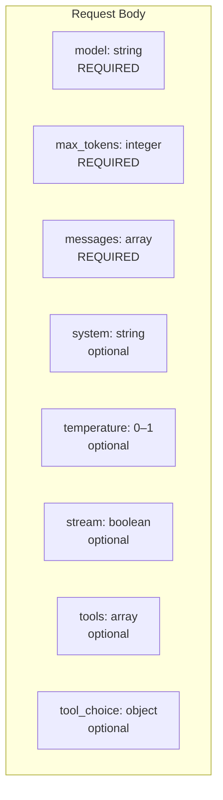
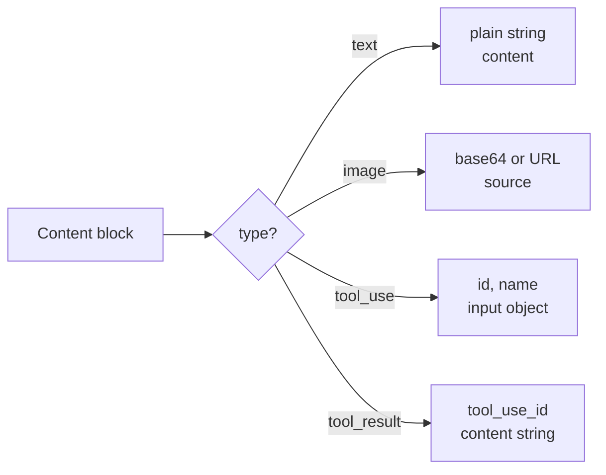
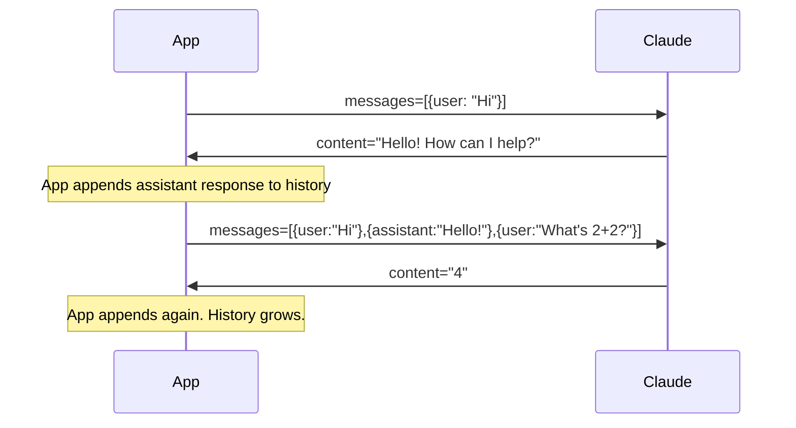

# Messages API

## The Story 📖

Think about how you write a letter. You have the letter itself (the content), the person you're writing to (the role), and what you're asking for. But a conversation is more than one letter — it's a stack of letters exchanged back and forth. Each one refers to the previous ones.

The **Messages API** formalizes exactly this structure. Every conversation is an ordered array of messages, each tagged with a role (`user` or `assistant`), and each containing one or more content blocks. When you want Claude to continue the conversation, you send the entire history — Claude has no memory of previous calls, so the history is how continuity is maintained.

The Messages API is the central endpoint in the Anthropic platform. Everything flows through it: single-turn Q&A, multi-turn chat, tool use, vision, streaming, caching — all of them use `POST /v1/messages`.

👉 This is why we need the **Messages API** — it gives every application a consistent, structured way to have conversations with Claude at any length and complexity.

---

## What is the Messages API? 📬

The **Messages API** is the primary interface for sending text (and other content) to Claude and receiving a response. It is accessed via:

```
POST https://api.anthropic.com/v1/messages
```

A request contains:
- The **model** to use
- A **max_tokens** limit on output
- An ordered array of **messages** (the conversation history)
- An optional **system** prompt
- Optional **tools**, **tool_choice**, **stream**, and **metadata** fields

A response contains:
- The **content** Claude generated
- The **stop_reason** (why generation stopped)
- **Usage** statistics (input tokens, output tokens)

---

## The Request Structure 🏗️

### Minimal valid request

```json
{
  "model": "claude-sonnet-4-6",
  "max_tokens": 1024,
  "messages": [
    {"role": "user", "content": "What is the capital of France?"}
  ]
}
```

### Full request with all optional fields

```json
{
  "model": "claude-sonnet-4-6",
  "max_tokens": 4096,
  "system": "You are a helpful assistant that answers concisely.",
  "messages": [
    {"role": "user", "content": "What is photosynthesis?"},
    {"role": "assistant", "content": "Photosynthesis is the process by which plants..."},
    {"role": "user", "content": "How does light intensity affect the rate?"}
  ],
  "temperature": 0.7,
  "top_p": 0.9,
  "stream": false,
  "metadata": {
    "user_id": "user-12345"
  }
}
```



---

## The Messages Array 💬

The `messages` array is the heart of the request. It must satisfy these rules:

1. Must contain at least one message
2. Messages must alternate roles: `user`, `assistant`, `user`, `assistant`, ...
3. The last message must have `role: "user"`
4. Each message has a `role` and a `content` field

```json
"messages": [
  {"role": "user", "content": "Turn 1 — user message"},
  {"role": "assistant", "content": "Turn 1 — Claude's response"},
  {"role": "user", "content": "Turn 2 — user follow-up"}
]
```

The `content` field can be a **simple string** (for text-only messages) or an **array of content blocks** (for multi-modal or tool-related messages).

---

## Content Blocks — The Full Type System 🧱

A content block is an object with a `type` field. The supported types are:

### type: "text"

The most common block. Used for plain text.

```json
{"type": "text", "text": "Hello, how can I help you?"}
```

### type: "image"

Used to send images to Claude (vision capability). Requires the model to support vision.

```json
{
  "type": "image",
  "source": {
    "type": "base64",
    "media_type": "image/jpeg",
    "data": "/9j/4AAQSkZJRgAB..."
  }
}
```

Or via URL:

```json
{
  "type": "image",
  "source": {
    "type": "url",
    "url": "https://example.com/chart.png"
  }
}
```

### type: "tool_use"

Appears in assistant messages when Claude decides to call a tool.

```json
{
  "type": "tool_use",
  "id": "toolu_01A09q90qw90lq92M9fjBz",
  "name": "get_weather",
  "input": {"location": "San Francisco, CA"}
}
```

### type: "tool_result"

Appears in user messages to return the result of a tool call back to Claude.

```json
{
  "type": "tool_result",
  "tool_use_id": "toolu_01A09q90qw90lq92M9fjBz",
  "content": "72°F, partly cloudy"
}
```



---

## The Response Structure 📦

A successful response looks like:

```json
{
  "id": "msg_01XFDUDYJgAACzvnptvVoYEL",
  "type": "message",
  "role": "assistant",
  "content": [
    {
      "type": "text",
      "text": "Paris is the capital of France."
    }
  ],
  "model": "claude-sonnet-4-6-20250219",
  "stop_reason": "end_turn",
  "stop_sequence": null,
  "usage": {
    "input_tokens": 14,
    "output_tokens": 9
  }
}
```

### Key response fields

| Field | Type | Meaning |
|---|---|---|
| `id` | string | Unique message ID — useful for logging |
| `type` | string | Always `"message"` |
| `role` | string | Always `"assistant"` |
| `content` | array | Array of content blocks Claude generated |
| `model` | string | Full model ID used (includes date suffix) |
| `stop_reason` | string | Why generation stopped (see below) |
| `usage` | object | Token counts for billing |

---

## Stop Reasons 🛑

The `stop_reason` field tells you why Claude stopped generating:

| Value | Meaning |
|---|---|
| `"end_turn"` | Claude finished naturally — the most common case |
| `"max_tokens"` | Hit the `max_tokens` limit — response was truncated |
| `"stop_sequence"` | Claude generated a custom stop string you defined |
| `"tool_use"` | Claude wants to call a tool — you must handle this |

Always check `stop_reason`:
- `"max_tokens"` means you need to increase `max_tokens` or handle continuation
- `"tool_use"` means the conversation is not done — you must execute the tool and continue

---

## Usage / Token Counting 📊

The `usage` object reports token consumption:

```json
"usage": {
  "input_tokens": 847,
  "output_tokens": 213,
  "cache_creation_input_tokens": 0,
  "cache_read_input_tokens": 0
}
```

| Field | Meaning |
|---|---|
| `input_tokens` | Tokens in your request (not from cache) |
| `output_tokens` | Tokens in Claude's response |
| `cache_creation_input_tokens` | Tokens written to prompt cache (charged at 1.25x) |
| `cache_read_input_tokens` | Tokens read from prompt cache (charged at 0.1x) |

Total cost = `(input_tokens × input_price) + (output_tokens × output_price)`

---

## Multi-Turn Conversation Pattern 🔄

Because the API is stateless, you maintain conversation history yourself. The pattern is:



```python
history = []

def chat(user_message):
    history.append({"role": "user", "content": user_message})
    
    response = client.messages.create(
        model="claude-sonnet-4-6",
        max_tokens=1024,
        messages=history
    )
    
    assistant_message = response.content[0].text
    history.append({"role": "assistant", "content": assistant_message})
    
    return assistant_message
```

---

## Common Mistakes to Avoid ⚠️

- **Mistake 1 — Not alternating roles:** Messages must alternate user/assistant. Two consecutive user messages will cause a 400 error.
- **Mistake 2 — Forgetting max_tokens:** Without it, output defaults to a small value and complex answers get truncated.
- **Mistake 3 — Ignoring stop_reason:** Assuming `content[0].text` is the full answer when `stop_reason = "tool_use"` will miss tool calls entirely.
- **Mistake 4 — Treating content as a string:** The `content` field is an array of blocks. Accessing `response.content` directly won't give you text — use `response.content[0].text`.
- **Mistake 5 — Not appending assistant messages:** If you forget to add Claude's response to history before the next turn, you break the conversation context.

---

## Connection to Other Concepts 🔗

- Relates to **Tool Use** (Topic 05) because `tool_use` and `tool_result` content blocks are how function calling flows through this endpoint
- Relates to **Streaming** (Topic 06) because adding `stream: true` to this same request body enables token-by-token streaming
- Relates to **Vision** (Topic 07) because image content blocks are sent through this same message structure
- Relates to **Prompt Caching** (Topic 09) because cache control markers are added to content blocks in this same structure

---

✅ **What you just learned:** The Messages API accepts a JSON body with `model`, `max_tokens`, and a `messages` array of role-tagged content blocks, and returns a response with `content`, `stop_reason`, and `usage`.

🔨 **Build this now:** Write a Python loop that maintains a conversation history list, appends user and assistant turns, and calls `client.messages.create()` on each iteration. Print the stop_reason for each response.

➡️ **Next step:** [First API Call](../03_First_API_Call/Theory.md) — set up the SDK and make your first working request.


---

## 📝 Practice Questions

- 📝 [Q97 · claude-api-messages](../../../ai_practice_questions_100.md#q97--normal--claude-api-messages)


---

## 📂 Navigation

**In this folder:**
| File | |
|---|---|
| 📄 **Theory.md** | ← you are here |
| [📄 Cheatsheet.md](./Cheatsheet.md) | Quick reference |
| [📄 Interview_QA.md](./Interview_QA.md) | Interview prep |
| [📄 Code_Example.md](./Code_Example.md) | Working code |

⬅️ **Prev:** [API Basics](../01_API_Basics/Theory.md) &nbsp;&nbsp;&nbsp; ➡️ **Next:** [First API Call](../03_First_API_Call/Theory.md)
