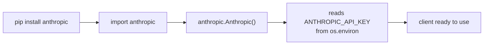
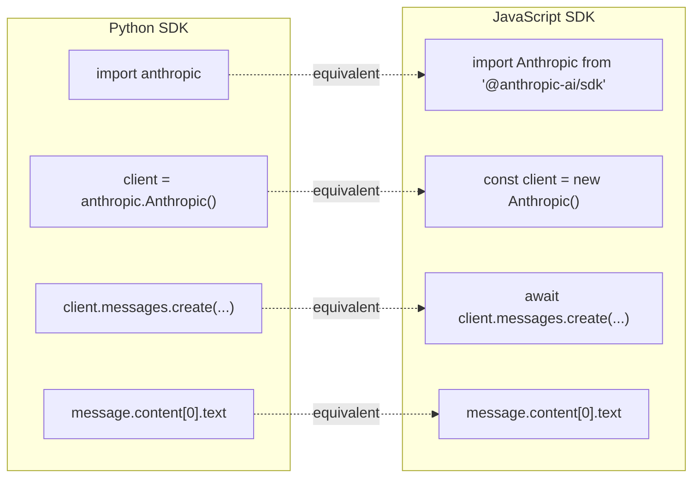
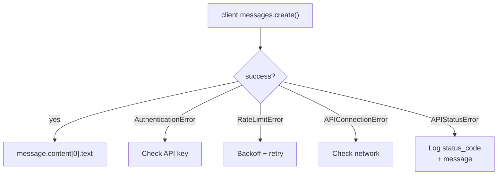

# First API Call

## The Story 📖

Remember the first time you drove a car? Before you touched the wheel, you learned the controls: ignition, gear, pedals, mirrors. The actual drive was just five minutes — but understanding what each control did made those five minutes safe and productive.

Your first Claude API call is exactly like that. The setup takes three minutes. The actual call is three lines of Python. But understanding what each line does — importing the client, creating the request, reading the response — is what lets you build confidently from here.

This topic is about that first drive: getting from zero to a working API call in the fastest, safest way possible, and understanding every step along the way.

👉 This is why we focus on the **First API Call** — confidence comes from doing it correctly the first time and knowing exactly why it worked.

---

## What You Need Before Starting 🛠️

### 1. An Anthropic API key
Get one from the [Anthropic Console](https://console.anthropic.com). New accounts get free credits to start.

### 2. Python 3.8+ or Node.js 18+
The official SDKs support both languages. Python is shown first in this guide.

### 3. The SDK installed

```bash
# Python
pip install anthropic

# JavaScript / Node.js
npm install @anthropic-ai/sdk
```

### 4. Your API key in the environment

```bash
export ANTHROPIC_API_KEY="sk-ant-api03-..."
```

---

## The Python SDK — Installation and Client Setup 🐍



The `Anthropic()` constructor:
- Reads `ANTHROPIC_API_KEY` from the environment automatically
- Sets up the HTTP session with correct headers
- Configures retry behavior and timeouts
- Returns a typed client with IDE autocomplete

```python
import anthropic

# Option 1: reads from ANTHROPIC_API_KEY env var (preferred)
client = anthropic.Anthropic()

# Option 2: explicit key (use only in scripts that manage their own secrets)
client = anthropic.Anthropic(api_key="sk-ant-api03-...")

# Option 3: with custom timeout
client = anthropic.Anthropic(timeout=30.0)
```

---

## Your First Complete Call 🚀

```python
import anthropic

client = anthropic.Anthropic()

message = client.messages.create(
    model="claude-sonnet-4-6",
    max_tokens=1024,
    messages=[
        {"role": "user", "content": "Hello! What can you help me with?"}
    ]
)

print(message.content[0].text)
```

That's it. Three imports and five lines produce a full round-trip to Claude.

### What each line does

| Line | What it does |
|---|---|
| `anthropic.Anthropic()` | Creates an authenticated HTTP client |
| `client.messages.create(...)` | Sends POST to `/v1/messages` with headers and body |
| `model=...` | Selects which Claude model to use |
| `max_tokens=...` | Sets maximum output length |
| `messages=[...]` | The conversation (one user message to start) |
| `message.content[0].text` | Extracts the text from Claude's response |

---

## Reading the Response Object 📦

The `message` object returned by `messages.create()` has these attributes:

```python
message.id              # "msg_01XFDUDYJgAACzvnptvVoYEL"
message.type            # "message"
message.role            # "assistant"
message.content         # [TextBlock(type='text', text='...')]
message.content[0].type # "text"
message.content[0].text # The actual response text — this is what you want
message.model           # "claude-sonnet-4-6-20250219"
message.stop_reason     # "end_turn"
message.usage           # Usage(input_tokens=12, output_tokens=87)
message.usage.input_tokens
message.usage.output_tokens
```

---

## Python and JavaScript Side by Side 🔄

The two SDKs have nearly identical structure:



**Python:**

```python
import anthropic

client = anthropic.Anthropic()

message = client.messages.create(
    model="claude-sonnet-4-6",
    max_tokens=1024,
    messages=[
        {"role": "user", "content": "Explain recursion simply."}
    ]
)

print(message.content[0].text)
```

**JavaScript:**

```javascript
import Anthropic from "@anthropic-ai/sdk";

const client = new Anthropic();

const message = await client.messages.create({
  model: "claude-sonnet-4-6",
  max_tokens: 1024,
  messages: [
    { role: "user", content: "Explain recursion simply." }
  ],
});

console.log(message.content[0].text);
```

Key differences:
- JavaScript uses `new Anthropic()` vs Python's `anthropic.Anthropic()`
- JavaScript requires `await` (the call is async)
- JavaScript uses `console.log` vs Python's `print`
- Parameter names and response structure are identical

---

## Basic Error Handling 🛡️

Your first call should already handle the most common errors:

```python
import anthropic

client = anthropic.Anthropic()

try:
    message = client.messages.create(
        model="claude-sonnet-4-6",
        max_tokens=1024,
        messages=[{"role": "user", "content": "Hello!"}]
    )
    print(message.content[0].text)

except anthropic.AuthenticationError:
    print("Invalid API key. Check ANTHROPIC_API_KEY.")

except anthropic.RateLimitError:
    print("Rate limit hit. Slow down requests.")

except anthropic.APIConnectionError:
    print("Network error. Check internet connection.")

except anthropic.APIStatusError as e:
    print(f"API error: {e.status_code} — {e.message}")
```



---

## Installing and Verifying the SDK 📋

### Python

```bash
pip install anthropic

# Verify installation
python -c "import anthropic; print(anthropic.__version__)"
```

### Node.js

```bash
npm install @anthropic-ai/sdk

# Verify
node -e "const a = require('@anthropic-ai/sdk'); console.log('installed')"
```

### Check environment variable is set

```bash
# Linux / macOS
echo $ANTHROPIC_API_KEY

# Windows PowerShell
echo $env:ANTHROPIC_API_KEY
```

If the output is empty, the environment variable is not set and the SDK will throw `AuthenticationError`.

---

## Common First-Call Mistakes ⚠️

### Mistake 1: Forgetting `await` in JavaScript

```javascript
// WRONG — returns a Promise, not a message
const message = client.messages.create({...});
console.log(message.content[0].text);  // TypeError

// CORRECT
const message = await client.messages.create({...});
console.log(message.content[0].text);
```

### Mistake 2: Treating `content` as a string

```python
# WRONG
print(message.content)     # [TextBlock(type='text', text='...')]
print(message.content.text) # AttributeError — list has no .text

# CORRECT
print(message.content[0].text)
```

### Mistake 3: Missing `model` or `max_tokens`

```python
# WRONG — missing required fields
client.messages.create(
    messages=[{"role": "user", "content": "Hi"}]
)
# raises ValidationError

# CORRECT
client.messages.create(
    model="claude-sonnet-4-6",
    max_tokens=1024,
    messages=[{"role": "user", "content": "Hi"}]
)
```

---

## Where You'll Use This in Real Systems 🏗️

- **Web APIs:** A FastAPI or Express endpoint calls `messages.create()` on each user request and returns the response as JSON
- **CLI tools:** A command-line script takes user input, sends it to Claude, prints the response
- **Data pipelines:** A Python script processes a list of records, sends each to Claude for analysis, collects results
- **Notebooks:** Jupyter notebooks call the API interactively for prototyping prompts

---

## Connection to Other Concepts 🔗

- Builds on **API Basics** (Topic 01) — the client handles authentication headers for you
- Builds on **Messages API** (Topic 02) — `messages.create()` is the Python binding for `/v1/messages`
- Foundation for **Streaming** (Topic 06) — same client, same call, just with `stream=True`
- Foundation for **Tool Use** (Topic 05) — same call with `tools=[]` added

---

✅ **What you just learned:** Installing the SDK, creating an `Anthropic()` client, calling `messages.create()`, and reading `message.content[0].text` are the four steps of every API interaction.

🔨 **Build this now:** Write a Python script that takes a command-line argument and sends it to Claude as a question. Print the response and token usage. Run it three times with different questions.

➡️ **Next step:** [System Prompts](../04_System_Prompts/Theory.md) — learn how to give Claude persistent instructions that shape every response.

---

## 📂 Navigation

**In this folder:**
| File | |
|---|---|
| 📄 **Theory.md** | ← you are here |
| [📄 Cheatsheet.md](./Cheatsheet.md) | Quick reference |
| [📄 Interview_QA.md](./Interview_QA.md) | Interview prep |
| [📄 Code_Example.md](./Code_Example.md) | Working code |

⬅️ **Prev:** [Messages API](../02_Messages_API/Theory.md) &nbsp;&nbsp;&nbsp; ➡️ **Next:** [System Prompts](../04_System_Prompts/Theory.md)
