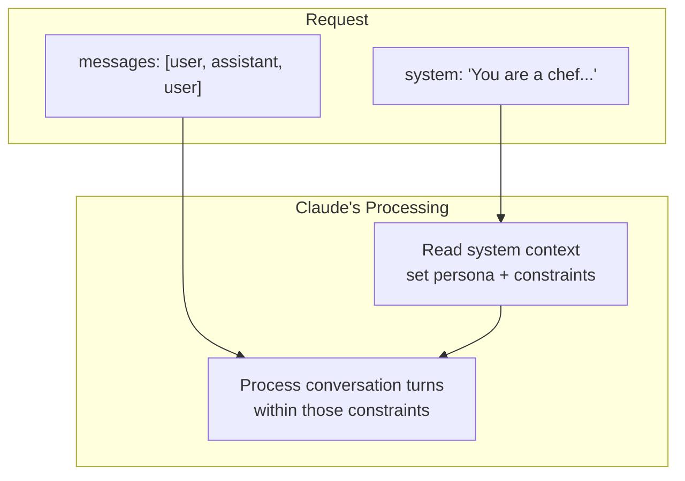
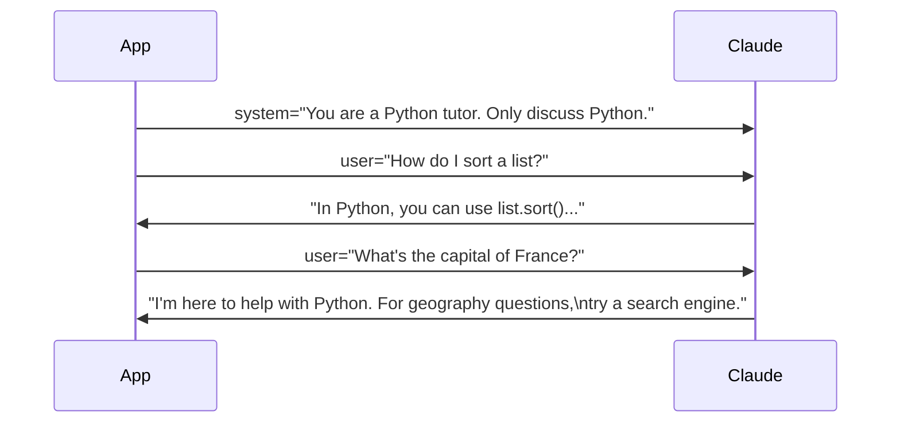

# System Prompts

## The Story 📖

Think about briefing a new contractor before they start working at your company. You don't just drop them at a desk and say "figure it out." You give them the handbook: our company values, how we communicate with clients, what we do and don't do, how formal to be in emails, and what topics are off limits. Every time they interact with a client, they carry that briefing with them — invisibly, automatically.

A **system prompt** is exactly that onboarding briefing for Claude. It runs before the conversation begins. It shapes how Claude interprets every user message. It persists across every turn in the conversation. And it's invisible to the user — they see only Claude's responses, not the instructions that shaped them.

The system parameter is one of the most powerful tools in prompt engineering. It's where you transform a generic AI assistant into a specialized, opinionated, constrained expert for your specific use case.

👉 This is why we use **system prompts** — they let you configure Claude's behavior once and have it apply automatically to every turn of every conversation.

---

## What is a System Prompt? 🎯

A **system prompt** is text passed via the `system` parameter in a `messages.create()` call. It sets context, persona, and constraints that apply to the entire conversation.

```python
client.messages.create(
    model="claude-sonnet-4-6",
    max_tokens=1024,
    system="You are a helpful assistant for a medical records company. Always respond in plain English. Never provide specific medical diagnoses.",
    messages=[
        {"role": "user", "content": "What is hypertension?"}
    ]
)
```

The system prompt is:
- Separate from the `messages` array — it has its own top-level parameter
- Applied before any user message is processed
- Invisible to users (they don't see it in the conversation)
- Persistent — it applies to every turn, not just the first one
- Optional — if omitted, Claude uses its default helpful assistant behavior

---

## System vs User Messages — Key Differences 📊



| Dimension | System Parameter | User Message |
|---|---|---|
| Position | Top-level field, before messages | Inside messages array |
| Role | Not user or assistant | `"user"` |
| Visibility | Invisible to end user | Visible in conversation |
| Persistence | Applies to entire conversation | Applies to that turn only |
| Purpose | Configuration, persona, rules | Actual queries and input |
| Priority | Higher — sets the frame | Lower — works within frame |

The key insight: **the system prompt sets the rules of the game; user messages play within those rules.**

---

## Why It Exists — The Problem It Solves 🔧

### Problem 1: Without system prompts, every conversation starts from the same generic default

Claude out of the box is a generalist. If your app is a customer service bot for a bank, you need Claude to: stay on topic, use formal language, never give investment advice, and always recommend calling support for account issues. Without a system prompt, you'd have to re-state all of this in every user message — which is wasteful, inconsistent, and pollutes the user's conversation.

### Problem 2: Users can accidentally (or deliberately) shift Claude's behavior

If you rely only on user messages for context, a clever prompt from a user can override your intended behavior. System prompts create a higher-authority instruction layer that the user cannot override through their messages.

### Problem 3: Business logic needs a home

Rules like "always respond in Spanish," "never mention competitor products," "format every response as a JSON object" belong in configuration — not in each user message. System prompts are that configuration layer.

👉 Without system prompts: every user query carries the full instruction burden. With system prompts: context and constraints live once, at configuration time.

---

## How It Works — Step by Step ⚙️

### Step 1: You write the system prompt once

Usually at application startup or per conversation session. Keep it in a separate file or config for maintainability.

### Step 2: It's sent with every request

The `system` parameter is included in every `messages.create()` call. If you're using prompt caching, the system prompt is the ideal candidate for caching — it's large, static, and repeated every turn.

### Step 3: Claude processes it as highest-priority context

Claude reads the system prompt first, before any user messages. It establishes the persona, constraints, and output format Claude will use for the rest of the conversation.

### Step 4: Every user message is interpreted through that lens

When a user says "can you do X?" Claude evaluates it against the system prompt's constraints. If X violates a rule in the system prompt, Claude declines — politely and in the persona the system prompt defined.



---

## Common Use Cases 🛠️

### Persona setting

```python
system = """You are Aria, a friendly customer service representative for TechCorp.
You are enthusiastic, concise, and always end responses with 'Is there anything else I can help you with?'"""
```

### Output format constraints

```python
system = """Always respond in valid JSON matching this schema:
{"answer": string, "confidence": "high"|"medium"|"low", "sources": [string]}
Do not include any text outside the JSON object."""
```

### Domain restriction

```python
system = """You are a specialized assistant for Python programming questions only.
If asked about any other topic, politely redirect the user back to Python.
Never provide code in any language other than Python."""
```

### Tone and style

```python
system = """You are an assistant for a children's educational platform.
- Always use simple vocabulary (5th grade reading level)
- Never use technical jargon without explaining it first
- Be encouraging and positive
- Keep responses under 100 words"""
```

### Role in a larger system

```python
system = """You are a data extraction engine. Your only task is to extract structured data from the text the user provides.
Return ONLY a JSON object. No preamble. No explanation. No markdown fences.
If data for a field is not present, use null."""
```

---

## Multi-Turn Persistence Example 🔄

The system prompt applies to every turn:

```python
import anthropic

client = anthropic.Anthropic()

SYSTEM = "You are a Socratic tutor. Never give direct answers. Only ask questions that guide the student to discover the answer themselves."

history = []

def tutor_chat(question):
    history.append({"role": "user", "content": question})
    response = client.messages.create(
        model="claude-sonnet-4-6",
        max_tokens=512,
        system=SYSTEM,
        messages=history
    )
    answer = response.content[0].text
    history.append({"role": "assistant", "content": answer})
    return answer

print(tutor_chat("What is 12 × 7?"))
# Claude asks: "What is 12 × 6?"
print(tutor_chat("It's 72."))
# Claude asks: "And if you add one more group of 12 to 72, what do you get?"
```

---

## Best Practices 📐

### 1. Use XML tags for structure in long system prompts

```python
system = """
<persona>
You are Alex, a financial planning assistant for WealthFirst.
</persona>

<constraints>
- Never recommend specific securities or ETFs
- Always include the disclaimer: "This is not financial advice"
- Refer complex questions to a certified financial planner
</constraints>

<tone>
Professional, reassuring, and clear. Avoid jargon.
</tone>
"""
```

### 2. Be specific, not vague

```
Vague:  "Be helpful and professional."
Better: "Respond in formal English. Use complete sentences. Do not use slang or contractions."
```

### 3. State constraints positively where possible

```
Negative: "Don't be rude."
Positive: "Always maintain a respectful, constructive tone."
```

### 4. Use prompt caching for long system prompts

Add `cache_control` to the system content when it's long and static — you'll pay full price on the first call, then 10x cheaper on all subsequent calls within the 5-minute TTL.

---

## Common Mistakes to Avoid ⚠️

- **Mistake 1 — System prompt in user message:** Putting instructions in the first user message instead of the `system` parameter. The system parameter has higher authority and caches better.
- **Mistake 2 — Vague instructions:** "Be helpful" is not a useful constraint. Specific behavioral rules produce predictable results.
- **Mistake 3 — Contradictory instructions:** If the system says "be concise" but also "be thorough and explain everything," Claude must guess what to prioritize. Resolve contradictions before deploying.
- **Mistake 4 — Assuming 100% constraint enforcement:** System prompts significantly shape behavior but are not hard code-level enforcement. For safety-critical constraints, add output validation as a separate layer.
- **Mistake 5 — Forgetting to update across sessions:** If your system prompt evolves, make sure all running sessions get the updated version.

---

## Connection to Other Concepts 🔗

- Relates to **Prompt Engineering** (Topic 08) because system prompts are the primary tool for controlling Claude's output style and format
- Relates to **Prompt Caching** (Topic 09) because the `system` parameter is the most efficient caching target — it's large and repeated every turn
- Relates to **Cost Optimization** (Topic 11) because caching the system prompt reduces input token cost by 90% after the first call
- Relates to **Safety Layers** in Section 21 Track 1 — system prompts implement application-level safety guardrails

---

✅ **What you just learned:** The `system` parameter sets persistent, high-authority instructions before the conversation begins — persona, constraints, and output format live here so they apply to every user message automatically.

🔨 **Build this now:** Write three different system prompts for the same base model: (1) a formal legal assistant, (2) a casual gaming buddy, (3) a JSON-only data extractor. Run the same user message through all three and compare the outputs.

➡️ **Next step:** [Tool Use](../05_Tool_Use/Theory.md) — learn how to give Claude the ability to call functions and act on the world.

---

## 📂 Navigation

**In this folder:**
| File | |
|---|---|
| 📄 **Theory.md** | ← you are here |
| [📄 Cheatsheet.md](./Cheatsheet.md) | Quick reference |
| [📄 Interview_QA.md](./Interview_QA.md) | Interview prep |
| [📄 Code_Example.md](./Code_Example.md) | Working code |

⬅️ **Prev:** [First API Call](../03_First_API_Call/Theory.md) &nbsp;&nbsp;&nbsp; ➡️ **Next:** [Tool Use](../05_Tool_Use/Theory.md)
