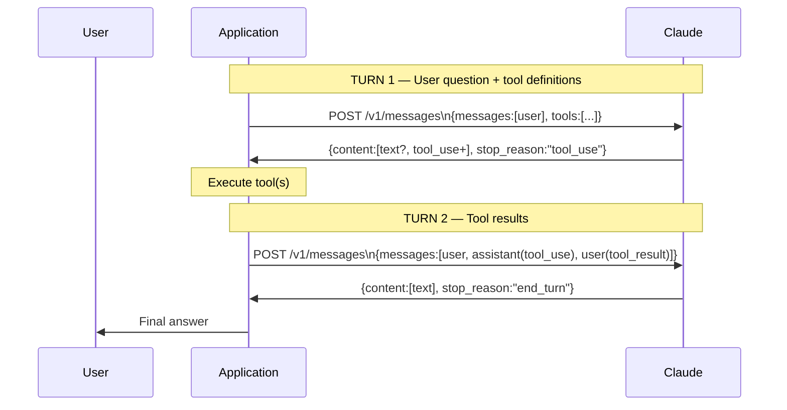
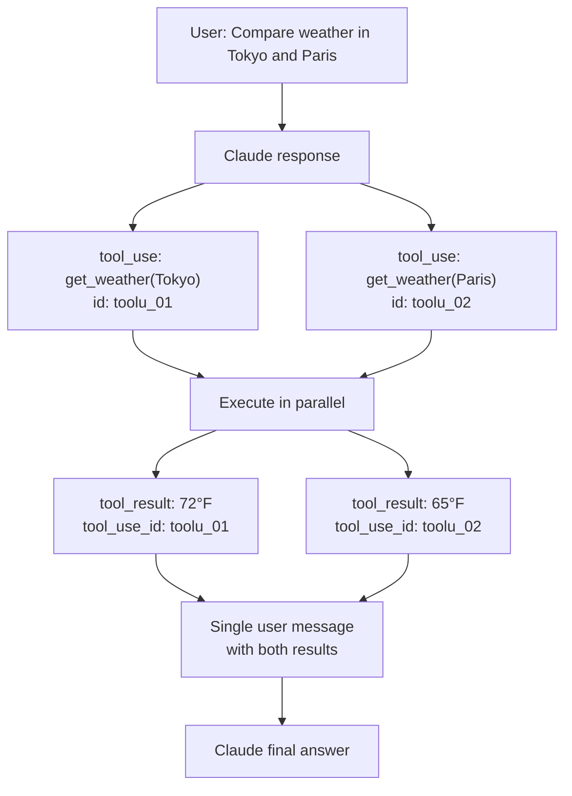
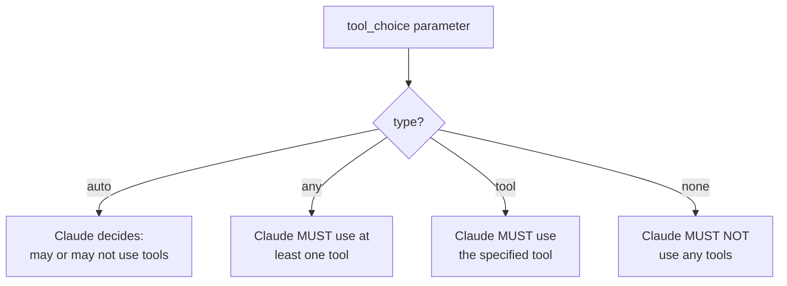
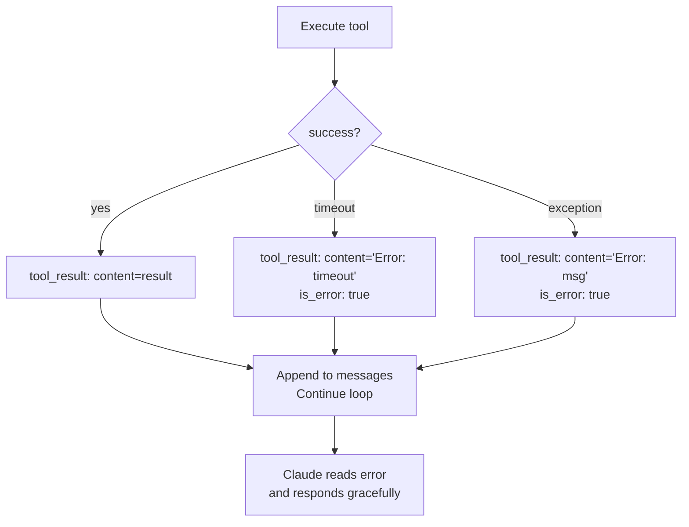
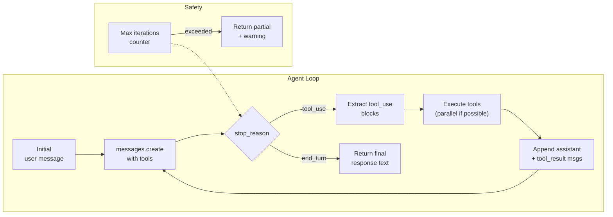
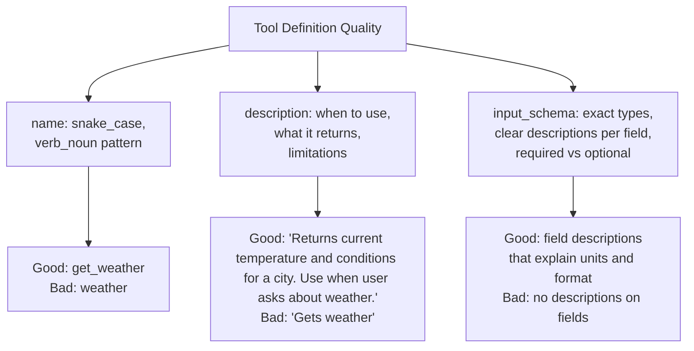

# Tool Use — Architecture Deep Dive

## The Full Tool Use Protocol

Tool use in the Anthropic API follows a precise multi-turn protocol. Understanding the exact message structure at each step is essential for building reliable agent loops.

---

## Step-by-Step Request/Response Architecture



---

## Exact Message Structure at Each Turn

### Turn 1 — Initial Request

```json
{
  "model": "claude-sonnet-4-6",
  "max_tokens": 4096,
  "tools": [
    {
      "name": "search_database",
      "description": "Search the product database by keyword. Returns matching products with IDs and prices.",
      "input_schema": {
        "type": "object",
        "properties": {
          "query": {
            "type": "string",
            "description": "Search keyword"
          },
          "limit": {
            "type": "integer",
            "description": "Max results to return (default 10)"
          }
        },
        "required": ["query"]
      }
    }
  ],
  "messages": [
    {"role": "user", "content": "Find me laptops under $1000"}
  ]
}
```

### Turn 1 — Claude's Response (tool call)

```json
{
  "id": "msg_01...",
  "type": "message",
  "role": "assistant",
  "content": [
    {
      "type": "text",
      "text": "I'll search the database for laptops under $1000."
    },
    {
      "type": "tool_use",
      "id": "toolu_01A09q90qw90lq92M9fjBz",
      "name": "search_database",
      "input": {
        "query": "laptop under 1000",
        "limit": 5
      }
    }
  ],
  "stop_reason": "tool_use"
}
```

Note: Claude may include a `text` block before `tool_use`. You must preserve the entire `content` array.

### Turn 2 — Request with Tool Result

```json
{
  "model": "claude-sonnet-4-6",
  "max_tokens": 4096,
  "tools": [...],
  "messages": [
    {"role": "user", "content": "Find me laptops under $1000"},
    {
      "role": "assistant",
      "content": [
        {"type": "text", "text": "I'll search the database for laptops under $1000."},
        {
          "type": "tool_use",
          "id": "toolu_01A09q90qw90lq92M9fjBz",
          "name": "search_database",
          "input": {"query": "laptop under 1000", "limit": 5}
        }
      ]
    },
    {
      "role": "user",
      "content": [
        {
          "type": "tool_result",
          "tool_use_id": "toolu_01A09q90qw90lq92M9fjBz",
          "content": "[{\"id\":\"LAP001\",\"name\":\"ThinkPad E15\",\"price\":899},{\"id\":\"LAP002\",\"name\":\"Dell Inspiron 15\",\"price\":749}]"
        }
      ]
    }
  ]
}
```

---

## Parallel Tool Call Architecture

When Claude calls multiple tools at once, all `tool_use` blocks appear in the same assistant message, and all `tool_result` blocks appear in the same user message:



```json
{
  "role": "user",
  "content": [
    {
      "type": "tool_result",
      "tool_use_id": "toolu_01",
      "content": "Tokyo: 72°F, sunny"
    },
    {
      "type": "tool_result",
      "tool_use_id": "toolu_02",
      "content": "Paris: 65°F, cloudy"
    }
  ]
}
```

Both results go in the same user message. Each `tool_use_id` matches the corresponding `tool_use` block's `id`.

---

## Tool Choice Architecture



| Value | Use case |
|---|---|
| `{"type": "auto"}` | General assistant — let Claude decide |
| `{"type": "any"}` | Force tool usage (data extraction) |
| `{"type": "tool", "name": "X"}` | Force a specific pipeline step |
| `{"type": "none"}` | Run a pass where tools were defined but shouldn't fire |

---

## Error Handling Architecture



```json
{
  "type": "tool_result",
  "tool_use_id": "toolu_01...",
  "content": "Error: Database unavailable. Please try again in a moment.",
  "is_error": true
}
```

Claude will acknowledge the error and either retry, use a fallback, or inform the user gracefully.

---

## Multi-Step Agent Loop Architecture



Always implement a `max_iterations` guard (typically 10) to prevent infinite loops.

---

## Tool Definition Best Practices



---

## Token Cost of Tool Use

Tool definitions consume input tokens on every call. A typical tool definition with one input field costs ~50-100 tokens. A complex tool with many fields costs 200+ tokens.

Optimization strategies:
1. Cache tool definitions using prompt caching (mark tools with `cache_control`)
2. Only include relevant tools per request — don't pass all 20 tools to a simple question
3. Use `tool_choice: {"type": "none"}` when you want Claude to reason without acting

---

## 📂 Navigation

**In this folder:**
| File | |
|---|---|
| [📄 Theory.md](./Theory.md) | Concept guide |
| [📄 Cheatsheet.md](./Cheatsheet.md) | Quick reference |
| [📄 Interview_QA.md](./Interview_QA.md) | Interview prep |
| 📄 **Architecture_Deep_Dive.md** | ← you are here |
| [📄 Code_Example.md](./Code_Example.md) | Working code |

⬅️ **Prev:** [System Prompts](../04_System_Prompts/Theory.md) &nbsp;&nbsp;&nbsp; ➡️ **Next:** [Streaming](../06_Streaming/Theory.md)
