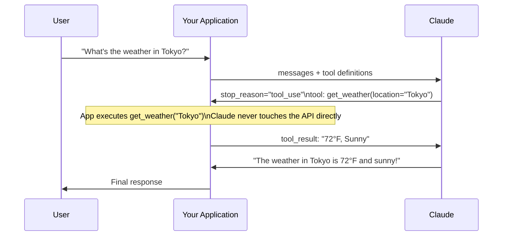
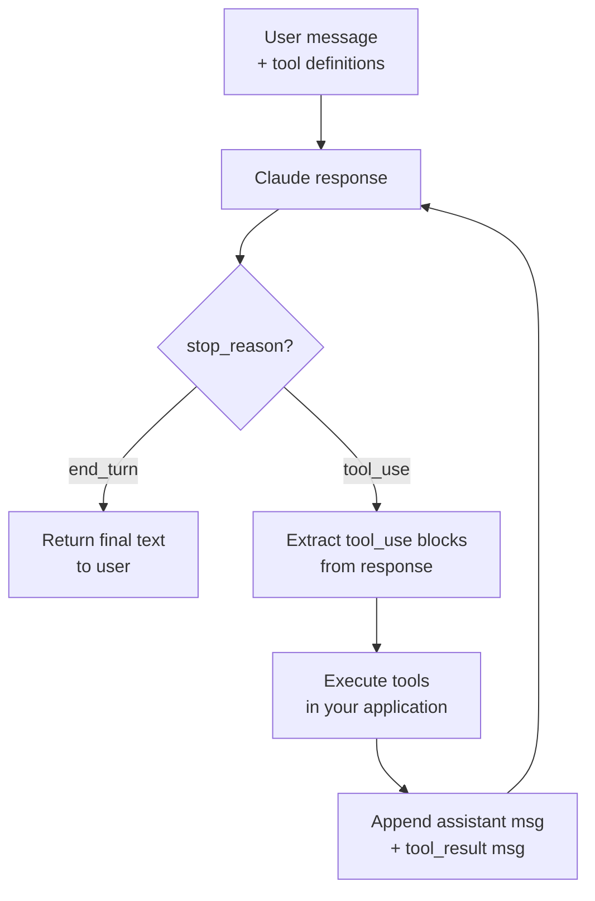

# Tool Use

## The Story 📖

Imagine hiring an incredibly knowledgeable consultant — someone who knows everything that was ever written down. They can analyze your situation brilliantly, reason through complex problems, and give you detailed plans. But there's one limitation: they work entirely from memory. They can't look at your database, can't send an email on your behalf, can't check today's stock price.

Now imagine giving that consultant a toolbox: a phone to call the stock exchange, access to your company database, the ability to send calendar invites. Suddenly, all that knowledge becomes executable. The consultant can not only advise — they can act.

**Tool use** is that toolbox for Claude. It's the bridge between Claude's reasoning capabilities and the real world — databases, APIs, file systems, external services, and business logic that only your application controls.

👉 This is why we need **tool use** — it transforms Claude from a sophisticated text processor into an agent that can take actions and retrieve live data.

---

## What is Tool Use? 🔧

**Tool use** (also called function calling) is a protocol that lets Claude request that your application execute specific functions, then uses the results in its response.

The key insight is that **Claude never executes tools itself**. It decides to call a tool, tells your code what function to run and with what arguments, and then waits for you to execute it and return the result.



---

## Tool Definition Schema 📐

Every tool is defined as a JSON schema object with three required fields:

```python
tools = [
    {
        "name": "get_weather",                    # function name (no spaces)
        "description": "Get current weather for a location. Use this when the user asks about weather, temperature, or forecast.",
        "input_schema": {                          # JSON Schema for arguments
            "type": "object",
            "properties": {
                "location": {
                    "type": "string",
                    "description": "City and country, e.g. 'Tokyo, Japan'"
                },
                "unit": {
                    "type": "string",
                    "enum": ["celsius", "fahrenheit"],
                    "description": "Temperature unit"
                }
            },
            "required": ["location"]              # required vs optional args
        }
    }
]
```

| Field | Type | Purpose |
|---|---|---|
| `name` | string | Identifier — Claude uses this in its `tool_use` block |
| `description` | string | Explains when to use this tool — critical for Claude's decision-making |
| `input_schema` | JSON Schema | Defines the argument types, required fields, and descriptions |

The `description` is the most important field. Claude reads it to decide which tool to call and when. Vague descriptions cause wrong tool selection; specific descriptions cause correct ones.

---

## The Tool Use Flow — Step by Step ⚙️

### Turn 1: Send question + tool definitions

```python
import anthropic

client = anthropic.Anthropic()

tools = [
    {
        "name": "get_weather",
        "description": "Returns current weather conditions for a city.",
        "input_schema": {
            "type": "object",
            "properties": {
                "location": {"type": "string", "description": "City name"}
            },
            "required": ["location"]
        }
    }
]

response = client.messages.create(
    model="claude-sonnet-4-6",
    max_tokens=1024,
    tools=tools,
    messages=[{"role": "user", "content": "What's the weather in Paris?"}]
)
```

### Check if Claude wants to use a tool

```python
if response.stop_reason == "tool_use":
    # Find the tool_use block
    tool_use_block = next(
        b for b in response.content if b.type == "tool_use"
    )
    
    tool_name = tool_use_block.name          # "get_weather"
    tool_input = tool_use_block.input        # {"location": "Paris"}
    tool_use_id = tool_use_block.id          # "toolu_01..."
```

### Turn 2: Execute tool, return result

```python
    # Execute your actual function
    weather_data = get_weather(tool_input["location"])  # your code
    
    # Add Claude's response and the tool result to history
    messages = [
        {"role": "user", "content": "What's the weather in Paris?"},
        {"role": "assistant", "content": response.content},  # includes tool_use block
        {
            "role": "user",
            "content": [
                {
                    "type": "tool_result",
                    "tool_use_id": tool_use_id,
                    "content": str(weather_data)
                }
            ]
        }
    ]
    
    # Final call — Claude generates the user-facing answer
    final_response = client.messages.create(
        model="claude-sonnet-4-6",
        max_tokens=1024,
        tools=tools,
        messages=messages
    )
    
    print(final_response.content[0].text)
```

---

## The Complete Multi-Turn Tool Loop 🔄

A production tool loop handles multiple sequential tool calls:



```python
def run_tool_loop(user_message: str, tools: list, tool_executor: dict) -> str:
    """
    tool_executor: dict mapping tool name -> callable
    """
    messages = [{"role": "user", "content": user_message}]
    
    while True:
        response = client.messages.create(
            model="claude-sonnet-4-6",
            max_tokens=4096,
            tools=tools,
            messages=messages
        )
        
        if response.stop_reason == "end_turn":
            # Done — extract final text
            return next(
                b.text for b in response.content if b.type == "text"
            )
        
        if response.stop_reason == "tool_use":
            # Append Claude's full response (with tool_use blocks)
            messages.append({"role": "assistant", "content": response.content})
            
            # Execute all tool calls and collect results
            tool_results = []
            for block in response.content:
                if block.type == "tool_use":
                    fn = tool_executor[block.name]
                    result = fn(**block.input)
                    tool_results.append({
                        "type": "tool_result",
                        "tool_use_id": block.id,
                        "content": str(result)
                    })
            
            # Append results as a user message
            messages.append({"role": "user", "content": tool_results})
        else:
            break
    
    return ""
```

---

## Tool Choice Parameter 🎛️

The `tool_choice` parameter controls whether Claude must use tools:

```python
# Default — Claude decides whether to use tools
tool_choice = {"type": "auto"}

# Force Claude to always use a tool (any tool)
tool_choice = {"type": "any"}

# Force Claude to use a specific tool
tool_choice = {"type": "tool", "name": "get_weather"}

# Never use tools (even if defined)
tool_choice = {"type": "none"}
```

When `tool_choice` is `"tool"` (forced specific tool), Claude may add a text block before the tool_use block. When it's `"auto"`, Claude may choose not to use any tool if it can answer directly.

---

## Parallel Tool Calls 🔀

Claude can request multiple tools simultaneously in a single response:

```python
# Claude might respond with two tool_use blocks:
[
    {"type": "tool_use", "id": "toolu_01", "name": "get_weather", "input": {"location": "Tokyo"}},
    {"type": "tool_use", "id": "toolu_02", "name": "get_weather", "input": {"location": "London"}}
]
```

Execute them in parallel, then return all results together:

```python
import asyncio

async def execute_parallel_tools(tool_blocks):
    tasks = [execute_tool(block.name, block.input) for block in tool_blocks]
    results = await asyncio.gather(*tasks)
    return [
        {"type": "tool_result", "tool_use_id": b.id, "content": str(r)}
        for b, r in zip(tool_blocks, results)
    ]
```

---

## Error Handling in Tools 🛡️

Return errors gracefully via the `tool_result` content — don't crash your application:

```python
try:
    result = execute_tool(tool_name, tool_input)
    tool_result_content = json.dumps(result)
except Exception as e:
    tool_result_content = f"Error: {str(e)}"

# Pass is_error flag for explicit error signaling
{
    "type": "tool_result",
    "tool_use_id": tool_use_id,
    "content": "Error: Database connection timeout after 30 seconds",
    "is_error": True  
}
```

Claude reads the error message and will handle it gracefully — often by telling the user what went wrong or trying an alternative approach.

---

## Where You'll See This in Real AI Systems 🏗️

- **Customer support bots:** Tools that look up order status, check inventory, create support tickets
- **Code assistants:** Tools that run code, check syntax, read files from the repo
- **Research agents:** Tools that search the web, read URLs, query databases
- **Workflow automation:** Tools that send emails, create calendar events, post to Slack
- **Data pipelines:** Tools that query SQL databases, fetch API data, transform records

---

## Common Mistakes to Avoid ⚠️

- **Mistake 1 — Vague tool descriptions:** Claude uses descriptions to decide when to call tools. "Does stuff with data" is useless. "Queries the customer database by customer ID and returns account details" is useful.
- **Mistake 2 — Not checking stop_reason:** Always check `stop_reason == "tool_use"` before assuming the response is text.
- **Mistake 3 — Not appending the assistant message before tool_result:** The conversation must include Claude's response (with the `tool_use` block) as an assistant message before the `tool_result` user message. Skipping this breaks the conversation flow.
- **Mistake 4 — Crashing on tool errors:** Return error strings via `tool_result` instead of raising exceptions. Let Claude handle errors gracefully.
- **Mistake 5 — Infinite loops:** Always add a max iteration counter to your tool loop to prevent runaway execution.

---

## Connection to Other Concepts 🔗

- Relates to **Messages API** (Topic 02) because tool_use and tool_result are content block types in the messages array
- Relates to **Streaming** (Topic 06) because tool_use blocks can appear in streaming responses before `message_stop`
- Relates to **AI Agents** (Section 10) because the tool loop is the foundation of every agent architecture
- Relates to **MCP** (Section 11) because MCP servers expose tools via the same schema format

---

✅ **What you just learned:** Tool use is a three-step protocol: define tools with JSON schemas, detect `stop_reason: "tool_use"`, execute tools in your code, and return results via `tool_result` content blocks.

🔨 **Build this now:** Define a `calculator` tool with `add`, `subtract`, `multiply`, `divide` operations. Build the full tool loop and test it with "What is (15 × 4) + 7?"

➡️ **Next step:** [Streaming](../06_Streaming/Theory.md) — learn how to receive Claude's output token by token for responsive UIs.

---

## 📂 Navigation

**In this folder:**
| File | |
|---|---|
| 📄 **Theory.md** | ← you are here |
| [📄 Cheatsheet.md](./Cheatsheet.md) | Quick reference |
| [📄 Interview_QA.md](./Interview_QA.md) | Interview prep |
| [📄 Architecture_Deep_Dive.md](./Architecture_Deep_Dive.md) | Full architecture |
| [📄 Code_Example.md](./Code_Example.md) | Working code |

⬅️ **Prev:** [System Prompts](../04_System_Prompts/Theory.md) &nbsp;&nbsp;&nbsp; ➡️ **Next:** [Streaming](../06_Streaming/Theory.md)
