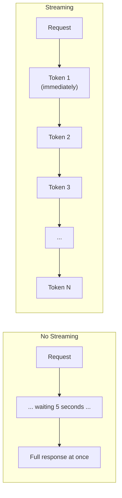

# Streaming

## The Story 📖

Think about two ways a restaurant can serve a meal. Option A: you order, wait 20 minutes in silence, and then the entire meal appears at once. Option B: the appetizer arrives first, then the soup, then the main course — you're eating and engaged the entire time.

Most people prefer Option B. The wait feels shorter. You're not staring at an empty table. You can start enjoying the food immediately.

This is exactly the difference between non-streaming and **streaming** API responses. Without streaming, your application stares at a blank screen until Claude finishes generating the entire response — then displays it all at once. With streaming, each token appears as Claude generates it — the response types out in real time, just like a human typing.

For applications where user experience matters — chatbots, code generators, writing tools — streaming is not a nice-to-have. It's essential.

👉 This is why we need **streaming** — it transforms waiting into watching, and makes AI applications feel fast and responsive.

---

## What is Streaming? ⚡

**Streaming** is a mode where the Anthropic API sends Claude's response token by token (in small chunks) as it's generated, rather than waiting for the complete response and sending it all at once.

Technically, streaming uses **Server-Sent Events (SSE)** — a standard HTTP protocol where the server sends a series of event messages over a single long-lived connection. Your client reads events as they arrive.



---

## How to Enable Streaming 🔌

### Python — using the stream context manager

```python
import anthropic

client = anthropic.Anthropic()

with client.messages.stream(
    model="claude-sonnet-4-6",
    max_tokens=1024,
    messages=[{"role": "user", "content": "Write a short story about a robot."}]
) as stream:
    for text in stream.text_stream:
        print(text, end="", flush=True)

print()  # newline after streaming completes
```

The `client.messages.stream()` context manager handles:
- Opening the SSE connection
- Parsing event frames
- Yielding text deltas via `stream.text_stream`
- Closing the connection cleanly on exit

---

## The SSE Event Format 📡

Under the hood, the server sends newline-delimited event objects:

```
event: message_start
data: {"type":"message_start","message":{"id":"msg_01...","type":"message","role":"assistant","content":[],"model":"claude-sonnet-4-6-20250219","stop_reason":null,"stop_sequence":null,"usage":{"input_tokens":25,"output_tokens":1}}}

event: content_block_start
data: {"type":"content_block_start","index":0,"content_block":{"type":"text","text":""}}

event: ping
data: {"type": "ping"}

event: content_block_delta
data: {"type":"content_block_delta","index":0,"delta":{"type":"text_delta","text":"Once"}}

event: content_block_delta
data: {"type":"content_block_delta","index":0,"delta":{"type":"text_delta","text":" upon"}}

event: content_block_delta
data: {"type":"content_block_delta","index":0,"delta":{"type":"text_delta","text":" a"}}

event: content_block_stop
data: {"type":"content_block_stop","index":0}

event: message_delta
data: {"type":"message_delta","delta":{"stop_reason":"end_turn","stop_sequence":null},"usage":{"output_tokens":589}}

event: message_stop
data: {"type":"message_stop"}
```

---

## Event Types — Reference 📋

| Event Type | When it fires | Key data |
|---|---|---|
| `message_start` | Once, at the beginning | Message ID, model, initial usage |
| `content_block_start` | Once per content block | Block index, block type |
| `content_block_delta` | Many times per block | `delta.text` — the new tokens |
| `content_block_stop` | Once per content block | Block is complete |
| `message_delta` | Once, near the end | `stop_reason`, final usage |
| `message_stop` | Once, at the very end | Stream complete |
| `ping` | Periodically | Keep-alive — ignore |

The event you care about most for text streaming: `content_block_delta` with `delta.type == "text_delta"` and `delta.text` containing the new token(s).

---

## Accessing the Full Message After Streaming ✅

The context manager collects the full response for you:

```python
with client.messages.stream(
    model="claude-sonnet-4-6",
    max_tokens=1024,
    messages=[{"role": "user", "content": "Hello!"}]
) as stream:
    # Stream tokens to UI in real time
    for text in stream.text_stream:
        print(text, end="", flush=True)

# After the `with` block, access the final message
final_message = stream.get_final_message()
print(f"\nStop reason: {final_message.stop_reason}")
print(f"Usage: {final_message.usage}")
```

---

## Streaming with System Prompts and Tools 🛠️

Streaming works the same way with system prompts:

```python
with client.messages.stream(
    model="claude-sonnet-4-6",
    max_tokens=2048,
    system="You are a helpful coding assistant. Use code blocks for all code.",
    messages=[{"role": "user", "content": "Write a Python bubble sort."}]
) as stream:
    for text in stream.text_stream:
        print(text, end="", flush=True)
```

When Claude calls a tool during streaming, a `content_block_start` event fires with `"type": "tool_use"`, followed by `content_block_delta` events with `"type": "input_json_delta"` containing the JSON arguments incrementally:

```
event: content_block_start
data: {"type":"content_block_start","index":0,"content_block":{"type":"tool_use","id":"toolu_01...","name":"get_weather","input":{}}}

event: content_block_delta
data: {"type":"content_block_delta","index":0,"delta":{"type":"input_json_delta","partial_json":"{\"loc"}}

event: content_block_delta
data: {"type":"content_block_delta","index":0,"delta":{"type":"input_json_delta","partial_json":"ation\": \"Paris\"}"}}
```

---

## Raw Streaming Without the Context Manager 🔩

For lower-level control, use `stream=True` with the raw `create()` method:

```python
with client.messages.create(
    model="claude-sonnet-4-6",
    max_tokens=1024,
    messages=[{"role": "user", "content": "Count to 5."}],
    stream=True
) as response:
    for event in response:
        if event.type == "content_block_delta":
            if event.delta.type == "text_delta":
                print(event.delta.text, end="", flush=True)
        elif event.type == "message_stop":
            print()  # newline at end
```

---

## JavaScript Streaming 🌐

```javascript
import Anthropic from "@anthropic-ai/sdk";

const client = new Anthropic();

const stream = await client.messages.stream({
  model: "claude-sonnet-4-6",
  max_tokens: 1024,
  messages: [{ role: "user", content: "Tell me a joke." }],
});

// Stream text to console
for await (const chunk of stream) {
  if (chunk.type === "content_block_delta" &&
      chunk.delta.type === "text_delta") {
    process.stdout.write(chunk.delta.text);
  }
}

// Or use the helper
stream.on("text", (text) => process.stdout.write(text));

// Get final message after streaming
const finalMessage = await stream.finalMessage();
console.log("\nUsage:", finalMessage.usage);
```

---

## Streaming in Web Applications 🖥️

For web apps, stream Claude's response to the browser using HTTP chunked transfer or WebSockets:

```python
from fastapi import FastAPI
from fastapi.responses import StreamingResponse
import anthropic

app = FastAPI()
client = anthropic.Anthropic()

@app.post("/chat")
async def chat(request: dict):
    async def generate():
        with client.messages.stream(
            model="claude-sonnet-4-6",
            max_tokens=2048,
            messages=[{"role": "user", "content": request["message"]}]
        ) as stream:
            for text in stream.text_stream:
                yield f"data: {text}\n\n"
        yield "data: [DONE]\n\n"
    
    return StreamingResponse(
        generate(),
        media_type="text/event-stream",
        headers={"Cache-Control": "no-cache"}
    )
```

---

## Common Mistakes to Avoid ⚠️

- **Mistake 1 — Forgetting `flush=True`:** When printing token by token, Python's print buffers output. Always `print(text, end="", flush=True)` to see tokens immediately.
- **Mistake 2 — Using `print()` with newline:** Each delta is a partial token. Using `print(text)` (default) adds a newline after each tiny chunk, breaking the output formatting.
- **Mistake 3 — Not collecting final message:** Token-by-token streaming doesn't give you stop_reason or usage. Use `stream.get_final_message()` after the loop.
- **Mistake 4 — Trying to parse content outside the `with` block:** The stream connection closes when you exit the `with` block. Access all stream data inside.
- **Mistake 5 — Mixing sync and async:** Don't use the sync `client.messages.stream()` inside a FastAPI async endpoint. Use `anthropic.AsyncAnthropic()` for async contexts.

---

## Connection to Other Concepts 🔗

- Relates to **Messages API** (Topic 02) because streaming uses the same endpoint and request structure — just with `stream=True` or the stream context manager
- Relates to **Tool Use** (Topic 05) because tool_use blocks also stream their JSON arguments incrementally
- Relates to **Streaming Responses** in Section 08 (LLM Applications) for broader patterns of streaming in production web apps
- Relates to **Cost Optimization** (Topic 11) because streaming has the same per-token cost as non-streaming — no extra charge

---

✅ **What you just learned:** Streaming uses `client.messages.stream()` as a context manager to yield text deltas via SSE events (`content_block_delta` with `text_delta` type) in real time as Claude generates them.

🔨 **Build this now:** Write a streaming CLI chat loop. Each user input triggers a streaming response that types out token by token. Track and print total input+output tokens at the end of each exchange.

➡️ **Next step:** [Vision](../07_Vision/Theory.md) — learn how to send images to Claude for analysis, OCR, and visual reasoning.

---

## 📂 Navigation

**In this folder:**
| File | |
|---|---|
| 📄 **Theory.md** | ← you are here |
| [📄 Cheatsheet.md](./Cheatsheet.md) | Quick reference |
| [📄 Interview_QA.md](./Interview_QA.md) | Interview prep |
| [📄 Code_Example.md](./Code_Example.md) | Working code |

⬅️ **Prev:** [Tool Use](../05_Tool_Use/Theory.md) &nbsp;&nbsp;&nbsp; ➡️ **Next:** [Vision](../07_Vision/Theory.md)
