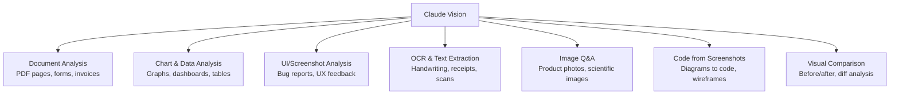

# Vision

## The Story 📖

For most of computing history, machines were blind. You could describe an image to a computer in excruciating detail — "the chart shows a rising line from 2020 to 2024 with a dip in Q2 2022" — and the computer would process your description. But actually looking at the chart? Impossible.

Claude changed that. Now you can hand Claude a photograph, a screenshot, a diagram, a PDF page, or a hand-drawn sketch, and Claude can see it — reason about it, describe it, extract data from it, and answer questions about it — just as if you were describing it to a human colleague.

This is **vision capability**: the ability for Claude to accept images as part of the conversation and incorporate visual information into its reasoning.

👉 This is why we need **vision** — it closes the gap between what the world looks like and what AI can reason about.

---

## What is Vision in the Claude API? 👁️

**Vision** is the ability to include image content blocks in your API requests. Claude can then see, analyze, and reason about those images alongside text.

Supported capabilities:
- Describe and caption images
- Answer questions about image content
- Extract text (OCR) from images
- Analyze charts, graphs, and diagrams
- Compare multiple images
- Identify objects, people, and scenes
- Read screenshots and UIs
- Understand technical diagrams and flowcharts

Models with vision support: all current claude-sonnet and claude-opus models. Haiku models also support vision.

---

## Image Content Block Structure 🖼️

Images are sent as content blocks within a user message. There are two source types:

### Source Type 1: base64

Encode the image as base64 and include it directly in the request:

```json
{
  "type": "image",
  "source": {
    "type": "base64",
    "media_type": "image/jpeg",
    "data": "/9j/4AAQSkZJRgAB..."
  }
}
```

### Source Type 2: URL

Reference an image by its public URL:

```json
{
  "type": "image",
  "source": {
    "type": "url",
    "url": "https://upload.wikimedia.org/wikipedia/commons/a/a7/Camponotus_flavomarginatus_ant.jpg"
  }
}
```

---

## Supported Formats and Limits 📏

| Property | Details |
|---|---|
| Supported formats | JPEG (`.jpg`, `.jpeg`), PNG (`.png`), GIF (`.gif`), WebP (`.webp`) |
| Max image size | 5MB per image |
| Max image dimensions | 8000 × 8000 pixels (images are resized if larger) |
| Max images per request | 20 images |
| Recommended resolution | ~1568px on the longest side for best quality |

For GIF files, only the first frame is analyzed (not animated GIFs as video).

---

## How to Send an Image — Python 🐍

### From a local file (base64)

```python
import anthropic
import base64
from pathlib import Path

client = anthropic.Anthropic()

# Load and encode image
image_path = Path("chart.png")
image_data = base64.standard_b64encode(image_path.read_bytes()).decode("utf-8")

response = client.messages.create(
    model="claude-sonnet-4-6",
    max_tokens=1024,
    messages=[
        {
            "role": "user",
            "content": [
                {
                    "type": "image",
                    "source": {
                        "type": "base64",
                        "media_type": "image/png",   # match actual format
                        "data": image_data,
                    },
                },
                {
                    "type": "text",
                    "text": "Describe the trends in this chart."
                }
            ],
        }
    ]
)

print(response.content[0].text)
```

### From a URL

```python
response = client.messages.create(
    model="claude-sonnet-4-6",
    max_tokens=1024,
    messages=[
        {
            "role": "user",
            "content": [
                {
                    "type": "image",
                    "source": {
                        "type": "url",
                        "url": "https://example.com/photo.jpg",
                    },
                },
                {
                    "type": "text",
                    "text": "What is in this image?"
                }
            ],
        }
    ]
)
```

---

## Multiple Images in One Request 🔀

Claude can compare and reason across multiple images simultaneously:

```python
import anthropic
import base64
from pathlib import Path

client = anthropic.Anthropic()

def load_image(path: str) -> dict:
    """Helper to create an image content block from a file path."""
    data = base64.standard_b64encode(Path(path).read_bytes()).decode("utf-8")
    suffix = Path(path).suffix.lower()
    media_types = {".jpg": "image/jpeg", ".jpeg": "image/jpeg", 
                   ".png": "image/png", ".gif": "image/gif", ".webp": "image/webp"}
    return {
        "type": "image",
        "source": {
            "type": "base64",
            "media_type": media_types.get(suffix, "image/jpeg"),
            "data": data
        }
    }

response = client.messages.create(
    model="claude-sonnet-4-6",
    max_tokens=2048,
    messages=[
        {
            "role": "user",
            "content": [
                load_image("before.png"),
                {"type": "text", "text": "This is the BEFORE image."},
                load_image("after.png"),
                {"type": "text", "text": "This is the AFTER image. What changed?"}
            ],
        }
    ]
)
```

---

## Vision Use Cases 🎯



### Real-world examples

- **Receipt OCR:** Photograph a paper receipt → extract merchant, date, items, total as JSON
- **Dashboard monitoring:** Screenshot of a metrics dashboard → automated description in plain English
- **UI bug reports:** Screenshot of a broken UI → Claude identifies the issue and suggests the fix
- **Chart to data:** Graph from a PDF → extract the underlying data values
- **Diagram to code:** Architecture diagram → generate corresponding code structure

---

## Cost of Vision Requests 💰

Images consume input tokens. The token cost depends on image dimensions:

Anthropic uses a tiling model:
- Images are divided into 85-token base tiles (512×512 pixels each)
- Larger images require more tiles
- A 1000×1000 JPEG costs approximately 1334 tokens
- A 100×100 thumbnail costs 85 tokens (1 tile)

Formula (approximate):
```
tiles = ceil(width / 512) × ceil(height / 512)
tokens = tiles × 170 + 85
```

For a 1568×1568 image: 3×3 = 9 tiles × 170 + 85 = 1,615 tokens

Optimization: resize images before sending. A 800×600 image and a 400×300 image of the same content produce similar analysis quality but very different token costs.

---

## Detecting Image Type Automatically 🔍

```python
import magic  # pip install python-magic

def get_media_type(file_path: str) -> str:
    mime = magic.from_file(file_path, mime=True)
    valid = {"image/jpeg", "image/png", "image/gif", "image/webp"}
    if mime not in valid:
        raise ValueError(f"Unsupported image type: {mime}")
    return mime
```

Or using the file extension:

```python
from pathlib import Path

EXTENSION_TO_MEDIA_TYPE = {
    ".jpg": "image/jpeg",
    ".jpeg": "image/jpeg",
    ".png": "image/png",
    ".gif": "image/gif",
    ".webp": "image/webp",
}

def get_media_type(path: str) -> str:
    ext = Path(path).suffix.lower()
    if ext not in EXTENSION_TO_MEDIA_TYPE:
        raise ValueError(f"Unsupported extension: {ext}")
    return EXTENSION_TO_MEDIA_TYPE[ext]
```

---

## Putting Text Before vs After the Image 📝

For single-image analysis, Anthropic recommends placing the image before your question:

```python
# Recommended order
content = [
    {"type": "image", "source": {...}},    # image first
    {"type": "text", "text": "What is this?"}  # question after
]
```

For multi-image analysis, label each image with text before it:

```python
content = [
    {"type": "text", "text": "Image 1 — January sales:"},
    {"type": "image", "source": {...}},
    {"type": "text", "text": "Image 2 — February sales:"},
    {"type": "image", "source": {...}},
    {"type": "text", "text": "Which month performed better and why?"}
]
```

---

## Common Mistakes to Avoid ⚠️

- **Mistake 1 — Wrong media_type:** Passing `image/png` for a JPEG file causes the request to fail or produce garbage output. Always match `media_type` to the actual file format.
- **Mistake 2 — Oversized images:** Sending 10MB images wastes tokens and money. Resize to ~1568px longest side before encoding.
- **Mistake 3 — URL images behind auth:** Claude's servers must be able to fetch the URL. Private S3 URLs with short-lived tokens may expire. Use base64 for private images.
- **Mistake 4 — Treating content as string:** When you have images, the `content` field must be an array — not a string. A text string for content cannot contain image blocks.
- **Mistake 5 — Expecting animated GIF analysis:** Only the first frame of a GIF is analyzed.

---

## Connection to Other Concepts 🔗

- Relates to **Messages API** (Topic 02) because images are sent as `image` content blocks within the `messages` array
- Relates to **Prompt Engineering** (Topic 08) because image placement and labeling significantly affects analysis quality
- Relates to **Cost Optimization** (Topic 11) because image token cost is significant and controllable via resizing
- Relates to **Multimodal AI** (Section 17) for a deeper treatment of vision-language models

---

✅ **What you just learned:** Images are sent as `image` content blocks with a `source` field specifying either `base64` or `url` type, plus the `media_type`. Claude supports JPEG, PNG, GIF, and WebP up to 5MB.

🔨 **Build this now:** Write a Python function that takes an image file path and a question, sends both to Claude, and returns the answer. Test it on a screenshot, a chart, and a handwritten note.

➡️ **Next step:** [Prompt Engineering](../08_Prompt_Engineering/Theory.md) — master the techniques that make Claude's responses precise, structured, and reliable.

---

## 📂 Navigation

**In this folder:**
| File | |
|---|---|
| 📄 **Theory.md** | ← you are here |
| [📄 Cheatsheet.md](./Cheatsheet.md) | Quick reference |
| [📄 Interview_QA.md](./Interview_QA.md) | Interview prep |
| [📄 Code_Example.md](./Code_Example.md) | Working code |

⬅️ **Prev:** [Streaming](../06_Streaming/Theory.md) &nbsp;&nbsp;&nbsp; ➡️ **Next:** [Prompt Engineering](../08_Prompt_Engineering/Theory.md)
