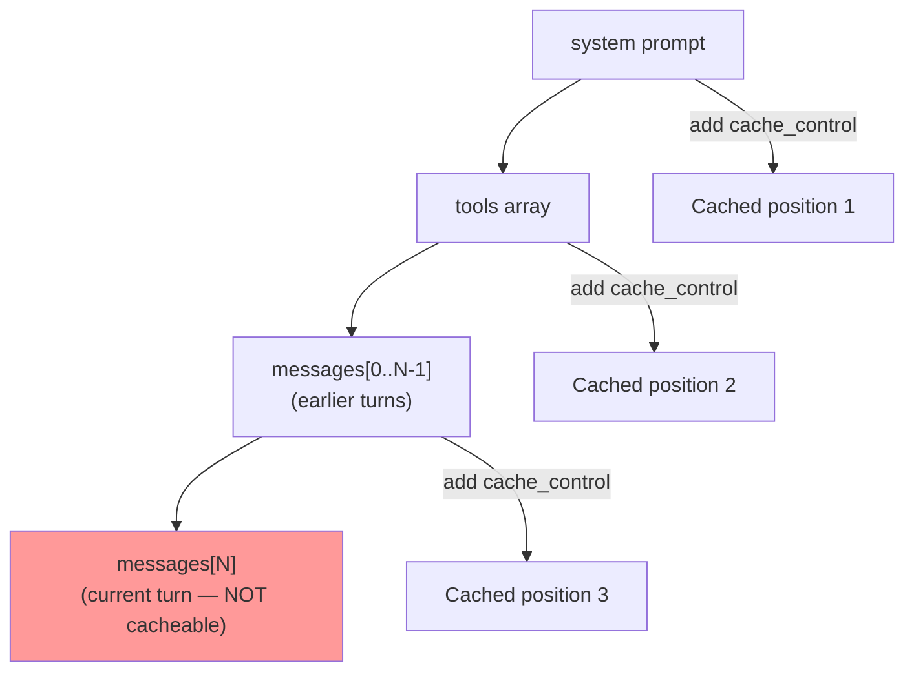
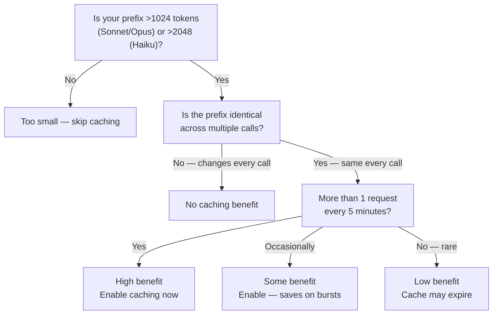

# Prompt Caching

## The Story 📖

Imagine you're a professor who teaches the same course every semester. Before each class, you spend 30 minutes briefing all your teaching assistants on the course material, syllabus, and grading rubric. Then each TA helps individual students. The problem: you're paying that 30-minute briefing cost for every single class session, even though the material never changes.

A smarter approach: brief the TAs once. Write it all down. The TAs keep the briefing in memory for a month. Every session starts instantly — they already have the context.

**Prompt caching** is exactly this. Your system prompt (the "briefing") gets cached on Anthropic's servers after the first call. Every subsequent call that uses the same system prompt reads from the cache at 10x lower cost. The large static context costs full price once, then a fraction of that price for every call within the cache TTL.

👉 This is why we need **prompt caching** — it makes long, reused prompts cheap enough to use in production at scale.

---

## 📌 Learning Priority

**Must Learn** — core concepts, needed to understand the rest of this file:
[How to Enable Caching](#how-to-enable-caching-) · [Cacheable Positions](#what-can-be-cached--cacheable-positions-) · [Pricing Model](#pricing-model-)

**Should Learn** — important for real projects and interviews:
[Cache TTL Window](#cache-ttl--5-minute-ephemeral-window-) · [Identifying Cache Activity](#identifying-cache-activity-in-responses-) · [When Caching Saves Money](#when-caching-saves-money--decision-guide-)

**Good to Know** — useful in specific situations, not needed daily:
[Minimum Token Threshold](#minimum-cacheable-token-threshold-)

**Reference** — skim once, look up when needed:
[Common Mistakes](#common-mistakes-to-avoid-)

---

## What is Prompt Caching? 💾

**Prompt caching** is a feature that lets you mark portions of your request for caching on Anthropic's infrastructure. When you make a request with a cache marker, Anthropic stores the KV (key-value) cache for that prefix and reuses it on subsequent requests with the same prefix.

Result:
- First call: pays full input token price + 25% premium to write the cache
- Subsequent calls (within TTL): pays 10% of the input token price for cached tokens

For a 2,000-token system prompt called 100 times/day:
- Without caching: 200,000 tokens/day at full price
- With caching: ~2,000 tokens (first write) + 99 × 200 cache reads = 22,000 token equivalents/day → ~9x cheaper

---

## How to Enable Caching 🔌

Add `"cache_control": {"type": "ephemeral"}` to the content block you want cached.

### Caching the system prompt

```python
client.messages.create(
    model="claude-sonnet-4-6",
    max_tokens=1024,
    system=[
        {
            "type": "text",
            "text": LONG_SYSTEM_PROMPT,
            "cache_control": {"type": "ephemeral"}
        }
    ],
    messages=[{"role": "user", "content": user_input}]
)
```

### Caching tools

```python
tools = [
    {...tool1...},
    {...tool2...},
    {
        **tool3,
        "cache_control": {"type": "ephemeral"}  # cache up to and including tool3
    }
]
```

### Caching messages (conversation prefix)

```python
messages = [
    {"role": "user", "content": [
        {
            "type": "text",
            "text": "Here is the long document to analyze:",
        },
        {
            "type": "text", 
            "text": long_document_text,
            "cache_control": {"type": "ephemeral"}
        }
    ]},
    {"role": "assistant", "content": "I have read the document."},
    {"role": "user", "content": [
        {"type": "text", "text": question}
    ]}
]
```

---

## What Can Be Cached — Cacheable Positions 📍

Cache markers can only appear at specific "prefix" positions in the request. The cache key is everything up to and including the marked block.



Rules:
- You can have up to **4 cache control markers** per request
- Each marker caches everything from the start of the request up to that point
- The markers must appear in order (from earliest to latest in the request)
- The final user message (the current turn) cannot be cached

---

## Cache TTL — 5-Minute Ephemeral Window ⏱️

Cache entries expire after **5 minutes of inactivity**. The timer resets on each cache hit.

This means:
- For high-traffic applications (>1 req/5min), the cache stays warm indefinitely
- For low-traffic applications, the cache may expire between requests — you pay full price again
- There's no way to extend TTL or pin a cache entry permanently

Caching is most cost-effective when:
- High request frequency (>1 request per 5 minutes per cached prefix)
- Large cacheable content (500+ tokens — minimum for caching)
- Static content (system prompt and tools that don't change between calls)

---

## Minimum Cacheable Token Threshold 🔢

Prompt caching requires a minimum prefix length before it activates:

| Model | Minimum cacheable tokens |
|---|---|
| Claude Haiku | 2,048 tokens |
| Claude Sonnet / Opus | 1,024 tokens |

If your cacheable prefix is below this threshold, the `cache_control` marker is ignored and you're charged full price. No error is raised — caching silently doesn't activate.

Implication: caching is most effective for substantial system prompts or large document contexts — not tiny prompts.

---

## Identifying Cache Activity in Responses 📊

The `usage` field in the response tells you whether caching was active:

```python
response = client.messages.create(...)

print(response.usage.input_tokens)                    # regular (uncached) input tokens
print(response.usage.cache_creation_input_tokens)     # tokens written to cache (first call)
print(response.usage.cache_read_input_tokens)         # tokens read from cache (subsequent calls)
print(response.usage.output_tokens)                   # output tokens (never cached)
```

On a cache miss (first call):
- `input_tokens`: ~small (just the uncached part)
- `cache_creation_input_tokens`: large (the cached prefix)

On a cache hit (subsequent call):
- `input_tokens`: ~small
- `cache_read_input_tokens`: large (reading from cache)
- `cache_creation_input_tokens`: 0

---

## Pricing Model 💰

| Token type | Price relative to standard input |
|---|---|
| Cache write (first call) | 1.25× standard input price |
| Cache read (subsequent) | 0.10× standard input price |
| Regular uncached input | 1.0× standard input price |
| Output | Full output price (never cached) |

Break-even calculation:
- Cache write costs 1.25× one call
- Each cache read costs 0.1× one call
- Break-even: you need ≥ 1.25 / (1 - 0.1) ≈ 1.4 cache hits to save money
- After just 2 hits, you're saving money on every subsequent hit

---

## When Caching Saves Money — Decision Guide 📐



---

## Common Mistakes to Avoid ⚠️

- **Mistake 1 — Using string for system with caching:** Caching requires `system` as an array of content blocks, not a string. `system="..."` cannot carry cache_control.
- **Mistake 2 — Caching below the minimum threshold:** Prompts under 1,024 tokens (Sonnet) are silently ignored by caching. Check `usage.cache_creation_input_tokens` to confirm caching activated.
- **Mistake 3 — Caching dynamic content:** If you include the user's name or timestamp in your system prompt, every user has a different cache key. The prefix must be identical across calls for the cache to hit.
- **Mistake 4 — Expecting infinite TTL:** The cache expires after 5 minutes of inactivity. Low-traffic apps may not benefit. Build in fallback cost for cache misses.
- **Mistake 5 — Not monitoring cache hit rate:** Implement logging of `cache_read_input_tokens` vs `cache_creation_input_tokens`. If you're seeing mostly cache creation, something is breaking the cache (dynamic prefixes, infrequent calls).

---

## Connection to Other Concepts 🔗

- Relates to **System Prompts** (Topic 04) because the system parameter is the primary caching target
- Relates to **Tool Use** (Topic 05) because tool definitions are another high-value caching target
- Relates to **Cost Optimization** (Topic 11) because prompt caching is the single highest-impact cost reduction technique
- Relates to **CAG (Cache Augmented Generation)** in Section 09 (RAG Systems) for a deeper architectural treatment of KV cache reuse

---

✅ **What you just learned:** Prompt caching uses `"cache_control": {"type": "ephemeral"}` markers to store large, static prefixes (system prompt, tools, documents) at 1.25× cost once and read them at 0.1× cost for 5 minutes.

🔨 **Build this now:** Write a function that makes 10 sequential calls with a 2,000-token system prompt. Log `cache_creation_input_tokens` and `cache_read_input_tokens` for each call. Calculate your actual savings vs uncached.

➡️ **Next step:** [Batching](../10_Batching/Theory.md) — learn how to submit thousands of requests at once at 50% cost reduction using the Message Batches API.


---

## 📝 Practice Questions

- 📝 [Q98 · prompt-caching](../../../ai_practice_questions_100.md#q98--critical--prompt-caching)


---

## 📂 Navigation

**In this folder:**
| File | |
|---|---|
| 📄 **Theory.md** | ← you are here |
| [📄 Cheatsheet.md](./Cheatsheet.md) | Quick reference |
| [📄 Interview_QA.md](./Interview_QA.md) | Interview prep |
| [📄 Code_Example.md](./Code_Example.md) | Working code |

⬅️ **Prev:** [Prompt Engineering](../08_Prompt_Engineering/Theory.md) &nbsp;&nbsp;&nbsp; ➡️ **Next:** [Batching](../10_Batching/Theory.md)
