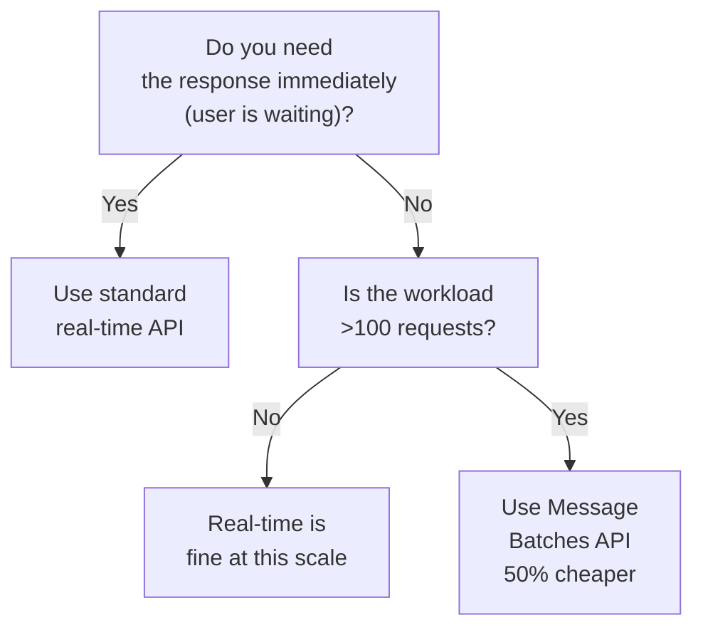
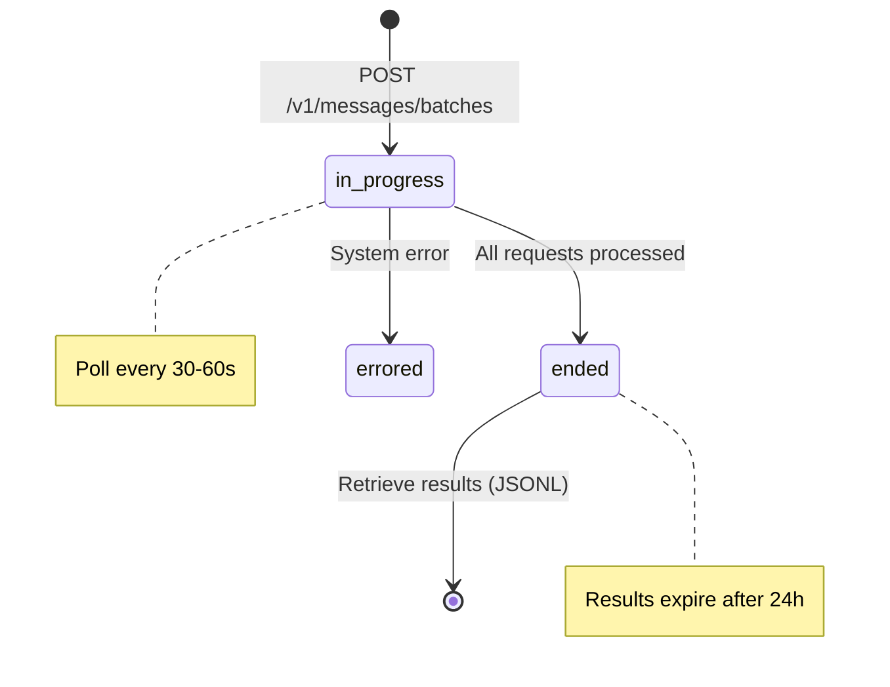

# Batching

## The Story 📖

Imagine you need to send 10,000 letters. You could walk to the post office 10,000 times — one letter per trip. Or you could load them all into a truck, drive once, and drop them all off. The post office processes them overnight and notifies you when they're done. You pick up the results the next morning.

The **Message Batches API** is that truck. Instead of making 10,000 individual API calls — each blocking, each paying real-time prices — you submit them all at once as a batch. Anthropic processes them asynchronously, usually within minutes to hours, and stores the results for you to retrieve. And for this offline, non-real-time service, you get a 50% cost reduction.

If your application doesn't need immediate responses — data annotation, document processing, nightly analysis pipelines, evaluation runs — batching is the right tool.

👉 This is why we need **batching** — it halves the cost of non-real-time workloads and removes the need to manage rate-limit complexity for large request volumes.

---

## What is the Message Batches API? 📦

The **Message Batches API** is an asynchronous processing system for large volumes of Claude requests. You submit up to 10,000 requests in a single batch, and Anthropic processes them as a background job.

Key properties:
- **50% cost reduction** vs standard API pricing
- **Async processing** — you poll for completion, don't wait
- **No rate limit pressure** — batch requests are separate from your real-time rate limits
- **JSONL results** — results are returned as newline-delimited JSON
- **24-hour expiry** — batch and results expire after 24 hours if not retrieved

---

## When to Use Batching vs Real-Time 🔀



**Use real-time API for:**
- Chat interfaces (user is waiting)
- Tool calls in agent loops
- Streaming responses
- Any response needed in <1 second

**Use Batches API for:**
- Data annotation (label 10,000 examples)
- Document classification pipelines
- Nightly analysis jobs
- Evaluation runs (testing prompts)
- Content generation queues
- Research experiments

---

## Creating a Batch 🚀

```python
import anthropic

client = anthropic.Anthropic()

# Define individual requests
requests = []
for i, text in enumerate(texts_to_analyze):
    requests.append({
        "custom_id": f"request-{i}",   # your ID for tracking
        "params": {
            "model": "claude-haiku-4-5-20251001",
            "max_tokens": 256,
            "messages": [
                {"role": "user", "content": f"Classify as POSITIVE/NEGATIVE/NEUTRAL:\n{text}"}
            ]
        }
    })

# Submit the batch
batch = client.beta.messages.batches.create(requests=requests)

print(f"Batch ID: {batch.id}")
print(f"Status: {batch.processing_status}")
```

---

## Batch Request Format 📋

Each request in the batch has exactly two fields:

```json
{
  "custom_id": "your-unique-id-per-request",
  "params": {
    "model": "claude-haiku-4-5-20251001",
    "max_tokens": 256,
    "messages": [...],
    "system": "...",
    "temperature": 0.0
  }
}
```

| Field | Required | Notes |
|---|---|---|
| `custom_id` | Yes | Your identifier — used to match results back to inputs |
| `params` | Yes | Same parameters as a normal `messages.create()` call |

The `custom_id` is how you correlate results with inputs since results may arrive in any order.

---

## Batch Lifecycle 🔄



Status values:
- `in_progress` — batch is being processed
- `ended` — all requests completed (success or individual errors)
- `errored` — batch-level error (rare)
- `canceling` — in the process of being cancelled
- `canceled` — cancelled before completion

---

## Polling for Completion ⏱️

```python
import time

def wait_for_batch(batch_id: str, poll_interval: int = 30) -> object:
    """Poll until batch completes. Returns the final batch object."""
    while True:
        batch = client.beta.messages.batches.retrieve(batch_id)
        
        print(f"Status: {batch.processing_status} | "
              f"Completed: {batch.request_counts.succeeded + batch.request_counts.errored} / "
              f"{batch.request_counts.processing + batch.request_counts.succeeded + batch.request_counts.errored}")
        
        if batch.processing_status == "ended":
            return batch
        
        time.sleep(poll_interval)

batch = wait_for_batch(batch.id)
print(f"Done! Succeeded: {batch.request_counts.succeeded}, Errored: {batch.request_counts.errored}")
```

---

## Retrieving Results 📥

Results are returned as a JSONL stream (newline-delimited JSON objects):

```python
results = {}

for result in client.beta.messages.batches.results(batch.id):
    custom_id = result.custom_id
    
    if result.result.type == "succeeded":
        text = result.result.message.content[0].text
        results[custom_id] = {"status": "ok", "text": text}
    
    elif result.result.type == "errored":
        error = result.result.error
        results[custom_id] = {"status": "error", "error": str(error)}
    
    elif result.result.type == "expired":
        results[custom_id] = {"status": "expired"}

print(f"Retrieved {len(results)} results")
```

---

## Result Object Structure 🏗️

Each result in the JSONL stream:

```json
{
  "custom_id": "request-42",
  "result": {
    "type": "succeeded",
    "message": {
      "id": "msg_01...",
      "type": "message",
      "role": "assistant",
      "content": [{"type": "text", "text": "POSITIVE"}],
      "model": "claude-haiku-4-5-20251001",
      "stop_reason": "end_turn",
      "usage": {"input_tokens": 45, "output_tokens": 3}
    }
  }
}
```

Result types:
| Type | Meaning |
|---|---|
| `succeeded` | Request completed — access `result.message` |
| `errored` | Request failed — access `result.error` |
| `expired` | Request expired before processing |

---

## Complete Batch Pipeline 🏭

```python
import anthropic
import time

client = anthropic.Anthropic()

def run_batch_pipeline(prompts: list[str], model: str = "claude-haiku-4-5-20251001") -> dict[str, str]:
    """
    Run a list of prompts through the batch API.
    Returns a dict mapping prompt index to response text.
    """
    # 1. Submit
    batch = client.beta.messages.batches.create(
        requests=[
            {
                "custom_id": f"req-{i}",
                "params": {
                    "model": model,
                    "max_tokens": 512,
                    "messages": [{"role": "user", "content": prompt}]
                }
            }
            for i, prompt in enumerate(prompts)
        ]
    )
    print(f"Submitted batch {batch.id} with {len(prompts)} requests")
    
    # 2. Poll
    while True:
        batch = client.beta.messages.batches.retrieve(batch.id)
        if batch.processing_status == "ended":
            break
        print(f"Processing... waiting 30s")
        time.sleep(30)
    
    # 3. Collect results
    results = {}
    for result in client.beta.messages.batches.results(batch.id):
        if result.result.type == "succeeded":
            results[result.custom_id] = result.result.message.content[0].text
        else:
            results[result.custom_id] = f"ERROR: {result.result}"
    
    return results
```

---

## 24-Hour Expiry ⚠️

Batches and their results expire after 24 hours. Best practices:
- Retrieve results as soon as `processing_status == "ended"`
- Save results to your own storage (database, S3) before expiry
- Don't rely on the batch results API as primary storage

---

## Common Mistakes to Avoid ⚠️

- **Mistake 1 — Using batching for real-time workloads:** If a user is waiting for a response, use the standard API. Batches can take minutes to hours.
- **Mistake 2 — Forgetting custom_id:** Without unique `custom_id` values, you can't correlate results with inputs. Use a meaningful ID (database row ID, filename, etc.).
- **Mistake 3 — Not saving results before expiry:** The 24-hour TTL is hard. Retrieve and persist results to your own storage immediately.
- **Mistake 4 — Ignoring `errored` results:** Some requests in a batch may fail individually (invalid request, model error). Always check `result.type` and handle errors.
- **Mistake 5 — Polling too frequently:** Polling every second is unnecessary and uses API quota. Poll every 30-60 seconds for most workloads.

---

## Connection to Other Concepts 🔗

- Relates to **Messages API** (Topic 02) because each batch request's `params` field is the same structure as a standard `messages.create()` call
- Relates to **Cost Optimization** (Topic 11) because batching provides the highest absolute cost reduction (50%) for offline workloads
- Relates to **Error Handling** (Topic 12) because individual batch requests can error — handle both batch-level and request-level errors

---

✅ **What you just learned:** The Message Batches API submits up to 10,000 requests asynchronously at 50% cost, identified by `custom_id`, polled by status until `"ended"`, and results retrieved as JSONL.

🔨 **Build this now:** Take a list of 20 product descriptions and submit them as a batch to classify sentiment. Poll until complete. Save results to a dict keyed by `custom_id`. Print a summary of POSITIVE/NEGATIVE/NEUTRAL counts.

➡️ **Next step:** [Cost Optimization](../11_Cost_Optimization/Theory.md) — learn all the strategies for minimizing Claude API spend in production.

---

## 📂 Navigation

**In this folder:**
| File | |
|---|---|
| 📄 **Theory.md** | ← you are here |
| [📄 Cheatsheet.md](./Cheatsheet.md) | Quick reference |
| [📄 Interview_QA.md](./Interview_QA.md) | Interview prep |
| [📄 Code_Example.md](./Code_Example.md) | Working code |

⬅️ **Prev:** [Prompt Caching](../09_Prompt_Caching/Theory.md) &nbsp;&nbsp;&nbsp; ➡️ **Next:** [Cost Optimization](../11_Cost_Optimization/Theory.md)
