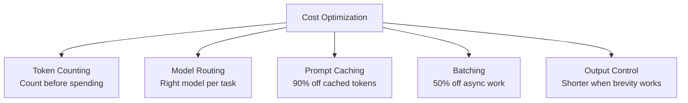
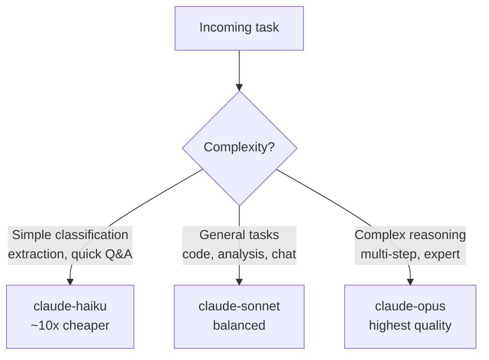
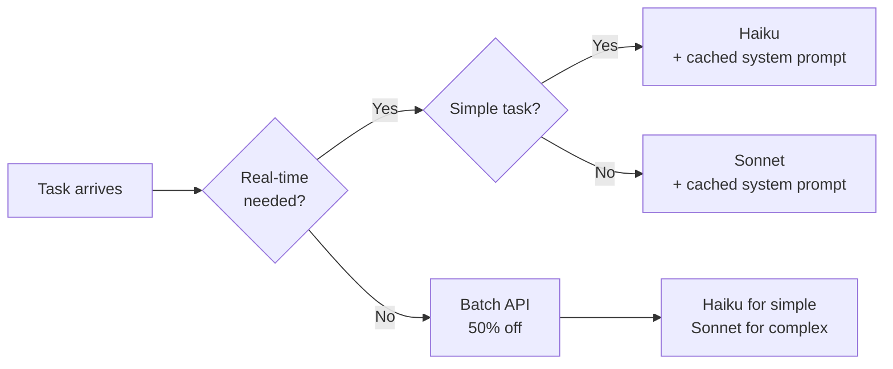

# Cost Optimization

## The Story 📖

Imagine running a taxi fleet. You have a mix of economy cars, mid-range sedans, and luxury SUVs. An experienced dispatcher doesn't send the SUV for a 2-block trip to pick up one person — they match the right vehicle to the right job. The short trip gets the economy car. The airport run with 5 bags gets the SUV. By routing intelligently, costs drop dramatically without any reduction in service quality.

**Cost optimization** for Claude API is that same dispatcher logic: match each task to the right model, use caching to avoid re-paying for repeated context, batch non-urgent work for 50% off, count tokens before spending them, and keep output tight when brevity is enough.

None of this reduces quality. A well-optimized Claude integration gives you the same intelligence at a fraction of the cost.

👉 This is why we need **cost optimization** — every dollar saved on infrastructure is a dollar available for product, features, and growth.

---

## What is Cost Optimization? 💰

Cost optimization for Claude API is the systematic application of strategies that reduce token spending and API costs without sacrificing output quality. The strategies compound: applying all of them together can reduce costs by 5-10× compared to a naive implementation.

The five main levers:



---

## Lever 1: Token Counting 🔢

Before making an expensive call, count tokens to predict cost and catch runaway prompts.

```python
import anthropic

client = anthropic.Anthropic()

# Count tokens WITHOUT making the actual API call
token_count = client.messages.count_tokens(
    model="claude-sonnet-4-6",
    system="You are a helpful assistant.",
    messages=[
        {"role": "user", "content": "Explain quantum computing in detail."}
    ]
)

print(f"Input tokens: {token_count.input_tokens}")
# Use this to estimate cost before sending
```

The `count_tokens()` method uses the same tokenizer as the actual API call — results are exact. Use it to:
- Validate that your prompt fits in the context window
- Monitor prompt size over time as your system evolves
- Alert when a constructed prompt grows unexpectedly large
- Calculate cost estimates before batching thousands of requests

---

## Lever 2: Model Routing Strategy 🎛️

Not every task needs Claude Sonnet. A smart routing strategy assigns each task to the cheapest model capable of doing it reliably.



Routing decision criteria:

| Task Type | Recommended Model |
|---|---|
| Sentiment classification, entity extraction | Haiku |
| Simple Q&A, formatting, translation | Haiku |
| Code generation, debugging | Sonnet |
| General chat, explanations | Sonnet |
| Complex reasoning, research | Sonnet or Opus |
| Novel problem solving, PhD-level analysis | Opus |

```python
def route_model(task_type: str) -> str:
    if task_type in ("classify", "extract", "format", "translate"):
        return "claude-haiku-4-5-20251001"
    elif task_type in ("code", "chat", "analyze"):
        return "claude-sonnet-4-6"
    else:
        return "claude-opus-4-6"   # fallback to highest
```

---

## Lever 3: Prompt Caching ROI 💾

Reviewed in depth in Topic 09. Key summary for cost optimization:

- Cache the system prompt if it's >1,024 tokens and called more than once
- Cache tool definitions if they're large and repeated
- Cache document context for multi-question document analysis

Expected savings:
- 90% reduction on cached token costs after cache is warm
- Break-even at 2 cache hits
- Typical production workload: 5-9× cheaper prompt costs

The `usage` response fields you monitor:
```python
response.usage.cache_creation_input_tokens  # cost at 1.25×
response.usage.cache_read_input_tokens      # cost at 0.10×
```

---

## Lever 4: Batching for Non-Real-Time Work 📦

Reviewed in depth in Topic 10. Key summary:

- 50% cost reduction for offline workloads
- Use for: data annotation, evaluation, document pipelines, nightly jobs
- Doesn't reduce quality — same models, same outputs
- Can be combined with prompt caching in batch requests

---

## Lever 5: Output Length Control ✂️

**Output tokens cost more than input tokens** on all Claude models (typically 3-5× more per token). Controlling output length is therefore one of the highest-impact levers.

### Set `max_tokens` explicitly

```python
# Too many output tokens for a simple classification
response = client.messages.create(
    model="claude-sonnet-4-6",
    max_tokens=4096,  # wasteful for a one-word output
    messages=[{"role": "user", "content": "Classify as POSITIVE or NEGATIVE: 'Great product!'"}]
)

# Right-sized
response = client.messages.create(
    model="claude-sonnet-4-6",
    max_tokens=8,   # one word max
    messages=[...]
)
```

### Use prompt instructions to control length

```python
# Verbose by default
"Explain X"

# Length-controlled
"Explain X in one sentence."
"List the top 3 points about X. Each point: max 10 words."
"Summarize X in under 50 words."
```

### Use stop sequences for extraction

```python
# Stop immediately after getting the answer
response = client.messages.create(
    model="claude-sonnet-4-6",
    max_tokens=256,
    stop_sequences=[".", "\n"],  # stop after the first sentence
    messages=[{"role": "user", "content": "What is the capital of France?"}]
)
# Claude stops at "Paris" or after the first sentence
```

---

## Cost Monitoring 📊

Track spending continuously — don't wait for a surprise bill.

```python
class TokenTracker:
    def __init__(self):
        self.total_input = 0
        self.total_output = 0
        self.total_cache_read = 0
        self.total_cache_write = 0
        self.calls = 0
    
    def record(self, usage, model: str):
        self.total_input += usage.input_tokens
        self.total_output += usage.output_tokens
        self.total_cache_read += usage.cache_read_input_tokens
        self.total_cache_write += usage.cache_creation_input_tokens
        self.calls += 1
    
    def cost_estimate(self, input_price: float, output_price: float) -> float:
        return (
            self.total_input * input_price +
            self.total_output * output_price +
            self.total_cache_write * input_price * 1.25 +
            self.total_cache_read * input_price * 0.10
        )
    
    def report(self):
        print(f"Calls: {self.calls}")
        print(f"Input: {self.total_input:,} tokens")
        print(f"Output: {self.total_output:,} tokens")
        print(f"Cache reads: {self.total_cache_read:,} tokens")
        print(f"Avg output/call: {self.total_output / max(self.calls, 1):.0f}")
```

---

## Combined Strategy: Maximum Savings 🎯

For a production application processing 10,000 requests/day:



| Strategy | Cost impact |
|---|---|
| Model routing (Haiku vs Sonnet) | 5-10× reduction on eligible tasks |
| Prompt caching | 90% on cached tokens |
| Batching | 50% on async work |
| Output length control | 30-60% on output tokens |
| **Combined** | **Up to 90%+ vs naive implementation** |

---

## Common Mistakes to Avoid ⚠️

- **Mistake 1 — Using Sonnet for everything:** Haiku handles 80% of production tasks at 10× lower cost. Benchmark quality before assuming you need Sonnet.
- **Mistake 2 — No max_tokens:** Defaulting to 4096 output tokens on every call — even when the answer is one word — wastes money on output tokens.
- **Mistake 3 — No cache monitoring:** Deploying caching without logging `cache_read_input_tokens` — you don't know if caching is even activating.
- **Mistake 4 — Not counting tokens before bulk jobs:** Submitting 10,000 requests without estimating total cost first — surprise bills.
- **Mistake 5 — Verbose output prompts for pipelines:** "Explain your reasoning before providing the answer" is great for debugging but doubles output tokens in production. Turn off CoT once your prompts are stable.

---

## Connection to Other Concepts 🔗

- Relates to **Prompt Caching** (Topic 09) and **Batching** (Topic 10) — these are two of the five cost levers
- Relates to **Model Reference** (Topic 13) — pricing and capability per model is the foundation of routing decisions
- Relates to **Production AI** (Section 12, Topic 03) for the broader production cost management context

---

✅ **What you just learned:** Cost optimization uses five levers: token counting (predict before spending), model routing (right model per task), prompt caching (90% off cached tokens), batching (50% off async), and output length control (right-size max_tokens).

🔨 **Build this now:** Implement `TokenTracker` in a simple chat app. After 20 test conversations, compute your cost-per-conversation and identify which lever would reduce it most.

➡️ **Next step:** [Error Handling](../12_Error_Handling/Theory.md) — build production-grade resilience for API failures, rate limits, and transient errors.

---

## 📂 Navigation

**In this folder:**
| File | |
|---|---|
| 📄 **Theory.md** | ← you are here |
| [📄 Cheatsheet.md](./Cheatsheet.md) | Quick reference |
| [📄 Interview_QA.md](./Interview_QA.md) | Interview prep |
| [📄 Comparison.md](./Comparison.md) | Strategy comparison |

⬅️ **Prev:** [Batching](../10_Batching/Theory.md) &nbsp;&nbsp;&nbsp; ➡️ **Next:** [Error Handling](../12_Error_Handling/Theory.md)
