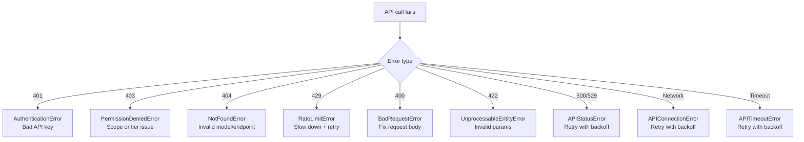

# Error Handling

## The Story 📖

Imagine you're building a highway. Cars drive on it every day and 99.9% of trips go perfectly. But roads have potholes, accidents, weather events, and congestion. A well-built highway doesn't just have lanes — it has guardrails, emergency exits, speed limits, and detour signs. These don't exist because you expect chaos. They exist because resilience is engineered in, not bolted on afterward.

An Anthropic API integration is that highway. 99.9% of calls succeed immediately. But rate limits happen. Network connections drop. Anthropic servers occasionally return 500s. The difference between a fragile integration and a production-grade one is whether you've engineered the guardrails before you need them.

**Error handling** is those guardrails: the code that catches failures gracefully, retries intelligently, surfaces errors correctly, and keeps your application running when the API has a bad moment.

👉 This is why we need **error handling** — production systems fail without it, and with it, individual API failures become invisible to users.

---

## What Can Go Wrong? 🔴

The Anthropic API can fail in several distinct ways, each requiring a different response:



---

## The Error Hierarchy 🏗️

The Anthropic Python SDK uses a structured exception hierarchy:

```
anthropic.APIError
├── anthropic.APIStatusError       # any HTTP 4xx/5xx
│   ├── anthropic.BadRequestError          # 400
│   ├── anthropic.AuthenticationError      # 401
│   ├── anthropic.PermissionDeniedError    # 403
│   ├── anthropic.NotFoundError            # 404
│   ├── anthropic.UnprocessableEntityError # 422
│   ├── anthropic.RateLimitError           # 429
│   └── anthropic.InternalServerError      # 500/529
├── anthropic.APIConnectionError    # network-level failure
└── anthropic.APITimeoutError       # request timed out
```

All exceptions have:
- `.message` — human-readable error description
- `.status_code` — HTTP status (for APIStatusError subclasses)
- `.request_id` — unique request ID for Anthropic support

---

## Basic Error Handling Pattern 🛡️

```python
import anthropic

client = anthropic.Anthropic()

try:
    response = client.messages.create(
        model="claude-sonnet-4-6",
        max_tokens=1024,
        messages=[{"role": "user", "content": "Hello!"}]
    )
    return response.content[0].text

except anthropic.AuthenticationError as e:
    # Bad API key — fail fast, log, alert ops
    raise RuntimeError(f"Invalid API key: {e.message}") from e

except anthropic.RateLimitError as e:
    # Slow down — implement backoff (see below)
    raise  # let retry logic handle this

except anthropic.BadRequestError as e:
    # Bug in your code — bad parameters
    raise ValueError(f"Invalid request: {e.message}") from e

except anthropic.APIConnectionError as e:
    # Network failure — retry
    raise  # let retry logic handle this

except anthropic.APIStatusError as e:
    # Catch-all for unexpected HTTP errors
    raise RuntimeError(f"API error {e.status_code}: {e.message}") from e
```

---

## Exponential Backoff with Tenacity ⏱️

The right retry strategy is exponential backoff with jitter. Tenacity is the standard Python library for this:

```python
import anthropic
from tenacity import (
    retry,
    stop_after_attempt,
    wait_exponential,
    wait_random,
    retry_if_exception_type,
)

client = anthropic.Anthropic()

RETRYABLE_ERRORS = (
    anthropic.RateLimitError,
    anthropic.APIConnectionError,
    anthropic.APITimeoutError,
    anthropic.InternalServerError,
)

@retry(
    retry=retry_if_exception_type(RETRYABLE_ERRORS),
    wait=wait_exponential(multiplier=1, min=1, max=60) + wait_random(0, 1),
    stop=stop_after_attempt(5),
    reraise=True,
)
def call_claude(prompt: str) -> str:
    response = client.messages.create(
        model="claude-sonnet-4-6",
        max_tokens=1024,
        messages=[{"role": "user", "content": prompt}]
    )
    return response.content[0].text
```

The backoff schedule:
- Attempt 1: immediate
- Attempt 2: ~1-2 seconds
- Attempt 3: ~2-4 seconds
- Attempt 4: ~8-12 seconds
- Attempt 5: ~30-60 seconds

The random jitter (`wait_random(0, 1)`) prevents synchronized retries from multiple clients all hitting the API at the same moment (thundering herd).

---

## Manual Exponential Backoff 🔧

When you can't use tenacity:

```python
import time
import random
import anthropic

def call_with_backoff(prompt: str, max_retries: int = 5) -> str:
    client = anthropic.Anthropic()
    
    for attempt in range(max_retries):
        try:
            response = client.messages.create(
                model="claude-sonnet-4-6",
                max_tokens=1024,
                messages=[{"role": "user", "content": prompt}]
            )
            return response.content[0].text
        
        except (anthropic.RateLimitError, anthropic.APIConnectionError, 
                anthropic.InternalServerError) as e:
            if attempt == max_retries - 1:
                raise  # final attempt — let it fail
            
            # Exponential backoff: 1s, 2s, 4s, 8s, ...
            wait = (2 ** attempt) + random.uniform(0, 1)
            print(f"Attempt {attempt+1} failed ({type(e).__name__}). Retrying in {wait:.1f}s")
            time.sleep(wait)
        
        except anthropic.AuthenticationError:
            raise  # never retry auth errors
        except anthropic.BadRequestError:
            raise  # never retry bad requests
    
    raise RuntimeError("All retry attempts exhausted")
```

---

## Respecting `retry-after` Headers 📋

When you receive a 429 RateLimitError, the response includes a `retry-after` header with the exact wait time:

```python
import anthropic
import time

def call_with_header_backoff(prompt: str) -> str:
    client = anthropic.Anthropic()
    
    for attempt in range(5):
        try:
            return client.messages.create(
                model="claude-sonnet-4-6",
                max_tokens=1024,
                messages=[{"role": "user", "content": prompt}]
            ).content[0].text
        
        except anthropic.RateLimitError as e:
            # Check if the SDK surfaced the retry-after header
            retry_after = getattr(e, 'retry_after', None)
            if retry_after:
                wait_time = float(retry_after)
            else:
                wait_time = 2 ** attempt  # fallback to exponential
            
            print(f"Rate limited. Waiting {wait_time}s")
            time.sleep(wait_time)
    
    raise RuntimeError("Exhausted retries on rate limit")
```

---

## Idempotency — Safe Retry Patterns 🔁

Not all API calls are safe to retry without side effects. For Claude messages.create(), retrying is safe because:
- The API generates a new response on each call
- There's no state on the server side that persists between calls

However, if your application does something with the response (inserts to database, sends email), make sure to:
1. Only process the response once per logical request
2. Use idempotency keys if you're triggering downstream side effects
3. Log the `message.id` — this lets you detect if you accidentally processed the same response twice

---

## Circuit Breaker Pattern 🔌

A circuit breaker prevents your application from hammering a failing API and making the situation worse:

```python
import time
import anthropic

class CircuitBreaker:
    def __init__(self, failure_threshold=5, recovery_timeout=60):
        self.failures = 0
        self.failure_threshold = failure_threshold
        self.recovery_timeout = recovery_timeout
        self.opened_at = None
        self.state = "CLOSED"  # CLOSED=normal, OPEN=blocking, HALF_OPEN=testing
    
    def call(self, fn, *args, **kwargs):
        if self.state == "OPEN":
            if time.time() - self.opened_at > self.recovery_timeout:
                self.state = "HALF_OPEN"
            else:
                raise RuntimeError("Circuit is OPEN — API calls blocked")
        
        try:
            result = fn(*args, **kwargs)
            if self.state == "HALF_OPEN":
                self.state = "CLOSED"
                self.failures = 0
            return result
        except (anthropic.APIConnectionError, anthropic.InternalServerError) as e:
            self.failures += 1
            if self.failures >= self.failure_threshold:
                self.state = "OPEN"
                self.opened_at = time.time()
                print(f"Circuit OPENED after {self.failures} failures")
            raise
```

---

## Structured Error Logging 📝

In production, always log errors with enough context to debug:

```python
import logging
import anthropic

logger = logging.getLogger(__name__)

def call_and_log(prompt: str, user_id: str) -> str:
    client = anthropic.Anthropic()
    
    try:
        response = client.messages.create(
            model="claude-sonnet-4-6",
            max_tokens=1024,
            messages=[{"role": "user", "content": prompt}]
        )
        
        logger.info("api_call_success", extra={
            "user_id": user_id,
            "input_tokens": response.usage.input_tokens,
            "output_tokens": response.usage.output_tokens,
            "stop_reason": response.stop_reason,
            "request_id": response.id,
        })
        return response.content[0].text
    
    except anthropic.APIStatusError as e:
        logger.error("api_call_failed", extra={
            "user_id": user_id,
            "status_code": e.status_code,
            "error_type": type(e).__name__,
            "message": e.message,
            "request_id": getattr(e, 'request_id', None),
        })
        raise
```

---

## Common Mistakes to Avoid ⚠️

- **Mistake 1 — Retrying auth errors:** `AuthenticationError` means your API key is wrong. Retrying doesn't fix it — you'll loop forever. Always fail fast on auth errors.
- **Mistake 2 — No jitter in backoff:** Without jitter, 100 clients all hit rate limits simultaneously, all wait the same amount, and all retry at the same moment — creating a new spike. Always add random jitter.
- **Mistake 3 — Unlimited retries:** A bug in your request body (400 error) will retry forever without a `stop_after_attempt` limit. Always cap retries.
- **Mistake 4 — Swallowing exceptions silently:** `except Exception: pass` in production is a silent failure. Always log at minimum, and usually re-raise.
- **Mistake 5 — Not logging the request_id:** The `request_id` field in the response lets Anthropic support debug specific failed calls. Always log it.

---

## Connection to Other Concepts 🔗

- Relates to **API Basics** (Topic 01) because HTTP status codes are the foundation of error classification
- Relates to **Batching** (Topic 10) because batch results have individual `errored` results that require separate handling
- Relates to **Production AI** (Section 12) for the broader production reliability context

---

✅ **What you just learned:** The Anthropic SDK raises typed exceptions for each error class. Retry `RateLimitError`, `APIConnectionError`, and `InternalServerError` with exponential backoff + jitter. Never retry `AuthenticationError` or `BadRequestError`.

🔨 **Build this now:** Wrap `client.messages.create()` with a tenacity decorator that retries on rate limits and connection errors with exponential backoff. Add logging for every retry attempt. Trigger a test by setting an artificially low sleep before each call.

➡️ **Next step:** [Model Reference](../13_Model_Reference/Theory.md) — complete guide to all current Claude model IDs, context windows, pricing, and capabilities.

---

## 📂 Navigation

**In this folder:**
| File | |
|---|---|
| 📄 **Theory.md** | ← you are here |
| [📄 Cheatsheet.md](./Cheatsheet.md) | Quick reference |
| [📄 Interview_QA.md](./Interview_QA.md) | Interview prep |
| [📄 Code_Example.md](./Code_Example.md) | Working code |

⬅️ **Prev:** [Cost Optimization](../11_Cost_Optimization/Theory.md) &nbsp;&nbsp;&nbsp; ➡️ **Next:** [Model Reference](../13_Model_Reference/Theory.md)
