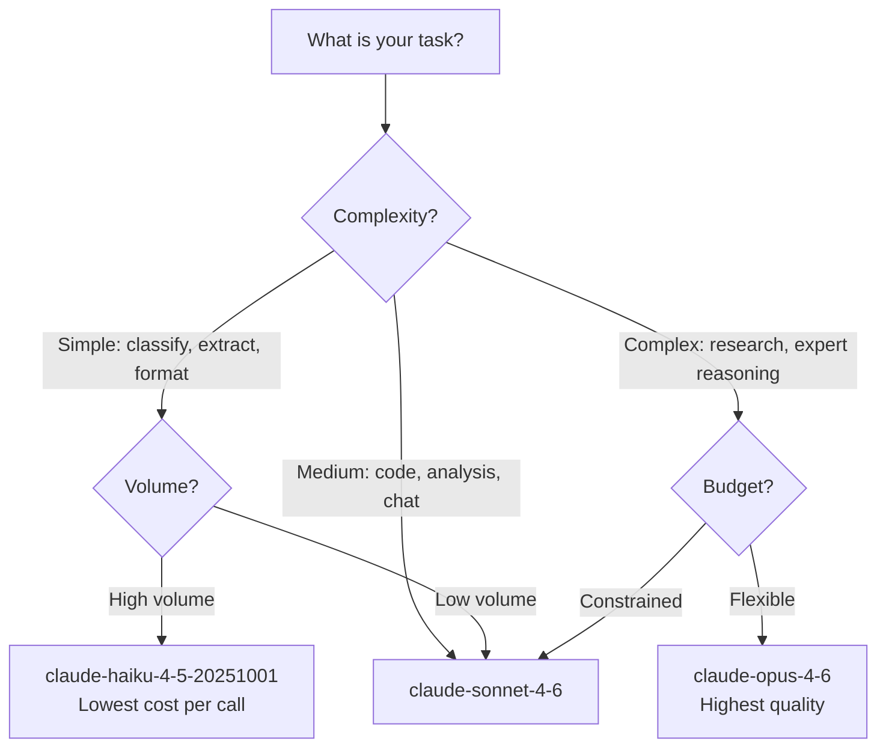

# Model Reference

## The Story 📖

Think about car rental. You don't just rent "a car" — you choose between economy, mid-size, full-size, and luxury, based on your needs and budget. An economy car gets you to the destination perfectly well for most trips. A luxury SUV is right for the client meeting where impressions matter. Picking a Ferrari for a grocery run is expensive overkill. Picking a compact for a cross-country move is the wrong tool.

Claude models are the same. **Haiku** is the compact: fast, economical, excellent for routine tasks. **Sonnet** is the mid-size: intelligent, versatile, the right fit for most production work. **Opus** is the luxury SUV: maximum intelligence, reserved for problems that genuinely require the most capable model available.

Knowing exactly which model to use — their IDs, context windows, pricing, and capability trade-offs — is a foundational production skill.

👉 This is why we study **model reference** — the wrong model choice wastes money or delivers subpar quality; the right choice optimizes both.

---

## Current Claude Model Lineup 🗂️

As of April 2026, the current production models are:

### Claude Haiku 4.5

| Property | Value |
|---|---|
| Model ID | `claude-haiku-4-5-20251001` |
| Speed | Fastest in the Claude family |
| Intelligence | Optimized for high-volume, simpler tasks |
| Context window | 200,000 tokens |
| Input pricing | ~$0.80 / million tokens |
| Output pricing | ~$4.00 / million tokens |
| Vision | Yes |
| Extended thinking | No |

Best for: classification, extraction, translation, simple Q&A, high-throughput pipelines.

---

### Claude Sonnet 4.6

| Property | Value |
|---|---|
| Model ID | `claude-sonnet-4-6` |
| Speed | Fast — production-optimized |
| Intelligence | High — the best balance of performance and cost |
| Context window | 200,000 tokens |
| Input pricing | ~$3.00 / million tokens |
| Output pricing | ~$15.00 / million tokens |
| Vision | Yes |
| Extended thinking | Yes |

Best for: code generation, analysis, reasoning, document processing, general production chat.

---

### Claude Opus 4.6

| Property | Value |
|---|---|
| Model ID | `claude-opus-4-6` |
| Speed | Slower — more deliberate reasoning |
| Intelligence | Highest available |
| Context window | 200,000 tokens |
| Input pricing | ~$15.00 / million tokens |
| Output pricing | ~$75.00 / million tokens |
| Vision | Yes |
| Extended thinking | Yes |

Best for: complex multi-step reasoning, expert-level analysis, research, tasks where quality is worth the cost.

---

## Model Comparison at a Glance 📊

```mermaid
graph LR
    subgraph "Speed"
        S1[Haiku ████████████ fastest]
        S2[Sonnet ████████ fast]
        S3[Opus ████ slowest]
    end

    subgraph "Intelligence"
        I1[Haiku ████ strong for simple tasks]
        I2[Sonnet ████████ high]
        I3[Opus ████████████ highest]
    end

    subgraph "Cost (relative)"
        C1[Haiku $]
        C2[Sonnet $$$]
        C3[Opus $$$$$$$$$$$$$$$$$$]
    end
```

---

## Model Selection Guide 🎯



| Task | Recommended Model | Reason |
|---|---|---|
| Sentiment classification | Haiku | Simple label output |
| Entity extraction | Haiku | Straightforward pattern matching |
| Translation | Haiku | Well-solved by smaller models |
| Simple Q&A | Haiku | Factual, short output |
| Code generation | Sonnet | Needs reasoning + context |
| Document analysis | Sonnet | Long context + analysis |
| Customer chat | Sonnet | Quality matters for UX |
| Complex debugging | Sonnet or Opus | Depends on complexity |
| Research synthesis | Opus | Multi-document reasoning |
| Expert-level writing | Opus | Nuance and depth required |

---

## Context Window — 200K Tokens 🪟

All current Claude models share a 200,000-token context window. To put this in perspective:

| Content | Approximate Tokens |
|---|---|
| One page of text | ~500 tokens |
| A short story (5,000 words) | ~7,000 tokens |
| A novel (80,000 words) | ~110,000 tokens |
| A code repository (medium) | ~50,000-150,000 tokens |
| An entire legal contract | ~5,000-20,000 tokens |
| A book chapter | ~3,000-8,000 tokens |

200K context means Claude can read and reason across very long documents — an entire codebase, a full legal document set, or a large research paper corpus — in a single request.

---

## Pricing Model — Token-Based Billing 💰

Claude billing is purely per-token. No monthly seat fees for API access. No per-request charges. Just input tokens + output tokens.

```
Total cost = (input_tokens × input_price) + (output_tokens × output_price)
```

With prompt caching:
```
Total cost = 
  (regular_input_tokens × input_price) +
  (cache_write_tokens × input_price × 1.25) +
  (cache_read_tokens × input_price × 0.10) +
  (output_tokens × output_price)
```

---

## Pricing Comparison Table

| Model | Input ($/MTok) | Output ($/MTok) | Cache Write | Cache Read |
|---|---|---|---|---|
| claude-haiku-4-5-20251001 | $0.80 | $4.00 | $1.00 | $0.08 |
| claude-sonnet-4-6 | $3.00 | $15.00 | $3.75 | $0.30 |
| claude-opus-4-6 | $15.00 | $75.00 | $18.75 | $1.50 |

Note: these prices are representative. Always verify at [https://www.anthropic.com/pricing](https://www.anthropic.com/pricing) for the latest.

---

## Model ID Versioning Pattern 📅

Claude model IDs follow a pattern:

```
claude-{family}-{major_version}-{date_suffix}
```

Examples:
```
claude-haiku-4-5-20251001   → Haiku family, version 4.5, snapshot 2025-10-01
claude-sonnet-4-6            → Sonnet family, version 4.6 (no date = latest)
claude-opus-4-6              → Opus family, version 4.6 (no date = latest)
```

Best practice:
- Use **non-dated IDs** (`claude-sonnet-4-6`) in development — always points to the latest model
- Use **dated IDs** in production for stability — pins behavior to a specific model snapshot
- The response `message.model` always returns the dated ID, even if you submitted a non-dated one

---

## Legacy Model Deprecation 🗑️

Anthropic deprecates older model generations on a rolling basis. Deprecated models:
- Are announced via email and docs with 6+ months notice
- Eventually stop accepting requests
- Should be replaced in your code before the deprecation deadline

Monitoring best practice: log `response.model` (the full dated ID) to a metrics system. Set alerts when you see a model ID you've explicitly marked for replacement.

---

## Capabilities Per Model Matrix

| Capability | Haiku 4.5 | Sonnet 4.6 | Opus 4.6 |
|---|---|---|---|
| Vision (images) | Yes | Yes | Yes |
| Extended thinking | No | Yes | Yes |
| Tool use | Yes | Yes | Yes |
| Streaming | Yes | Yes | Yes |
| Prompt caching | Yes (2K min) | Yes (1K min) | Yes (1K min) |
| Message Batches | Yes | Yes | Yes |
| JSON output | Yes | Yes | Yes |
| Context window | 200K | 200K | 200K |

---

## Common Mistakes to Avoid ⚠️

- **Mistake 1 — Using Opus for everything:** Opus costs 50× more than Haiku. Using it for a simple classification task is financially irrational. Profile your tasks before choosing models.
- **Mistake 2 — Hardcoding model IDs without a config variable:** When models are deprecated, you need to update every hardcoded string. Store model IDs in a config file.
- **Mistake 3 — Confusing non-dated and dated IDs:** `claude-sonnet-4-6` (latest) vs `claude-sonnet-4-6-20250219` (pinned). Use dated IDs in production.
- **Mistake 4 — Ignoring extended thinking availability:** If your Haiku prompt requires extended thinking, it will fail — Haiku doesn't support it. Check capability matrix before routing.
- **Mistake 5 — Assuming model pricing is stable:** Prices change. Build a config for pricing rather than hardcoding numbers — you'll need to update them.

---

## Connection to Other Concepts 🔗

- Relates to **Cost Optimization** (Topic 11) because model selection is the primary lever in routing strategies
- Relates to **Extended Thinking** in Track 1 Topic 08 for model-specific thinking capabilities
- Relates to **First API Call** (Topic 03) because `model` is a required parameter in every call

---

✅ **What you just learned:** Three current model families (Haiku/Sonnet/Opus) differ in speed, intelligence, and price. All share 200K context. Use Haiku for simple high-volume tasks, Sonnet for most production work, Opus for maximum quality needs.

🔨 **Build this now:** Implement a `route_model(task_description: str) -> str` function. Test it with 10 different task types. Verify the routing decisions are cost-appropriate by calculating the price difference for each choice.

➡️ **Next step:** [Track 4 — Claude Agent SDK](../../04_Claude_Agent_SDK/01_What_are_Agents/Theory.md) — build autonomous agents that use Claude to reason, plan, and take action.

---

## 📂 Navigation

**In this folder:**
| File | |
|---|---|
| 📄 **Theory.md** | ← you are here |
| [📄 Cheatsheet.md](./Cheatsheet.md) | Quick reference |
| [📄 Interview_QA.md](./Interview_QA.md) | Interview prep |
| [📄 Comparison.md](./Comparison.md) | Full model comparison |

⬅️ **Prev:** [Error Handling](../12_Error_Handling/Theory.md) &nbsp;&nbsp;&nbsp; ➡️ **Next:** [Track 4 — Agent SDK](../../04_Claude_Agent_SDK/01_What_are_Agents/Theory.md)
