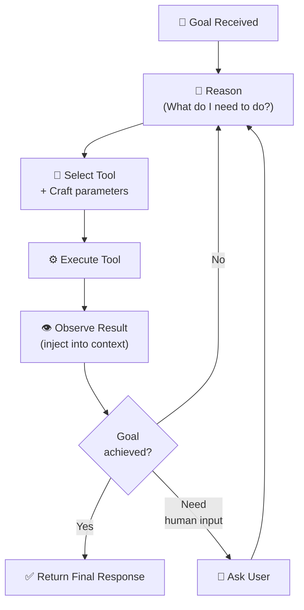
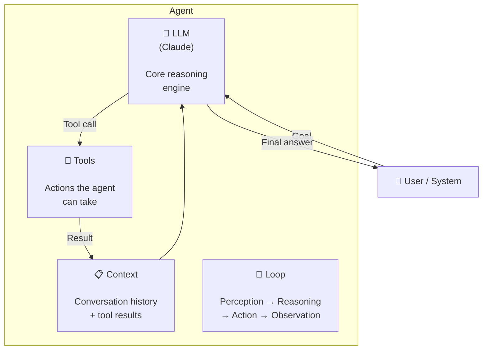

# What Are Agents?

## The Story 📖

Imagine you hire a personal assistant and say: "Book me a flight to London next Thursday, under $800, aisle seat." You don't walk them through every step. You don't say "open a browser, type kayak.com, click flights, enter London..." You state the goal and they figure it out.

Your assistant has a loop running in their head: look at what they know, decide the next action, do it, observe the result, adjust the plan, repeat — until the job is done or they hit a wall and come back to ask you.

That loop — observe, think, act, observe, repeat — is exactly what an **agent** is.

Now imagine replacing your assistant with an AI. Same loop, but now the AI uses tools (web search, code execution, file reading) instead of hands. The AI can take dozens of actions autonomously before ever coming back to you. That's the shift from a chatbot to an agent.

👉 This is why we need **agents** — to let AI accomplish multi-step goals, not just answer single questions.

---

## 📌 Learning Priority

**Must Learn** — core concepts, needed to understand the rest of this file:
[What is an Agent](#what-is-an-agent) · [Agent Loop Steps](#how-it-works--step-by-step) · [Four Agent Components](#the-four-components-of-an-agent)

**Should Learn** — important for real projects and interviews:
[Agent vs Chain](#what-makes-something-an-agent-vs-just-a-chain) · [Real System Examples](#where-youll-see-this-in-real-ai-systems)

**Good to Know** — useful in specific situations, not needed daily:
[Loop Pseudocode](#the-math--technical-side-simplified)

**Reference** — skim once, look up when needed:
[Common Mistakes](#common-mistakes-to-avoid-)

---

## What is an Agent?

An **agent** is an AI system that perceives its environment, reasons about what to do, takes actions using tools, observes the results, and loops until it achieves a goal — without requiring a human to direct each step.

The key distinction from a simple API call:

| Single API Call | Agent |
|---|---|
| One question → one answer | Goal → multiple steps → outcome |
| Stateless | Maintains context across steps |
| No tools | Uses tools to act in the world |
| Human drives every step | AI drives intermediate steps |
| Deterministic path | Adaptive planning |

#### Real-world examples

- **Code assistant**: Given "fix all failing tests in this repo," reads failing test output, finds root cause, edits files, reruns tests, iterates until all pass
- **Research agent**: Given "summarize the top 5 papers on ControlNet from 2023," searches, retrieves, reads, filters, synthesizes — all autonomously
- **Data pipeline agent**: Given "clean this CSV and generate a summary report," reads data, detects issues, writes cleaning code, runs it, compiles report
- **Customer support agent**: Given a ticket, reads the user's account history, looks up relevant docs, takes action in the system, responds — without human routing

---

## Why It Exists — The Problem It Solves

1. **Single responses don't accomplish goals.** If your goal requires 12 steps and you only get one response per interaction, you're the bottleneck. Agents remove the human from the loop for the intermediate steps.

2. **Real tasks require tools.** Answering "what's the weather?" requires calling an API. Running code requires a sandboxed executor. Editing a file requires file access. No single LLM response includes real-world actions — agents wire the tools to the model.

3. **Plans must adapt.** If step 4 fails, a smart agent adjusts steps 5-12 rather than giving up. A fixed chain of prompts cannot adapt to unexpected results.

👉 Without agents: AI is a question-answering machine. With agents: AI is a goal-achieving machine.

---

## How It Works — Step by Step

### Step 1: Receive a Goal

The agent receives a high-level objective. This could be from a user, another agent, or a scheduler.

```
Goal: "Find the three most-cited papers on diffusion models published in 2022 and create a summary table."
```

### Step 2: Reason About the Plan

The model thinks about what steps are needed. With Claude, this is the "thinking before acting" phase — the model may internally decompose the goal into sub-tasks.

### Step 3: Select and Execute a Tool

The model chooses a tool (web search, code executor, file writer) and calls it with specific parameters.

### Step 4: Observe the Result

The tool returns output — search results, code output, error messages, file contents. This is injected back into the model's context.

### Step 5: Loop or Return

The model decides: is the goal achieved? If not, go back to step 2 with the new information. If yes, produce the final response.



This loop is called the **agent loop** or the **ReAct loop** (Reason + Act).

---

## The Four Components of an Agent

Every agent has these building blocks:



**The LLM** is the reasoning core — it decides what to do at each step.

**Tools** are the actions: web search, code execution, file I/O, API calls, database queries.

**Context** is the running record of what has happened — it's how the agent "remembers" steps 1-11 when working on step 12.

**The loop** is the infrastructure that keeps running until the goal is met.

---

## What Makes Something "An Agent" vs "Just a Chain"?

There's a spectrum:

```
Single call → Chain → Agent → Multi-Agent System
```

- A **chain** runs a fixed sequence of LLM calls. The path is predetermined.
- An **agent** decides its own path. If step 3 fails, it can try a different approach. It can call more tools, fewer tools, or different tools than planned.

The defining property of an agent is **adaptive autonomy**: the model decides what to do next based on what it observes, not based on a predetermined script.

---

## The Math / Technical Side (Simplified)

At each agent step, the model receives:

```
context = [system_prompt, user_goal, tool_definitions, history_of_actions_and_results]
```

The model then produces either:
- A **tool call**: `{ "tool": "web_search", "query": "DDPM 2020 Ho et al" }`
- A **final response**: plain text

The loop runs until the model produces a final response (no tool call) or a stop condition is hit.

The key insight: the agent loop is just a `while` loop around an LLM API call.

```
while True:
    response = call_llm(context)
    if response.is_final_answer:
        return response.text
    tool_result = execute_tool(response.tool_call)
    context.append(response.tool_call)
    context.append(tool_result)
```

This is all the Claude Agent SDK does — it handles that loop so you don't have to write it yourself.

---

## Where You'll See This in Real AI Systems

- **Claude Code** — uses the agent loop to read files, run commands, edit code, run tests, all in service of a coding goal
- **Perplexity** — agent-style search: queries multiple sources, synthesizes, cites
- **Devin / GitHub Copilot Workspace** — full agent loops over codebases
- **OpenAI Assistants API** — hosted agent loop with built-in tools
- **LangGraph agents** — stateful agent loops with checkpointing
- **AutoGen / CrewAI** — multi-agent frameworks where each agent runs its own loop

---

## Common Mistakes to Avoid ⚠️

- Calling something an "agent" when it's a fixed 3-step chain. A chain is not an agent — it can't adapt.
- Thinking agents always do better than single calls. For simple tasks, agents add latency and complexity for no gain.
- Not setting termination conditions. An agent without a max-steps limit can loop forever.
- Confusing the model with the agent. The model is just the reasoning component. The agent is the whole system: model + tools + loop.

---

## Connection to Other Concepts 🔗

- Relates to **ReAct pattern** (Section 10) — the thought-action-observation loop is the original agent formulation
- Relates to **Tool Use** (Track 3, Topic 05) — tools are what make the agent's actions real
- Relates to **Multi-Agent Systems** (Topic 07 in this track) — multiple agents, each running its own loop
- Relates to **Claude Code** (Track 2) — Claude Code is itself an agent

---

✅ **What you just learned:** An agent is an AI system running a perception → reasoning → action → observation loop until a goal is achieved, distinct from single API calls by its adaptive autonomy and tool use.

🔨 **Build this now:** Write out (in pseudocode or plain English) the agent loop for a research agent that takes a topic and returns a 3-sentence summary sourced from the web. What tools does it need? How does it know when to stop?

➡️ **Next step:** [Why Agent SDK?](../02_Why_Agent_SDK/Theory.md) — learn why the Agent SDK exists and what it gives you over raw API calls.

---

## 📂 Navigation

**In this folder:**
| File | |
|---|---|
| 📄 **Theory.md** | ← you are here |
| [📄 Cheatsheet.md](./Cheatsheet.md) | Quick reference |
| [📄 Interview_QA.md](./Interview_QA.md) | Interview prep |
| [📄 Visual_Guide.md](./Visual_Guide.md) | Step-by-step diagrams |

⬅️ **Prev:** [Track 3: Model Reference](../../03_Claude_API_and_SDK/13_Model_Reference/Theory.md) &nbsp;&nbsp;&nbsp; ➡️ **Next:** [Why Agent SDK?](../02_Why_Agent_SDK/Theory.md)
