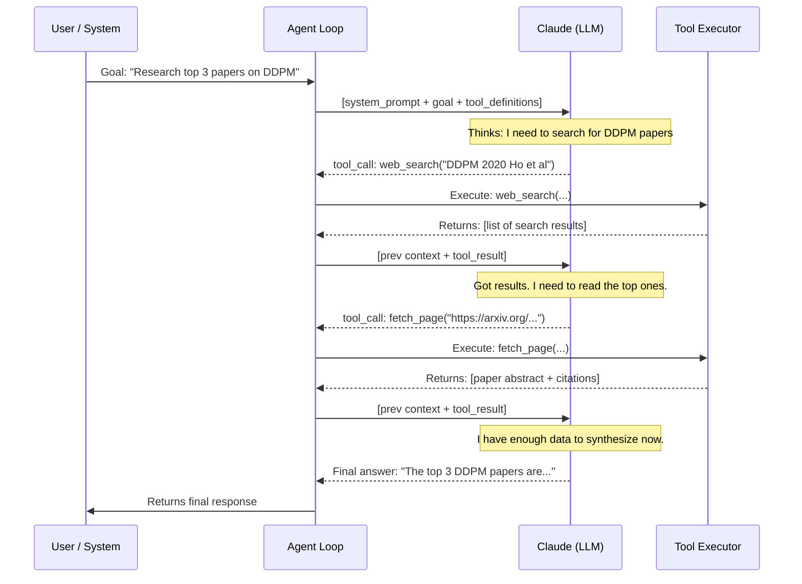
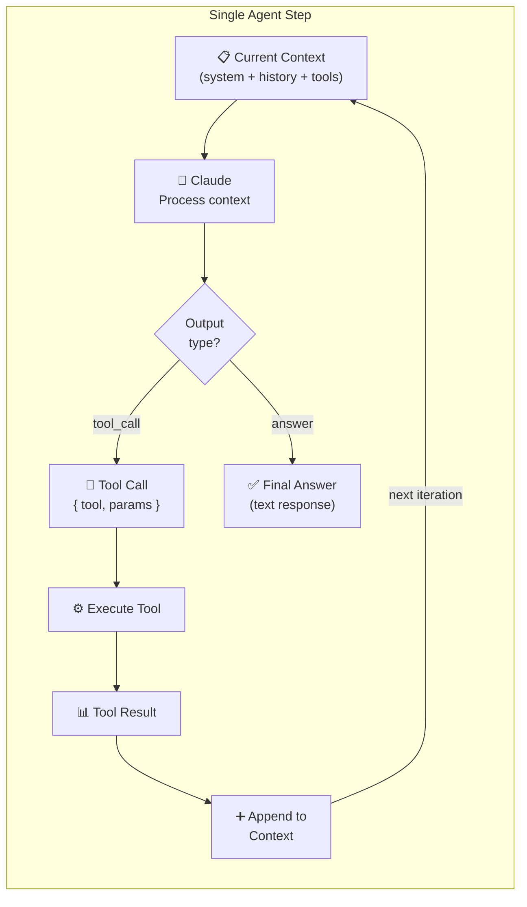
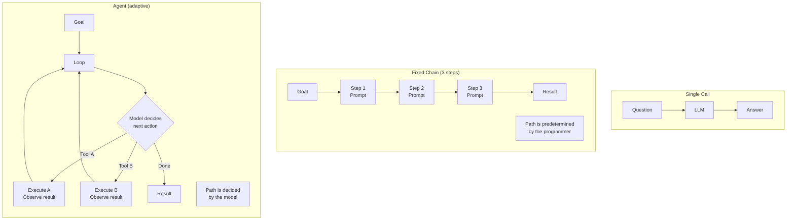

# What Are Agents? — Visual Guide

## The Full Agent Loop, Step by Step



---

## Anatomy of One Loop Iteration



---

## Context Growth Over a 4-Step Agent Loop

```
Step 0 — Initial context
┌─────────────────────────────────────────────────────────┐
│ System prompt (300 tokens)                               │
│ User goal (50 tokens)                                    │
│ Tool definitions (200 tokens)                            │
└─────────────────────────────────────────────────────────┘
Total: ~550 tokens

Step 1 — After first tool call
┌─────────────────────────────────────────────────────────┐
│ [Previous context: 550 tokens]                           │
│ Tool call: web_search(...) (30 tokens)                   │
│ Tool result: search results (800 tokens)                 │
└─────────────────────────────────────────────────────────┘
Total: ~1,380 tokens

Step 2 — After second tool call
┌─────────────────────────────────────────────────────────┐
│ [Previous context: 1,380 tokens]                         │
│ Tool call: fetch_page(...) (25 tokens)                   │
│ Tool result: paper text (2,000 tokens)                   │
└─────────────────────────────────────────────────────────┘
Total: ~3,405 tokens

Step 3 — After third tool call
┌─────────────────────────────────────────────────────────┐
│ [Previous context: 3,405 tokens]                         │
│ Tool call: fetch_page(...) (25 tokens)                   │
│ Tool result: paper text (2,000 tokens)                   │
└─────────────────────────────────────────────────────────┘
Total: ~5,430 tokens

Step 4 — Final answer generated
┌─────────────────────────────────────────────────────────┐
│ [Previous context: 5,430 tokens]                         │
│ Final response (300 tokens)                              │
└─────────────────────────────────────────────────────────┘
```

Key insight: context grows linearly with steps. Long agents need memory management strategies (see Topic 06).

---

## Agent vs Chain vs Single Call — Visual Comparison



---

## 📂 Navigation

**In this folder:**
| File | |
|---|---|
| [📄 Theory.md](./Theory.md) | Full explanation |
| [📄 Cheatsheet.md](./Cheatsheet.md) | Quick reference |
| [📄 Interview_QA.md](./Interview_QA.md) | Interview prep |
| 📄 **Visual_Guide.md** | ← you are here |

⬅️ **Prev:** [Track 3: Model Reference](../../03_Claude_API_and_SDK/13_Model_Reference/Theory.md) &nbsp;&nbsp;&nbsp; ➡️ **Next:** [Why Agent SDK?](../02_Why_Agent_SDK/Theory.md)
