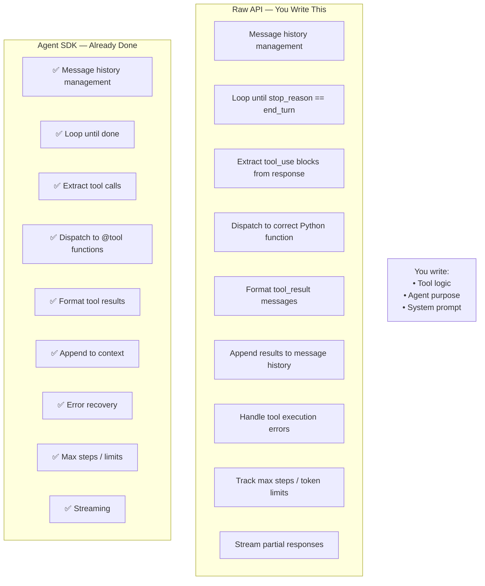
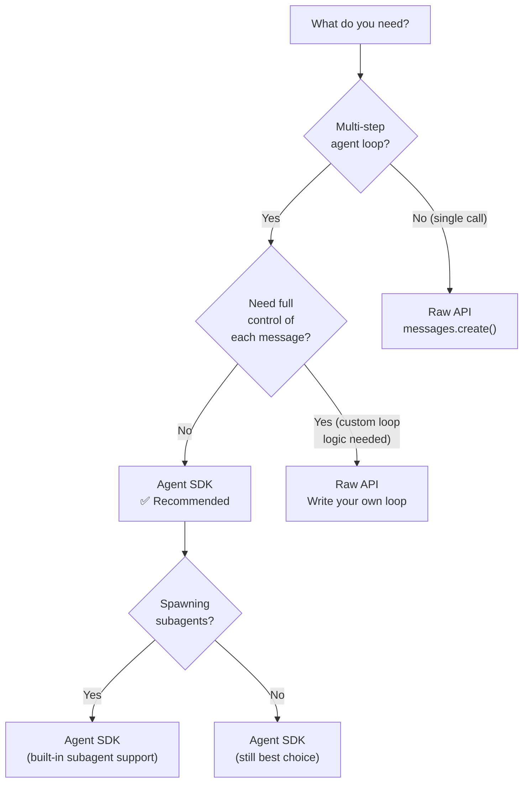

# Why Agent SDK?

## The Story 📖

Picture two plumbers. The first one brings a single wrench and improvises every connection by hand — cutting pipes, bending fittings, testing leaks, rerouting when something doesn't fit. He gets the job done, but spends 80% of his time on plumbing infrastructure and 20% on the actual work.

The second plumber brings a full toolkit: pre-cut pipes, quick-connect fittings, leak detectors, pressure gauges. She spends 10% of her time on infrastructure and 90% on the actual job.

The raw Anthropic API is the first plumber's single wrench. You can build agents — but you have to write the loop yourself, manage tool execution yourself, handle errors yourself, track context yourself. It's all possible, and some engineers prefer that level of control.

The **Claude Agent SDK** is the second plumber's toolkit. It ships the loop, tool execution, context management, and error handling pre-built. You describe the agent and its tools. The SDK runs the agent.

👉 This is why the **Agent SDK** exists — to remove the boilerplate so you focus on the agent's purpose, not its plumbing.

---

## What is the Claude Agent SDK?

The **Claude Agent SDK** (also called the Anthropic Agent SDK or `claude_agent_sdk`) is a Python library that wraps the raw Messages API to provide a production-ready implementation of the agent loop.

It gives you:

- **Built-in agent loop** — no `while True` to write yourself
- **Automatic tool execution** — define a tool, the SDK calls it when Claude asks
- **Context management** — conversation history tracked and passed automatically
- **Error recovery** — tool errors are caught, formatted, and returned to the model
- **Streaming support** — stream agent thoughts and tool calls in real time
- **Subagent spawning** — launch child agents with their own loops

---

## Raw API vs Agent SDK — What Changes?

### The raw API: you own the loop

With the raw Messages API, building an agent looks like this:

```python
import anthropic

client = anthropic.Anthropic()
messages = []

while True:
    response = client.messages.create(
        model="claude-sonnet-4-6",
        max_tokens=4096,
        tools=tool_definitions,
        messages=messages
    )
    
    if response.stop_reason == "end_turn":
        print(response.content[0].text)
        break
    
    # Find tool calls
    tool_calls = [b for b in response.content if b.type == "tool_use"]
    if not tool_calls:
        break
    
    messages.append({"role": "assistant", "content": response.content})
    tool_results = []
    
    for tc in tool_calls:
        result = execute_tool(tc.name, tc.input)  # you write this dispatcher
        tool_results.append({
            "type": "tool_result",
            "tool_use_id": tc.id,
            "content": str(result)
        })
    
    messages.append({"role": "user", "content": tool_results})
```

You're managing: the message list, stop reason checks, tool call extraction, tool dispatch, result formatting, and loop continuation. That's 30+ lines before your tools are even defined.

### The Agent SDK: the loop is handled

```python
from claude_agent_sdk import Agent, tool

@tool
def web_search(query: str) -> str:
    """Search the web for information."""
    return search_api(query)

agent = Agent(
    model="claude-sonnet-4-6",
    tools=[web_search],
    system="You are a research assistant."
)

result = agent.run("Find the top 3 papers on DDPM from 2020.")
print(result)
```

The loop, tool dispatch, context tracking — all handled. You write the business logic.

---

## What the SDK Handles Automatically



---

## When to Use the SDK vs Raw API



**Use the Agent SDK when:**
- Building any agent with tool use
- You want automatic tool execution
- You need subagents or multi-agent patterns
- You want production-ready error handling

**Use the raw API when:**
- Single message/response (no loop needed)
- You need byte-for-byte control of the message format
- Building a custom loop with non-standard logic (e.g., stateful game loops)
- Integrating with a framework that manages the loop itself (LangGraph, etc.)

---

## The Math / Technical Side (Simplified)

The SDK abstracts the state machine underneath the agent loop. The state at any point is:

```
AgentState = {
    messages: List[Message],
    step_count: int,
    tool_registry: Dict[str, Callable],
    config: AgentConfig
}
```

The loop transitions between states:

```
State(n) → call_llm(State.messages) → response
         → if response.has_tool_calls → execute_tools → State(n+1)
         → if response.is_final → return response.final_text
```

The SDK exposes `Agent.run(goal)` as the entry point and hides all state transitions.

---

## Where You'll See This in Real AI Systems

- **Claude Code** — uses the same agent loop patterns internally to manage file editing and command execution
- **Anthropic's own demos** — all agent demos in the Anthropic cookbook use the Agent SDK
- **Production AI assistants** — any system built on Claude that needs multi-step reasoning
- **Research pipelines** — automated literature review, data analysis agents

---

## Common Mistakes to Avoid ⚠️

- Using the raw API to re-implement what the SDK already provides. This is wasted engineering time and introduces bugs the SDK has already solved.
- Using the Agent SDK for single-turn chat (overkill — just use `messages.create()`).
- Assuming the SDK handles prompt engineering. The SDK handles the loop; you still write the system prompt, tool descriptions, and agent instructions.
- Not reading the tool execution logs when debugging. The SDK logs tool calls — use them.

---

## Connection to Other Concepts 🔗

- Relates to **Tool Use** (Track 3, Topic 05) — the SDK automates what you do manually in Track 3
- Relates to **Messages API** (Track 3, Topic 02) — the SDK wraps this API
- Relates to **What Are Agents** (Topic 01) — the SDK implements the agent loop described there
- Relates to **Multi-Agent Orchestration** (Topic 07) — the SDK also handles spawning subagents

---

✅ **What you just learned:** The Agent SDK wraps the raw Messages API to provide a production-ready agent loop — handling tool dispatch, context management, error recovery, and streaming automatically. Use it for any multi-step agent; use the raw API for single-turn calls or fully custom loops.

🔨 **Build this now:** Write the pseudocode for a research agent using the raw API approach. Then rewrite it using the SDK's `@tool` + `agent.run()` pattern. Count how many lines each requires for the same behavior.

➡️ **Next step:** [Simple Agent](../03_Simple_Agent/Theory.md) — build your first working agent with the SDK.

---

## 📂 Navigation

**In this folder:**
| File | |
|---|---|
| 📄 **Theory.md** | ← you are here |
| [📄 Cheatsheet.md](./Cheatsheet.md) | Quick reference |
| [📄 Interview_QA.md](./Interview_QA.md) | Interview prep |
| [📄 Comparison.md](./Comparison.md) | Raw API vs SDK full comparison |

⬅️ **Prev:** [What Are Agents?](../01_What_are_Agents/Theory.md) &nbsp;&nbsp;&nbsp; ➡️ **Next:** [Simple Agent](../03_Simple_Agent/Theory.md)
