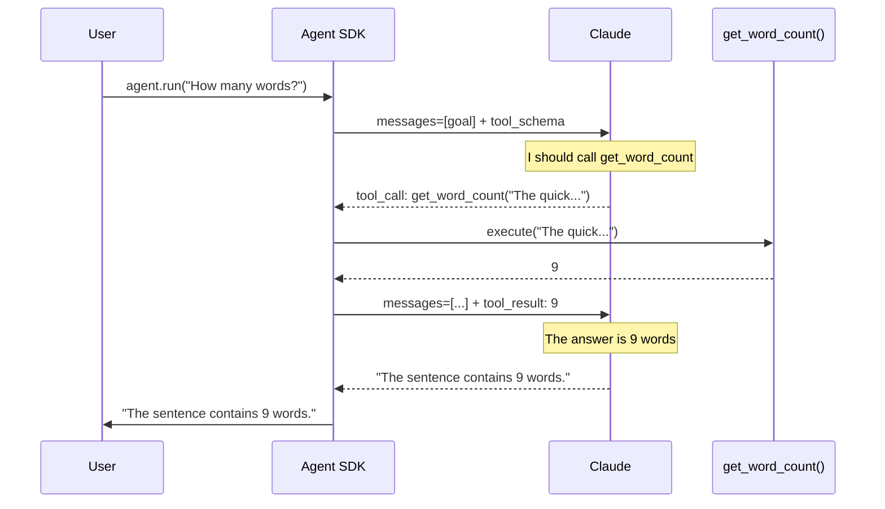

# Simple Agent

## The Story 📖

You're teaching someone to drive for the first time. You don't start with motorway merging at 70mph. You find an empty car park, explain the pedals, and say: "Go forward, stop, go again." Minimal moving parts. Clear feedback. Build intuition before complexity.

Building your first agent is the same principle. Forget orchestration, subagents, and memory systems. Start with one model, one tool, one goal. Make it run. Understand each piece. Then add complexity.

The simplest possible agent has three parts: a model that reasons, one tool it can call, and a loop that runs until done. Once you've built that, every other agent concept is just an extension.

👉 This is the minimal working **simple agent** — your car park run before the motorway.

---

## 📌 Learning Priority

**Must Learn** — core concepts, needed to understand the rest of this file:
[Defining Tools](#step-1-define-your-tools) · [Creating the Agent](#step-2-create-the-agent) · [Running the Loop](#step-3-run-the-agent-loop)

**Should Learn** — important for real projects and interviews:
[@tool Decorator Anatomy](#anatomy-of-the-tool-decorator) · [Minimal Working Example](#the-complete-minimal-working-example)

**Good to Know** — useful in specific situations, not needed daily:
[SDK Internal Payload](#the-math--technical-side-simplified)

**Reference** — skim once, look up when needed:
[Common Mistakes](#common-mistakes-to-avoid-)

---

## What is a Simple Agent?

A **simple agent** is the minimal implementation of the agent pattern: one Claude model, one or more tools defined with the `@tool` decorator, and the agent loop managed by the SDK.

It demonstrates the complete perception → reasoning → action → observation cycle with the least possible code.

---

## Why It Exists — The Problem It Solves

1. **Learning by doing.** Reading about agents doesn't build intuition. A running agent does.
2. **Debugging surface.** A minimal agent has minimal failure modes — you can see exactly what the model is doing at each step.
3. **Foundation for everything else.** Every complex agent in production starts as this. You add tools, memory, subagents — but the core loop never changes.

---

## How It Works — Step by Step

### Step 1: Define Your Tools

A **tool** is any Python function that the agent can call. The `@tool` decorator converts it to a schema Claude understands.

```python
from claude_agent_sdk import tool

@tool
def get_word_count(text: str) -> int:
    """Count the number of words in a text string."""
    return len(text.split())
```

The decorator reads the function signature and docstring to generate a **JSON schema** that Claude uses to know: "this tool exists, it takes a `text` parameter (string), and returns an integer."

### Step 2: Create the Agent

```python
from claude_agent_sdk import Agent

agent = Agent(
    model="claude-sonnet-4-6",
    tools=[get_word_count],
    system="You are a text analysis assistant. Use tools to answer questions about text."
)
```

The `Agent` object holds: the model name, the tool registry (name → function mapping), and the system prompt.

### Step 3: Run the Agent Loop

```python
result = agent.run("How many words are in this sentence: 'The quick brown fox jumps over the lazy dog'?")
print(result)
```

Internally, `agent.run()` is executing:

```python
while True:
    response = call_claude(messages, tools)
    if response.is_final:
        return response.text
    result = execute_tool(response.tool_call)
    messages.append(result)
```

### Step 4: Read the Result

```
The sentence 'The quick brown fox jumps over the lazy dog' contains 9 words.
```

The model called `get_word_count("The quick brown fox jumps over the lazy dog")`, received `9`, and synthesized the answer.

---

## The Complete Minimal Working Example



---

## Anatomy of the `@tool` Decorator

The `@tool` decorator does three things:

1. **Reads the function signature** — `text: str` → `{"name": "text", "type": "string"}`
2. **Reads the docstring** — becomes the tool description Claude uses to decide when to call it
3. **Registers the function** — so the SDK can dispatch calls to it by name

This means your docstring is part of your system design — write it clearly:

```python
@tool
def search_papers(query: str, year: int = None) -> list[dict]:
    """Search academic papers by keyword. Returns title, authors, and abstract.
    Use this when the user asks about research papers or scientific findings.
    The year parameter filters results to a specific publication year."""
    # ...
```

Good docstrings = better tool selection by the model.

---

## The Math / Technical Side (Simplified)

When you call `agent.run(goal)`, the SDK constructs the first message payload:

```json
{
  "model": "claude-sonnet-4-6",
  "system": "You are a text analysis assistant...",
  "messages": [{"role": "user", "content": "How many words..."}],
  "tools": [
    {
      "name": "get_word_count",
      "description": "Count the number of words in a text string.",
      "input_schema": {
        "type": "object",
        "properties": {"text": {"type": "string"}},
        "required": ["text"]
      }
    }
  ]
}
```

Claude returns either a tool call or a final text response. The SDK handles the branching.

---

## Where You'll See This in Real AI Systems

- Every tutorial and getting-started guide for any agent framework begins here
- Anthropic's own cookbook examples use this exact pattern for quick demos
- Production agents add complexity on top but never replace this foundation
- Unit tests for agents often reduce them back to this minimal form

---

## Common Mistakes to Avoid ⚠️

- Writing a vague docstring. The model uses the docstring to decide when to call the tool — "does stuff" is useless; "searches the web for recent news articles given a query string" is actionable.
- Forgetting to add the tool to the `tools=[]` list. Defining `@tool` doesn't register it; you have to pass it explicitly.
- Not handling tool errors. If your tool function raises an exception, the SDK should catch it — but log it so you can debug.
- Running a full agent for tasks that don't need one. If the answer doesn't require a tool call, just call `messages.create()` directly.

---

## Connection to Other Concepts 🔗

- Relates to **Why Agent SDK** (Topic 02) — this is the SDK in action
- Relates to **Tool Calling in Agents** (Topic 04) — deep dive into what happens inside tool execution
- Relates to **Multi-Step Reasoning** (Topic 05) — extending this with chained tool calls
- Relates to **Tool Use** (Track 3, Topic 05) — the raw API version of what `@tool` handles

---

✅ **What you just learned:** A simple agent requires three elements: a model, one or more `@tool`-decorated functions, and `agent.run()`. The SDK handles the loop, tool dispatch, and context — you write the tool logic and system prompt.

🔨 **Build this now:** Implement a simple agent with two tools: `add(a, b)` and `multiply(a, b)`. Ask it: "What is (4 + 7) × 3?" Watch it call both tools in sequence.

➡️ **Next step:** [Tool Calling in Agents](../04_Tool_Calling_in_Agents/Theory.md) — understand the full tool call lifecycle, error handling, and schema design.

---

## 📂 Navigation

**In this folder:**
| File | |
|---|---|
| 📄 **Theory.md** | ← you are here |
| [📄 Cheatsheet.md](./Cheatsheet.md) | Quick reference |
| [📄 Interview_QA.md](./Interview_QA.md) | Interview prep |
| [📄 Code_Example.md](./Code_Example.md) | Complete working code |

⬅️ **Prev:** [Why Agent SDK?](../02_Why_Agent_SDK/Theory.md) &nbsp;&nbsp;&nbsp; ➡️ **Next:** [Tool Calling in Agents](../04_Tool_Calling_in_Agents/Theory.md)
