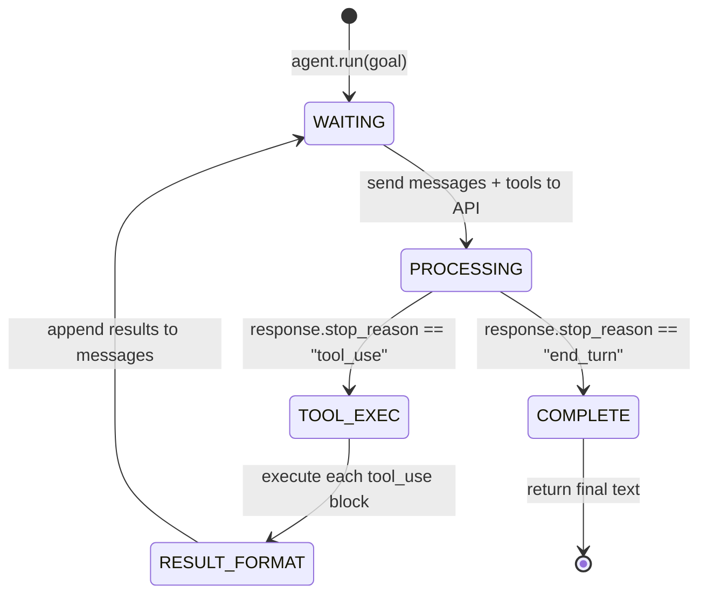
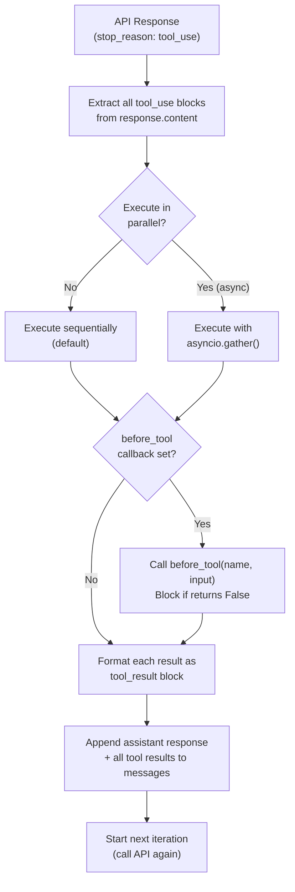

# Tool Calling in Agents — Architecture Deep Dive

## The Tool Call State Machine

At the protocol level, every agent loop iteration is a transition between three states:



---

## Message Wire Format — One Full Iteration

What actually travels over the wire for a single tool call iteration:

### Request (Iteration 1)

```json
{
  "model": "claude-sonnet-4-6",
  "max_tokens": 4096,
  "system": "You are a research assistant...",
  "tools": [
    {
      "name": "web_search",
      "description": "Search the web for current information...",
      "input_schema": {
        "type": "object",
        "properties": {
          "query": {
            "type": "string",
            "description": "The search query"
          },
          "max_results": {
            "type": "integer",
            "description": "Maximum results to return",
            "default": 5
          }
        },
        "required": ["query"]
      }
    }
  ],
  "messages": [
    {
      "role": "user",
      "content": "Find the publication date of the DDPM paper"
    }
  ]
}
```

### Response (Iteration 1 — tool call)

```json
{
  "id": "msg_01abc",
  "type": "message",
  "role": "assistant",
  "stop_reason": "tool_use",
  "content": [
    {
      "type": "text",
      "text": "Let me search for the DDPM paper."
    },
    {
      "type": "tool_use",
      "id": "toolu_01xyz",
      "name": "web_search",
      "input": {
        "query": "DDPM paper Ho et al 2020 publication date",
        "max_results": 3
      }
    }
  ]
}
```

### Request (Iteration 2 — with tool result)

```json
{
  "messages": [
    {"role": "user", "content": "Find the publication date of the DDPM paper"},
    {
      "role": "assistant",
      "content": [
        {"type": "text", "text": "Let me search for the DDPM paper."},
        {"type": "tool_use", "id": "toolu_01xyz", "name": "web_search",
         "input": {"query": "DDPM paper Ho et al 2020 publication date"}}
      ]
    },
    {
      "role": "user",
      "content": [
        {
          "type": "tool_result",
          "tool_use_id": "toolu_01xyz",
          "content": [
            {
              "type": "text",
              "text": "[{\"title\": \"Denoising Diffusion Probabilistic Models\", \"url\": \"https://arxiv.org/abs/2006.11239\", \"snippet\": \"Published June 2020, NeurIPS 2020...\"}]"
            }
          ]
        }
      ]
    }
  ]
}
```

### Response (Iteration 2 — final answer)

```json
{
  "stop_reason": "end_turn",
  "content": [
    {
      "type": "text",
      "text": "The DDPM paper (\"Denoising Diffusion Probabilistic Models\" by Ho et al.) was published in June 2020 and accepted at NeurIPS 2020. The arXiv preprint is at https://arxiv.org/abs/2006.11239."
    }
  ]
}
```

---

## Tool Schema Generation — How `@tool` Works

The `@tool` decorator inspects the function at definition time using Python's `inspect` module:

```python
import inspect
from typing import get_type_hints

def tool(func):
    hints = get_type_hints(func)
    sig = inspect.signature(func)
    
    properties = {}
    required = []
    
    for param_name, param in sig.parameters.items():
        type_hint = hints.get(param_name, str)
        schema = python_type_to_json_schema(type_hint)
        properties[param_name] = schema
        
        if param.default == inspect.Parameter.empty:
            required.append(param_name)
    
    func._tool_schema = {
        "name": func.__name__,
        "description": func.__doc__ or "",
        "input_schema": {
            "type": "object",
            "properties": properties,
            "required": required
        }
    }
    
    return func

def python_type_to_json_schema(python_type) -> dict:
    mapping = {
        str: {"type": "string"},
        int: {"type": "integer"},
        float: {"type": "number"},
        bool: {"type": "boolean"},
        list: {"type": "array"},
        dict: {"type": "object"},
    }
    return mapping.get(python_type, {"type": "string"})
```

---

## Multiple Tool Calls in One Response

Claude can produce multiple `tool_use` blocks in a single response when it needs to call several tools simultaneously. The SDK executes all of them before the next iteration:

```
Response content: [
    {"type": "text", "text": "I'll look up both accounts simultaneously."},
    {"type": "tool_use", "id": "toolu_01", "name": "get_account", "input": {"id": "acct_001"}},
    {"type": "tool_use", "id": "toolu_02", "name": "get_account", "input": {"id": "acct_002"}}
]

SDK executes:
    result_1 = get_account(id="acct_001")  # executed in parallel
    result_2 = get_account(id="acct_002")  # executed in parallel

Next request includes both tool results in the user message.
```

This is parallel tool execution in a single agent step — more efficient than sequential calls.

---

## Error Result Format

When a tool raises an exception, the SDK formats it as an error tool result:

```json
{
  "type": "tool_result",
  "tool_use_id": "toolu_01xyz",
  "is_error": true,
  "content": [
    {
      "type": "text",
      "text": "KeyError: Customer not found: id=99999"
    }
  ]
}
```

Claude sees this and can respond: try a different ID, inform the user, or call a different tool.

---

## SDK Dispatch Flow



---

## 📂 Navigation

**In this folder:**
| File | |
|---|---|
| [📄 Theory.md](./Theory.md) | Full explanation |
| [📄 Cheatsheet.md](./Cheatsheet.md) | Quick reference |
| [📄 Interview_QA.md](./Interview_QA.md) | Interview prep |
| [📄 Code_Example.md](./Code_Example.md) | Tool patterns in code |
| 📄 **Architecture_Deep_Dive.md** | ← you are here |

⬅️ **Prev:** [Simple Agent](../03_Simple_Agent/Theory.md) &nbsp;&nbsp;&nbsp; ➡️ **Next:** [Multi-Step Reasoning](../05_Multi_Step_Reasoning/Theory.md)
