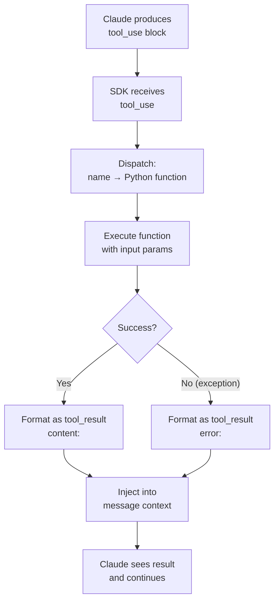
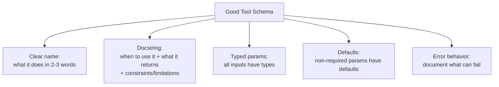

# Tool Calling in Agents

## The Story 📖

A surgeon operating in a hospital has a very specific tool discipline. Before the operation, every instrument is laid out in a precise arrangement. During the operation, the surgeon doesn't rummage through a drawer — they call out the name of the instrument they need, a nurse places it exactly in their hand, they use it, hand it back, and continue. If an instrument fails (breaks, isn't the right size), the nurse immediately provides the next option. After the operation, every instrument is counted to make sure nothing was left behind.

That's exactly how tool calling works in an agent. Claude calls out the tool name and parameters — the SDK places the result in Claude's context — Claude continues. If the tool errors, the error is returned like any other result. Every call is logged.

The discipline here matters. Surgeons don't improvise with wrong instruments mid-operation. Agents shouldn't either — and your tool schemas, error handling, and descriptions are how you enforce that discipline.

👉 This is what makes **tool calling** in agents reliable, not just possible.

---

## 📌 Learning Priority

**Must Learn** — core concepts, needed to understand the rest of this file:
[Full Tool Lifecycle](#how-it-works--the-full-tool-call-lifecycle) · [Tool Schema Best Practices](#tool-schema-best-practices) · [Error Recovery](#phase-4-error-recovery)

**Should Learn** — important for real projects and interviews:
[Auto vs Manual Execution](#automatic-vs-manual-execution) · [Retry Logic](#retry-logic) · [Tool Output Format](#tool-output-format)

**Good to Know** — useful in specific situations, not needed daily:
[Real System Examples](#where-youll-see-this-in-real-ai-systems)

**Reference** — skim once, look up when needed:
[Common Mistakes](#common-mistakes-to-avoid-)

---

## What is Tool Calling in Agents?

**Tool calling** (also called **function calling**) is the mechanism by which an agent takes real-world actions. When Claude decides it needs information or needs to do something, it produces a structured tool call — a JSON object specifying which tool to use and what parameters to pass. The SDK executes the function and returns the result to Claude.

Key distinction from a raw API tool call: in an agent, tool calls happen inside a loop. Claude may call tools dozens of times before producing a final answer, and each result reshapes what Claude does next.

---

## Why It Exists — The Problem It Solves

1. **Bridging the text-world gap.** LLMs output text. The real world needs actions. Tool calling is the bridge.
2. **Structured interfaces.** A tool schema defines exactly what parameters are valid — preventing malformed calls.
3. **Automatic execution.** The agent doesn't produce "here's some code you could run" — it runs the tool directly and observes the result.

---

## How It Works — The Full Tool Call Lifecycle

### Phase 1: Tool Definition

Before the agent runs, tools are defined with schemas. The SDK generates these from your `@tool`-decorated functions:

```python
@tool
def query_database(sql: str, database: str = "production") -> list[dict]:
    """Execute a read-only SQL query against the specified database.
    Returns a list of row dictionaries. Use this for data lookups only.
    Never use for INSERT, UPDATE, or DELETE operations."""
    return db.execute(sql, database)
```

This generates a schema that tells Claude: what the tool is named, when to use it (docstring), what parameters it takes, and their types.

### Phase 2: Claude Selects and Constructs a Tool Call

When Claude decides a tool is needed, it produces a **tool_use** content block:

```json
{
  "type": "tool_use",
  "id": "toolu_01XYZ",
  "name": "query_database",
  "input": {
    "sql": "SELECT name, revenue FROM customers ORDER BY revenue DESC LIMIT 5",
    "database": "production"
  }
}
```

Claude does not call the tool — it requests the call. The SDK executes it.

### Phase 3: SDK Dispatches and Executes

The SDK routes the tool call to the correct Python function by name, passes the `input` dict as keyword arguments, and captures the return value or exception.



### Phase 4: Error Recovery

If a tool throws an exception, the SDK doesn't crash — it formats the error as a tool result and returns it to Claude. Claude can then:
- Try the call again with different parameters
- Call a different tool
- Explain what went wrong to the user
- Abandon that approach

This is automatic error recovery — and it only works because the error is visible to the model.

---

## Automatic vs Manual Execution

The Agent SDK defaults to **automatic execution**: when Claude returns a tool call, the SDK immediately executes it. This is the right default for most agents.

For some use cases, you want **manual execution** — where you inspect, approve, or modify the tool call before it runs. The SDK supports a `before_tool` callback for this:

```python
def approve_tool(tool_name: str, tool_input: dict) -> bool:
    """Human-in-the-loop: confirm before any write operation."""
    if tool_name in DANGEROUS_TOOLS:
        confirm = input(f"Allow {tool_name}({tool_input})? [y/N]: ")
        return confirm.lower() == "y"
    return True

agent = Agent(
    model="claude-sonnet-4-6",
    tools=[...],
    before_tool=approve_tool
)
```

---

## Tool Schema Best Practices

The quality of your tool descriptions directly determines how well the agent uses them.



Example of a poor vs good tool description:

```python
# Poor — vague, unhelpful
@tool
def get_data(query: str) -> dict:
    """Gets some data."""
    ...

# Good — specific, actionable
@tool  
def search_customer_records(name: str, email: str = None) -> list[dict]:
    """Search the customer database by name (required) and optionally by email.
    Returns a list of matching customer records with fields: id, name, email, plan, created_at.
    Returns empty list if no matches found. Raises ValueError if name is empty string.
    Use this to look up customer information before making account changes."""
    ...
```

---

## Tool Output Format

Tools should return clean, structured data that's easy for Claude to reason about:

| Return Type | Best For |
|---|---|
| `str` | Simple text results, messages, status |
| `dict` | Structured single records |
| `list[dict]` | Multiple records |
| `int / float` | Numeric computations |
| `bool` | Success/failure flags |

Avoid returning raw HTML, binary data, or deeply nested objects — Claude has to reason about the output, so simpler is better.

---

## Retry Logic

The Agent SDK doesn't automatically retry failed tool calls — it returns the error to Claude and lets Claude decide. This is by design: Claude can often recover more intelligently than a blind retry.

For transient errors (rate limits, network timeouts), you can wrap tool functions with retry logic:

```python
import time
from functools import wraps

def retry(max_attempts=3, delay=1.0):
    def decorator(func):
        @wraps(func)
        def wrapper(*args, **kwargs):
            for attempt in range(max_attempts):
                try:
                    return func(*args, **kwargs)
                except TransientError as e:
                    if attempt == max_attempts - 1:
                        raise
                    time.sleep(delay * (2 ** attempt))
        return wrapper
    return decorator

@tool
@retry(max_attempts=3)
def call_external_api(endpoint: str) -> dict:
    """Call an external API endpoint. Returns JSON response."""
    return requests.get(endpoint).json()
```

---

## Where You'll See This in Real AI Systems

- **Claude Code** — every file read, edit, bash command is a tool call in the agent loop
- **OpenAI Assistants API** — identical pattern: tool definitions, dispatch, injection
- **LangChain agents** — wraps the same tool-call loop with additional abstractions
- **Customer support agents** — tools for CRM lookup, ticket creation, knowledge base search

---

## Common Mistakes to Avoid ⚠️

- Tools that take too long (>30s) without a timeout — agents can appear to hang.
- Tools that return massive outputs — a tool returning 50KB of raw text floods the context.
- Missing error documentation in docstrings — Claude doesn't know what errors to expect.
- Tools that have side effects not mentioned in the description — Claude may call them multiple times during retry.

---

## Connection to Other Concepts 🔗

- Relates to **Tool Use** (Track 3, Topic 05) — the raw API foundation this builds on
- Relates to **Simple Agent** (Topic 03) — the `@tool` decorator seen there in full detail here
- Relates to **Safety in Agents** (Topic 10) — tool permission scoping, dangerous action detection
- Relates to **Multi-Step Reasoning** (Topic 05) — how chained tool calls enable complex tasks

---

✅ **What you just learned:** Tool calling is the full lifecycle of: Claude producing a structured tool_use block → SDK dispatching to your function → result injected back to Claude. Error recovery is automatic (errors returned as tool results). Good docstrings and typed schemas are the primary lever for tool reliability.

🔨 **Build this now:** Create a tool `divide(a: float, b: float)` that raises `ZeroDivisionError` when b=0. Run an agent with the goal: "What is 10 divided by 0?" Watch how Claude handles the error response.

➡️ **Next step:** [Multi-Step Reasoning](../05_Multi_Step_Reasoning/Theory.md) — how agents chain multiple tool calls to accomplish complex goals.

---

## 📂 Navigation

**In this folder:**
| File | |
|---|---|
| 📄 **Theory.md** | ← you are here |
| [📄 Cheatsheet.md](./Cheatsheet.md) | Quick reference |
| [📄 Interview_QA.md](./Interview_QA.md) | Interview prep |
| [📄 Code_Example.md](./Code_Example.md) | Tool patterns in code |
| [📄 Architecture_Deep_Dive.md](./Architecture_Deep_Dive.md) | Full tool call internals |

⬅️ **Prev:** [Simple Agent](../03_Simple_Agent/Theory.md) &nbsp;&nbsp;&nbsp; ➡️ **Next:** [Multi-Step Reasoning](../05_Multi_Step_Reasoning/Theory.md)
