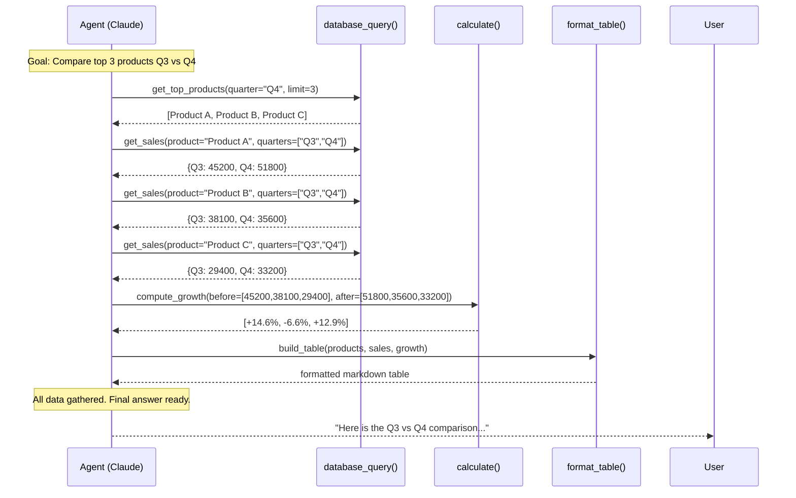
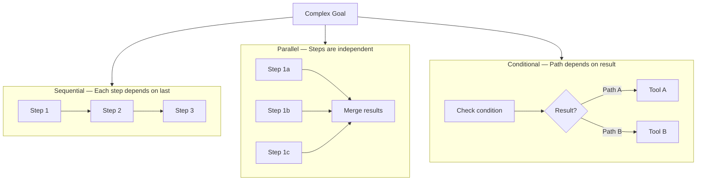

# Multi-Step Reasoning

## The Story 📖

Consider a detective investigating a case. She doesn't arrive at the crime scene and immediately name the culprit. She examines the scene, discovers a clue (footprints outside the window), follows that lead (checks surveillance cameras), uses what she finds (sees a car), runs the plate (calls dispatch), and builds her conclusion piece by piece.

Each clue changes the direction of investigation. Finding the car opens new paths that weren't visible from the crime scene. The final arrest only happens because every intermediate step was available to inform the next one.

That's multi-step reasoning in agents. The agent doesn't know the full path to the answer at the start. It discovers the path as it goes — each tool call revealing the next action needed.

👉 This is **multi-step reasoning** — goal-directed thinking where intermediate results drive the plan.

---

## 📌 Learning Priority

**Must Learn** — core concepts, needed to understand the rest of this file:
[Chaining Tool Calls](#chaining-tool-calls) · [Task Decomposition Patterns](#task-decomposition-patterns) · [Loop Termination](#loop-termination-conditions)

**Should Learn** — important for real projects and interviews:
[Planning Before Acting](#planning-before-acting) · [Intermediate Results as Context](#intermediate-results-as-context)

**Good to Know** — useful in specific situations, not needed daily:
[Greedy Search Model](#the-math--technical-side-simplified)

**Reference** — skim once, look up when needed:
[Common Mistakes](#common-mistakes-to-avoid-)

---

## What is Multi-Step Reasoning?

**Multi-step reasoning** is an agent's ability to decompose a complex goal into a sequence of sub-tasks, where each task's result informs the next task. The agent does not pre-determine the full sequence — it plans one or a few steps ahead, executes, observes, and replans.

Contrast with a single tool call (one action) or a fixed chain (N predetermined actions). Multi-step reasoning is adaptive: the sequence of tool calls is determined at runtime.

---

## Why It Exists — The Problem It Solves

1. **Some answers can't be known in one step.** "What are the total sales for the top 5 customers last month?" requires: finding the customers, querying their sales, totaling each, sorting, returning the top 5. No single tool handles all of that.

2. **Information discovered at step N shapes step N+1.** A customer's name tells you what ID to look up. A code error tells you which file to read. Pre-planning the full sequence before seeing any results is brittle — or impossible.

3. **Complex goals decompose naturally.** "Research X and write a report" = search + read multiple sources + synthesize + format. Each stage is a tool-calling sub-problem.

---

## How It Works — Step by Step

### Planning Before Acting

A well-designed agent (and a well-prompted one) thinks about the task before jumping to the first tool call. This is the "planning" phase:

```
User: "Compare the performance of our top 3 products last quarter vs this quarter."

Agent thinks:
1. I need to know which products are the top 3 (by what metric?)
2. I need Q3 and Q4 data for each
3. I need to compute the comparison
4. I need to format the result

Let me start with step 1: query the product ranking.
```

This planning is internal — it happens in the model's reasoning, not in explicit tool calls. Giving Claude a system prompt that encourages step-by-step planning improves reliability significantly.

### Chaining Tool Calls



### Intermediate Results as Context

Each tool result becomes context for the next decision. After getting `[Product A, Product B, Product C]`, Claude now knows which IDs to pass to `get_sales()`. Without intermediate results, this can't work.

This is why **context management matters** (see Topic 06): all intermediate results live in the context window. A 10-step agent with large tool outputs can exhaust a 200K context window.

---

## Task Decomposition Patterns



The Agent SDK handles all three naturally — the model's output determines which tool to call next, enabling conditional branching without explicit if/else in your code.

---

## Loop Termination Conditions

An agent running multi-step reasoning must know when to stop. Common conditions:

| Condition | Mechanism |
|---|---|
| Goal achieved | Model produces final answer (no tool call) |
| Max steps reached | SDK stops after N iterations (configurable) |
| Token limit | Context window exhaustion |
| Tool error threshold | Stop after N consecutive errors |
| Human interrupt | User sends stop signal |
| External timeout | Wall-clock time limit |

Always set `max_steps` explicitly. A runaway agent is an expensive agent.

---

## The Math / Technical Side (Simplified)

The agent's planning process approximates a greedy search over a decision tree:

```
At each step t:
  action_t = argmax_{action} P(action | goal, history_{0..t-1})
  result_t = execute(action_t)
  history_t = history_{t-1} + (action_t, result_t)

Until: is_complete(history_T) = True
```

The model doesn't enumerate all possible paths — it greedily selects the best next action given the current context. This is fast but imperfect: a better path missed at step 3 may not be recoverable later.

For tasks where optimal planning matters, techniques like Tree-of-Thought (having the model consider multiple options before committing) can improve outcomes.

---

## Where You'll See This in Real AI Systems

- **Claude Code** tasks: "add error handling to all database functions" — reads files, identifies functions, edits each in sequence
- **Research agents**: search → read paper → find citations → read citations → synthesize
- **Data analysis agents**: load data → clean → describe → compute statistics → generate report
- **Debugging agents**: read error → identify file → read file → suggest fix → apply fix → re-run tests

---

## Common Mistakes to Avoid ⚠️

- Not setting a max_steps limit — multi-step agents can loop indefinitely on ambiguous goals.
- Writing system prompts that discourage breaking down tasks — tell Claude explicitly to think step by step and use tools to gather information before concluding.
- Returning huge tool outputs at every step — 5 steps × 10KB per result = 50KB context bloat quickly.
- Expecting the agent to plan perfectly upfront — multi-step agents adapt. That's the feature, not the bug. Let it explore.

---

## Connection to Other Concepts 🔗

- Relates to **Planning and Reasoning** (Section 10, Topic 05) — the broader ML theory
- Relates to **Tool Calling in Agents** (Topic 04) — each step in the chain is a tool call
- Relates to **Agent Memory** (Topic 06) — intermediate results are a form of working memory
- Relates to **Multi-Agent Orchestration** (Topic 07) — delegate steps to specialized subagents

---

✅ **What you just learned:** Multi-step reasoning is goal-directed tool chaining where each result informs the next action. The agent plans adaptively at runtime — it doesn't need to know the full path upfront. Always set max_steps to prevent runaway loops.

🔨 **Build this now:** Create an agent with tools `list_files(dir)` and `read_file(path)`. Ask it: "Read all .txt files in /docs and list which ones mention the word 'error'." Trace how it chains the two tools.

➡️ **Next step:** [Agent Memory](../06_Agent_Memory/Theory.md) — how agents store and retrieve information beyond what fits in one conversation.

---

## 📂 Navigation

**In this folder:**
| File | |
|---|---|
| 📄 **Theory.md** | ← you are here |
| [📄 Cheatsheet.md](./Cheatsheet.md) | Quick reference |
| [📄 Interview_QA.md](./Interview_QA.md) | Interview prep |
| [📄 Code_Example.md](./Code_Example.md) | Chained tool call examples |

⬅️ **Prev:** [Tool Calling in Agents](../04_Tool_Calling_in_Agents/Theory.md) &nbsp;&nbsp;&nbsp; ➡️ **Next:** [Agent Memory](../06_Agent_Memory/Theory.md)
