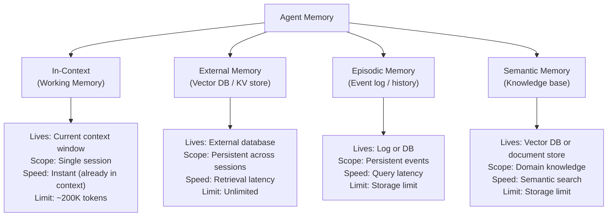
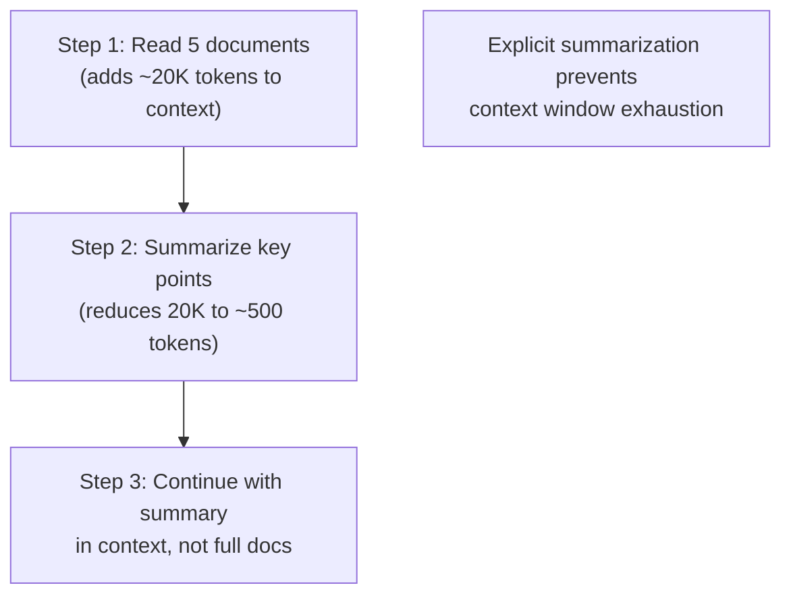

# Agent Memory

## The Story 📖

A brilliant consultant joins your company for a week. On Monday, you brief her on everything: company history, product lines, key customers, ongoing issues. By Friday, she's solved three problems using all that context.

On Monday of the following week, she walks in and says: "Hello, I'm here to help. Can you tell me about your company?"

She forgot everything. Not because she's not brilliant — but because she has no persistent memory. Every session is a blank slate.

That's the reality of AI agents. The model itself is stateless — it only "knows" what's in the current context window. When the session ends, everything is gone. For short tasks, this is fine. For long-running agents that work across days, handle many customers, or learn from experience — it's a fundamental limitation.

The solution is **agent memory** — deliberately persisting information outside the context window so the agent can access it later.

👉 This is why **agent memory** is a design concern, not just a feature.

---

## 📌 Learning Priority

**Must Learn** — core concepts, needed to understand the rest of this file:
[Four Memory Types](#what-is-agent-memory) · [In-Context Memory](#in-context-memory-working-memory) · [External Memory via Tools](#external-memory-vector-database)

**Should Learn** — important for real projects and interviews:
[Passing Context Between Steps](#passing-context-between-steps) · [Memory Limitations](#memory-limitations)

**Good to Know** — useful in specific situations, not needed daily:
[Session State Pattern](#session-state) · [Embedding Retrieval](#the-math--technical-side-simplified)

**Reference** — skim once, look up when needed:
[Common Mistakes](#common-mistakes-to-avoid-)

---

## What is Agent Memory?

**Agent memory** is any mechanism by which an agent retains information beyond a single context window. It exists on a spectrum from immediate (in-context) to long-term (external databases).

There are four distinct memory types:



---

## Why It Exists — The Problem It Solves

1. **Context windows are finite.** A 200K token window sounds large, but a 50-step agent with rich tool outputs fills it quickly. You need to offload facts to external memory before the window saturates.

2. **Sessions end.** If your agent handles customer support tickets, each ticket is a separate session. Remembering what happened in ticket #4,821 requires external storage — it's not in the context window.

3. **Learning from experience.** An agent that "remembers" what strategies worked on previous tasks can improve over time — but only if that knowledge is persisted.

---

## How It Works — Memory Types in Detail

### In-Context Memory (Working Memory)

The simplest memory: everything already in the conversation history. Every previous message, tool call, and tool result is "remembered" as long as it stays in the context window.

```
context = [
    system_prompt,     ← persistent across the session
    user_message_1,
    assistant_response_1,
    tool_call_1,
    tool_result_1,     ← all this is in-context memory
    user_message_2,
    ...
]
```

Strengths: zero latency (already loaded), no infrastructure needed.
Weaknesses: disappears at session end, limited by context window size.

### External Memory (Vector Database)

Information stored outside the model, retrieved on demand using semantic search. The agent has a `memory_search` tool that queries a vector DB and injects the results into context.

```python
@tool
def recall_memory(query: str, limit: int = 5) -> list[dict]:
    """Search long-term agent memory for relevant past information.
    Returns the most semantically similar stored memories.
    Use this when you need to remember what happened in previous sessions
    or look up facts from the knowledge base."""
    results = vector_db.search(query, limit=limit)
    return [{"content": r.text, "relevance": r.score} for r in results]

@tool
def save_memory(content: str, tags: list[str] = None) -> str:
    """Save important information to long-term agent memory.
    Use this after completing a task to save useful facts or decisions."""
    vector_db.upsert(content, tags=tags)
    return "Saved."
```

### Session State

Structured key-value data persisted between sessions. Think of it as the agent's "clipboard" — it stores facts in a specific format for later retrieval.

```python
session_state = {
    "user_id": "cust_4821",
    "last_seen_topics": ["billing", "plan upgrade"],
    "preferred_plan": "Pro",
    "outstanding_issues": ["ticket_2231 pending"]
}
```

This is loaded at session start and saved at session end. Not for semantic search — for exact lookups.

---

## Passing Context Between Steps

Within a single agent session, intermediate results flow through context automatically. But you can also be deliberate about summarizing context to prevent bloat:



Prompt the model to summarize as part of its task: "After reading the documents, compress your findings to bullet points before proceeding."

---

## Memory Limitations

| Limitation | Impact | Mitigation |
|---|---|---|
| Context window size | Old messages fall out of context | Summarize and persist externally |
| Retrieval quality | Wrong memories retrieved by semantic search | Curate what gets saved, use tags |
| Write discipline | Agent may not know when to save | Explicit instructions in system prompt |
| Cost | Vector DB operations cost latency + money | Only save genuinely useful information |
| Staleness | Saved facts can become outdated | Add timestamps; expire old memories |

---

## The Math / Technical Side (Simplified)

External memory retrieval uses embedding similarity:

```
query_embedding = embed_model(query_text)
results = vector_db.search(
    query_vector=query_embedding,
    top_k=5,
    threshold=0.7
)
```

The vector DB stores embeddings of all saved memories. When the agent searches, it computes cosine similarity between the query embedding and all stored embeddings, returning the most relevant entries.

This means semantic search — "what do I know about this customer's billing issues?" — works even when the query phrasing doesn't match the stored text exactly.

---

## Where You'll See This in Real AI Systems

- **Claude Code's MEMORY.md** — literally a file Claude reads at session start to recall cross-session context
- **Customer support agents** — vector DB of previous tickets, customer history loaded at session start
- **Personal AI assistants** — persistent preference memory, past conversation summaries
- **Research agents** — accumulate findings across multiple research sessions
- **Coding assistants** — remember project architecture, coding standards, past decisions

---

## Common Mistakes to Avoid ⚠️

- Saving everything to external memory — this pollutes the memory store and degrades retrieval quality. Save selectively.
- Not including retrieval in the system prompt — the model won't use `recall_memory` unless told to check memory before answering.
- Ignoring context window growth — a 40-step agent can easily exceed 200K tokens without compression.
- Using session state for semantic content — key-value stores are for structured data; use vector DB for text.

---

## Connection to Other Concepts 🔗

- Relates to **Memory Systems** (Section 08, Topic 07) — the broader memory architecture theory
- Relates to **Multi-Step Reasoning** (Topic 05) — working memory is the foundation of chained reasoning
- Relates to **RAG Systems** (Section 09) — vector DB retrieval is the same as RAG retrieval
- Relates to **Agent Handoffs** (Topic 09) — context passing between agents is a memory problem

---

✅ **What you just learned:** Agent memory exists on four levels: in-context (working memory), external (vector DB), episodic (event log), and semantic (knowledge base). In-context memory is free but finite. External memory persists across sessions. The agent needs explicit tools and instructions to use external memory.

🔨 **Build this now:** Add a `save_memory(content)` and `recall_memory(query)` tool to a simple agent. Ask it: "Remember that I prefer metric units." Then in a new session ask: "What unit system do I prefer?" Watch the external memory bridge the sessions.

➡️ **Next step:** [Multi-Agent Orchestration](../07_Multi_Agent_Orchestration/Theory.md) — when one agent isn't enough.

---

## 📂 Navigation

**In this folder:**
| File | |
|---|---|
| 📄 **Theory.md** | ← you are here |
| [📄 Cheatsheet.md](./Cheatsheet.md) | Quick reference |
| [📄 Interview_QA.md](./Interview_QA.md) | Interview prep |

⬅️ **Prev:** [Multi-Step Reasoning](../05_Multi_Step_Reasoning/Theory.md) &nbsp;&nbsp;&nbsp; ➡️ **Next:** [Multi-Agent Orchestration](../07_Multi_Agent_Orchestration/Theory.md)
