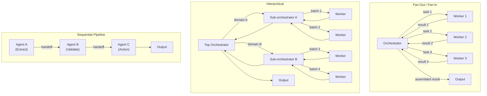
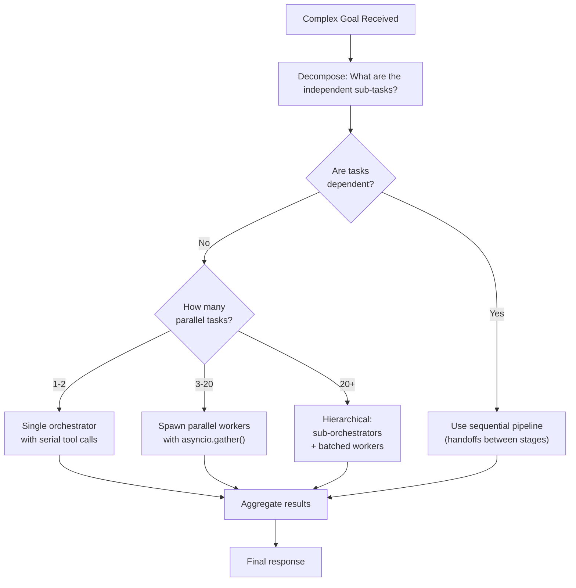
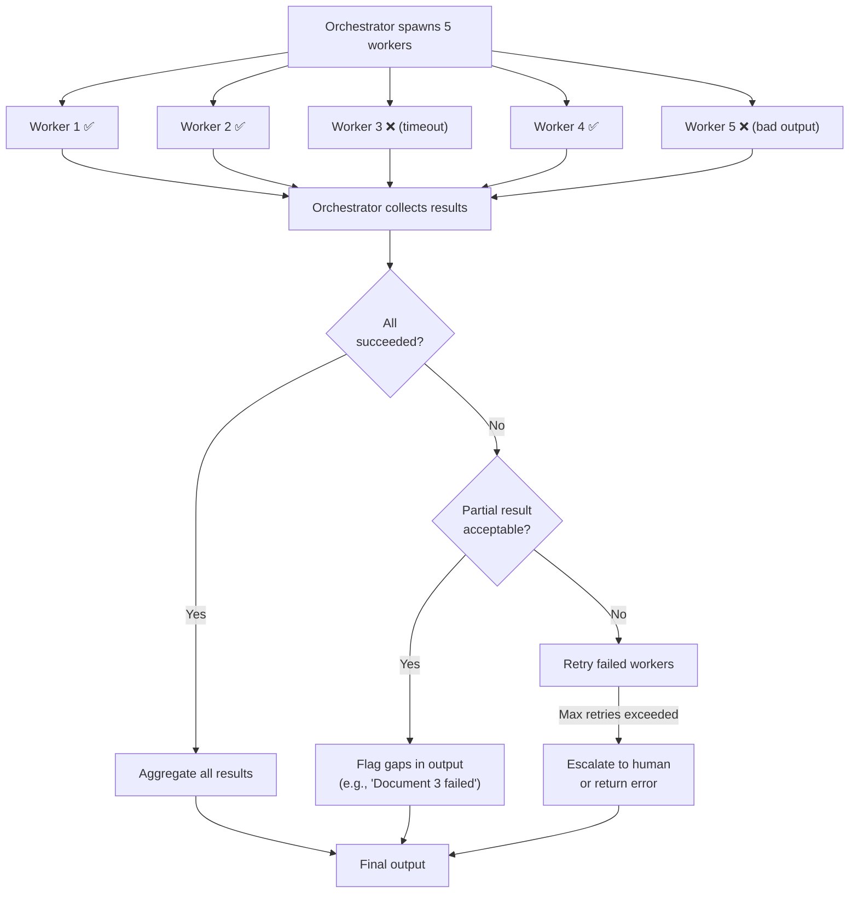
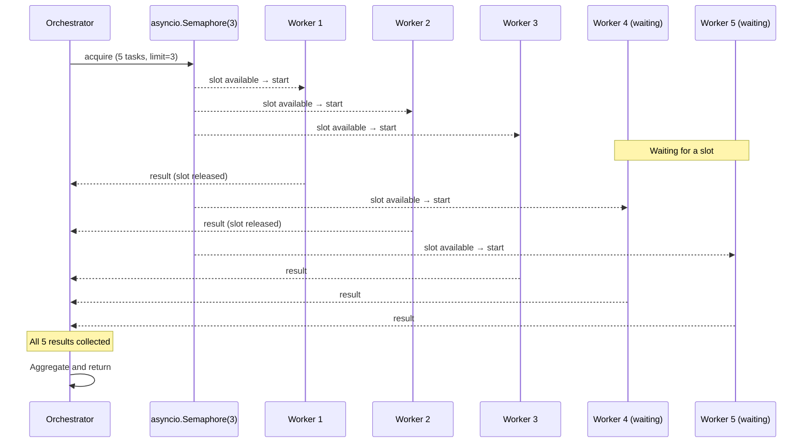

# Multi-Agent Orchestration — Architecture Deep Dive

## Orchestration Topology Patterns



---

## Orchestrator Decision Algorithm

How the orchestrator decides what workers to spawn:



---

## Context Isolation: What Each Layer Sees

```
User's request (500 tokens)
    ↓
Orchestrator context:
┌─────────────────────────────────────────────────────────────┐
│ System prompt (300 tokens)                                   │
│ User request (500 tokens)                                    │
│ Tool call: analyze_document(doc_1) (50 tokens)               │
│ Tool result: {summary: ..., keywords: ...} (200 tokens)      │  ← only the result, not
│ Tool call: analyze_document(doc_2) (50 tokens)               │    the worker's 10 internal steps
│ Tool result: {summary: ..., keywords: ...} (200 tokens)      │
│ Tool call: compile_report(all_results) (300 tokens)          │
│ Tool result: "# Report..." (400 tokens)                      │
│ Final answer (300 tokens)                                    │
└─────────────────────────────────────────────────────────────┘
Total orchestrator context: ~2,300 tokens

Worker 1 context (isolated, discarded after task):
┌─────────────────────────────────────────────────────────────┐
│ Worker system prompt (200 tokens)                            │
│ Task: "Summarize this document..." (600 tokens)              │
│ Tool call: summarize_text(...) (50 tokens)                   │
│ Tool result: ... (300 tokens)                                │
│ Tool call: extract_keywords(...) (50 tokens)                 │
│ Tool result: ... (100 tokens)                                │
│ Final answer (200 tokens)                                    │
└─────────────────────────────────────────────────────────────┘
Worker context: ~1,500 tokens (never seen by orchestrator)
```

The orchestrator's context stays lean even for complex, multi-worker tasks.

---

## Worker Specialization — System Prompt Design

The power of multi-agent is specialization. Each worker gets a focused system prompt:

```python
WORKER_CONFIGS = {
    "security_reviewer": {
        "model": "claude-sonnet-4-6",
        "system": """You are a security code reviewer. Your ONLY focus is security.

        Look for:
        - SQL injection vulnerabilities
        - XSS / CSRF risks  
        - Authentication bypasses
        - Insecure deserialization
        - Hardcoded secrets or credentials
        - Path traversal vulnerabilities

        Return findings as JSON: [{"type": "...", "severity": "critical|high|medium|low", 
        "line": N, "description": "..."}]
        
        If no issues found, return: []""",
        "tools": ["read_file", "search_patterns"]
    },
    
    "style_reviewer": {
        "model": "claude-haiku-4-5",  # cheaper model for simpler task
        "system": """You are a code style reviewer. Your ONLY focus is code quality.

        Check for:
        - PEP 8 compliance (Python)
        - Missing docstrings
        - Complex functions (>20 lines)
        - Magic numbers
        - Variable naming conventions

        Return findings as JSON: [{"type": "...", "severity": "info|warning", 
        "line": N, "description": "..."}]""",
        "tools": ["read_file"]
    },
    
    "correctness_reviewer": {
        "model": "claude-sonnet-4-6",
        "system": """You are a code correctness reviewer. Focus on bugs and logic errors.

        Check for:
        - Off-by-one errors
        - Null pointer risks
        - Resource leaks
        - Incorrect algorithm implementation
        - Edge cases not handled

        Return findings as JSON.""",
        "tools": ["read_file", "run_tests"]
    }
}
```

---

## Failure Handling in Orchestration



---

## Concurrency Architecture



---

## When Each Pattern Applies

| Topology | Use When | Example |
|---|---|---|
| **Fan-Out/Fan-In** | N independent items, same analysis | Analyze 20 documents in parallel |
| **Hierarchical** | 2-axis decomposition (N items × M analyses) | 10 companies × 5 metrics = 50 workers in 5 groups |
| **Sequential Pipeline** | Dependent stages, data flows forward | Extract → Validate → Enrich → Store |
| **Debate** | Need multiple perspectives on one problem | 3 agents argue for different approaches, 1 judge picks best |
| **Specialist Routing** | Input type determines which expert handles it | Route by topic (billing/technical/account) |

---

## 📂 Navigation

**In this folder:**
| File | |
|---|---|
| [📄 Theory.md](./Theory.md) | Full explanation |
| [📄 Cheatsheet.md](./Cheatsheet.md) | Quick reference |
| [📄 Interview_QA.md](./Interview_QA.md) | Interview prep |
| 📄 **Architecture_Deep_Dive.md** | ← you are here |
| [📄 Code_Example.md](./Code_Example.md) | Orchestrator + worker code |

⬅️ **Prev:** [Agent Memory](../06_Agent_Memory/Theory.md) &nbsp;&nbsp;&nbsp; ➡️ **Next:** [Subagents](../08_Subagents/Theory.md)
