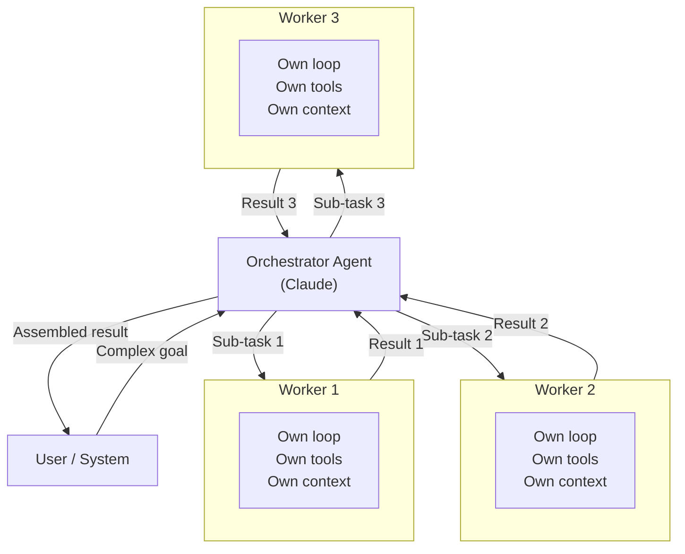

# Multi-Agent Orchestration

## The Story 📖

A general contractor doesn't build a house alone. He coordinates: the electrician handles wiring, the plumber handles pipes, the framer handles structure, the inspector reviews everything. The general contractor's job is to assign work, sequence it correctly, and combine the results — not to personally do every task.

A single Claude agent is like a very capable solo worker. It can do many things, but complex projects benefit from specialization and parallelism. **Multi-agent orchestration** is the general contractor pattern: one orchestrator agent breaks work into pieces, assigns them to specialized worker agents, and assembles the results.

The orchestrator doesn't need to be an expert in every domain — it needs to be good at planning, delegation, and synthesis. The workers just need to be good at their one thing.

👉 This is **multi-agent orchestration** — task delegation to achieve what no single agent could do alone.

---

## 📌 Learning Priority

**Must Learn** — core concepts, needed to understand the rest of this file:
[Orchestrator-Worker Pattern](#the-orchestrator-worker-pattern) · [Spawning Subagents in SDK](#spawning-subagents-in-the-sdk) · [Sequential vs Parallel Workers](#sequential-vs-parallel-workers)

**Should Learn** — important for real projects and interviews:
[Task Delegation Patterns](#task-delegation-patterns) · [When to Use Multi-Agent](#when-to-use-multi-agent-vs-single-agent)

**Good to Know** — useful in specific situations, not needed daily:
[Parallelism Math](#the-math--technical-side-simplified) · [Result Aggregation](#result-aggregation)

**Reference** — skim once, look up when needed:
[Common Mistakes](#common-mistakes-to-avoid-)

---

## What is Multi-Agent Orchestration?

**Multi-agent orchestration** is a system design pattern where an **orchestrator** agent decomposes a goal into sub-tasks and delegates each to one or more **worker** (subagent) instances of Claude. Each worker runs its own agent loop, executes its task, and returns results to the orchestrator, which assembles the final output.

---

## Why It Exists — The Problem It Solves

1. **Parallelism.** A single agent is sequential. An orchestrator with 5 parallel workers can complete 5 independent tasks simultaneously — dramatically reducing total time.

2. **Specialization.** A worker agent can have a focused system prompt ("You are an expert code reviewer focused only on security vulnerabilities") that outperforms a generalist agent on specialized tasks.

3. **Context isolation.** Each worker starts with a clean context. The orchestrator only receives the results — not the 50,000 tokens of raw tool calls each worker made. This prevents context window exhaustion in the orchestrator.

4. **Fault isolation.** If one worker fails, the others continue. The orchestrator handles the failure without the entire system crashing.

---

## How It Works — Step by Step

### The Orchestrator-Worker Pattern



### Sequential vs Parallel Workers

**Sequential**: orchestrator waits for worker 1 to finish before sending work to worker 2. Use when results are dependent:

```
Step 1: [worker 1] Extract all customer names from the CSV
Step 2: [worker 2] For each customer, look up their account status (needs names from step 1)
Step 3: [orchestrator] Compile report
```

**Parallel**: orchestrator sends work to multiple workers simultaneously. Use when tasks are independent:

```
Simultaneously:
  [worker 1] Analyze Q1 sales data
  [worker 2] Analyze Q2 sales data
  [worker 3] Analyze Q3 sales data
  [worker 4] Analyze Q4 sales data
  
[orchestrator] Combine all four quarters into annual report
```

---

## Spawning Subagents in the SDK

In the Agent SDK, the orchestrator calls a specialized tool to spawn a worker:

```python
from claude_agent_sdk import Agent, spawn_agent, tool

@tool
def analyze_document(document_path: str, focus_area: str) -> str:
    """Spawn a specialized worker agent to analyze a document.
    Returns a structured summary focused on the specified area."""
    worker = Agent(
        model="claude-sonnet-4-6",
        system=f"You are a document analyst focused on {focus_area}. "
               f"Read the document and return a structured analysis.",
        tools=[read_file]
    )
    return worker.run(f"Analyze {document_path} focusing on {focus_area}")

orchestrator = Agent(
    model="claude-sonnet-4-6",
    tools=[analyze_document, synthesize_reports],
    system="""You are a research orchestrator. When given a research question:
    1. Identify the relevant documents
    2. Spawn worker agents to analyze each one in parallel
    3. Synthesize the results into a final answer"""
)
```

---

## Task Delegation Patterns

### Fan-Out / Fan-In

The most common pattern: one task → multiple parallel workers → merge results.

```
[In]: Analyze 10 customer contracts for compliance issues.
[Fan-out]: 10 workers each analyze one contract.
[Fan-in]: Orchestrator merges findings, identifies patterns, produces report.
[Out]: Consolidated compliance report.
```

### Hierarchical Delegation

Orchestrator → sub-orchestrators → workers. For deeply nested tasks:

```
Top-level orchestrator
├── Sub-orchestrator: Technical audit
│   ├── Worker: Code review
│   ├── Worker: Security scan
│   └── Worker: Performance analysis
└── Sub-orchestrator: Business audit
    ├── Worker: Revenue analysis
    └── Worker: Cost analysis
```

### Pipeline (Sequential Handoff)

Output of one worker becomes input of the next (see Topic 09 for Handoffs):

```
[Worker 1: Extract] → raw data → [Worker 2: Clean] → clean data → [Worker 3: Analyze] → insights
```

---

## Result Aggregation

The orchestrator must synthesize results from multiple workers. This is itself a reasoning task — the orchestrator needs to:

- Handle conflicting findings across workers
- Identify patterns that span multiple worker outputs
- Distinguish between worker errors and genuine negative results
- Produce a coherent final output

Give the orchestrator explicit instructions for aggregation in its system prompt.

---

## When to Use Multi-Agent (vs Single Agent)

| Use Multi-Agent | Use Single Agent |
|---|---|
| Task parallelism available | Task is inherently sequential |
| Workers benefit from specialization | Generalist approach is sufficient |
| Context isolation needed | Single context is fine |
| 5+ similar sub-tasks | 1-4 sub-tasks |
| Fault isolation required | Simplicity preferred |
| Different tools per worker | Same tools throughout |

Rule of thumb: if your task has independent pieces that can run simultaneously, multi-agent is worth it. If everything depends on the step before, keep it simple.

---

## The Math / Technical Side (Simplified)

Wall-clock time comparison:

```
Sequential (1 agent, N tasks each taking T seconds):
    Total time = N × T

Parallel (1 orchestrator + N workers):
    Total time = T + overhead (spawn + result merge)
    
For N=10 tasks each taking 30 seconds:
    Sequential: 300 seconds
    Parallel: ~35 seconds (30s worker + ~5s overhead)
```

The speedup is approximately `N × T / (T + overhead)`. For large N or slow tasks, the benefit is dramatic.

---

## Where You'll See This in Real AI Systems

- **Claude Code's "parallel agents"** — spawns multiple agents to work on independent files simultaneously
- **Research automation** — one orchestrator, N workers each reading one paper
- **Code review pipelines** — security agent, style agent, correctness agent all run in parallel
- **Customer service routing** — orchestrator routes to specialist agents (billing, technical, account)
- **Multi-agent frameworks** (CrewAI, AutoGen) — these are orchestration frameworks

---

## Common Mistakes to Avoid ⚠️

- Adding unnecessary orchestration complexity for tasks a single agent handles fine.
- Not giving the orchestrator explicit guidance on how to handle worker failures.
- Sending the same huge context to every worker when they each only need a slice.
- Not rate-limit-aware: spawning 20 parallel agents will hit API rate limits. Use concurrency controls.

---

## Connection to Other Concepts 🔗

- Relates to **Subagents** (Topic 08) — the worker perspective on this pattern
- Relates to **Handoffs** (Topic 09) — sequential delegation between agents
- Relates to **Multi-Agent Systems** (Section 10, Topic 07) — the broader theory
- Relates to **Agent Memory** (Topic 06) — orchestrators often use shared memory for coordination

---

✅ **What you just learned:** Multi-agent orchestration uses an orchestrator agent to decompose goals and delegate to parallel worker agents. Workers run in isolation with their own context, tools, and loops. The pattern enables parallelism, specialization, and context isolation.

🔨 **Build this now:** Create an orchestrator that takes a list of 3 topics and spawns 3 parallel worker agents (one per topic) to write a one-paragraph summary of each. Have the orchestrator combine them into a structured document.

➡️ **Next step:** [Subagents](../08_Subagents/Theory.md) — the worker perspective: when to spawn, how to isolate, how to return results.


---

## 📝 Practice Questions

- 📝 [Q99 · agent-sdk-orchestration](../../../ai_practice_questions_100.md#q99--design--agent-sdk-orchestration)


---

## 📂 Navigation

**In this folder:**
| File | |
|---|---|
| 📄 **Theory.md** | ← you are here |
| [📄 Cheatsheet.md](./Cheatsheet.md) | Quick reference |
| [📄 Interview_QA.md](./Interview_QA.md) | Interview prep |
| [📄 Architecture_Deep_Dive.md](./Architecture_Deep_Dive.md) | Orchestration patterns in depth |
| [📄 Code_Example.md](./Code_Example.md) | Orchestrator + worker code |

⬅️ **Prev:** [Agent Memory](../06_Agent_Memory/Theory.md) &nbsp;&nbsp;&nbsp; ➡️ **Next:** [Subagents](../08_Subagents/Theory.md)
