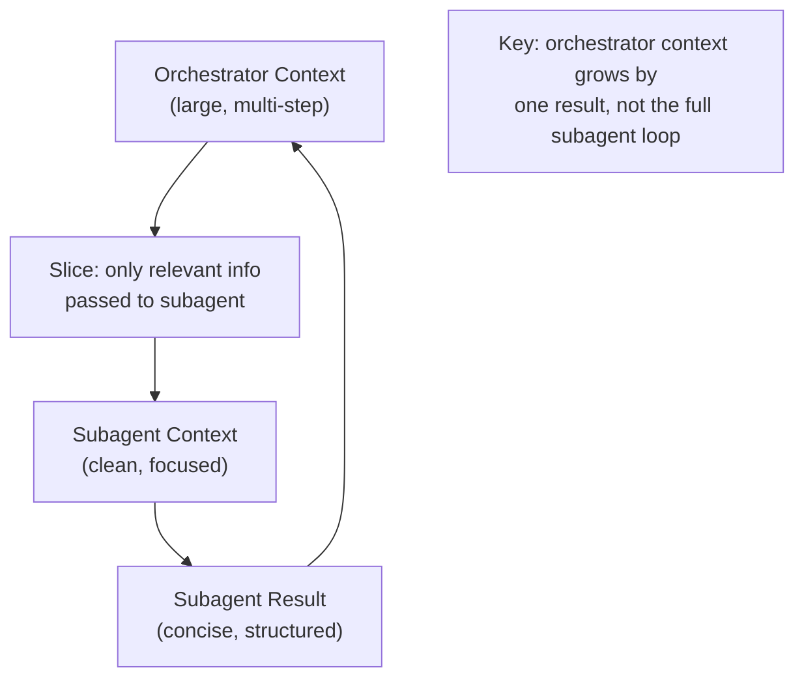

# Subagents

## The Story 📖

Think of a law firm. The senior partner takes on a complex case. She doesn't personally research every precedent, draft every document, and argue every motion. She delegates: "Research all prior rulings on this clause" goes to a junior associate. "Draft the motion to dismiss" goes to another. Each works independently, delivers their work product, and the partner assembles it.

The junior associates are **subagents**. They have a narrow task, a defined scope, a clear deliverable. They don't need to know about the full case — they just need to execute their assignment and report back.

The key insight: the senior partner is shielded from the details. She doesn't read every case the associate found — just the relevant summary. This isolation is what makes delegation powerful.

👉 **Subagents** are isolated workers: scoped, focused, disposable, and able to run in parallel.

---

## 📌 Learning Priority

**Must Learn** — core concepts, needed to understand the rest of this file:
[Spawning a Subagent](#how-it-works--spawning-a-subagent) · [Context Passing](#context-passing) · [Isolation Benefits](#isolation-benefits)

**Should Learn** — important for real projects and interviews:
[Foreground vs Background](#foreground-vs-background-subagents) · [When to Spawn](#when-to-spawn-a-subagent-vs-doing-it-in-the-orchestrator)

**Good to Know** — useful in specific situations, not needed daily:
[Result Formats](#result-formats)

**Reference** — skim once, look up when needed:
[Common Mistakes](#common-mistakes-to-avoid-)

---

## What is a Subagent?

A **subagent** is an agent instance spawned by a parent (orchestrator) agent to handle a specific sub-task. The subagent runs its own agent loop, has its own context window, its own tools, and its own system prompt. When it completes, it returns a result to the parent.

From the orchestrator's perspective, a subagent looks like a tool call — send in parameters, receive a result. The orchestrator never sees the subagent's internal reasoning or intermediate tool calls.

---

## Why It Exists — The Problem It Solves

1. **Context isolation.** A subagent processing a 50-page document generates thousands of tokens of intermediate context. If this ran inside the orchestrator's context, it would crowd out other information. By running in its own context, only the final summary is returned.

2. **Specialization.** A subagent can have a focused system prompt ("You are a SQL expert. Only generate SELECT queries.") that makes it better at its specific task than a generalist agent.

3. **Parallelism.** Multiple subagents run simultaneously — the parent doesn't wait for one to finish before starting another.

4. **Failure containment.** If a subagent crashes or times out, the orchestrator handles the failure gracefully without the entire system going down.

---

## How It Works — Spawning a Subagent

### From the Orchestrator's Perspective

The orchestrator calls a tool that internally creates and runs a new agent:

```python
from claude_agent_sdk import Agent, tool

@tool
def run_security_review(code_snippet: str, language: str) -> dict:
    """Run a security-focused code review on the provided code.
    Returns identified vulnerabilities with severity ratings.
    Use this for any code that will handle user data or authentication."""
    
    security_agent = Agent(
        model="claude-sonnet-4-6",
        system="""You are a security code reviewer. Your sole focus is:
        1. Identifying security vulnerabilities (SQL injection, XSS, CSRF, etc.)
        2. Rating each by severity: Critical / High / Medium / Low
        3. Returning structured findings as JSON
        
        Do not comment on code style or performance. Only security.""",
        tools=[check_vulnerability_db, lookup_cve]
    )
    
    result = security_agent.run(
        f"Review this {language} code for security issues:\n\n{code_snippet}"
    )
    return {"security_review": result, "status": "complete"}
```

The orchestrator calls `run_security_review(code, "python")` and gets back a clean result. It never sees the subagent's tool calls or intermediate reasoning.

### From the Subagent's Perspective

The subagent is a normal agent. It:
1. Receives a goal (the text passed to `worker.run(...)`)
2. Has its own tools, system prompt, and context
3. Runs its own agent loop
4. Returns a final text response

It has no knowledge of the orchestrator. It doesn't know it's a subagent — it just executes its goal.

---

## Context Passing

The orchestrator communicates with subagents through the parameters passed to the spawning tool. The subagent can only see what's explicitly passed:



Design principle: pass only what the subagent needs. A subagent reviewing one customer account doesn't need data about all other customers.

---

## Foreground vs Background Subagents

**Foreground (blocking)**: the orchestrator waits for the subagent to complete before proceeding. Use when the result is needed for the next decision.

```python
# Foreground — orchestrator blocks until done
result = run_analysis_agent(data)
# orchestrator continues here only after result is ready
next_action = plan_based_on(result)
```

**Background (async)**: the orchestrator fires off the subagent and continues working on other tasks. Use for parallelism.

```python
# Background — orchestrator does not block
import asyncio

async def run_parallel():
    tasks = [
        run_analysis_agent(data_q1),
        run_analysis_agent(data_q2),
        run_analysis_agent(data_q3),
    ]
    results = await asyncio.gather(*tasks)
    return synthesize(results)
```

---

## Result Formats

Subagents should return clean, structured results that are easy for the orchestrator to use. Common formats:

| Return Format | When to Use |
|---|---|
| Plain text summary | Human-readable synthesis, prose reports |
| JSON object | Structured data: scores, flags, extracted fields |
| List of items | Multiple findings, enumerable results |
| Bool + reason | Pass/fail evaluations |
| Status code + payload | API-style responses |

Avoid returning raw intermediate data (full document text, unfiltered search results) — the orchestrator doesn't need it.

---

## Isolation Benefits

Subagents provide three types of isolation:

**Context isolation**: each subagent has a blank context window. It can't access the orchestrator's conversation history (unless explicitly passed). This prevents sensitive information from leaking between tasks and prevents context window contamination.

**Tool isolation**: a subagent only has the tools you give it. A subagent that reads documents doesn't have access to write files — even if the orchestrator does.

**Failure isolation**: a subagent that throws an exception doesn't crash the orchestrator. The orchestrator receives an error result and can retry, use a fallback, or proceed without that result.

---

## When to Spawn a Subagent (vs Doing It in the Orchestrator)

**Spawn a subagent when:**
- The sub-task generates significant intermediate context
- The sub-task requires specialized tools the orchestrator doesn't need
- The sub-task can run in parallel with others
- The sub-task has a well-defined input/output interface
- Failure isolation is valuable

**Do it in the orchestrator when:**
- The sub-task is just 1-2 tool calls
- The result is needed immediately for the next reasoning step
- Spawning overhead would dominate the task time
- Context sharing is actually needed

---

## Where You'll See This in Real AI Systems

- **Claude Code** — spawns subagents to work on independent file changes in parallel
- **Research pipelines** — one subagent per paper to extract key findings
- **Code review systems** — separate subagents for security, style, correctness
- **Data processing** — one subagent per data partition for parallel processing
- **CrewAI / AutoGen** — both implement agent crews where each "crew member" is a subagent

---

## Common Mistakes to Avoid ⚠️

- Spawning subagents for trivial tasks (1-2 tool calls) — the spawn overhead isn't worth it.
- Passing too much context to the subagent — defeats the isolation purpose.
- Not setting max_steps on subagents — a runaway subagent burns tokens and blocks the orchestrator.
- Expecting subagents to have access to orchestrator memory — they don't, unless explicitly passed.

---

## Connection to Other Concepts 🔗

- Relates to **Multi-Agent Orchestration** (Topic 07) — the orchestrator perspective on this pattern
- Relates to **Handoffs** (Topic 09) — when a subagent passes control forward rather than returning
- Relates to **Agent Memory** (Topic 06) — subagents may use shared external memory for coordination
- Relates to **Agents and Subagents** (Track 2, Topic 10) — Claude Code CLI's implementation

---

✅ **What you just learned:** Subagents are isolated worker agents spawned by an orchestrator. They run their own loop, have their own context and tools, and return a clean result. Isolation prevents context bloat, enables parallelism, and contains failures.

🔨 **Build this now:** Create an orchestrator that takes 3 strings and spawns 3 subagents in parallel — each one calls `len()` on one string and returns its length. Have the orchestrator return the total combined length.

➡️ **Next step:** [Handoffs](../09_Handoffs/Theory.md) — when agents don't just return results but hand control to each other.

---

## 📂 Navigation

**In this folder:**
| File | |
|---|---|
| 📄 **Theory.md** | ← you are here |
| [📄 Cheatsheet.md](./Cheatsheet.md) | Quick reference |
| [📄 Interview_QA.md](./Interview_QA.md) | Interview prep |
| [📄 Code_Example.md](./Code_Example.md) | Subagent spawn patterns |

⬅️ **Prev:** [Multi-Agent Orchestration](../07_Multi_Agent_Orchestration/Theory.md) &nbsp;&nbsp;&nbsp; ➡️ **Next:** [Handoffs](../09_Handoffs/Theory.md)
