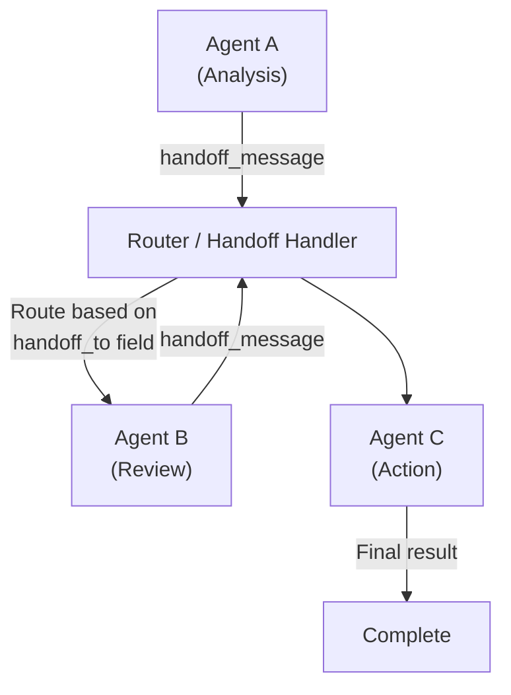
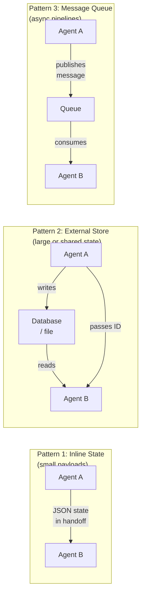

# Handoffs

## The Story 📖

Imagine a hospital emergency department. A patient arrives and is assessed by the triage nurse, who determines it's a cardiac case and hands off to the cardiac team. The cardiac team stabilizes the patient and then hands off to the surgical team for the procedure. After surgery, the patient is handed off to recovery nurses.

Each handoff is deliberate: the outgoing team passes a structured summary — patient name, vitals, what was done, what still needs doing, any alerts. The incoming team picks up exactly where the last one left off.

No one starts from scratch. No information is lost. The patient's journey continues seamlessly across teams.

**Agent handoffs** are exactly this: one agent completes its part of the work, packages the state and context, and passes control to the next agent — which continues without losing what came before.

👉 This is the **handoff** pattern — coordinated agent-to-agent control transfer with shared state.

---

## 📌 Learning Priority

**Must Learn** — core concepts, needed to understand the rest of this file:
[Handoff Lifecycle](#how-it-works--the-handoff-lifecycle) · [Shared State Patterns](#shared-state-patterns) · [Handoff Message Format](#handoff-message-format)

**Should Learn** — important for real projects and interviews:
[Coordination Protocols](#coordination-protocols) · [Human-in-the-Loop Handoffs](#human-in-the-loop-handoffs)

**Good to Know** — useful in specific situations, not needed daily:
[Real System Examples](#where-youll-see-this-in-real-ai-systems)

**Reference** — skim once, look up when needed:
[Common Mistakes](#common-mistakes-to-avoid-)

---

## What is a Handoff?

A **handoff** is a structured transfer of control from one agent to another. Unlike subagent delegation (orchestrator sends work and waits for results), a handoff is a sequential transfer: Agent A does its part, then hands off to Agent B, which continues the task.

The outgoing agent produces a **handoff message** containing: the current state, what has been accomplished, what remains to be done, and any context the next agent needs. The incoming agent uses this to pick up exactly where the last left off.

---

## Why It Exists — The Problem It Solves

1. **Specialization without orchestration overhead.** Not every multi-agent system needs a central orchestrator. Sometimes a linear pipeline — A → B → C — is simpler and more efficient.

2. **Long-running workflows.** A workflow that spans days or requires human checkpoints needs to suspend and resume. Handoffs are how you checkpoint state.

3. **Role separation.** Different agents can have genuinely different permissions, tools, and prompts — no single agent needs to do everything.

4. **Scalability.** Pipeline patterns distribute work across dedicated stages without a central coordinator becoming a bottleneck.

---

## How It Works — The Handoff Lifecycle

### Step 1: Agent A Produces a Handoff Message

When Agent A completes its stage, it doesn't just return a result — it produces a structured handoff:

```json
{
  "handoff_to": "review_agent",
  "context_summary": "Analyzed 3 customer accounts. Findings: Account 1 has billing error. Account 2 is up to date. Account 3 flagged for fraud review.",
  "state": {
    "accounts_analyzed": ["acct_001", "acct_002", "acct_003"],
    "issues_found": [
      {"account": "acct_001", "type": "billing_error", "amount": 49.99},
      {"account": "acct_003", "type": "fraud_flag", "severity": "high"}
    ],
    "next_action": "escalate account 3 to fraud team, issue credit for account 1"
  },
  "metadata": {
    "session_id": "sess_789",
    "timestamp": "2026-04-21T10:30:00Z"
  }
}
```

### Step 2: Routing

A router (or the orchestrator) receives the handoff message and instantiates the next agent:



### Step 3: Agent B Receives and Continues

Agent B's `run()` call includes the handoff context:

```python
review_agent = Agent(
    model="claude-sonnet-4-6",
    tools=[lookup_account, issue_credit, escalate_to_fraud],
    system="You are a customer account review specialist. You receive analysis findings and take appropriate actions."
)

result = review_agent.run(
    f"""Continue from where the analysis agent left off.
    
    Context summary: {handoff['context_summary']}
    
    Current state:
    {json.dumps(handoff['state'], indent=2)}
    
    Take the required actions and document what you did."""
)
```

---

## Shared State Patterns

Handoffs need shared state — information that persists across agent boundaries. Three approaches:



For most use cases, pattern 1 (inline state in the handoff message) is simplest. Use pattern 2 when the state is too large to serialize inline (e.g., a 50-page document analysis). Use pattern 3 for truly asynchronous pipelines where agents may run at different times.

---

## Coordination Protocols

### Linear Pipeline

```
A → B → C → D → result
```

Each agent does its part and passes control to the next. Simple, predictable, easy to debug.

### Conditional Routing

```
A → [condition check] → B (if path X) or C (if path Y)
```

The handoff message includes a signal that determines which agent runs next. Example: fraud detection agent routes to human review for high-severity cases and automatic resolution for low-severity cases.

### Feedback Loop

```
A → B → [quality check] → A (if unsatisfactory) or DONE (if satisfactory)
```

Agent B evaluates Agent A's work and hands back for revision if needed. Used for iterative refinement.

---

## Handoff Message Format

A well-structured handoff message has these fields:

| Field | Purpose |
|---|---|
| `handoff_to` | Name or role of the next agent |
| `context_summary` | Human-readable summary of what happened |
| `state` | Structured data the next agent needs |
| `completed_steps` | What has already been done (prevents re-doing) |
| `remaining_steps` | What still needs to happen |
| `metadata` | Session ID, timestamps, tracing info |
| `flags` | Any alerts, errors, or special conditions |

---

## Human-in-the-Loop Handoffs

A handoff doesn't have to go to another agent — it can pause and wait for human input:

```python
@tool
def request_human_approval(action_summary: str, risk_level: str) -> str:
    """Pause execution and request human approval before proceeding.
    Returns 'approved', 'rejected', or 'modified: <new instructions>'."""
    # In production: send notification, wait for webhook/response
    human_response = human_approval_service.request(
        summary=action_summary,
        risk=risk_level
    )
    return human_response
```

The agent calls this tool before any high-risk action. If the human rejects, the agent gets the rejection as a tool result and adjusts its approach.

---

## Where You'll See This in Real AI Systems

- **Support ticket pipelines**: Triage agent → Specialist agent → Resolution agent → Satisfaction check agent
- **Code review pipelines**: Author → Security reviewer → Style reviewer → Merge approver
- **Document processing**: Extraction agent → Validation agent → Enrichment agent → Storage agent
- **LangGraph** — handoffs are explicitly modeled as edges in the graph
- **Airflow for AI** — DAG-style agent pipelines where each task is a handoff

---

## Common Mistakes to Avoid ⚠️

- Losing state between handoffs — the receiving agent needs all context, not just the final result.
- Circular handoffs without exit conditions — Agent A hands to B which hands to A which hands to B... set max hops.
- Overloading the handoff message — don't pass the full conversation history; pass a structured summary.
- Not documenting which steps are already complete — the next agent may re-do work.

---

## Connection to Other Concepts 🔗

- Relates to **Subagents** (Topic 08) — subagent delegation vs sequential handoff
- Relates to **Multi-Agent Orchestration** (Topic 07) — orchestrators coordinate; handoffs pass control forward
- Relates to **Agent Memory** (Topic 06) — shared external state is a memory pattern
- Relates to **Human-in-the-Loop** in Safety (Topic 10) — human approval is a handoff variant

---

✅ **What you just learned:** Handoffs are structured control transfers between agents. The outgoing agent produces a handoff message with state, summary, and routing. The incoming agent reads this and continues without losing context. Three shared state patterns: inline JSON, external store, message queue.

🔨 **Build this now:** Create a 2-agent pipeline: Agent A summarizes a 500-word article in 3 bullets. Agent A then hands off to Agent B (via inline state), which translates those 3 bullets to Spanish. Both agents should only receive what they need.

➡️ **Next step:** [Safety in Agents](../10_Safety_in_Agents/Theory.md) — prompt injection, permission scoping, and human checkpoints.

---

## 📂 Navigation

**In this folder:**
| File | |
|---|---|
| 📄 **Theory.md** | ← you are here |
| [📄 Cheatsheet.md](./Cheatsheet.md) | Quick reference |
| [📄 Interview_QA.md](./Interview_QA.md) | Interview prep |
| [📄 Code_Example.md](./Code_Example.md) | Handoff pipeline in code |

⬅️ **Prev:** [Subagents](../08_Subagents/Theory.md) &nbsp;&nbsp;&nbsp; ➡️ **Next:** [Safety in Agents](../10_Safety_in_Agents/Theory.md)
