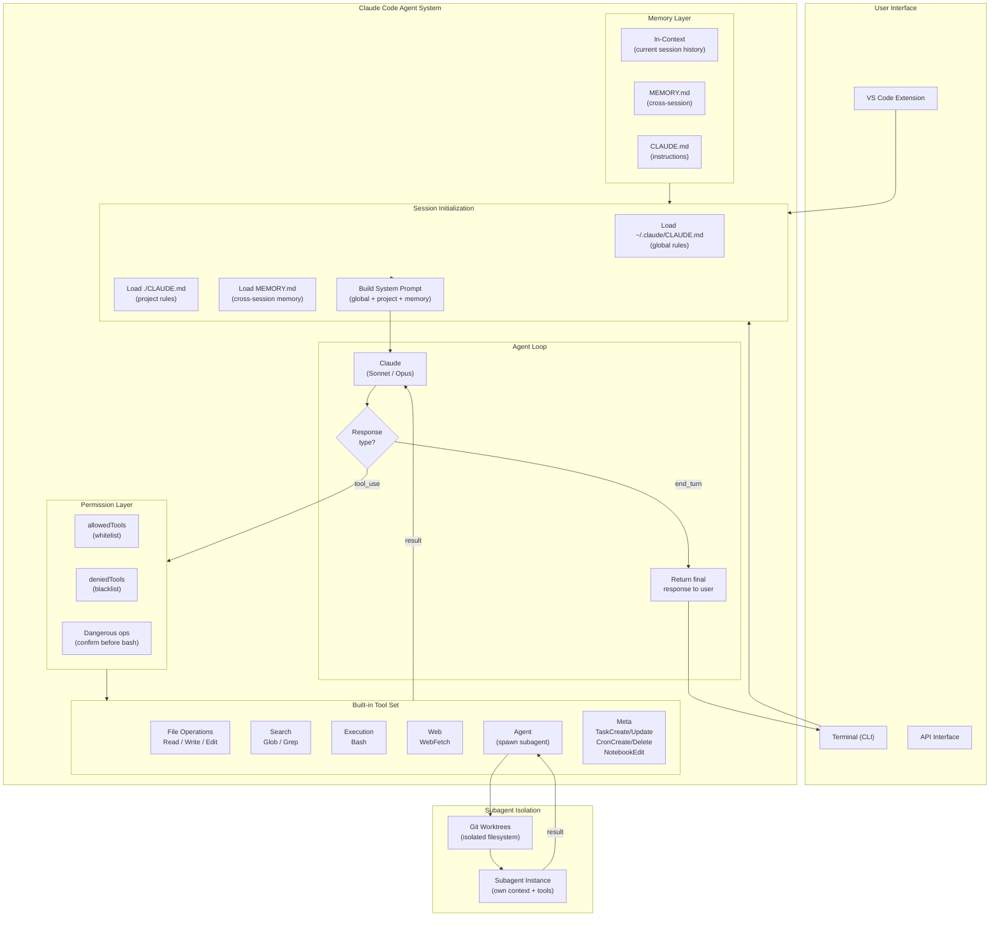
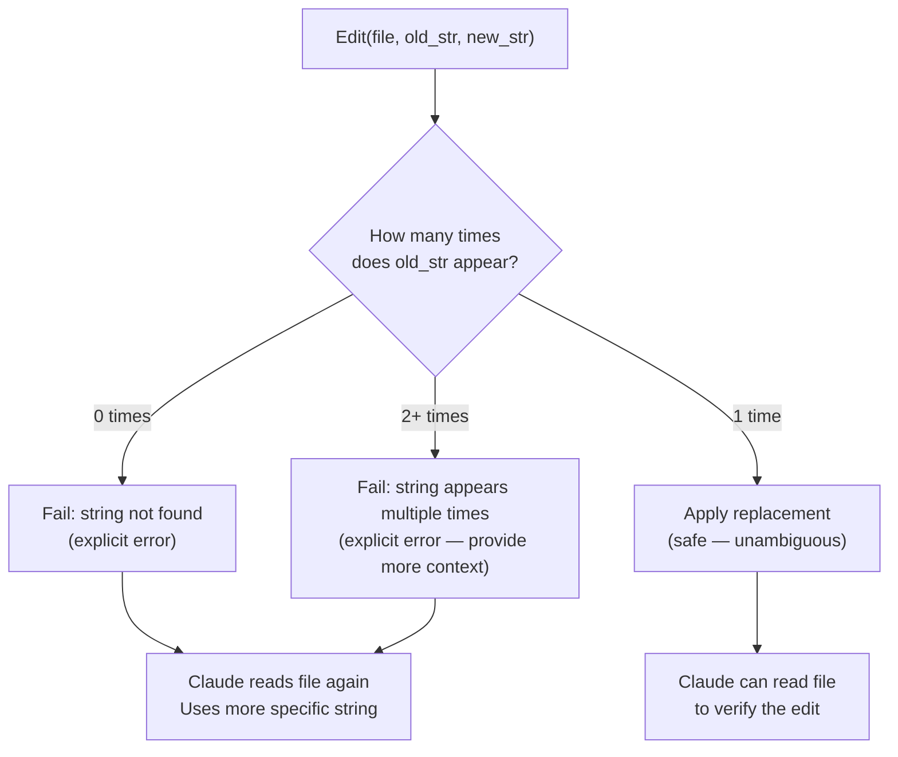
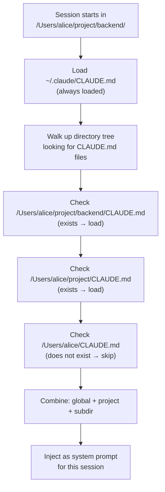
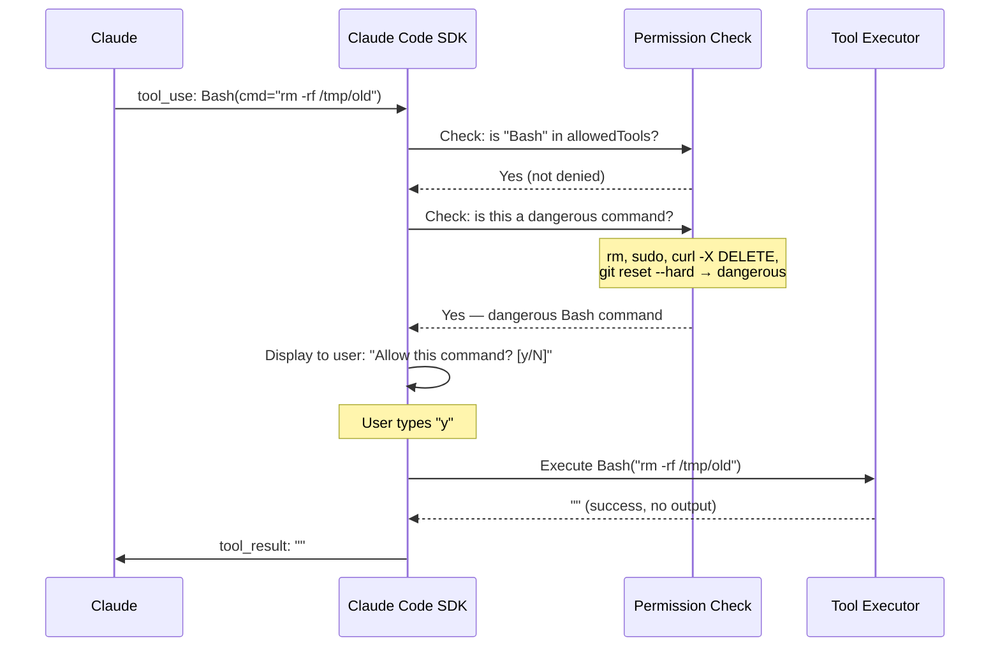
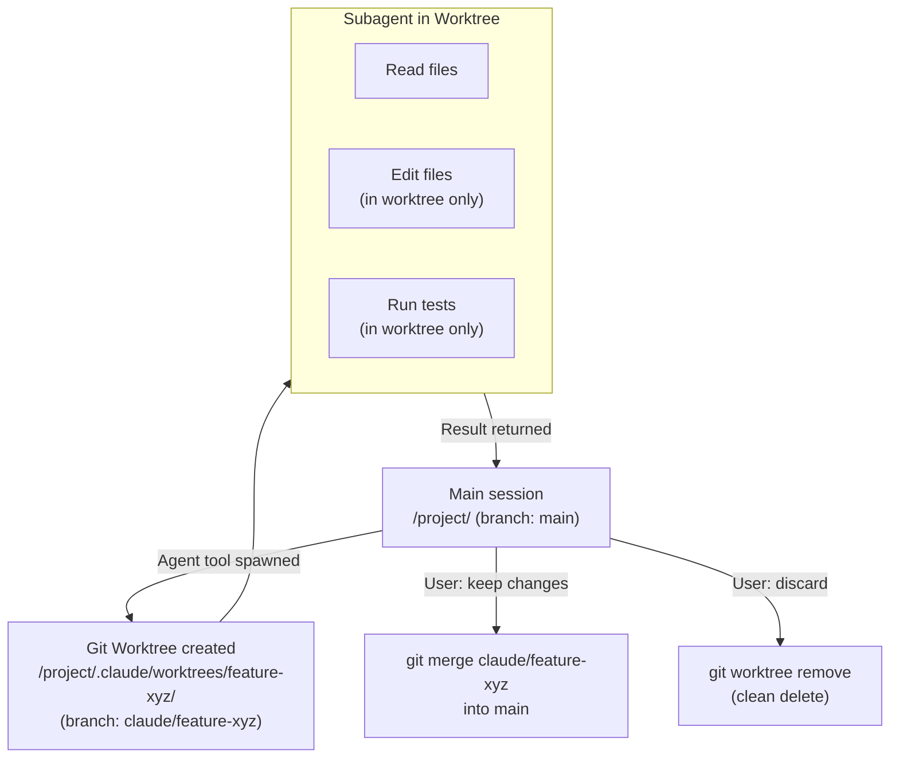

# Claude Code as Agent — Architecture Deep Dive

## Complete System Architecture



---

## The Edit Tool — Why Uniqueness Matters

The Edit tool's uniqueness requirement is a deliberate safety mechanism:



Why not line numbers?
```
Original file (line 5 = target):
Line 1: import os
Line 2: import sys
Line 3: 
Line 4: def process():
Line 5:     x = 1  ← target
Line 6:     return x

After adding a line at line 2:
Line 1: import os
Line 2: import json  ← new line
Line 3: import sys
Line 4:
Line 5: def process():
Line 6:     x = 1  ← target is now line 6!
Line 7:     return x
```

Unique string `    x = 1` still finds the target regardless of line shifts.

---

## CLAUDE.md Loading Stack



The loading is hierarchical — the deepest (most specific) CLAUDE.md instructions layer on top of broader ones.

---

## Tool Execution with Permission Check



---

## MEMORY.md Lifecycle

```
Session 1:
┌──────────────────────────────────────────────────────────┐
│ User: "Remember that this project uses Python 3.11"      │
│ Claude: Calls Write(MEMORY.md, "## Active Projects\n\n   │
│         - Project X: Python 3.11, FastAPI...")           │
└──────────────────────────────────────────────────────────┘
            ↓  (session ends)
┌─────────────────────────────────┐
│ MEMORY.md on disk:              │
│ ## Active Projects              │
│ - Project X: Python 3.11        │
└─────────────────────────────────┘
            ↓  (next session starts)
Session 2:
┌──────────────────────────────────────────────────────────┐
│ Claude Code reads MEMORY.md                              │
│ Injects contents into system prompt                      │
│ User: "What Python version are we using?"                │
│ Claude: "This project uses Python 3.11 (from memory)"    │
└──────────────────────────────────────────────────────────┘
```

---

## Worktree Isolation for Subagents



The worktree provides: isolation (subagent can't affect main branch), safety (easy rollback), parallelism (multiple worktrees can exist simultaneously).

---

## Comparing Claude Code's Architecture to This Track's Concepts

| This Track | Claude Code Implementation |
|---|---|
| Topic 01: Agent loop | Built-in `while True` loop that runs until task complete |
| Topic 02: Why SDK | Claude Code IS the pre-built SDK |
| Topic 03: `@tool` decorator | Each built-in tool is a registered function |
| Topic 04: Tool call lifecycle | Read → Bash → Edit → Bash test cycle |
| Topic 05: Multi-step reasoning | "Fix all failing tests" → multi-file loop |
| Topic 06: Agent memory | MEMORY.md (external) + conversation history (in-context) |
| Topic 07: Orchestration | Agent tool that spawns child agents |
| Topic 08: Subagents | Workers spawned in isolated worktrees |
| Topic 09: Handoffs | Worktree result merged back to parent |
| Topic 10: Safety | Permission modes, dangerous command confirmation |
| Topic 11: This topic | The complete picture |

---

## 📂 Navigation

**In this folder:**
| File | |
|---|---|
| [📄 Theory.md](./Theory.md) | Full explanation |
| [📄 Cheatsheet.md](./Cheatsheet.md) | Quick reference |
| [📄 Interview_QA.md](./Interview_QA.md) | Interview prep |
| 📄 **Architecture_Deep_Dive.md** | ← you are here |

⬅️ **Prev:** [Safety in Agents](../10_Safety_in_Agents/Theory.md) &nbsp;&nbsp;&nbsp; ➡️ **Next:** [Track 4 README](../Readme.md)
