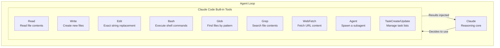
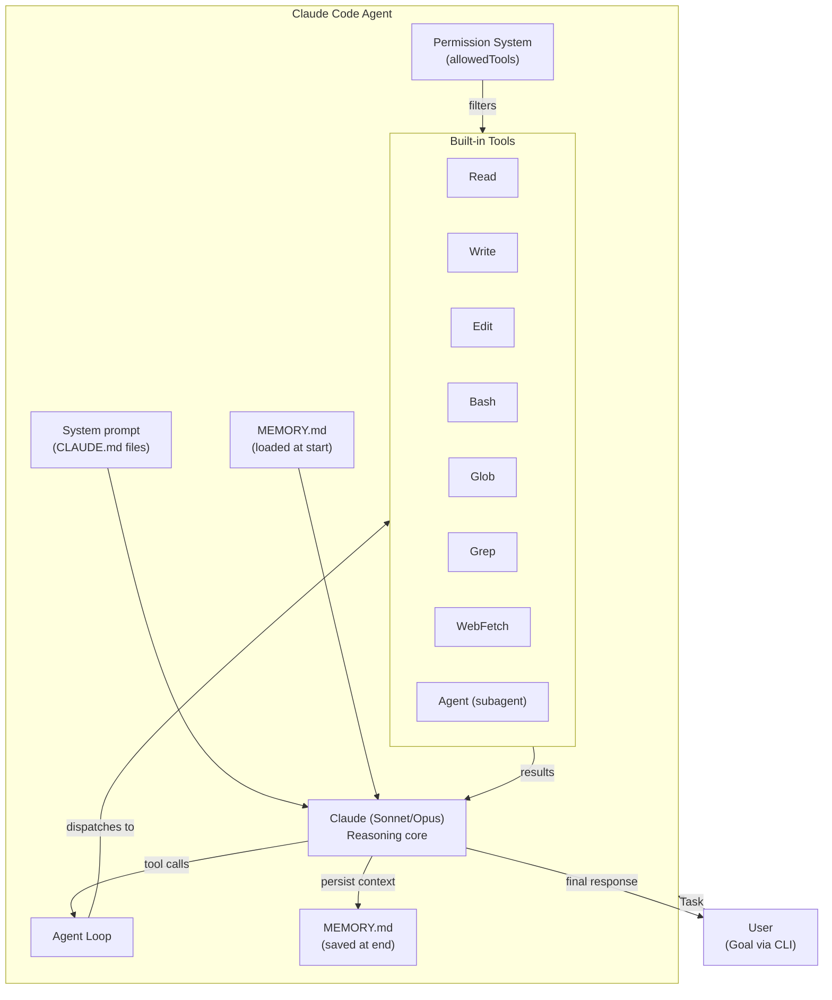

# Claude Code as Agent

## The Story 📖

You've spent this entire track learning about agents: the loop, tools, subagents, handoffs, memory, safety. Now here's the reveal: the tool you've been using to learn all of this — Claude Code — is itself one of the most sophisticated agent implementations you could study.

Every time Claude Code reads a file, runs a command, edits code, and checks the result — that's the agent loop. Every built-in tool (Read, Write, Edit, Bash, Glob, Grep) is a `@tool`-decorated function. Every session where Claude Code works through a multi-file change is multi-step reasoning. The worktree feature spawns isolated subagents. MEMORY.md is external agent memory.

Claude Code isn't just a user of the Agent SDK. It's a case study in how to design production agents that handle real-world engineering complexity.

👉 **Claude Code as Agent** — everything you learned, embodied in the tool you're using right now.

---

## 📌 Learning Priority

**Must Learn** — core concepts, needed to understand the rest of this file:
[Tool Loop Internals](#the-tool-loop-internals) · [CLAUDE.md as System Prompt](#claudemd-as-system-prompt) · [MEMORY.md as External Memory](#memorymd-as-external-agent-memory)

**Should Learn** — important for real projects and interviews:
[Worktrees as Subagent Isolation](#worktrees-as-subagent-isolation) · [Permission System as Scoping](#permission-system-as-tool-scoping) · [Design Lessons](#lessons-from-claude-codes-design)

**Good to Know** — useful in specific situations, not needed daily:
[Full Architecture Diagram](#the-full-architecture-in-one-diagram)

**Reference** — skim once, look up when needed:
[Common Mistakes](#common-mistakes-to-avoid-)

---

## What is Claude Code?

**Claude Code** is Anthropic's CLI for autonomous coding. Users give it goals ("add unit tests for this module," "refactor the auth system") and Claude Code achieves them through the agent loop: reading files, running commands, making edits, running tests, and iterating until done.

Under the hood, it is a full agent implementation:
- Claude (Sonnet/Opus) as the reasoning core
- ~15 built-in tools registered with the `@tool` pattern
- An agent loop that runs until the task is complete or the user interrupts
- External memory (MEMORY.md, CLAUDE.md files)
- Subagent support via the Agent tool
- Safety controls (permission modes, dangerous command detection)

---

## The Tool Loop Internals

Claude Code's built-in tools map directly to the concepts in this track:



When you ask Claude Code to "add error handling to all API calls," here's what actually runs:

```
Step 1: Glob("**/*.py") → finds all Python files
Step 2: Grep("requests.get|requests.post", files) → finds API call locations  
Step 3: Read(file_1) → reads first file
Step 4: Edit(file_1, old_code, new_code_with_try_except) → makes the edit
Step 5: Bash("python -m pytest tests/test_api.py") → runs tests
Step 6: Read test output → checks if tests pass
... repeats for all files
Step N: Returns summary to user
```

Every step is a tool call. Every result reshapes the next action.

---

## How File Editing Works Under the Hood

The `Edit` tool is a precise string-replacement operation:

```python
@tool
def edit(file_path: str, old_string: str, new_string: str) -> str:
    """Performs exact string replacements in files.
    old_string must be unique in the file to avoid ambiguous edits.
    Reads the file, replaces the first match, writes back."""
    content = Path(file_path).read_text()
    if old_string not in content:
        raise ValueError(f"String not found in {file_path}")
    if content.count(old_string) > 1:
        raise ValueError("String appears multiple times — use more context")
    new_content = content.replace(old_string, new_string, 1)
    Path(file_path).write_text(new_content)
    return f"Edit applied to {file_path}"
```

Why string replacement instead of line numbers?
- Line numbers change when you edit a file mid-loop
- String replacement is deterministic — if the code changed, the edit fails explicitly
- Forces Claude to read before editing (knows exactly what it's replacing)

This is a safety design: edit failures are loud, not silent.

---

## CLAUDE.md as System Prompt

`CLAUDE.md` files serve as persistent system prompt configuration for Claude Code's agent. They're loaded at session start and injected as instructions.

```
User project prompt stack:
1. Global ~/.claude/CLAUDE.md (user's global rules)
2. ~/path/to/project/CLAUDE.md (project rules)
3. Session-specific instructions
→ Combined into the agent's system prompt
```

This is the same as giving an agent a specialized system prompt for each context. The CLAUDE.md pattern is an elegant solution to the "how do I give my agent persistent, context-specific instructions?" problem.

---

## MEMORY.md as External Agent Memory

Claude Code uses a file-based external memory pattern:

```
~/.claude/projects/-Users-<user>-<project>/memory/MEMORY.md
```

At session start, Claude Code reads this file and injects it into context. When the user says "remember X," Claude Code writes to this file. This is the exact external memory pattern from Topic 06:

- **Read at start** = load memory into context
- **Write at end** = persist working memory for next session
- **Selective saving** = agent decides what's worth persisting

The implementation is deliberately simple: a Markdown file. No vector DB, no embeddings — just structured text that Claude can read and write. For project-scoped memory, this is often sufficient.

---

## Worktrees as Subagent Isolation

Claude Code's worktree feature creates isolated Git worktrees for agent work:

```bash
# Claude Code creates:
/path/to/project/.claude/worktrees/feature-branch/
# A complete copy of the repo at a new branch
```

This implements the subagent isolation principle from Topic 08:
- The agent works in an isolated directory
- Changes don't affect the main branch until merged
- If the agent's work is wrong, you just delete the worktree
- Multiple worktrees can run in parallel (parallel subagents)

The worktree IS the context isolation of a subagent, applied to the filesystem.

---

## Permission System as Tool Scoping

Claude Code's permission modes map directly to Topic 10's tool permission scoping:

| Permission Mode | Tool Scope |
|---|---|
| Read-only | Read, Glob, Grep, WebFetch only |
| Default | All tools, confirms destructive bash |
| Trust all | All tools, no confirmation (dangerous) |
| Custom allowedTools | Explicit whitelist of permitted tools |

The `--allowedTools` configuration is exactly the least-privilege principle: give the agent only the tools it needs.

```json
{
  "allowedTools": ["Read", "Glob", "Grep"],
  "deniedTools": ["Bash", "Write"]
}
```

---

## Lessons from Claude Code's Design

Five design principles visible in Claude Code's architecture that apply to any production agent:

**1. Read before write.** Claude Code always reads a file before editing it. This ensures the edit is precise and prevents stale-state errors. Apply this: always give your agent tools to read/inspect before tools to modify.

**2. Explicit failures.** Edit fails loudly if the string isn't found. Bash captures stderr. Failed tool calls surface as errors, not silent no-ops. Make your tools fail loudly.

**3. Minimal footprint.** Claude Code won't write outside the project scope. Tools are scoped by default. Apply least privilege to all your agents.

**4. Human-readable memory.** MEMORY.md is a plain Markdown file a human can read and edit. Don't over-engineer agent memory — readable text files often work better than databases.

**5. Progressive disclosure.** Claude Code shows what it's doing (each tool call is visible) but doesn't flood you with internal reasoning unless you ask for verbose mode. Agents should be transparent about their actions without being overwhelming.

---

## The Full Architecture in One Diagram



---

## Where You'll See This in Real AI Systems

- **Claude Code** — the subject of this entire topic
- **GitHub Copilot Workspace** — similar architecture: goals, file tools, test execution loop
- **Devin** — professional-grade engineering agent with same pattern
- **SWE-agent** — research system using the same read-edit-run loop
- Any production coding agent is a variant of this architecture

---

## Common Mistakes to Avoid ⚠️

- Thinking Claude Code is "magic" — it's a well-designed agent following the patterns in this track.
- Underestimating tool design — the quality of Claude Code's tools (especially Edit's uniqueness check) is what makes it reliable.
- Not using CLAUDE.md — without it, every session starts from zero. Use project CLAUDE.md files to give your coding agent context.
- Ignoring audit trails — Claude Code shows every tool call for a reason. Review them; they reveal the agent's reasoning.

---

## Connection to Other Concepts 🔗

- Relates to **All topics in this track** — Claude Code is the complete implementation
- Relates to **Claude Code CLI** (Track 2) — the user perspective on this agent
- Relates to **Agent Memory** (Topic 06) — MEMORY.md is the implementation
- Relates to **Safety in Agents** (Topic 10) — permission system is the implementation

---

✅ **What you just learned:** Claude Code is a production agent implementation using all the patterns from this track: a tool loop with built-in tools, CLAUDE.md as system prompt, MEMORY.md as external memory, worktrees as subagent isolation, and permission modes as tool scoping. Its design choices (explicit failures, read-before-write, minimal footprint) are lessons for any agent you build.

🔨 **Build this now:** Open a project in Claude Code and run a small task (e.g., "add a docstring to this function"). Watch the tool call output. Identify: which tools were called, in what order, and how the results shaped the next action. You've just read the agent loop.

➡️ **Next step:** You've completed Track 4 — Claude Agent SDK. Return to the [Track 4 README](../Readme.md) or proceed to [Section 20: Projects](../../22_Capstone_Projects/README.md) to build with everything you've learned.

---

## 📂 Navigation

**In this folder:**
| File | |
|---|---|
| 📄 **Theory.md** | ← you are here |
| [📄 Cheatsheet.md](./Cheatsheet.md) | Quick reference |
| [📄 Interview_QA.md](./Interview_QA.md) | Interview prep |
| [📄 Architecture_Deep_Dive.md](./Architecture_Deep_Dive.md) | Full internals diagram |

⬅️ **Prev:** [Safety in Agents](../10_Safety_in_Agents/Theory.md) &nbsp;&nbsp;&nbsp; ➡️ **Next:** [Track 4 README](../Readme.md)
