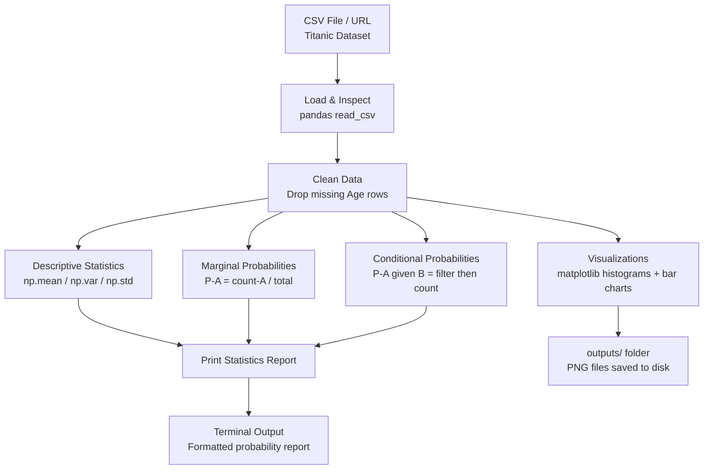
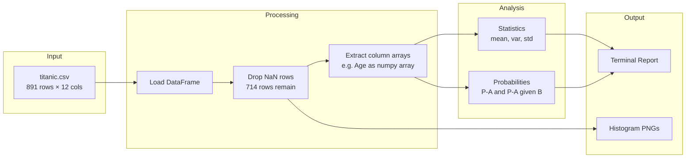
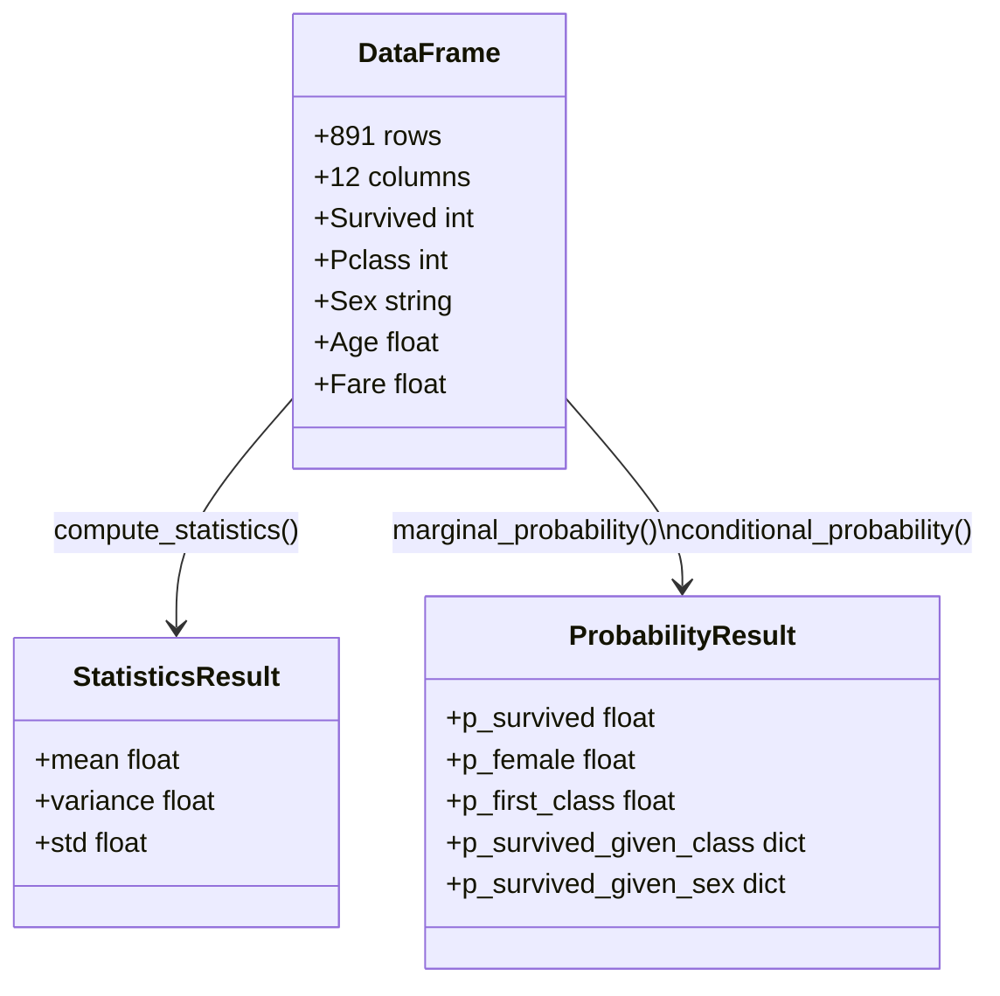
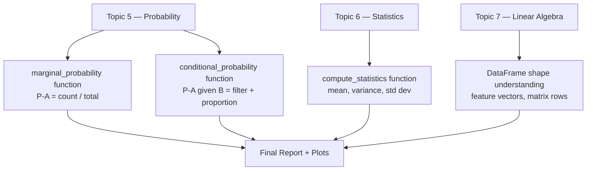

# 🏗️ Project 1 — Architecture

## System Overview

This project is a data analysis pipeline — a linear flow from raw data to insights. There is no model training here. The purpose is to understand the data that models will eventually learn from.

---

## System Diagram



---

## Data Flow



---

## Component Table

| Component | File / Library | Role | Inputs | Outputs |
|---|---|---|---|---|
| Data Loader | `pandas.read_csv()` | Fetch and parse CSV data | URL or file path | DataFrame (891 × 12) |
| Data Cleaner | `df.dropna()` | Remove rows with missing values | Raw DataFrame | Clean DataFrame (714 rows) |
| Statistics Engine | `numpy` (mean/var/std) | Compute distribution summaries | Numeric column array | 3 float values |
| Probability Calculator | Custom Python functions | Compute P(A) and P(A\|B) | DataFrame + column names | Float 0–1 |
| Visualizer | `matplotlib` | Plot distributions as images | DataFrame columns | PNG files in outputs/ |
| Report Printer | Python `print()` | Display results in terminal | Computed values | Formatted text |

---

## Key Data Structures



---

## Concepts Map



---

## Tech Stack

| Tool | Version | Why This Tool |
|---|---|---|
| `pandas` | 1.5+ | Load CSV, filter rows, groupby operations |
| `numpy` | 1.23+ | Compute statistics, array math |
| `matplotlib` | 3.6+ | Plot histograms and bar charts |

---

## Folder Structure

```
01_Data_and_Probability_Explorer/
├── src/
│   └── starter.py            ← Main Python script
├── outputs/
│   ├── age_distribution.png
│   ├── fare_distribution.png
│   └── survival_by_class.png
├── 01_MISSION.md
├── 02_ARCHITECTURE.md
├── 03_GUIDE.md
└── 04_RECAP.md
```

---

## Why This Architecture?

This project uses a functional, single-file architecture by design. Each concept gets its own function:

- `compute_statistics()` — isolates the statistics concept
- `marginal_probability()` — isolates P(A)
- `conditional_probability()` — isolates P(A|B)

This makes it easy to test each piece independently and swap in different datasets. As you move to more complex projects, these functions will be replaced by classes and modules — but the same logic applies.

---

## 📂 Navigation

**In this folder:**
| File | |
|---|---|
| [📄 01_MISSION.md](./01_MISSION.md) | Context and objectives |
| 📄 **02_ARCHITECTURE.md** | You are here |
| [📄 03_GUIDE.md](./03_GUIDE.md) | Step-by-step build guide |
| [📄 src/starter.py](./src/starter.py) | Starter code with TODOs |
| [📄 04_RECAP.md](./04_RECAP.md) | Concepts recap and next steps |

➡️ **Next Project:** [02 — ML Model Comparison](../02_ML_Model_Comparison/01_MISSION.md)
