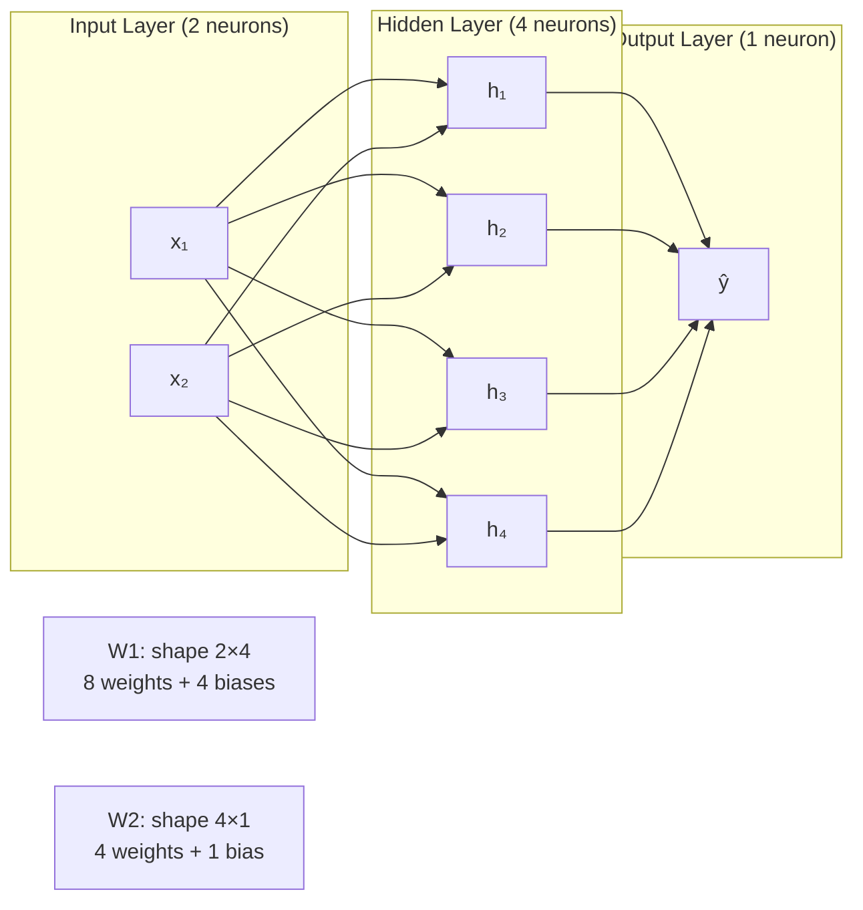
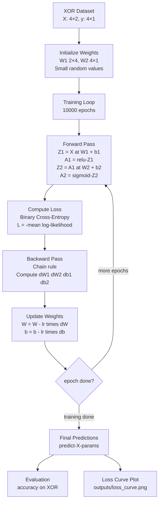
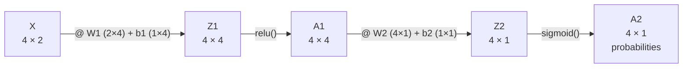
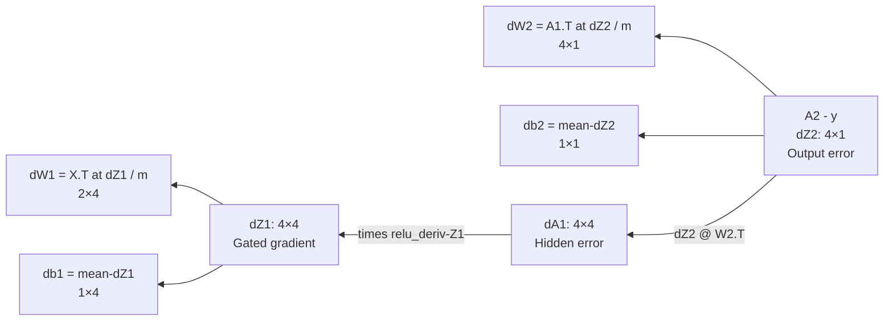
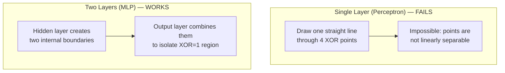
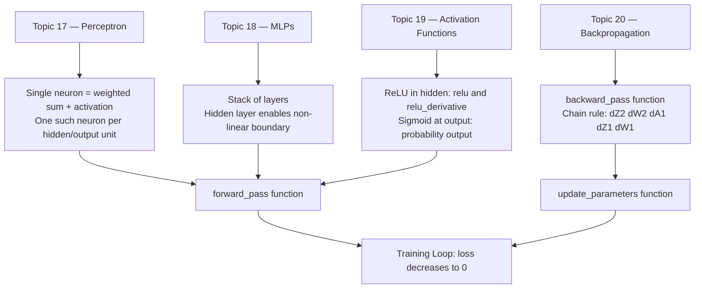

# 🏗️ Project 3 — Architecture

## System Overview

This project implements a 2-layer Multi-Layer Perceptron (MLP) using only numpy. The architecture is minimal by design — enough to solve XOR, small enough to understand every parameter.

---

## Network Architecture Diagram



---

## Training Pipeline



---

## Forward Pass: Data Shapes at Each Step



---

## Backpropagation: Gradient Flow



---

## Component Table

| Component | Function | Math Operation | Key Shape |
|---|---|---|---|
| Input | Raw data | — | (4, 2) |
| Layer 1 Linear | `Z1 = X @ W1 + b1` | Matrix multiply + broadcast | (4, 4) |
| ReLU Activation | `A1 = relu(Z1)` | Element-wise max(0, x) | (4, 4) |
| Layer 2 Linear | `Z2 = A1 @ W2 + b2` | Matrix multiply + broadcast | (4, 1) |
| Sigmoid Activation | `A2 = sigmoid(Z2)` | Element-wise 1/(1+e^-x) | (4, 1) |
| BCE Loss | `compute_loss(A2, y)` | -mean log-likelihood | scalar |
| Output grad | `dZ2 = A2 - y` | Subtraction | (4, 1) |
| W2 gradient | `dW2 = A1.T @ dZ2 / m` | Matrix multiply | (4, 1) |
| Hidden error | `dA1 = dZ2 @ W2.T` | Matrix multiply | (4, 4) |
| ReLU gate | `dZ1 = dA1 * relu_deriv(Z1)` | Element-wise multiply | (4, 4) |
| W1 gradient | `dW1 = X.T @ dZ1 / m` | Matrix multiply | (2, 4) |
| Update | `W -= lr * dW` | Element-wise subtract | same as W |

---

## Why XOR Needs Two Layers



The hidden layer transforms the input space into a new representation where the problem becomes linearly separable. Then the output layer draws the final boundary in that transformed space.

---

## Parameters Count

| Parameter | Shape | Count |
|---|---|---|
| W1 | (2, 4) | 8 |
| b1 | (1, 4) | 4 |
| W2 | (4, 1) | 4 |
| b2 | (1, 1) | 1 |
| **Total** | | **17** |

This tiny network has only 17 learnable parameters — yet it solves XOR perfectly. Modern LLMs have billions of parameters solving incomparably harder problems, but the same fundamental algorithm (forward pass, backpropagation, gradient descent) applies.

---

## Concepts Map



---

## Tech Stack

| Tool | Version | Why This Tool |
|---|---|---|
| `numpy` | 1.23+ | ALL math: matrix multiply, activations, gradients |
| `matplotlib` | 3.6+ | Loss curve plot |

No scikit-learn. No PyTorch. No TensorFlow. This is intentional — every operation is visible.

---

## Folder Structure

```
03_Neural_Net_from_Scratch/
├── src/
│   └── starter.py            ← Main Python script
├── outputs/
│   └── loss_curve.png
├── 01_MISSION.md
├── 02_ARCHITECTURE.md
├── 03_GUIDE.md
└── 04_RECAP.md
```

---

## 📂 Navigation

**In this folder:**
| File | |
|---|---|
| [📄 01_MISSION.md](./01_MISSION.md) | Context and objectives |
| 📄 **02_ARCHITECTURE.md** | You are here |
| [📄 03_GUIDE.md](./03_GUIDE.md) | Step-by-step build guide |
| [📄 src/starter.py](./src/starter.py) | Starter code with TODOs |
| [📄 04_RECAP.md](./04_RECAP.md) | Concepts recap and next steps |

⬅️ **Previous:** [02 — ML Model Comparison](../02_ML_Model_Comparison/01_MISSION.md)
➡️ **Next:** [04 — LLM Chatbot with Memory](../04_LLM_Chatbot_with_Memory/01_MISSION.md)
