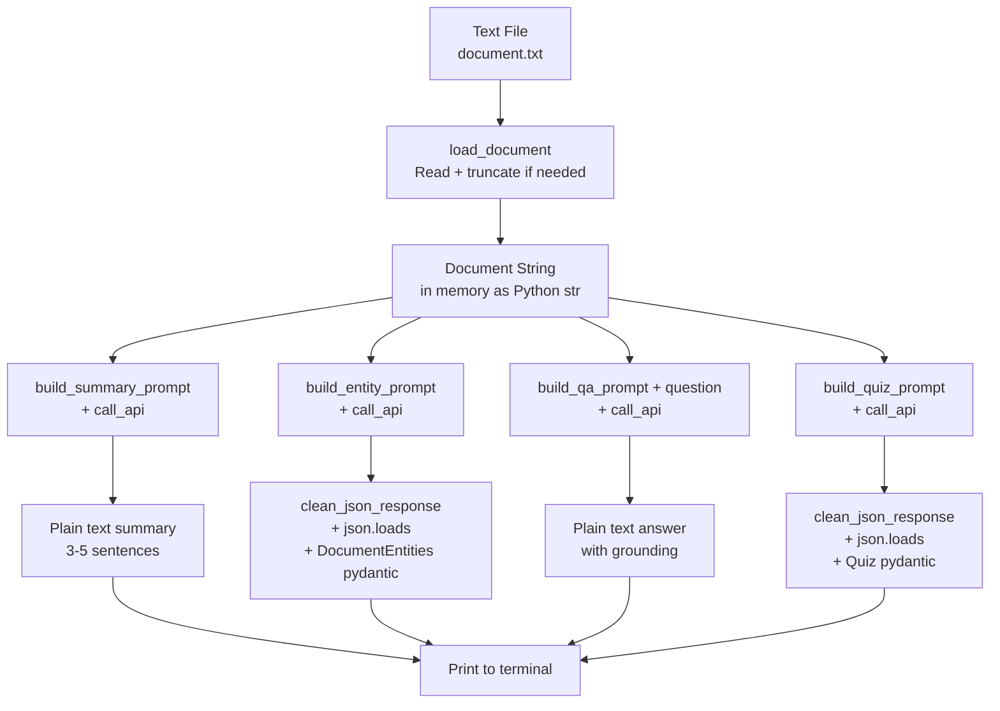
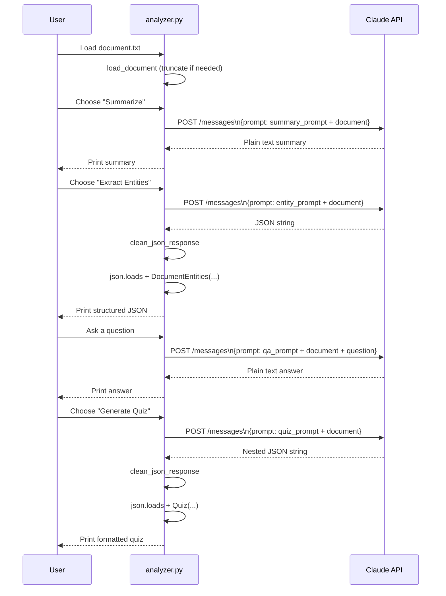
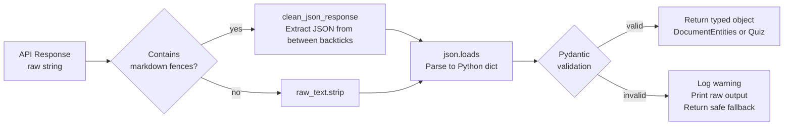
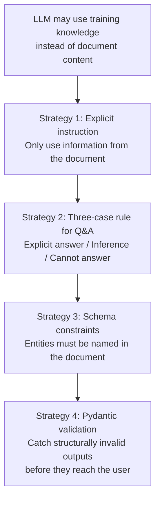
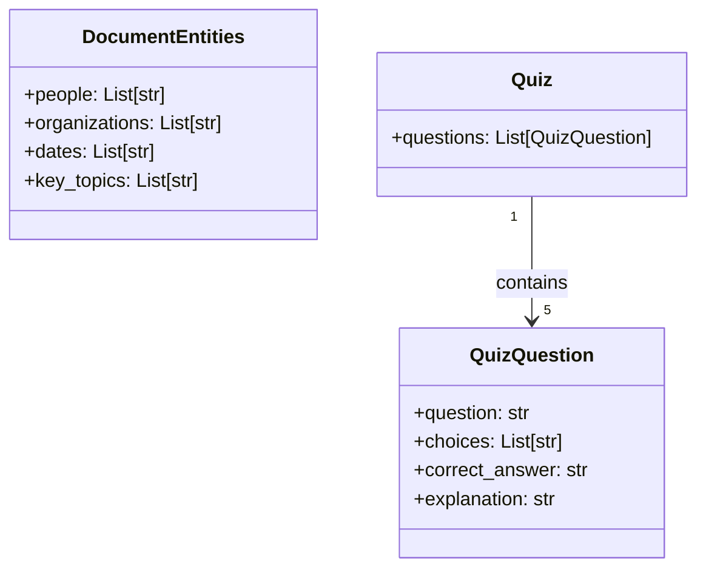
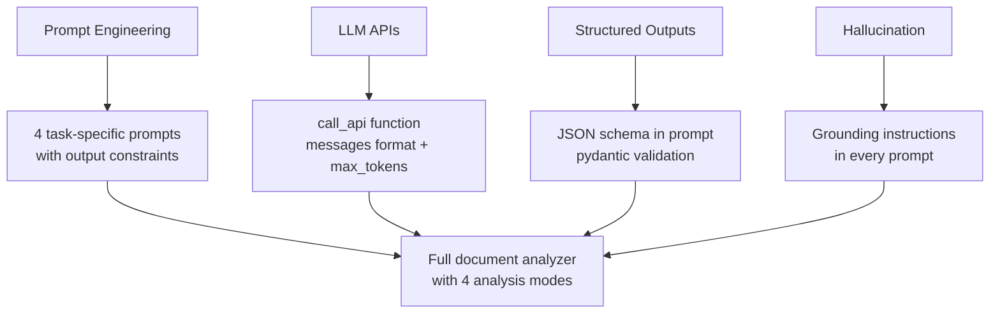

# Project 5 — Architecture

## System Overview

This project is a **prompt chain pipeline** — multiple LLM API calls, each with a specific prompt and output format, wired together into a single application. The document acts as shared context across all 4 analysis tasks. Each task is a self-contained function with its own prompt and validation logic.

---

## Full System Diagram



---

## Prompt Chain Flow



---

## Structured Output Pipeline



---

## Hallucination Reduction Strategy



Note: These strategies reduce hallucination but cannot eliminate it. For high-stakes applications, answers should always be verified against source material.

---

## Pydantic Model Hierarchy



---

## Component Table

| Component | File/Function | Role |
|---|---|---|
| Document Loader | `load_document()` | Reads file, truncates to context-safe length |
| Prompt Builders | `build_*_prompt()` | Construct task-specific prompts with document embedded |
| API Caller | `call_api()` | Single function for all non-streaming API calls |
| JSON Cleaner | `clean_json_response()` | Strips markdown code fences from LLM output |
| Entity Validator | `DocumentEntities` (pydantic) | Validates and types entity extraction result |
| Quiz Validator | `Quiz`, `QuizQuestion` (pydantic) | Validates nested quiz structure |
| Summary Display | `print()` | Plain text — no structure needed |
| Entity Display | `display_entities()` | Uses `model.model_dump_json(indent=2)` |
| Quiz Display | `display_quiz()` | Prints each question with choices and answer |
| Q&A Session | `run_qa_session()` | Interactive input loop |
| Main Menu | `run_analyzer()` | Orchestrates all components |

---

## Prompt Engineering Table

| Task | Anti-Hallucination Technique | Output Constraint | max_tokens |
|---|---|---|---|
| Summary | "Only information explicitly stated in the document" | "3 to 5 sentences" | 300 |
| Entity Extraction | "Do not add entities not mentioned in the document" | "Return ONLY valid JSON" + schema | 600 |
| Q&A | "Do not use knowledge outside the document", 3-case rule | Explicit fallback phrase | 400 |
| Quiz | "All questions must be based on content in the document" | "Return ONLY valid JSON" + schema | 1500 |

---

## Context Window Usage

```
Document:        ~1,000–100,000 chars = ~250–25,000 tokens
Prompt overhead: ~100–200 tokens per task
Max output:      300–1500 tokens per task

Total per call: document_tokens + ~300 overhead + max_output
Claude limit:   200,000 tokens

For a 10,000-word document (~13,000 tokens):
  Total per call ≈ 13,000 + 300 + 1,500 = ~14,800 tokens — well within limits
```

Very long documents (>100K words) would need chunking, not covered here.

---

## Tech Stack

| Layer | Tool | Why |
|---|---|---|
| Language | Python 3.9+ | f-strings, typing support |
| API client | `anthropic` SDK | Claude API calls |
| Validation | `pydantic` | Schema enforcement on LLM output |
| Parsing | `json` stdlib | Convert raw LLM string to Python dict |
| CLI | `argparse` stdlib | Accept file path as argument |

---

## Concepts Map



---

## 📂 Navigation

| File | |
|---|---|
| [01_MISSION.md](./01_MISSION.md) | Context and objectives |
| **02_ARCHITECTURE.md** | You are here |
| [03_GUIDE.md](./03_GUIDE.md) | Step-by-step build guide |
| [src/starter.py](./src/starter.py) | Starter code with TODOs |
| [04_RECAP.md](./04_RECAP.md) | What you built and what comes next |
