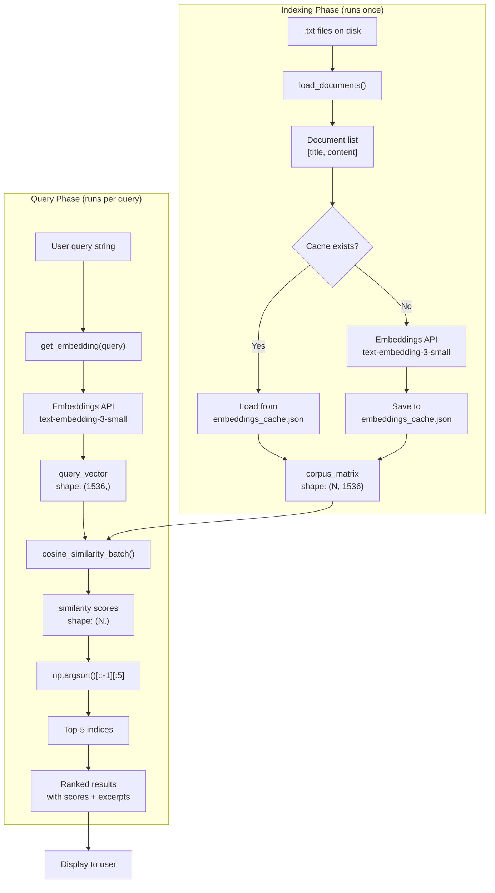
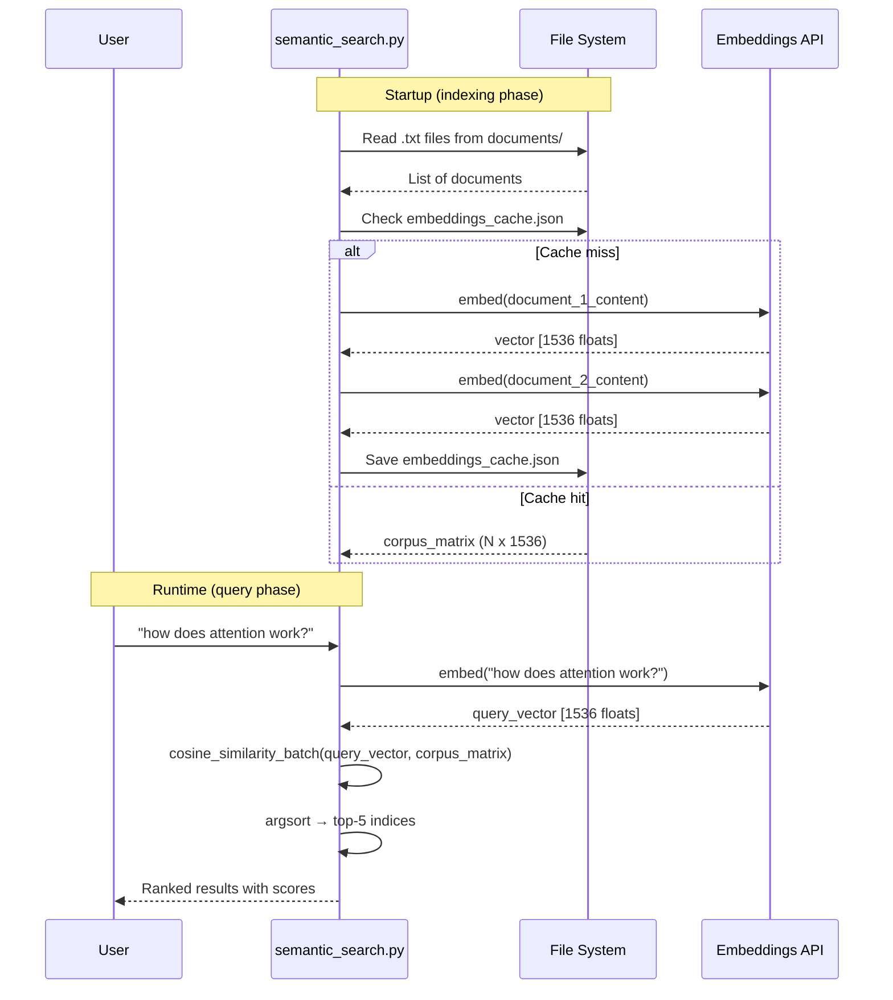
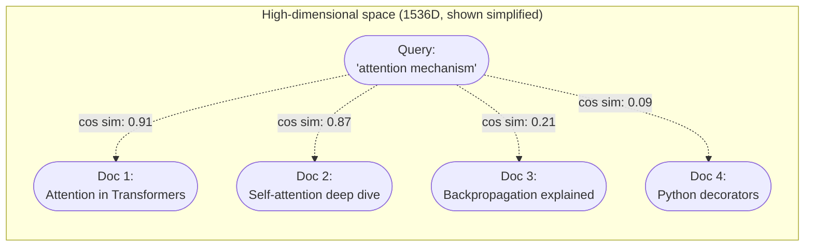

# Project 6 — Architecture

## System Overview

The semantic search engine is a two-phase system: an offline **indexing phase** that embeds documents once and caches them to disk, and an online **query phase** that embeds the user's query and runs a vectorized nearest-neighbor search.

---

## Full System Diagram



---

## Data Flow Diagram



---

## Embedding Space Concept



Documents about similar topics cluster together in embedding space. The query lands closest to semantically related documents — regardless of exact word overlap.

---

## Component Table

| Component | File/Function | Purpose | Key Detail |
|---|---|---|---|
| Document Loader | `load_documents()` | Reads `.txt` files from disk | Sorted by name for consistent ordering |
| Embedding API Client | `get_embedding()` | Converts text to vector | Always use same model for docs and queries |
| Cache Manager | `load_cache()` / `save_cache()` | Persist embeddings to JSON | Keyed by document title; avoids re-embedding |
| Corpus Builder | `build_corpus_embeddings()` | Combines loader + cache + API | Returns numpy matrix `(N, 1536)` |
| Similarity Engine | `cosine_similarity_batch()` | Scores query against all docs | Vectorized numpy — no Python loop |
| Ranker | Inside `search()` | Sorts scores, picks top-k | `np.argsort(scores)[::-1][:k]` |
| Display | `display_results()` | Formats output for terminal | Shows rank, score, title, excerpt |
| Main Loop | `main()` | Ties everything together | Load once, query repeatedly |

---

## Key Data Structures

```
documents: list[dict]
    [
        {"title": "attention_mechanism", "content": "Transformers use..."},
        {"title": "backpropagation",     "content": "Backprop is..."},
        ...
    ]
    Length: N

corpus_matrix: np.ndarray
    Shape: (N, 1536)
    dtype: float32
    Row i corresponds to documents[i]

query_vector: np.ndarray
    Shape: (1536,)
    dtype: float32

similarities: np.ndarray
    Shape: (N,)
    Values: [-1.0, 1.0]
    Index i is the similarity to documents[i]
```

---

## Tech Stack

| Layer | Tool | Why |
|---|---|---|
| Language | Python 3.9+ | Pathlib, type hints |
| Embeddings | OpenAI `text-embedding-3-small` | 1536 dims, cheap, fast |
| Math | `numpy` | Vectorized cosine similarity — no loops |
| Cache | `json` + `pathlib` | Persist embeddings to disk without a database |
| Config | `python-dotenv` | Load API key from `.env` file |

---

## How This Scales

| Scale | Approach |
|---|---|
| 1K documents | This numpy approach — fine |
| 10K documents | Add ChromaDB (see Project 2) |
| 1M+ documents | FAISS with IVF index or Pinecone |
| Multi-modal | Use CLIP embeddings for image+text |

---

## Cost and Performance

| Metric | Value | Notes |
|---|---|---|
| Embedding cost | ~$0.00002 per 1K tokens | `text-embedding-3-small` pricing |
| 10 docs x 300 words each | ~$0.0001 total | One-time at index time |
| Query cost | ~$0.000001 per query | Single embedding call |
| Search latency | < 1ms | Numpy matrix multiply on CPU |
| API latency | 100–300ms | Per call to embeddings API |

---

## 📂 Navigation

| File | |
|---|---|
| [01_MISSION.md](./01_MISSION.md) | Context and objectives |
| **02_ARCHITECTURE.md** | You are here |
| [03_GUIDE.md](./03_GUIDE.md) | Step-by-step build guide |
| [src/starter.py](./src/starter.py) | Starter code with TODOs |
| [04_RECAP.md](./04_RECAP.md) | What you built and what comes next |
