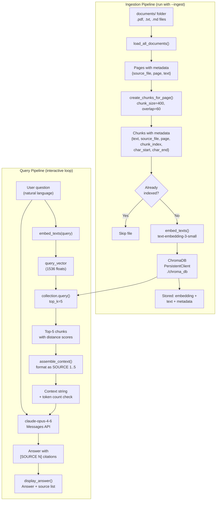
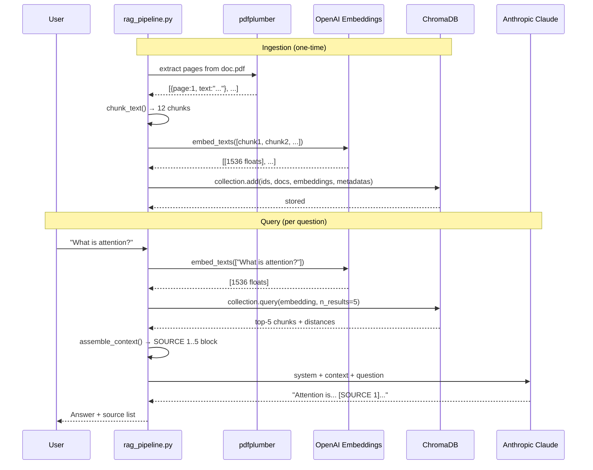

# Project 07 — Personal Knowledge Base RAG: Architecture

## System Overview

The RAG pipeline is a two-phase system. The **ingestion pipeline** runs offline when documents change. The **query pipeline** runs online for every user question.

---

## Full System Architecture



---

## Data Flow — Sequence Diagram



---

## Component Table

| Component | Function | Input | Output | Key Detail |
|---|---|---|---|---|
| Document Loader | `load_all_documents()` | `Path` to folder | List of page dicts | Dispatches by file extension |
| PDF Extractor | `extract_pdf()` | `.pdf` file path | Pages with text | Skips image-only pages |
| Text Extractor | `extract_text_file()` | `.txt` file path | Single page dict | Handles encoding errors |
| Chunker | `chunk_text()` | Text string | Chunk dicts with char offsets | Fixed-size with overlap |
| Metadata Attacher | `create_chunks_for_page()` | Page dict | Chunks with full metadata | Source, page, index all attached |
| Embedding API | `embed_texts()` | List of strings | List of 1536-d vectors | Batched, rate-limited |
| Vector Store | ChromaDB `PersistentClient` | Embeddings + metadata | Persisted collection | Cosine distance space |
| Dedup Guard | `is_file_indexed()` | Collection + filename | Boolean | Prevents duplicate ingestion |
| Retriever | `retrieve()` | Query string | Top-k chunk dicts | Distance converted to similarity |
| Context Assembler | `assemble_context()` | Chunk list | Formatted string | Token-counted, trimmed if needed |
| Generator | `generate_answer()` | Question + context | Answer string | Claude with grounding prompt |
| Display | `display_answer()` | Answer + chunks | Terminal output | Numbered source list |

---

## Tech Stack

| Layer | Tool | Why |
|---|---|---|
| PDF parsing | `pdfplumber` | More reliable than PyPDF2 for most PDFs |
| Embeddings | OpenAI `text-embedding-3-small` | 1536-d vectors, cost-effective |
| Vector store | ChromaDB (PersistentClient) | Local, no server needed, persists to disk |
| Generation | Anthropic Claude (`claude-opus-4-6`) | 200K context window |
| Token counting | `tiktoken` | Count tokens before sending to LLM |
| Config | `python-dotenv` | Keep API keys out of code |

---

## ChromaDB Data Model

Each row in the ChromaDB collection has three parts:

```
ID (string, unique):
    "attention_mechanism.pdf_p2_c4"

Document (string):
    "The attention mechanism allows the model to focus on
     relevant parts of the input sequence. Given queries Q,
     keys K, and values V, attention is computed as..."

Metadata (dict):
    {
        "source_file": "attention_mechanism.pdf",
        "page": 2,
        "chunk_index": 4,
        "char_start": 1600,
        "char_end": 2000
    }

Embedding (vector):
    [0.0231, -0.0147, 0.0089, ...] (1536 floats)
```

The metadata enables filtering and citation. The embedding enables similarity search. The document text is returned directly without needing to look it up from disk.

---

## Chunking Visualization

```mermaid
gantt
    title Fixed-Size Chunking with Overlap (chunk_size=400, overlap=60)
    dateFormat X
    axisFormat %s

    section Page Text (1200 chars)
    Chunk 0 :0, 400
    Chunk 1 :340, 740
    Chunk 2 :680, 1080
    Chunk 3 :1020, 1200
```



Each chunk starts 340 characters after the previous one (400 - 60 overlap). Sentences near chunk boundaries appear in two consecutive chunks, preventing information loss.

---

## RAG Prompt Structure

```
┌─────────────────────────────────────────────────────────────┐
│ SYSTEM PROMPT                                               │
│ "Answer ONLY from provided sources. Cite as [SOURCE N]..."  │
├─────────────────────────────────────────────────────────────┤
│ USER MESSAGE                                                │
│                                                             │
│ Sources:                                                    │
│ [SOURCE 1] File: doc.pdf | Page: 2 | Chunk: 4              │
│ The attention mechanism allows...                           │
│                                                             │
│ [SOURCE 2] File: notes.txt | Page: 1 | Chunk: 0            │
│ Transformers replaced RNNs because...                       │
│                                                             │
│ [SOURCE 3–5] ...                                            │
│                                                             │
│ Question: What is the attention mechanism?                  │
│                                                             │
│ Answer (with inline citations):                             │
├─────────────────────────────────────────────────────────────┤
│ ASSISTANT RESPONSE                                          │
│ "The attention mechanism allows models to dynamically       │
│ weight input tokens [SOURCE 1]. Unlike RNNs, Transformers   │
│ process all tokens in parallel [SOURCE 2]."                 │
└─────────────────────────────────────────────────────────────┘
```

---

## Failure Mode Analysis

| Failure | Symptom | Root Cause | Fix |
|---|---|---|---|
| Empty retrieval | No chunks returned | Documents not indexed | Run `--ingest` first |
| Wrong chunks retrieved | Irrelevant results | Embedding model mismatch | Use same model for ingest and query |
| Hallucination | Answer not in sources | Weak grounding prompt | Strengthen system prompt |
| Duplicate chunks | ID collision error | Re-running ingest | `is_file_indexed()` guard |
| Context too long | Token limit exceeded | Too many/large chunks | `assemble_context()` trimming |
| Empty PDF pages | Pages skipped | Scanned image PDF | Skip or use OCR |

---

## Scaling This Architecture

| Document count | Recommended change |
|---|---|
| < 1K chunks | This architecture — fine |
| 1K–100K chunks | Add ChromaDB HNSW tuning (ef_construction, m parameters) |
| 100K+ chunks | Switch to Qdrant or Weaviate with server mode |
| Multi-tenant | Add user_id to metadata, filter by user on retrieval |
| Real-time updates | Background worker for ingestion; version chunks by timestamp |

---

## 📂 Navigation

**In this folder:**
| File | |
|---|---|
| [01_MISSION.md](./01_MISSION.md) | Context and goals |
| 02_ARCHITECTURE.md | you are here |
| [03_GUIDE.md](./03_GUIDE.md) | Progressive build steps |
| [src/starter.py](./src/starter.py) | Runnable starter code |
| [04_RECAP.md](./04_RECAP.md) | What you built + next steps |

⬅️ **Prev:** [06 — Semantic Search Engine](../06_Semantic_Search_Engine/01_MISSION.md) &nbsp;&nbsp;&nbsp; ➡️ **Next:** [08 — Multi-Tool Research Agent](../08_Multi_Tool_Research_Agent/01_MISSION.md)
