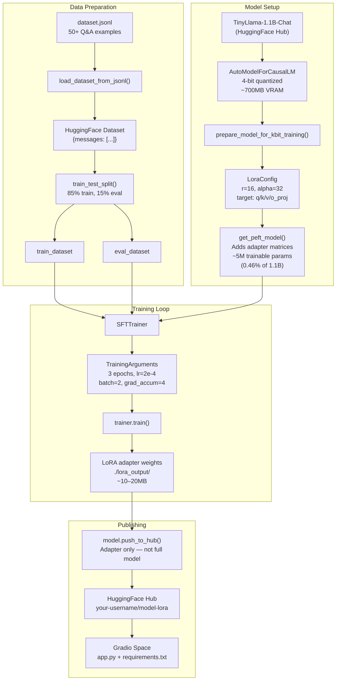
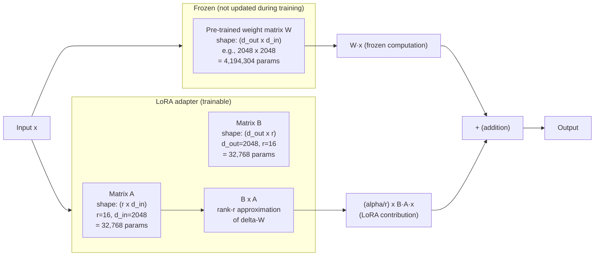
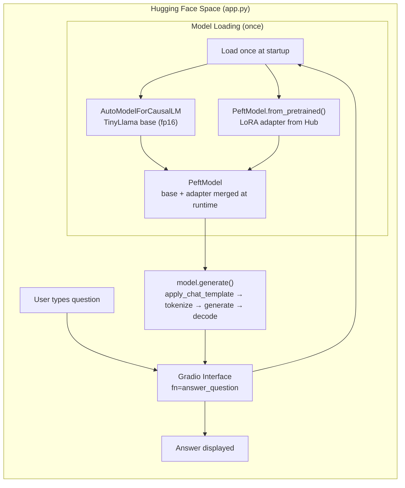

# Project 09 — Custom LoRA Fine-Tuning: Architecture

## System Overview

LoRA fine-tuning has two distinct systems: the **training pipeline** that produces a LoRA adapter, and the **inference pipeline** that loads the adapter at runtime. The base model weights never change — only the small adapter matrices are trained and stored.

---

## Training Pipeline Architecture



---

## LoRA Mechanism — What Gets Modified



LoRA does not modify W. It adds a parallel path through two small matrices A and B. During inference, the LoRA contribution `(alpha/r) × B·A·x` is added to the frozen model's output. After training, you can merge: `W_merged = W + (alpha/r) × B·A`, eliminating the extra computation.

---

## Parameter Count Comparison

| Method | Trainable params | Storage needed | VRAM needed |
|---|---|---|---|
| Full fine-tuning | 1,100,000,000 | ~2 GB | ~14 GB |
| LoRA (r=16) | 5,111,808 | ~20 MB | ~700 MB (4-bit) |
| LoRA (r=4) | 1,277,952 | ~5 MB | ~700 MB (4-bit) |

With LoRA at r=16: 0.46% of model parameters are trainable. The rest are frozen.

---

## Inference Pipeline (Deployment)



---

## Component Table

| Component | File/Class | Purpose | Notes |
|---|---|---|---|
| Dataset Loader | `load_dataset_from_jsonl()` | Parse and validate JSONL | Validates structure before training |
| Train/Eval Split | `Dataset.train_test_split()` | Hold out 15% for eval | Prevents overfitting measurement bias |
| Quantization Config | `BitsAndBytesConfig` | 4-bit quantization | Reduces VRAM from ~2GB to ~700MB |
| Base Model | `AutoModelForCausalLM` | TinyLlama 1.1B | Frozen during training |
| Tokenizer | `AutoTokenizer` | Text to token IDs | pad_token = eos_token |
| kbit Prep | `prepare_model_for_kbit_training()` | Enables gradient checkpointing | Required before LoRA on quantized models |
| LoRA Config | `LoraConfig` | Defines adapter structure | r, alpha, target_modules, dropout |
| LoRA Wrapper | `get_peft_model()` | Injects adapter into model | Makes only adapter params trainable |
| Training Config | `TrainingArguments` | Epochs, LR, batch, logging | Gradient accumulation for effective batch |
| Trainer | `SFTTrainer` | Supervised fine-tuning loop | Auto-formats chat templates |
| Evaluation | `evaluate.py` | Before/after comparison | Qualitative + response quality |
| Gradio App | `app.py` | Interactive demo UI | Deployed to HF Spaces |

---

## Tech Stack

| Layer | Tool | Why |
|---|---|---|
| Base model | `TinyLlama/TinyLlama-1.1B-Chat-v1.0` | Small enough for free GPU, chat-format ready |
| Quantization | `bitsandbytes` | 4-bit NF4 quantization — fits in Colab T4 |
| LoRA | `peft` (PEFT library) | LoraConfig + get_peft_model |
| Training loop | `trl` (SFTTrainer) | Handles chat template + training loop |
| Dataset | `datasets` (HuggingFace) | Dataset.from_list + train_test_split |
| Hub publishing | `huggingface_hub` | Push adapter (not full model) |
| Demo UI | `gradio` | Interactive web interface |

---

## Training Loss Interpretation

```
Epoch 1/3:   loss = 1.42   ← model is learning the format/style
Epoch 2/3:   loss = 0.89   ← model learning domain-specific content
Epoch 3/3:   loss = 0.71   ← converging

eval_loss per epoch:
  Epoch 1: 1.38   ← good: close to train loss
  Epoch 2: 0.92
  Epoch 3: 0.88   ← still decreasing: not overfit

Overfit signal (stop training if you see this):
  train_loss keeps decreasing: 0.71 → 0.45 → 0.22
  eval_loss starts increasing:  0.88 → 0.95 → 1.12
```

---

## LoRA Hyperparameter Guide

| Hyperparameter | Value range | Effect | Recommended start |
|---|---|---|---|
| `r` (rank) | 4–64 | Higher = more capacity, more params, more overfit risk | 16 |
| `lora_alpha` | 4–128 | Scaling factor; `alpha/r` is the effective scale | 2 × r |
| `lora_dropout` | 0.0–0.2 | Regularization; helps on small datasets | 0.05 |
| `target_modules` | q, k, v, o, mlp | More modules = more params = more capacity | q_proj, v_proj (start) |
| `num_train_epochs` | 1–10 | Too many = overfit on small data | 3 |
| `learning_rate` | 1e-5 – 5e-4 | Too high = unstable loss; too low = slow | 2e-4 |

---

## File Outputs

```
./lora_output/
├── adapter_config.json       ← LoRA configuration (r, alpha, modules, etc.)
├── adapter_model.safetensors ← the actual trained LoRA weights (~10–20 MB)
├── tokenizer_config.json
├── tokenizer.model
└── special_tokens_map.json

Hugging Face Hub:
  your-username/tinyllama-ml-tutor-lora/
  ├── README.md               ← model card (you write this)
  ├── adapter_config.json
  └── adapter_model.safetensors
```

---

## 📂 Navigation

**In this folder:**
| File | |
|---|---|
| [01_MISSION.md](./01_MISSION.md) | Context and goals |
| 02_ARCHITECTURE.md | you are here |
| [03_GUIDE.md](./03_GUIDE.md) | Progressive build steps |
| [src/starter.py](./src/starter.py) | Runnable starter code |
| [04_RECAP.md](./04_RECAP.md) | What you built + next steps |

⬅️ **Prev:** [08 — Multi-Tool Research Agent](../08_Multi_Tool_Research_Agent/01_MISSION.md) &nbsp;&nbsp;&nbsp; ➡️ **Next:** [10 — Production RAG System](../10_Production_RAG_System/01_MISSION.md)
