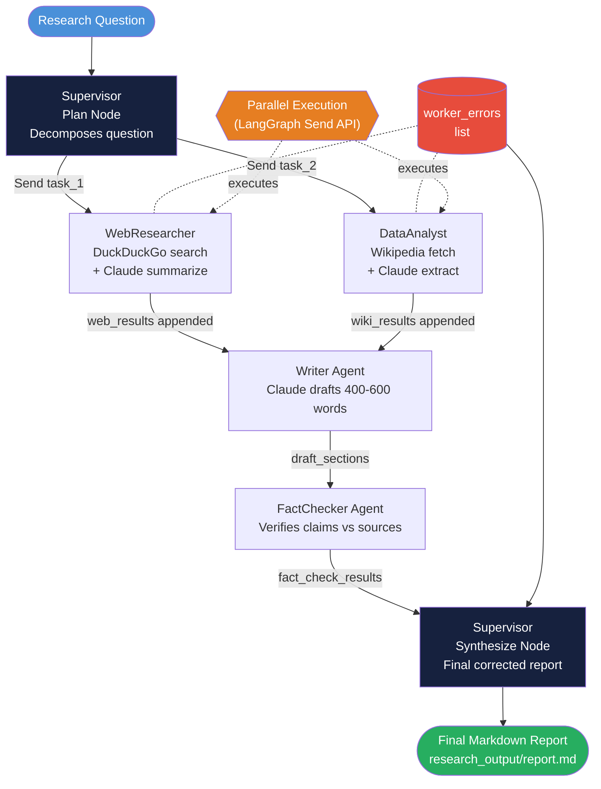
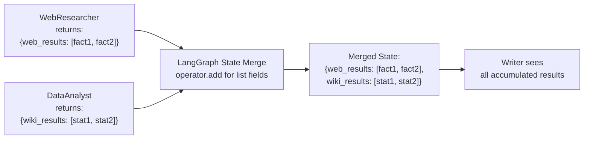
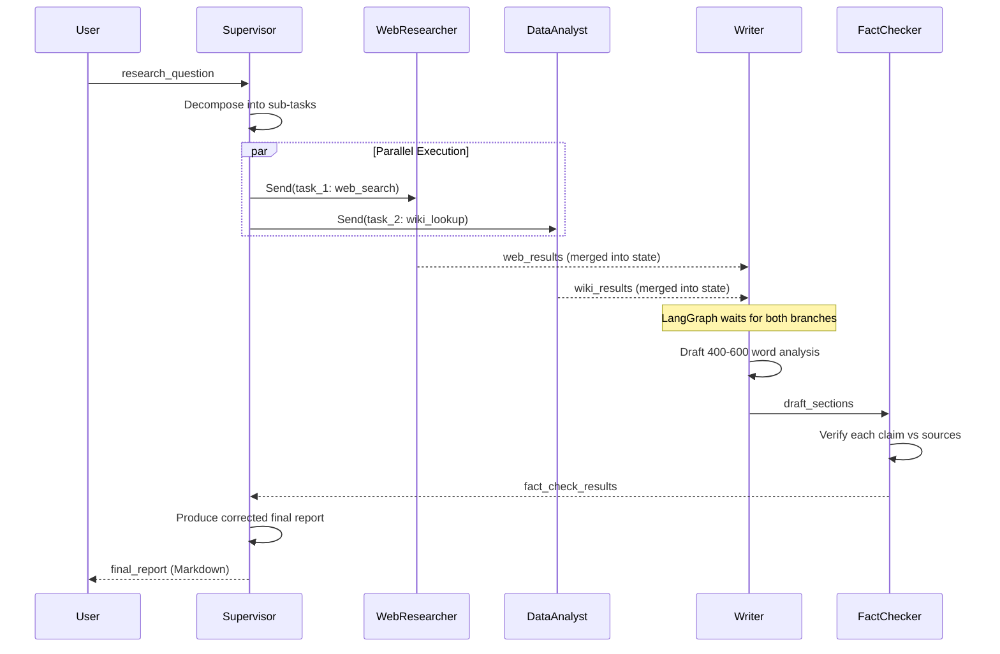
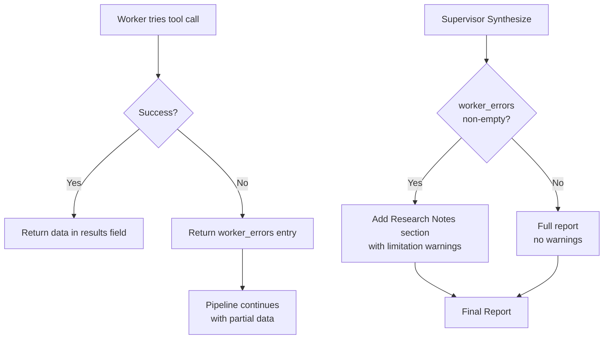
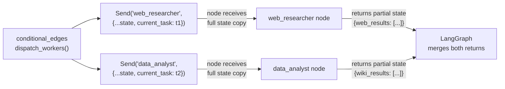

# 02 Architecture — Multi-Agent Research System

## Full System Flowchart



---

## Component Table

| Agent / Node | Role | Tools | Input from State | Output to State |
|---|---|---|---|---|
| Supervisor (Plan) | Decompose question into sub-tasks | Claude claude-sonnet-4-6 | `research_question` | `sub_tasks` (list of task dicts) |
| WebResearcher | Search web, extract key facts | DuckDuckGo + Claude | `current_task.query` | `web_results` (appended) |
| DataAnalyst | Fetch Wikipedia, extract stats | Wikipedia API + Claude | `current_task.topic` | `wiki_results` (appended) |
| Writer | Draft coherent prose from research | Claude claude-sonnet-4-6 | `web_results`, `wiki_results` | `draft_sections` (appended) |
| FactChecker | Verify claims vs sources | Claude claude-sonnet-4-6 | `draft_sections`, `web_results`, `wiki_results` | `fact_check_results` |
| Supervisor (Synthesize) | Final corrected report | Claude claude-sonnet-4-6 | All state fields | `final_report` |

---

## Tech Stack

| Tool | Purpose |
|---|---|
| `langgraph` | StateGraph, Send API, parallel execution |
| `anthropic` | Claude for all agent reasoning |
| `duckduckgo-search` | Web search without API key |
| `wikipedia-api` | Wikipedia content retrieval |
| `langchain-anthropic` | Claude integration for LangGraph |

---

## State Merge Semantics



| Field | Merge Strategy | Reason |
|---|---|---|
| `web_results` | `operator.add` (append) | Multiple workers may contribute; all results needed |
| `wiki_results` | `operator.add` (append) | Same |
| `draft_sections` | `operator.add` (append) | Multiple drafts possible in extended pipelines |
| `worker_errors` | `operator.add` (append) | Collect all errors without overwriting |
| `sub_tasks` | Overwrite | Only supervisor writes this |
| `final_report` | Overwrite | Only synthesizer writes this |
| `fact_check_results` | Overwrite | Only fact checker writes this |

---

## Supervisor Pattern — Sequence



---

## Fault Tolerance Architecture



| Worker Failure | System Behavior |
|---|---|
| WebResearcher fails | Report uses only Wikipedia data; notes web research unavailable |
| DataAnalyst fails | Report uses only web data; notes Wikipedia data unavailable |
| Writer fails | Supervisor uses raw research summary instead of polished draft |
| FactChecker fails | Report uses unverified draft; notes fact-checking was skipped |

---

## Send API Mechanics



Key insight: each `Send` gives the worker a copy of the full state plus the specific task. Workers return partial state updates (only the fields they modify). LangGraph merges these using the field-level merge strategies defined with `Annotated[list, operator.add]`.

---

## File Structure

```
14_Multi_Agent_Research_System/
├── 01_MISSION.md
├── 02_ARCHITECTURE.md
├── 03_GUIDE.md
├── 04_RECAP.md
├── src/
│   └── starter.py          # Main system (research_system.py)
└── research_output/        # Generated reports (auto-created)
    └── report_YYYYMMDD_HHMMSS.md
```

---

## 📂 Navigation

**In this folder:**
| File | |
|---|---|
| [01_MISSION.md](./01_MISSION.md) | Context and goals |
| **02_ARCHITECTURE.md** | you are here |
| [03_GUIDE.md](./03_GUIDE.md) | Progressive build steps |
| [src/starter.py](./src/starter.py) | Runnable starter code |
| [04_RECAP.md](./04_RECAP.md) | Concepts applied, extensions, job mapping |
