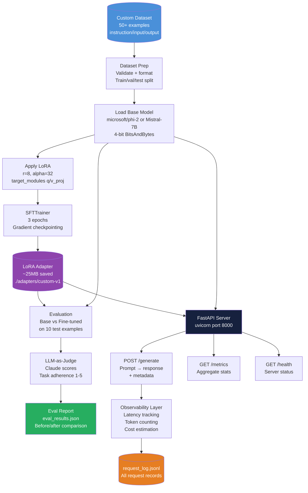
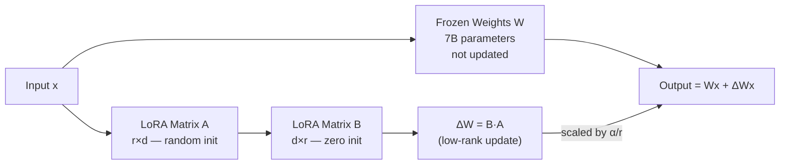
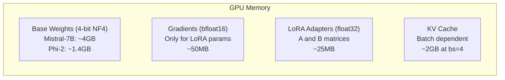
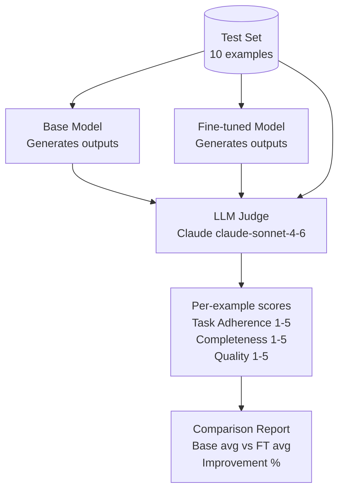
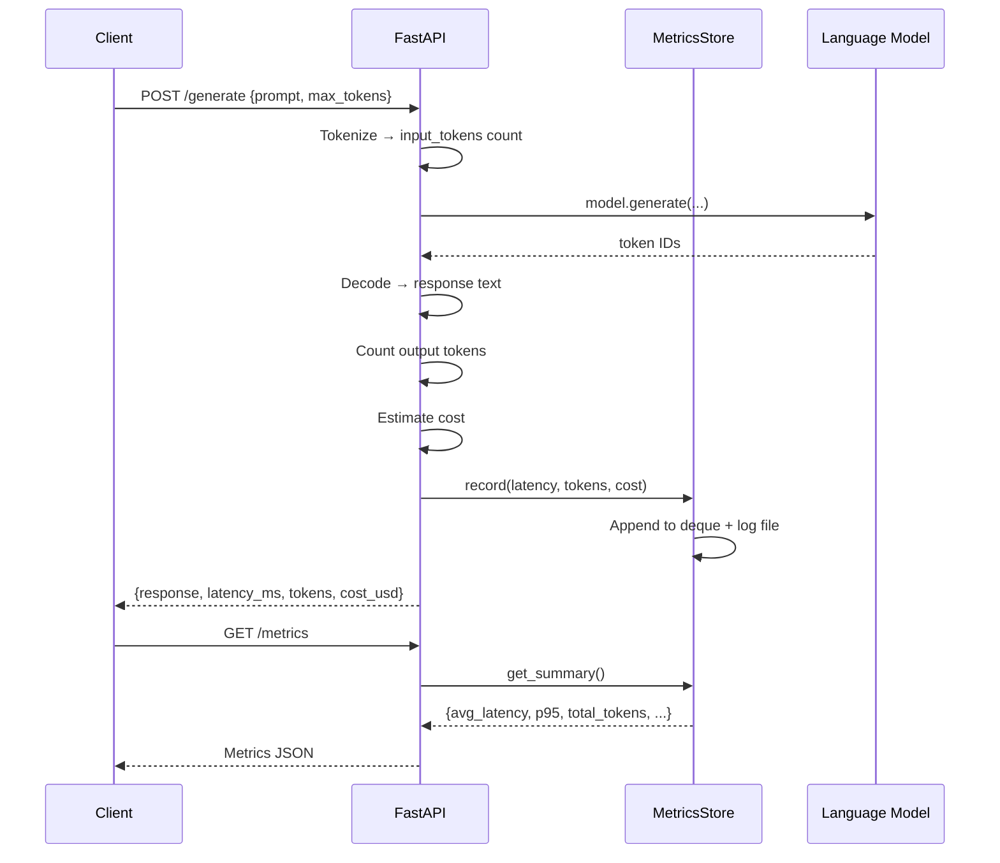

# 02 Architecture — Fine-Tune, Evaluate, and Deploy

## Full MLOps Pipeline



---

## Component Table

| Component | File | Input | Output | Key Config |
|---|---|---|---|---|
| Dataset Prep | `train.py` | `dataset.jsonl` | `DatasetDict` (train/val/test) | 70/15/15 split, 512 token max |
| Base Model Loader | `train.py` | Model name + BnB config | Quantized model + tokenizer | `load_in_4bit=True, nf4, bfloat16` |
| LoRA Application | `train.py` | Base model + LoRAConfig | PEFT-wrapped model | `r=8, alpha=32` |
| SFT Training | `train.py` | PEFT model + dataset | Updated weights in checkpoints | 3 epochs, lr=2e-4, batch=4 |
| Adapter Saver | `train.py` | Trained PEFT model | `./adapters/custom-v1/` directory | ~25MB adapter files |
| LLM Judge | `train.py` | Prompt + output + expected | Score dict (1-5) | Claude claude-sonnet-4-6 as evaluator |
| FastAPI App | `serve.py` | HTTP request | JSON response + metadata | Loads adapter at startup |
| Metrics Store | `serve.py` | Per-request records | Aggregate statistics | Thread-safe deque, max 10k records |
| Observability | `serve.py` | Response metadata | `request_log.jsonl` | Per-request JSONL logging |

---

## Tech Stack

| Tool | Purpose |
|---|---|
| `transformers` | Model loading, tokenization, generation |
| `peft` | LoRA adapter application and management |
| `trl` | SFTTrainer for supervised fine-tuning |
| `bitsandbytes` | 4-bit and 8-bit quantization |
| `datasets` | Dataset loading and processing |
| `fastapi` | REST API serving |
| `uvicorn` | ASGI server for FastAPI |
| `anthropic` | LLM-as-judge evaluation |
| `torch` | PyTorch (GPU) |

---

## LoRA Mechanics



| Hyperparameter | Meaning | Typical Range | Effect |
|---|---|---|---|
| `r` (rank) | Dimension of adapter bottleneck | 4–64 | Higher r = more capacity, more VRAM/params |
| `lora_alpha` | Scaling factor; effective scale = α/r | 16–64 | Higher = stronger adaptation |
| `target_modules` | Which weight matrices to adapt | `q_proj, v_proj` minimum | More modules = more params but better adaptation |
| `lora_dropout` | Dropout on adapter outputs | 0.0–0.1 | Regularization; helps with small datasets |

---

## QLoRA Memory Stack



| Model | Base (float16) | QLoRA 4-bit | Min VRAM (training) |
|---|---|---|---|
| Phi-2 (2.7B) | 5.4 GB | 1.6 GB | 8 GB |
| Mistral-7B | 14 GB | 4 GB | 14 GB |
| Llama-3-8B | 16 GB | 4.5 GB | 16 GB |

---

## Evaluation Framework



---

## API Server Architecture



---

## Observability Data Model

| Field | Type | Description |
|---|---|---|
| `timestamp` | ISO-8601 string | When the request was processed |
| `latency_ms` | float | End-to-end request latency |
| `input_tokens` | int | Tokens in the prompt |
| `output_tokens` | int | Tokens generated |
| `cost_usd` | float | Estimated compute cost |
| `success` | bool | Whether generation succeeded |
| `error` | str or None | Error message if failed |

Derived metrics: `p95_latency`, `tokens_per_second`, `cost_per_1k_tokens`

---

## File Structure

```
15_Fine_Tune_Evaluate_Deploy/
├── 01_MISSION.md
├── 02_ARCHITECTURE.md
├── 03_GUIDE.md
├── 04_RECAP.md
├── src/
│   └── starter.py          # train.py + serve.py combined entry point
├── dataset.jsonl           # Your 50+ training examples
├── eval_results.json       # Auto-generated evaluation report
├── request_log.jsonl       # Auto-generated per-request logs
├── checkpoints/            # Training checkpoints (auto-created)
└── adapters/
    └── custom-v1/          # Saved LoRA adapter
```

---

## 📂 Navigation

**In this folder:**
| File | |
|---|---|
| [01_MISSION.md](./01_MISSION.md) | Context and goals |
| **02_ARCHITECTURE.md** | you are here |
| [03_GUIDE.md](./03_GUIDE.md) | Progressive build steps |
| [src/starter.py](./src/starter.py) | Runnable starter code |
| [04_RECAP.md](./04_RECAP.md) | Concepts applied, extensions, job mapping |
