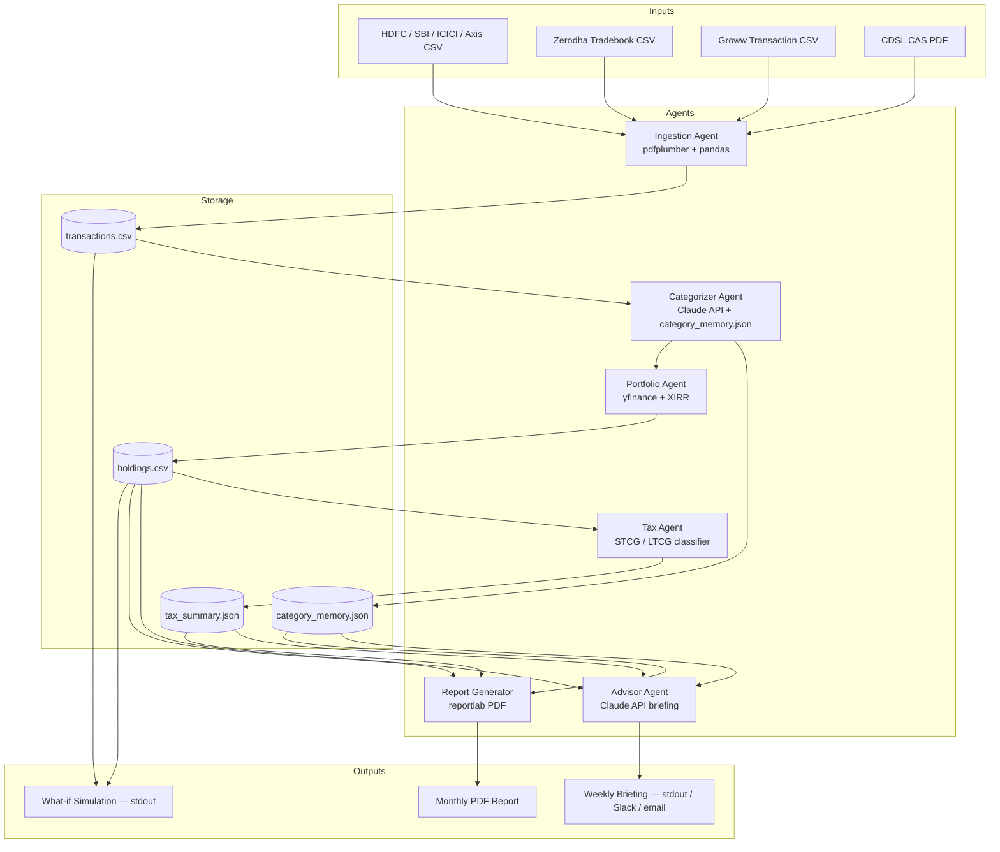

# 🏗️ Architecture — Budget Portfolio Agent

## 🗺️ The Analogy

Think of the system like a finance department in a startup. Each department handles one specialty: the mailroom opens envelopes (Ingestion), accounting labels every line item (Categorizer), the treasury desk tracks portfolio value (Portfolio), legal figures out taxes (Tax), the CFO writes the weekly memo (Advisor), and the print room produces the board report (Report Generator). They share one filing cabinet (a local JSON/CSV store) but never get in each other's way.

---

## 🔷 System Architecture Diagram



---

## 🧩 Component Table

| Agent | File | Responsibility | Key Library |
|-------|------|----------------|-------------|
| Ingestion Agent | `ingestion.py` | Parse all input formats into a unified DataFrame | `pdfplumber`, `pandas` |
| Categorizer Agent | `categorizer.py` | LLM-label each transaction; persist memory | `anthropic`, `json` |
| Portfolio Agent | `portfolio.py` | Fetch live prices, compute unrealized P&L, XIRR | `yfinance`, `scipy` |
| Tax Agent | `tax.py` | Classify STCG vs LTCG; estimate liability | `pandas`, `datetime` |
| Advisor Agent | `advisor.py` | Generate plain-English weekly briefing | `anthropic` |
| Report Generator | `report.py` | Produce PDF with charts and tables | `reportlab` |
| Orchestrator | `main.py` | Wire all agents; CLI entry point | `argparse` |
| What-if Simulator | `simulator.py` | Project savings under spending cuts | `pandas` |

---

## 🛠️ Tech Stack

| Library | Version (minimum) | Purpose |
|---------|-------------------|---------|
| `anthropic` | 0.25+ | Claude API for categorization and briefing |
| `pdfplumber` | 0.11+ | Extract text tables from CDSL CAS PDFs |
| `pandas` | 2.0+ | All tabular data wrangling |
| `yfinance` | 0.2+ | Live and historical NSE/BSE price data |
| `scipy` | 1.12+ | `scipy.optimize.brentq` for XIRR calculation |
| `reportlab` | 4.0+ | Generate monthly PDF report |
| `python-dotenv` | 1.0+ | Load `ANTHROPIC_API_KEY` from `.env` |
| `httpx` | 0.27+ | Optional: fetch NSE API directly |

Install with:
```bash
pip install anthropic pdfplumber pandas yfinance scipy reportlab python-dotenv httpx
```

---

## 📄 Input File Formats

### Bank Statement CSV (HDFC-style)
```
Date,Narration,Chq./Ref.No.,Value Date,Withdrawal Amt.,Deposit Amt.,Closing Balance
01/04/2024,UPI-Swiggy-payment,,01/04/2024,450.00,,45230.10
```

### Zerodha Tradebook CSV
```
trade_date,tradingsymbol,exchange,segment,series,trade_type,quantity,price,order_id,trade_id,order_timestamp
2024-01-15,RELIANCE,NSE,EQ,EQ,buy,10,2450.50,1234567,9876543,2024-01-15 10:23:45
```

### Groww Transaction CSV
```
Date,Type,Scheme/Stock Name,Units,NAV/Price,Amount
15-01-2024,SIP,Axis Bluechip Fund,12.345,67.89,837.50
```

### CDSL CAS PDF
Extracted text table with columns: ISIN, Company, Quantity, Average Cost, Current Value. The exact format varies; the ingestion agent uses regex + pdfplumber table extraction.

---

## 🔑 API Reference

### Anthropic Messages API (Categorizer)
```python
client.messages.create(
    model="claude-opus-4-5",
    max_tokens=256,
    system="You are a transaction categorizer for Indian bank accounts...",
    messages=[{"role": "user", "content": narration}]
)
```

### yfinance Ticker
```python
import yfinance as yf
ticker = yf.Ticker("RELIANCE.NS")   # ← .NS suffix for NSE; .BO for BSE
info = ticker.fast_info
ltp = info.last_price                # ← last traded price in INR
hist = ticker.history(period="2y")   # ← 2-year OHLCV for XIRR
```

### XIRR via scipy
XIRR solves for rate `r` where: `sum(cashflow_i / (1+r)^((date_i - date_0).days/365)) = 0`

```python
from scipy.optimize import brentq

def xirr(cashflows, dates):
    # cashflows: list of floats (negative=outflow, positive=inflow/current_value)
    # dates: list of datetime.date objects
    ...
```

---

## 📂 Navigation

| | Link |
|---|---|
| Back to Capstone Index | [22_Capstone_Projects README](../README.md) |
| Previous File | [01 — Mission](./01_MISSION.md) |
| Next File | [03 — Guide](./03_GUIDE.md) |
