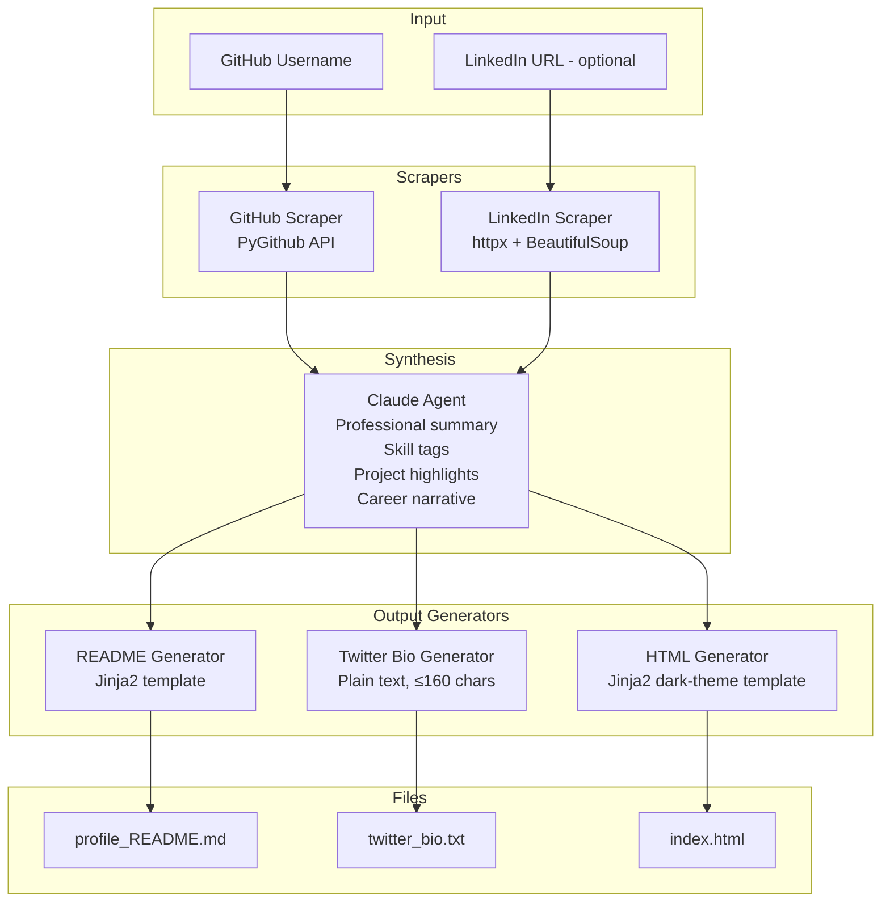

# 🏗️ Architecture — Personal Profile Builder Agent

## 🗺️ The Analogy

Think of a newspaper editorial desk. The data reporters (scrapers) go out and collect raw facts. The editor (Claude) synthesises those facts into a coherent story. The layout team (output generators) format that story into three different publications: a GitHub README, a tweet, and a webpage. Each publication has its own format rules, but they all tell the same underlying story.

---

## 🔷 System Architecture Diagram



---

## 🧩 Component Table

| Component | File | Responsibility | Key Library |
|-----------|------|----------------|-------------|
| GitHub Scraper | `github_scraper.py` | Fetch repos, languages, stars, bio, recent commits | `PyGithub` |
| LinkedIn Scraper | `linkedin_scraper.py` | Extract headline + summary from public page | `httpx`, `beautifulsoup4` |
| Claude Agent | `claude_agent.py` | Synthesise raw data into profile components | `anthropic` |
| Output Generator | `output_generator.py` | Render Jinja2 templates to output files | `jinja2` |
| Orchestrator | `main.py` | Wire all components; CLI entry point | `argparse` |

---

## 🛠️ Tech Stack

| Library | Version (minimum) | Purpose |
|---------|-------------------|---------|
| `anthropic` | 0.25+ | Claude API for synthesis |
| `PyGithub` | 2.3+ | GitHub REST API wrapper |
| `httpx` | 0.27+ | HTTP requests with timeout and retry |
| `beautifulsoup4` | 4.12+ | HTML parsing for LinkedIn scrape |
| `jinja2` | 3.1+ | Template rendering for README and HTML |
| `python-dotenv` | 1.0+ | Load API keys from `.env` |

Install with:
```bash
pip install anthropic PyGithub httpx beautifulsoup4 jinja2 python-dotenv
```

---

## 📄 Data Flow

### GitHub Scraper Output (dict)
```python
{
    "username":       "priyasharma",
    "name":           "Priya Sharma",
    "bio":            "ML Engineer | Open Source",
    "location":       "Bengaluru, India",
    "public_repos":   34,
    "followers":      412,
    "top_repos": [
        {"name": "rag-pipeline", "description": "...", "stars": 87, "language": "Python"},
        ...
    ],
    "top_languages":  ["Python", "JavaScript", "Go"],
    "recent_commits": 23,    # commits across all repos in last 30 days
}
```

### Claude Agent Output (dict)
```python
{
    "summary":   "Priya is a Bengaluru-based ML Engineer ...",
    "skills":    ["Python", "RAG", "LLMs", "FastAPI", "PostgreSQL"],
    "projects":  [{"name": "rag-pipeline", "highlight": "..."}],
    "narrative": "From data science intern to open-source contributor ...",
    "twitter_bio": "ML Engineer building RAG pipelines | Open Source | Bengaluru",
}
```

---

## 🔑 API Reference

### PyGithub
```python
from github import Github

g    = Github(token)                        # ← token from GITHUB_TOKEN env var
user = g.get_user("priyasharma")            # ← public user object
repos = user.get_repos()                    # ← PaginatedList of Repository objects
repo.stargazers_count                       # ← star count
repo.get_languages()                        # ← {"Python": 12340, "Shell": 234}
```

### httpx with retry
```python
import httpx

headers = {"User-Agent": "Mozilla/5.0 ..."}   # ← LinkedIn needs a real UA string
with httpx.Client(timeout=10.0) as client:
    resp = client.get(url, headers=headers, follow_redirects=True)
```

### Jinja2 template rendering
```python
from jinja2 import Environment, FileSystemLoader

env      = Environment(loader=FileSystemLoader("templates/"))
template = env.get_template("readme.md.j2")
output   = template.render(profile=profile_dict)
```

---

## 📂 Navigation

| | Link |
|---|---|
| Back to Capstone Index | [22_Capstone_Projects README](../README.md) |
| Previous File | [01 — Mission](./01_MISSION.md) |
| Next File | [03 — Guide](./03_GUIDE.md) |
