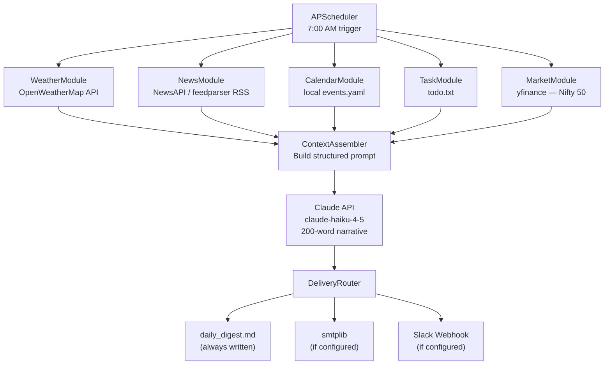
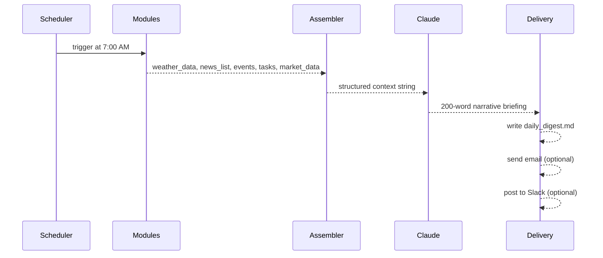

# Project 18 — Daily Automation Agent: Architecture

## System Overview

Think of this agent as a newspaper editor who arrives at the office first. They assign reporters to different beats — weather, news, finance, personal schedule — then collect all the copy, hand it to a columnist (Claude) to write the narrative, and finally send the finished edition to the reader.

Each beat is an independent module. They all run in parallel, return structured data, and hand off to a single assembly function before Claude writes the briefing.

---

## System Architecture



---

## Component Table

| Component | File Location | Inputs | Outputs |
|---|---|---|---|
| Scheduler | `solution.py: run_scheduler()` | APScheduler config | Triggers `run_briefing()` at 7am |
| WeatherModule | `solution.py: fetch_weather()` | City name, OWM API key | dict: temp, description, humidity |
| NewsModule | `solution.py: fetch_news()` | RSS URL or NewsAPI key | list of 5 headline strings |
| CalendarModule | `solution.py: load_calendar()` | `events.yaml` path | list of today's events |
| TaskModule | `solution.py: load_tasks()` | `todo.txt` path | list of open task strings |
| MarketModule | `solution.py: fetch_market()` | ticker symbols | dict: index price, top movers |
| ContextAssembler | `solution.py: assemble_context()` | All module outputs | Formatted string prompt |
| Claude Briefing | `solution.py: generate_briefing()` | Context string | 200-word narrative string |
| DeliveryRouter | `solution.py: deliver()` | Briefing string, config | Written files, email, Slack |

---

## Data Flow in Detail



---

## Tech Stack Details

| Layer | Technology | Why |
|---|---|---|
| Scheduling | `APScheduler 3.x` | Pure Python, no daemon required, clean cron-style API |
| Weather | `OpenWeatherMap API` (free) | Reliable, global, JSON response |
| News | `feedparser` + BBC RSS | No API key required; easy fallback |
| Markets | `yfinance` | Free, unofficial Yahoo Finance wrapper, no key needed |
| Calendar | `PyYAML` + local file | No OAuth complexity; simple YAML config |
| AI | `anthropic` claude-haiku-4-5 | Fast + cheap for structured summarization |
| Email | `smtplib` (stdlib) | No dependency; works with Gmail app passwords |
| Slack | `requests` POST to webhook | One HTTP call, no Slack SDK needed |
| Config | `python-dotenv` | Standard .env pattern for secrets |

---

## File Layout

```
18_Daily_Automation_Agent/
├── 01_MISSION.md
├── 02_ARCHITECTURE.md        ← you are here
├── 03_GUIDE.md
├── 04_RECAP.md
├── events.yaml               ← your calendar (created in Step 3)
├── todo.txt                  ← your task list (created in Step 3)
├── daily_digest.md           ← generated output (created at runtime)
├── .env                      ← API keys (never committed)
└── src/
    ├── starter.py
    └── solution.py
```

---

## 📂 Navigation

| File | |
|---|---|
| [01_MISSION.md](./01_MISSION.md) | Context and goals |
| **02_ARCHITECTURE.md** | ← you are here |
| [03_GUIDE.md](./03_GUIDE.md) | Step-by-step build guide |
| [04_RECAP.md](./04_RECAP.md) | Concepts applied, extensions, job mapping |
