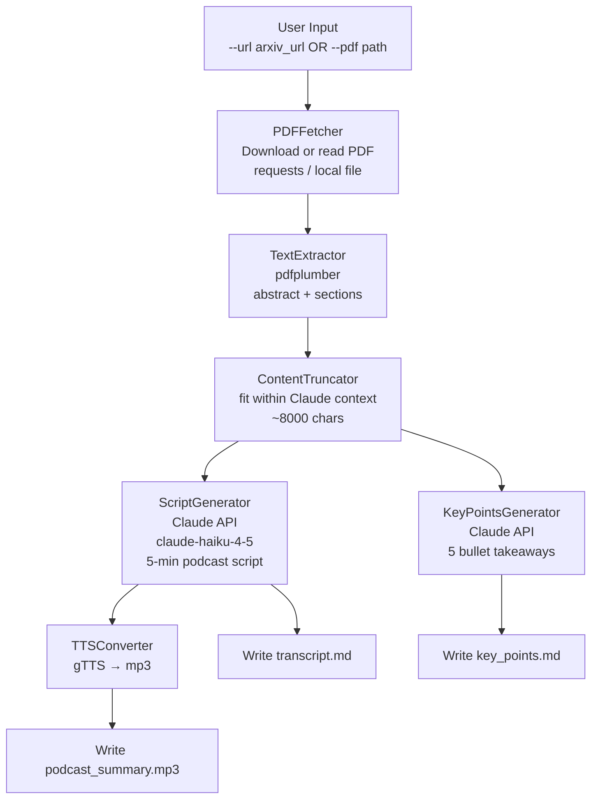
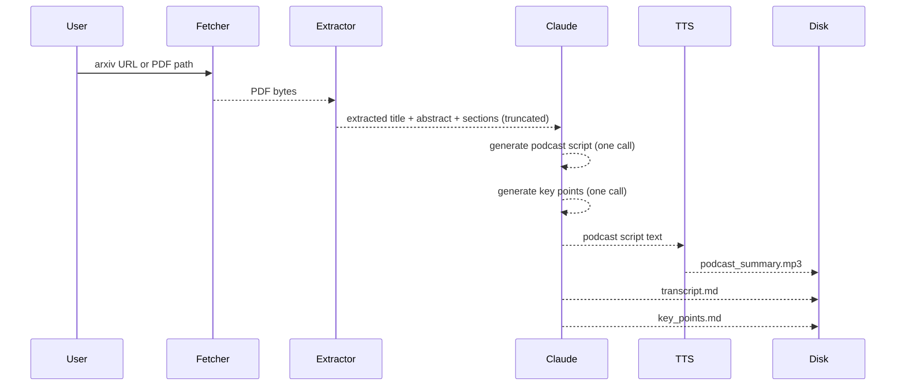

# Project 19 — Research Paper to Podcast Agent: Architecture

## System Overview

Think of this system as a translation pipeline with three stages: extraction, scriptwriting, and production.

In the first stage, a researcher (pdfplumber) reads the paper and produces a structured summary. In the second stage, a script writer (Claude) receives the summary and produces a conversational podcast episode. In the third stage, a voice actor (gTTS) reads the script aloud and produces an audio file.

Each stage is independent. You could swap gTTS for OpenAI TTS or ElevenLabs without touching the extraction or scriptwriting logic.

---

## System Architecture



---

## Component Table

| Component | Function | Inputs | Outputs |
|---|---|---|---|
| PDFFetcher | Download arXiv PDF or read local file | URL or file path | Raw bytes |
| TextExtractor | Parse PDF into structured text | PDF bytes | dict: title, abstract, sections |
| ContentTruncator | Limit text to fit Claude context | Extracted text | Truncated string (~8000 chars) |
| ScriptGenerator | Claude generates podcast script | Paper summary | Podcast script string |
| KeyPointsGenerator | Claude generates 5 takeaways | Paper summary | Key points string |
| TTSConverter | gTTS converts script to audio | Script string | podcast_summary.mp3 |
| OutputWriter | Writes all three output files | Script, points | transcript.md, key_points.md, mp3 |

---

## Data Flow in Detail



---

## arXiv URL Format

arXiv papers have two URL patterns:

| Type | Example |
|---|---|
| Abstract page | `https://arxiv.org/abs/1706.03762` |
| Direct PDF | `https://arxiv.org/pdf/1706.03762` |

The agent converts abstract URLs to PDF URLs automatically by replacing `/abs/` with `/pdf/`.

---

## Prompt Architecture

Two Claude calls, each with a focused system prompt:

```
Call 1 — Podcast Script
  System: You are a science podcast host. Write a 5-minute conversational episode...
  User:   Here is the paper content: [truncated text]
  Output: Full podcast script (~800 words)

Call 2 — Key Points
  System: You are a research analyst. Extract the 5 most important takeaways...
  User:   Here is the paper content: [truncated text]
  Output: 5 bullet points with brief explanations
```

Keeping them as two separate calls gives you cleaner, focused outputs. A single combined call tends to produce mixed-format results.

---

## Tech Stack Details

| Layer | Technology | Why |
|---|---|---|
| PDF parsing | `pdfplumber` | Reliable text extraction with page-level control |
| PDF download | `requests` | Simple HTTP GET with User-Agent header |
| Scriptwriting | `anthropic` claude-haiku-4-5 | Fast, cost-effective for structured generation |
| TTS | `gTTS` | Free, no API key, uses Google TTS internally |
| CLI | `argparse` (stdlib) | `--url` and `--pdf` flags |
| Config | `python-dotenv` | API key management |

---

## File Layout

```
19_Research_Paper_Podcast_Agent/
├── 01_MISSION.md
├── 02_ARCHITECTURE.md         ← you are here
├── 03_GUIDE.md
├── 04_RECAP.md
├── podcast_summary.mp3        ← generated at runtime
├── transcript.md              ← generated at runtime
├── key_points.md              ← generated at runtime
├── .env
└── src/
    ├── starter.py
    └── solution.py
```

---

## 📂 Navigation

| File | |
|---|---|
| [01_MISSION.md](./01_MISSION.md) | Context and goals |
| **02_ARCHITECTURE.md** | ← you are here |
| [03_GUIDE.md](./03_GUIDE.md) | Step-by-step build guide |
| [04_RECAP.md](./04_RECAP.md) | Concepts applied, extensions, job mapping |
