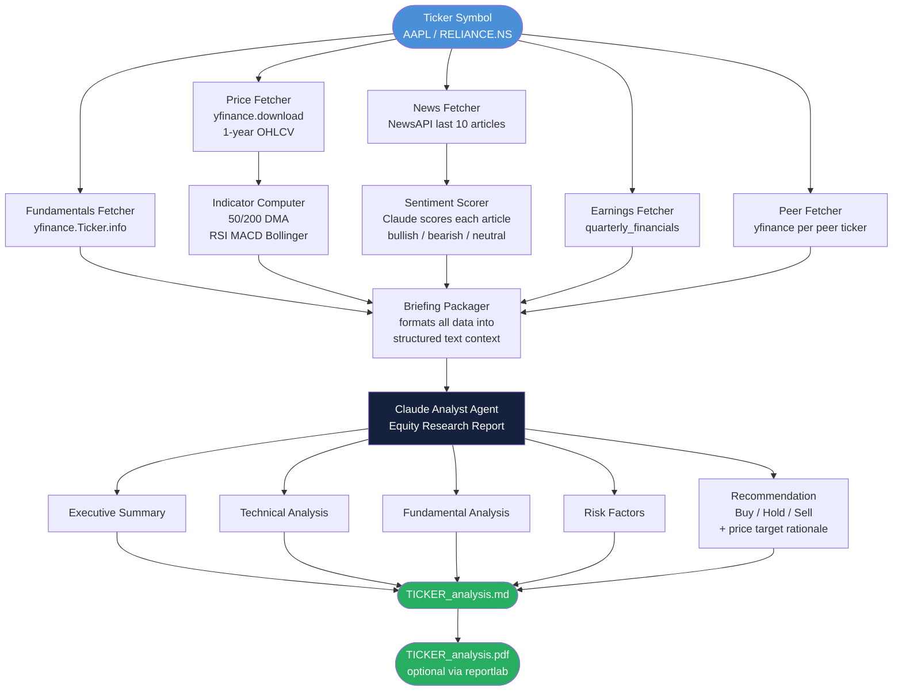

# Project 20 — Architecture

## How the System Works

Think of the agent as a team of four junior analysts, each assigned one task in parallel, who then hand everything to a senior analyst (Claude) to synthesize.

The senior analyst does not go hunting for data — she receives a fully formatted briefing packet. Your job as the engineer is to assemble that packet cleanly and completely. The quality of Claude's report is a direct function of how well-structured your briefing is.

---

## Full Data Flow



---

## Component Breakdown

| Component | Responsibility | Key logic |
|---|---|---|
| Price Fetcher | Download 1 year of OHLCV | `yfinance.download(ticker, period='1y')` |
| Indicator Computer | Compute all TA indicators | Pure pandas — no TA library needed |
| Fundamentals Fetcher | Pull key ratios from `.info` | Parse dict, handle missing keys safely |
| News Fetcher | Last 10 articles from NewsAPI | `GET /v2/everything?q={ticker}&pageSize=10` |
| Sentiment Scorer | Claude call per batch of articles | One Claude call for all 10 articles at once |
| Earnings Fetcher | 4-quarter revenue and profit | `.quarterly_financials` transposed |
| Peer Fetcher | P/E and revenue growth for 2-3 peers | Same `.info` calls on peer tickers |
| Briefing Packager | Assemble structured text prompt | String formatting — the critical glue layer |
| Claude Analyst Agent | Full equity research report | Single Claude call with large structured prompt |
| Report Writer | Save .md and optionally .pdf | `open()` + `reportlab` SimpleDocTemplate |

---

## Indicator Formulas

All indicators are computed with raw pandas — no `ta` library dependency.

### 50 / 200 Day Moving Average

```
DMA_50  = Close.rolling(50).mean()
DMA_200 = Close.rolling(200).mean()
```

Signal: price above both DMAs is bullish. Golden cross (50 crosses above 200) is a classic buy signal.

### RSI — Relative Strength Index

```
delta = Close.diff()
gain  = delta.clip(lower=0).rolling(14).mean()
loss  = (-delta.clip(upper=0)).rolling(14).mean()
RS    = gain / loss
RSI   = 100 - (100 / (1 + RS))
```

Reading: RSI > 70 = overbought. RSI < 30 = oversold.

### MACD — Moving Average Convergence Divergence

```
EMA_12   = Close.ewm(span=12).mean()
EMA_26   = Close.ewm(span=26).mean()
MACD     = EMA_12 - EMA_26
Signal   = MACD.ewm(span=9).mean()
Histogram = MACD - Signal
```

Reading: MACD crossing above Signal line is a buy signal.

### Bollinger Bands

```
SMA_20       = Close.rolling(20).mean()
STD_20       = Close.rolling(20).std()
Upper_Band   = SMA_20 + (2 * STD_20)
Lower_Band   = SMA_20 - (2 * STD_20)
```

Reading: price touching the lower band suggests potential bounce.

---

## Briefing Packager Output Format

The packager produces a structured block of text. Example:

```
=== STOCK ANALYSIS DATA: AAPL ===

--- PRICE & TECHNICAL INDICATORS (as of 2026-04-24) ---
Current Price: $189.84
52-Week High:  $199.62   52-Week Low: $164.08
50-Day DMA:    $183.21   200-Day DMA: $178.45
RSI (14):      58.3      Signal: Neutral
MACD:          +1.24     Signal Line: +0.87   Histogram: +0.37
Bollinger Upper: $197.10  Middle: $185.40  Lower: $173.70
Volume (20-day avg): 58,234,000

--- FUNDAMENTAL DATA ---
Market Cap:       $2.94T
P/E Ratio:        28.4
P/B Ratio:        47.8
Debt-to-Equity:   1.73
ROE:              147.3%
Dividend Yield:   0.52%
Sector:           Technology
Industry:         Consumer Electronics

--- NEWS SENTIMENT (last 10 articles) ---
Overall: 7 Bullish | 2 Neutral | 1 Bearish
1. [BULLISH] "Apple Vision Pro demand exceeds..." — reasoning: product expansion signal
2. [NEUTRAL] "Apple to hold annual WWDC in June..." — reasoning: routine announcement
...

--- EARNINGS TREND (last 4 quarters) ---
Q1 2026: Revenue $124.3B  | Net Income $33.9B
Q4 2025: Revenue $119.6B  | Net Income $29.4B
Q3 2025: Revenue  $85.8B  | Net Income $21.4B
Q2 2025: Revenue  $94.9B  | Net Income $25.0B
Trend: Revenue growing +4.1% YoY

--- COMPETITOR COMPARISON ---
Ticker  | P/E   | Rev Growth (YoY)
AAPL    | 28.4  | +4.1%
MSFT    | 34.2  | +17.6%
GOOGL   | 22.1  | +14.8%
META    | 25.3  | +22.0%
```

---

## Claude Analyst Prompt Design

The prompt follows a strict XML-block structure for clean parsing:

```
You are a senior equity research analyst. You have been given a structured data 
briefing for {ticker}. Based solely on the data provided, write a professional 
equity research report.

<data>
{briefing_text}
</data>

Write the following sections:

## Executive Summary
[2-3 paragraph narrative: what is the key story here?]

## Technical Analysis
[Interpret the price action, indicators, and trend. 
 Be specific — reference the actual RSI/MACD/DMA values.]

## Fundamental Analysis
[Evaluate the valuation ratios and competitive position. 
 Is the P/E justified vs peers? What does the earnings trend say?]

## Risk Factors
[Three numbered risks. Be specific — not generic "market risk" statements.]

## Recommendation
**Rating:** Buy / Hold / Sell
**Price Target:** $XX (or N/A if insufficient data)
**Rationale:** [2-3 sentences explaining the call]

Use only the provided data. Do not invent statistics. If data is missing, 
note it explicitly.
```

---

## Error Handling Map

| Failure | Behavior |
|---|---|
| `yfinance` returns empty DataFrame | Log warning, skip that section, note in report |
| NewsAPI key invalid / rate limit | Skip news section, note "news data unavailable" |
| Earnings data missing (private company or no history) | Skip earnings section |
| Peer ticker not found | Drop that peer silently |
| Claude API error | Raise with full context for debugging |

---

## File Structure

```
20_Stock_Market_Analysis_Agent/
├── 01_MISSION.md
├── 02_ARCHITECTURE.md
├── 03_GUIDE.md
├── src/
│   ├── starter.py       <- scaffolded version, TODO stubs
│   └── solution.py      <- complete working implementation
├── 04_RECAP.md
└── output/              <- created at runtime
    └── AAPL_analysis.md
```

---

## 📂 Navigation

**In this folder:**

| File | |
|---|---|
| [📄 01_MISSION.md](./01_MISSION.md) | Mission briefing |
| 📄 **02_ARCHITECTURE.md** | ← you are here |
| [📄 03_GUIDE.md](./03_GUIDE.md) | Step-by-step build guide |
| [📄 src/starter.py](./src/starter.py) | Starter scaffold |
| [📄 src/solution.py](./src/solution.py) | Complete solution |
| [📄 04_RECAP.md](./04_RECAP.md) | What you built |

⬅️ **Prev:** [01_MISSION.md](./01_MISSION.md) &nbsp;&nbsp;&nbsp; ➡️ **Next:** [03_GUIDE.md](./03_GUIDE.md)
