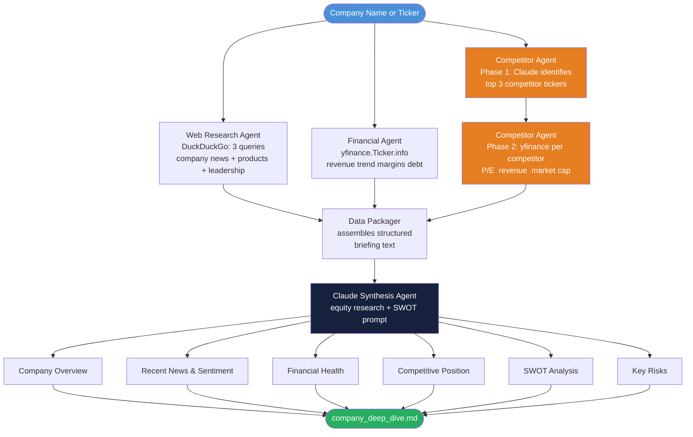
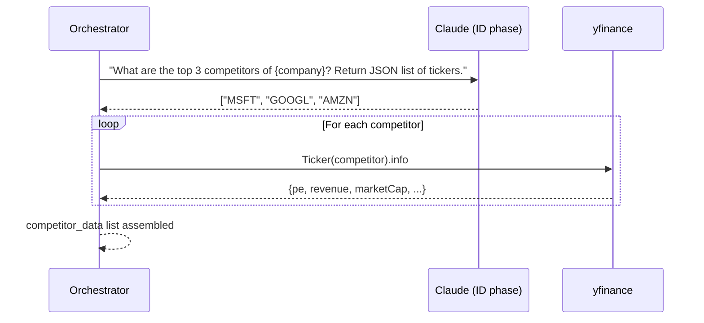

# Project 21 — Architecture

## How the System Works

Think of this as a newsroom. Three reporters each cover one beat — web news, financials, competitive landscape. They each file their copy independently. An editor (Claude) reads all three reports and writes the final article.

The key architectural insight: the reporters do not talk to each other. Each agent takes the same input (company name/ticker), does its own research, and returns structured data. The editor sees everything at once. This keeps the agents simple and the synthesis clean.

There is one exception: competitor identification requires a quick Claude call before the Competitor Agent can fetch data. You cannot know who the competitors are without asking. This creates a two-phase structure for that agent.

---

## Full System Architecture



---

## Agent Specifications

### Web Research Agent

Runs three DuckDuckGo queries and collects results:

| Query | Purpose |
|---|---|
| `"{company} company news 2025 2026"` | Recent events and announcements |
| `"{company} products services business model"` | What they actually do |
| `"{company} CEO leadership strategy"` | Who is running it and where it is going |

Returns up to 5 results per query. Each result has: `title`, `snippet`, `url`.

The `DDGS` class from `duckduckgo-search` provides a `.text()` method. Each result is a dict with `title`, `body`, and `href` keys.

---

### Financial Agent

Attempts `yfinance.Ticker(identifier).info` to detect if the company is public. Returns structured financial data or a "private company" flag.

| Field | Source |
|---|---|
| Revenue (TTM) | `totalRevenue` |
| Revenue growth (YoY) | `revenueGrowth` |
| Gross margin | `grossMargins` |
| Net margin | `profitMargins` |
| Debt-to-equity | `debtToEquity` |
| Current ratio | `currentRatio` |
| Free cash flow | `freeCashflow` |
| Market cap | `marketCap` |
| P/E ratio | `trailingPE` |

If the ticker is unknown or `.info` returns minimal data (e.g., `{'symbol': 'ZZZZZ'}`), the agent sets `is_public = False` and the report notes that financial data is unavailable.

---

### Competitor Agent

Two-phase operation:

**Phase 1 — Identification:** Claude is given the company name and a short description (from web research). It returns a JSON list of 3-4 competitor ticker symbols or company names.

**Phase 2 — Data fetch:** For each identified competitor, fetch basic financials from yfinance. If no ticker is available (private competitor), store only the name.



---

### Claude Synthesis Agent

Receives a single structured briefing and produces the full report in one call.

The briefing contains clearly labeled sections. Claude is instructed to:
- Write from the data, not from general knowledge
- Explicitly note when data is unavailable rather than inferring
- Ground every SWOT point in specific data from the briefing
- Keep the Key Risks section concrete and company-specific

---

## Data Packager Output Format

```
=== COMPANY INTELLIGENCE BRIEFING: {company} ===

--- COMPANY PROFILE (from web research) ---
Search results for "{company} products services business model":
1. [Title] Snippet text...
   Source: url

Search results for "{company} company news 2025 2026":
1. [Title] Snippet text...
...

--- FINANCIAL DATA ---
Status: Public Company (Ticker: AAPL)
Market Cap: $2.94T
Revenue (TTM): $394.3B
Revenue Growth (YoY): +4.1%
Gross Margin: 45.2%
Net Margin: 25.3%
Debt-to-Equity: 1.73
Current Ratio: 0.94
Free Cash Flow: $99.6B
P/E Ratio: 28.4

--- COMPETITOR DATA ---
Identified Competitors: MSFT, GOOGL, META

Competitor: Microsoft (MSFT)
  Market Cap: $3.14T  |  P/E: 34.2  |  Revenue Growth: +17.6%

Competitor: Alphabet (GOOGL)
  Market Cap: $2.04T  |  P/E: 22.1  |  Revenue Growth: +14.8%

Competitor: Meta Platforms (META)
  Market Cap: $1.52T  |  P/E: 25.3  |  Revenue Growth: +22.0%
```

---

## Error Handling Map

| Failure | Behavior |
|---|---|
| DuckDuckGo returns no results | Return empty list; report section notes "no results found" |
| Company is private (no ticker match) | Financial section says "Financial data not available — private company or no public listing found" |
| Competitor identifier is a company name not a ticker | Store name only, no yfinance fetch |
| yfinance rate limit during competitor fetch | Skip that competitor, log warning |
| Claude fails to parse competitor JSON | Fall back to empty competitor list |

---

## File Structure

```
21_Company_Deep_Dive_Agent/
├── 01_MISSION.md
├── 02_ARCHITECTURE.md
├── 03_GUIDE.md
├── src/
│   ├── starter.py       <- scaffolded version with TODO stubs
│   └── solution.py      <- complete working implementation
├── 04_RECAP.md
└── output/              <- created at runtime
    └── apple_deep_dive.md
```

---

## 📂 Navigation

**In this folder:**

| File | |
|---|---|
| [📄 01_MISSION.md](./01_MISSION.md) | Mission briefing |
| 📄 **02_ARCHITECTURE.md** | ← you are here |
| [📄 03_GUIDE.md](./03_GUIDE.md) | Step-by-step build guide |
| [📄 src/starter.py](./src/starter.py) | Starter scaffold |
| [📄 src/solution.py](./src/solution.py) | Complete solution |
| [📄 04_RECAP.md](./04_RECAP.md) | What you built |

⬅️ **Prev:** [01_MISSION.md](./01_MISSION.md) &nbsp;&nbsp;&nbsp; ➡️ **Next:** [03_GUIDE.md](./03_GUIDE.md)
