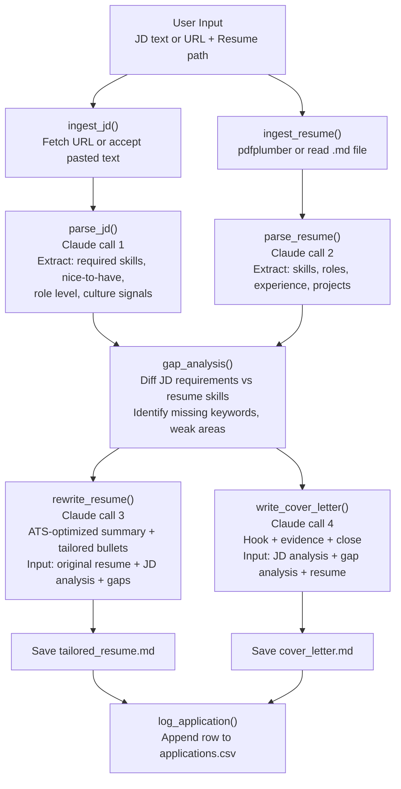
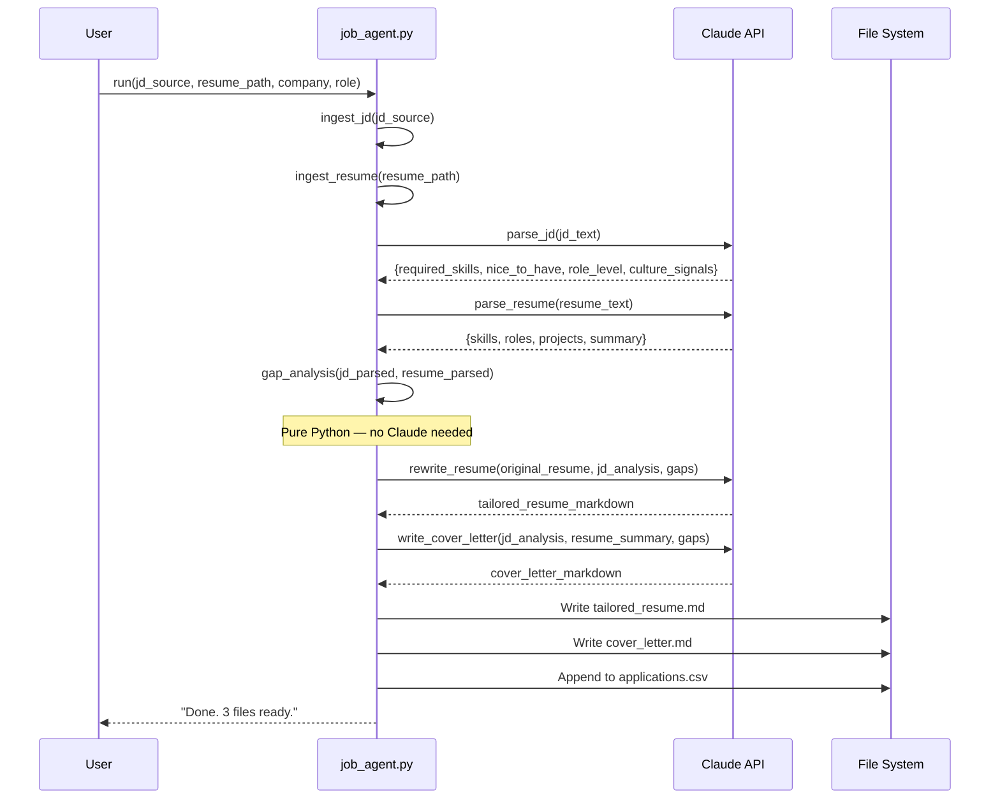

# Project 22 — AI Job Application Agent: Architecture

## System Overview

This agent is a linear pipeline, not a loop. Unlike a ReAct agent that decides its own steps, this pipeline has a fixed sequence: ingest → parse → analyze → generate → save. Each stage feeds the next. Claude is called three times — once to parse the JD, once to rewrite the resume, once to write the cover letter.

Think of it like an assembly line for a car. Each station does one job. The chassis goes in, stations add parts in order, a finished car comes out. The pipeline runs the same way every time. Predictability is a feature.

---

## Pipeline Architecture



---

## Component Table

| Component | Function | Input | Output |
|---|---|---|---|
| JD Ingestor | `ingest_jd()` | URL string or pasted text | Raw JD text string |
| Resume Ingestor | `ingest_resume()` | File path (.pdf or .md) | Raw resume text string |
| JD Parser | `parse_jd()` | Raw JD text | Dict: required_skills, nice_to_have, role_level, culture |
| Resume Parser | `parse_resume()` | Raw resume text | Dict: skills, roles, projects, years_experience |
| Gap Analyzer | `gap_analysis()` | JD dict + resume dict | Dict: gaps, strengths, keyword_matches |
| Resume Rewriter | `rewrite_resume()` | Original resume + JD analysis + gaps | Tailored resume Markdown string |
| Cover Letter Writer | `write_cover_letter()` | JD analysis + resume dict + gaps | Cover letter Markdown string |
| Application Logger | `log_application()` | All metadata | Row appended to `applications.csv` |

---

## Data Flow Between Components



---

## Claude Prompt Architecture

Each Claude call uses a structured XML-tagged prompt for consistent, parseable output.

### Call 1 — Parse JD

```
System: You are a recruiting analyst. Extract structured information from job descriptions.
        Always respond in valid JSON.

User:   Analyze this job description and return JSON with these exact keys:
        - required_skills: list of strings
        - nice_to_have: list of strings
        - role_level: one of ["Junior", "Mid", "Senior", "Staff", "Principal", "Director"]
        - culture_signals: list of strings (phrases that reveal company culture/values)
        - summary: 2-sentence plain English description of the role

        <job_description>
        {jd_text}
        </job_description>
```

### Call 2 — Parse Resume

```
System: You are a resume analyst. Extract structured information from resumes.
        Always respond in valid JSON.

User:   Analyze this resume and return JSON with these exact keys:
        - skills: list of strings (all technical and soft skills mentioned)
        - current_role: string
        - years_experience: integer (approximate)
        - roles: list of dicts [{title, company, duration, bullets}]
        - projects: list of strings
        - summary: existing summary paragraph or "" if none

        <resume>
        {resume_text}
        </resume>
```

### Call 3 — Rewrite Resume

```
System: You are an expert resume writer and ATS optimization specialist.
        You rewrite resumes to match job descriptions without fabricating facts.
        Preserve all factual content. Reframe and reorder to match JD keywords.

User:   Rewrite this resume to target the following role.

        <original_resume>
        {original_resume_text}
        </original_resume>

        <jd_analysis>
        Required skills: {required_skills}
        Nice-to-have: {nice_to_have}
        Role level: {role_level}
        Culture signals: {culture_signals}
        </jd_analysis>

        <gap_analysis>
        Gaps: {gaps}
        Strong matches: {strengths}
        </gap_analysis>

        Rules:
        1. Rewrite the summary section to open with the top 2 JD requirements
        2. Rewrite each bullet point to front-load impact metrics and JD keywords
        3. Do not add skills, companies, or roles that are not in the original resume
        4. Keep all dates, company names, and titles exactly as they appear
        5. Output the complete rewritten resume in Markdown format
```

### Call 4 — Cover Letter

```
System: You are a career coach who writes compelling, concise cover letters.
        Three paragraphs maximum. No fluff. No "I am writing to express interest."

User:   Write a cover letter for this application.

        <role>
        Company: {company}
        Title: {role}
        </role>

        <jd_analysis>
        {jd_analysis_json}
        </jd_analysis>

        <candidate_summary>
        {resume_summary}
        Current role: {current_role}
        Top matching skills: {strengths}
        </candidate_summary>

        Structure:
        Paragraph 1 (Hook): Open with the most compelling reason this candidate is
                             a direct match. Reference a specific JD requirement.
        Paragraph 2 (Evidence): Two concrete examples from experience that demonstrate
                                 the top 2 required skills.
        Paragraph 3 (Close): Why this company specifically. Reference a culture signal.
                             Clear CTA.

        Do not use: "I am excited", "I am passionate", "would be a great fit"
```

---

## Output File Formats

### tailored_resume.md

```markdown
# Jane Smith
jane@email.com | linkedin.com/in/janesmith | github.com/janesmith

## Summary
[Claude-rewritten summary targeting JD keywords]

## Skills
[Reordered to front-load JD-matched skills]

## Experience
### Senior Software Engineer — Acme Corp (2021–Present)
- [Rewritten bullet 1 with JD keyword + impact metric]
- [Rewritten bullet 2]
...
```

### cover_letter.md

```markdown
# Cover Letter — [Role] at [Company]
**Date:** [YYYY-MM-DD]

[Paragraph 1 — Hook]

[Paragraph 2 — Evidence]

[Paragraph 3 — Close]

Jane Smith
jane@email.com
```

### applications.csv

```
company,role,date_applied,status,jd_url,tailored_resume_path,notes
Acme Corp,Senior ML Engineer,2025-09-01,Applied,https://...,./output/tailored_resume_acme.md,
```

---

## Edge Cases

| Scenario | Handling |
|---|---|
| JD is a URL | `requests.get()` + BeautifulSoup to extract `<body>` text |
| JD is pasted text | Use directly, skip HTTP fetch |
| Resume is PDF | `pdfplumber.open()` — extract text page by page |
| Resume is Markdown | `open().read()` |
| Claude returns malformed JSON | `json.loads()` with try/except + retry with stricter prompt |
| `applications.csv` does not exist | Create it with header row on first run |
| Output folder does not exist | `os.makedirs("output", exist_ok=True)` |

---

## ATS Optimization Strategy

ATS (Applicant Tracking Systems) scan resumes for keyword density and section structure. The rewrite strategy targets three levers:

1. **Keyword injection** — required_skills from the JD are woven into bullet points and the summary if they are substantiated by actual experience
2. **Front-loading** — bullets start with impact verb + metric + JD keyword, not with vague descriptions
3. **Section order** — Skills section is moved immediately after Summary to maximize keyword hits in the first 200 words

---

## 📂 Navigation

**In this folder:**
| File | |
|---|---|
| [01_MISSION.md](./01_MISSION.md) | What you'll build |
| 02_ARCHITECTURE.md | ← you are here |
| [03_GUIDE.md](./03_GUIDE.md) | 9-step build guide |
| [src/starter.py](./src/starter.py) | Starter code with TODOs |
| [src/solution.py](./src/solution.py) | Complete working solution |
| [04_RECAP.md](./04_RECAP.md) | What you built and what's next |

⬅️ **Prev:** [21 — Claude Mastery](../../21_Claude_Mastery/Readme.md) &nbsp;&nbsp;&nbsp; ➡️ **Next:** [23 — Codebase Review Agent](../23_Codebase_Review_Agent/01_MISSION.md)
