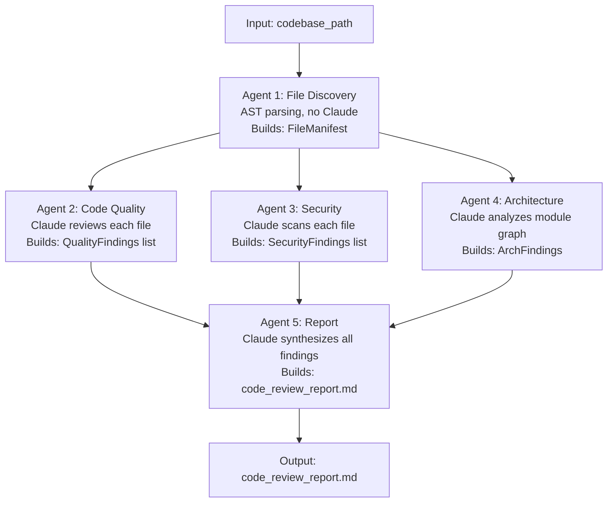
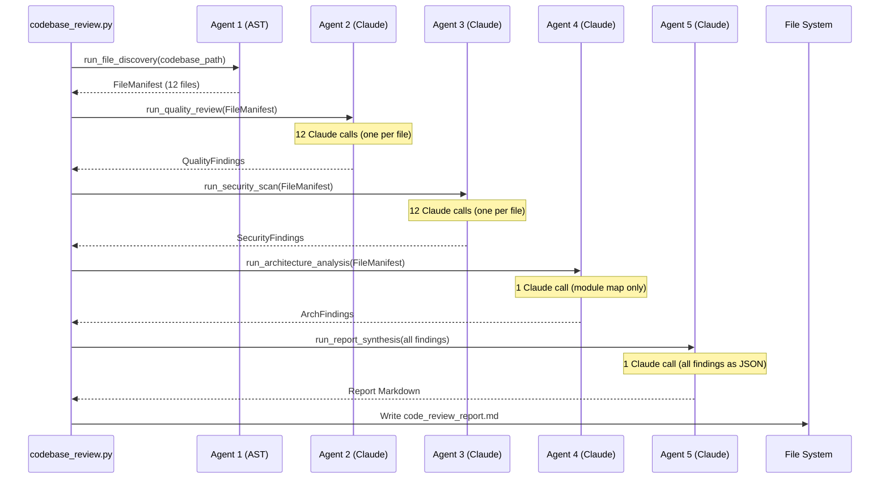
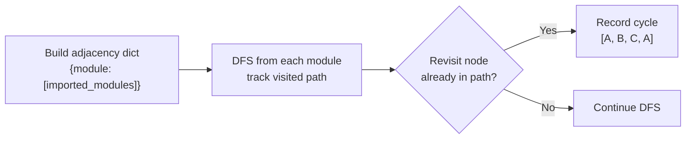

# Project 23 — Codebase Review Agent: Architecture

## System Overview

This is a **sequential multi-agent pipeline** where each agent produces a structured artifact consumed by the next. Unlike a loop-based ReAct agent, this system runs agents in a fixed order — each pass builds the context the next agent needs.

Think of it like a hospital handoff system. The admitting nurse takes vital signs (File Discovery). The attending physician reviews each chart (Code Quality). The pharmacist checks for drug interactions (Security). The department head reviews the org chart (Architecture). The CMO reads all reports and writes the executive summary (Report Agent). Each specialist sees everything the previous specialists found.

---

## Multi-Agent Pipeline



Agents 2, 3, and 4 can conceptually run in parallel (they all read from Agent 1's manifest). In this implementation they run sequentially to keep the code simple. The Architecture file notes where you could parallelize with `concurrent.futures` as a stretch goal.

---

## Agent Contracts

### Agent 1 — File Discovery

Input: `codebase_path: str`

Output: `FileManifest` — a list of file analysis dicts:

```python
[
    {
        "path": "/abs/path/to/file.py",
        "relative_path": "src/models.py",
        "lines": 89,
        "source": "...full source code...",
        "functions": ["get_user", "create_user", "delete_user"],
        "classes": ["UserModel", "UserManager"],
        "imports": ["os", "json", "sqlalchemy"],
        "has_docstrings": True,
    },
    ...
]
```

Uses Python's `ast` module only. No Claude call.

---

### Agent 2 — Code Quality

Input: `FileManifest`

Output: `QualityFindings` — a list:

```python
[
    {
        "file": "src/models.py",
        "issues": [
            {"severity": "medium", "description": "Function `get_user` is 78 lines long. Consider splitting."},
            {"severity": "low",    "description": "Class `UserModel` lacks docstring."},
        ],
        "positives": ["Clean naming conventions throughout."],
    },
    ...
]
```

Claude call: one call per file. Prompt includes file source, function list, class list.

---

### Agent 3 — Security

Input: `FileManifest`

Output: `SecurityFindings` — a list:

```python
[
    {
        "file": "src/config.py",
        "issues": [
            {
                "severity": "critical",
                "category": "hardcoded_secret",
                "description": "API key hardcoded at line 14: `API_KEY = 'sk-abc...'`",
                "line_hint": 14,
                "recommendation": "Move to environment variable: os.getenv('API_KEY')",
            },
        ],
    },
    ...
]
```

Claude call: one call per file. Prompt includes file source and a security checklist.

---

### Agent 4 — Architecture

Input: `FileManifest`

Output: `ArchFindings` — a single dict:

```python
{
    "circular_imports": [["src/models.py", "src/utils.py", "src/models.py"]],
    "god_classes": [
        {"class": "UserManager", "file": "src/models.py", "method_count": 12,
         "description": "Handles auth, DB, email, and caching — too many responsibilities."}
    ],
    "missing_abstractions": ["No repository layer — DB queries mixed directly into route handlers."],
    "module_observations": ["Clean separation between routes and models."],
}
```

Claude call: one call with the full module map (all file paths, imports, class/function names). Does not send full source code — too large.

---

### Agent 5 — Report

Input: `FileManifest + QualityFindings + SecurityFindings + ArchFindings`

Output: `code_review_report.md` written to disk.

Claude call: one final synthesis call. Receives all findings as structured JSON. Produces the full Markdown report.

---

## Data Flow Diagram



---

## AST-Based File Analysis

Python's `ast` module parses source code into an Abstract Syntax Tree without executing it. This is safe for analyzing untrusted code.

```python
import ast

source = open("file.py").read()
tree = ast.parse(source)

# Extract top-level function names
functions = [
    node.name
    for node in ast.walk(tree)
    if isinstance(node, ast.FunctionDef)
]

# Extract top-level class names
classes = [
    node.name
    for node in ast.walk(tree)
    if isinstance(node, ast.ClassDef)
]

# Extract import names
imports = []
for node in ast.walk(tree):
    if isinstance(node, ast.Import):
        imports.extend(n.name for n in node.names)
    elif isinstance(node, ast.ImportFrom):
        if node.module:
            imports.append(node.module)
```

For circular import detection: build an adjacency graph from all `import` statements, then check for cycles using DFS. See the Architecture Analysis section.

---

## Claude Prompt Architecture

### Agent 2 — Code Quality Prompt (per file)

```
System: You are a senior software engineer conducting a code review.
        Be specific. Reference actual function names, line counts, and patterns.
        Always return valid JSON.

User:   Review this Python file for code quality.

        File: {relative_path}
        Lines: {line_count}
        Functions: {function_list}
        Classes: {class_list}

        <source>
        {source_code}
        </source>

        Review for:
        1. Function length (>40 lines is a concern, >80 is a problem)
        2. Naming conventions (PEP 8 compliance)
        3. Docstring coverage (classes and public functions)
        4. Code duplication (obvious repeated blocks)
        5. Complexity (deeply nested logic, long parameter lists)
        6. Pythonic patterns (list comprehensions, context managers, etc.)

        Return JSON:
        {
          "file": "{relative_path}",
          "issues": [{"severity": "low|medium|high", "description": "..."}],
          "positives": ["..."]
        }
```

### Agent 3 — Security Prompt (per file)

```
System: You are a security engineer doing an OWASP-based code review.
        Be precise. Quote the vulnerable line or pattern when possible.
        Always return valid JSON.

User:   Scan this Python file for security issues.

        File: {relative_path}

        <source>
        {source_code}
        </source>

        Check for:
        1. Hardcoded secrets (passwords, API keys, tokens in string literals)
        2. SQL injection (string formatting or % used in SQL queries)
        3. Command injection (subprocess with shell=True + user input)
        4. Dangerous functions: eval(), exec(), pickle.loads(), yaml.load() without Loader
        5. Insecure deserialization
        6. Missing input validation on external data
        7. Debug endpoints or debug=True in production configs
        8. Overly broad exception handling that swallows errors silently

        Return JSON:
        {
          "file": "{relative_path}",
          "issues": [
            {
              "severity": "critical|high|medium|low",
              "category": "hardcoded_secret|sql_injection|...",
              "description": "...",
              "line_hint": null_or_integer,
              "recommendation": "..."
            }
          ]
        }

        If no issues found, return {"file": "...", "issues": []}
```

### Agent 4 — Architecture Prompt (module map)

```
System: You are a software architect reviewing a Python codebase's structure.
        Focus on module-level patterns, not line-level issues.
        Always return valid JSON.

User:   Analyze the architecture of this Python codebase.

        <module_map>
        {json_of_all_files_with_imports_classes_functions}
        </module_map>

        Analyze for:
        1. Circular imports (A imports B imports A)
        2. God classes (classes with >8 methods that span multiple responsibilities)
        3. Missing abstraction layers (e.g., DB queries in route handlers)
        4. Tight coupling (modules that import from many other internal modules)
        5. Single Responsibility Principle violations at the module level

        Return JSON:
        {
          "circular_imports": [[...cycle path...]],
          "god_classes": [{"class": "...", "file": "...", "method_count": N, "description": "..."}],
          "missing_abstractions": ["..."],
          "tight_coupling": ["..."],
          "module_observations": ["...positive or neutral observations..."]
        }
```

### Agent 5 — Report Synthesis Prompt

```
System: You are a technical lead writing a formal code review report.
        Be direct. Prioritize by impact. No filler.

User:   Synthesize these findings into a complete code review report.

        <quality_findings>
        {json}
        </quality_findings>

        <security_findings>
        {json}
        </security_findings>

        <architecture_findings>
        {json}
        </architecture_findings>

        <file_stats>
        Total files: N | Total lines: N | Functions: N | Classes: N
        </file_stats>

        Write a Markdown report with these exact sections:
        # Code Review Report
        ## Executive Summary
          - Overall quality score (1-10) with one-paragraph justification
        ## Critical Issues
          - Security and correctness bugs only. Each issue: file, description, recommendation.
        ## Improvement Suggestions
          - Ranked by impact (highest first). Each: description, affected file(s), recommendation.
        ## Architecture Observations
          - Module-level patterns, structural issues, design recommendations.
        ## Positive Patterns
          - What is done well. Be specific.

        Use Markdown headers, bullet points, and code snippets where helpful.
        Be concise. No padding.
```

---

## Circular Import Detection

To detect circular imports without running the code:



Python implementation sketch:

```python
def find_cycles(graph: dict) -> list:
    """DFS-based cycle detection in import graph."""
    cycles = []
    visited = set()

    def dfs(node, path):
        if node in path:
            cycle_start = path.index(node)
            cycles.append(path[cycle_start:] + [node])
            return
        if node in visited:
            return
        visited.add(node)
        for neighbor in graph.get(node, []):
            dfs(neighbor, path + [node])

    for node in graph:
        dfs(node, [])
    return cycles
```

This runs on the import graph extracted by Agent 1 — no Claude needed.

---

## Report Quality Heuristics

The report agent prompt includes a scoring rubric to anchor the quality score:

| Score | Meaning |
|---|---|
| 9-10 | Production-ready. Minor style issues only. |
| 7-8 | Good quality. A few medium issues. No critical issues. |
| 5-6 | Functional but needs work. Multiple medium issues or 1-2 high issues. |
| 3-4 | Significant problems. High-severity bugs or security issues. |
| 1-2 | Critical issues. Not safe to deploy. |

---

## 📂 Navigation

**In this folder:**
| File | |
|---|---|
| [01_MISSION.md](./01_MISSION.md) | What you'll build |
| 02_ARCHITECTURE.md | ← you are here |
| [03_GUIDE.md](./03_GUIDE.md) | 10-step build guide |
| [src/starter.py](./src/starter.py) | Skeleton with contracts |
| [src/solution.py](./src/solution.py) | Complete working solution |
| [04_RECAP.md](./04_RECAP.md) | What you built and what's next |

⬅️ **Prev:** [22 — AI Job Application Agent](../22_AI_Job_Application_Agent/01_MISSION.md) &nbsp;&nbsp;&nbsp; ➡️ **Back to Projects README**
