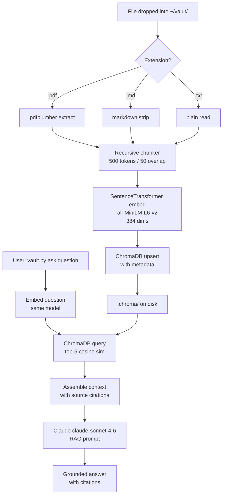

# Project 24 — Architecture

## The Filing Cabinet Analogy

An ordinary filing cabinet stores documents by physical location — drawer 3, folder B, tab 7. To find a document you must already know where you put it. A knowledge vault works the opposite way: documents are stored by meaning. Every sentence in every document gets translated into a point in a high-dimensional space where similar ideas live close together. Ask a question and you find every relevant sentence — regardless of which file it came from.

The translation step — turning text into a vector — is called **embedding**. The database that stores those vectors and answers similarity queries is the **vector store**. Everything else in the system is plumbing that feeds documents into the embedding step and takes questions out through the answer step.

---

## System Overview

```
┌─────────────────────────────────────────────────────────────┐
│                    VAULT CLI (vault.py)                      │
│                                                              │
│   vault.py watch          vault.py ask "question"           │
│        │                          │                         │
│        ▼                          ▼                         │
│  ┌──────────────┐         ┌───────────────┐                 │
│  │ File Watcher │         │  Query Agent  │                 │
│  │  (watchdog)  │         │  (anthropic)  │                 │
│  └──────┬───────┘         └───────┬───────┘                 │
│         │                         │                         │
│         ▼                         ▼                         │
│  ┌─────────────────────────────────────────────────────┐    │
│  │             Ingestion Pipeline                       │    │
│  │                                                      │    │
│  │  parse() → chunk() → embed() → store()              │    │
│  └──────────────────────┬──────────────────────────────┘    │
│                         │                                    │
│                         ▼                                    │
│              ┌──────────────────────┐                       │
│              │    ChromaDB (local)   │                       │
│              │  .chroma/ directory  │                       │
│              └──────────────────────┘                       │
└─────────────────────────────────────────────────────────────┘
```

---

## Component Breakdown

### 1. File Watcher

watchdog's `Observer` runs in a background thread and emits `FileCreatedEvent` and `FileModifiedEvent` for any file dropped into `~/vault/`. The event handler filters by extension (`.pdf`, `.md`, `.txt`) and calls the ingestion pipeline.

### 2. Ingestion Pipeline

The pipeline has four stages executed sequentially per document:

```
Stage 1 — Parse
  .pdf  → pdfplumber: iterate pages, extract text, join with newline
  .md   → strip markdown syntax, preserve paragraph breaks
  .txt  → read directly, normalize whitespace

Stage 2 — Chunk
  RecursiveCharacterTextSplitter:
    chunk_size    = 500 tokens (approx 2,000 chars)
    chunk_overlap = 50 tokens  (approx 200 chars)
  Result: list of text strings + their start offsets

Stage 3 — Embed
  model = SentenceTransformer("all-MiniLM-L6-v2")
  Each chunk → 384-dimensional float vector

Stage 4 — Store
  ChromaDB collection: "vault"
  Document ID: sha256(filename + chunk_index)
  Payload: { text, filename, date_added, chunk_index }
```

Duplicate detection: the SHA-256 ID ensures re-ingesting an unchanged file is a no-op at the ChromaDB level. Modifying a file re-ingests all its chunks (old IDs are deleted first).

### 3. Vector Store (ChromaDB)

ChromaDB is a local, file-backed vector database. It writes to `.chroma/` in the current directory. No server process is required. Queries use cosine similarity by default. The collection schema:

```
collection: "vault"
  id:        str  (sha256 hash)
  embedding: List[float]  (384 dims from all-MiniLM-L6-v2)
  document:  str  (raw chunk text)
  metadata:
    filename:    str
    date_added:  str (ISO 8601)
    chunk_index: int
```

### 4. Query Agent

When the user calls `vault.py ask "..."`, the system:

1. Embeds the query with the same sentence-transformers model
2. Runs `collection.query(query_embeddings=[...], n_results=5)`
3. Assembles the 5 retrieved chunks into a context block
4. Sends to Claude with a RAG prompt: "Answer using only the provided context. Cite sources."
5. Prints Claude's response plus the source metadata

---

## Data Flow Diagram



---

## Chunking Strategy — Why 500/50

Think of a document as a long scroll. You want to cut it into windows that are:

- Large enough to contain a complete thought (too small = fragments without context)
- Small enough to stay focused (too large = chunk contains multiple unrelated ideas, retrieval gets noisy)
- Overlapping slightly so a sentence on a boundary does not get orphaned

500 tokens (~375 words) is large enough for most technical paragraphs. 50 tokens overlap means the last ~2 sentences of one chunk appear again at the start of the next, preserving continuity across boundaries.

---

## Embedding Model Choice

`all-MiniLM-L6-v2` is a 22M parameter model that runs locally in under 100ms per chunk on CPU. It produces 384-dimensional vectors. For a personal vault with hundreds of documents this is more than sufficient. No API calls, no cost, no latency spike. If you have a large vault and need better semantic matching, swap to `all-mpnet-base-v2` (768 dims, 2x slower, noticeably better quality).

---

## Why Local vs Cloud Vector DB

A personal knowledge vault should not send your private documents to a third-party API. ChromaDB stores everything in a local `.chroma/` folder. There is no server to run, no account to create, no monthly bill. For a single user with thousands of documents, a local SQLite-backed vector store is plenty fast.

---

## 📂 Navigation

| File | |
|------|---|
| [01_MISSION.md](./01_MISSION.md) | Project brief |
| **02_ARCHITECTURE.md** | You are here |
| [03_GUIDE.md](./03_GUIDE.md) | 10-step build guide |
| [src/starter.py](./src/starter.py) | Starter scaffold |
| [src/solution.py](./src/solution.py) | Complete reference solution |
| [04_RECAP.md](./04_RECAP.md) | What you learned, career framing |
