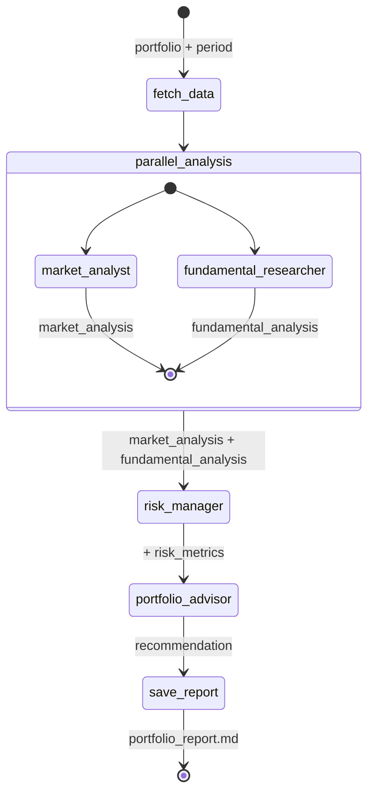
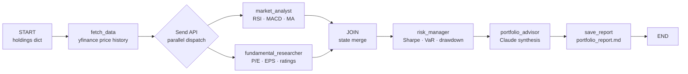

# Project 25 — Architecture

## The Orchestra Analogy

A symphony orchestra does not have one musician who plays all instruments sequentially. It has specialists — strings, brass, woodwinds, percussion — performing simultaneously under a conductor who coordinates timing and blends the outputs into a coherent whole.

LangGraph is the conductor. Each agent is a section. The state object is the shared score — every musician can read it, and each one writes their part into it. The final performance (the portfolio report) only exists because every section contributed at the right time.

---

## LangGraph State Design

The entire system communicates through a single shared state object. This is the TypedDict that flows through every node:

```python
class PortfolioState(TypedDict):
    # Input
    holdings: dict[str, float]          # {"AAPL": 0.25, "MSFT": 0.20, ...}
    period: str                          # "1y", "6mo", etc.

    # Agent outputs (populated by each specialist)
    market_analysis: dict               # RSI, MACD, trend per ticker
    fundamental_analysis: dict          # P/E, EPS, analyst rating per ticker
    risk_metrics: dict                  # Sharpe, max_drawdown, VaR, correlation

    # Final output
    recommendation: str                 # markdown report text
    report_path: str                    # path to saved report file
```

No agent knows about any other agent's internal logic. They only read from and write to this shared state.

---

## LangGraph State Diagram



---

## Execution Flow Diagram



---

## Agent Responsibilities

### Node 1: fetch_data

Not an LLM agent — a pure Python node. Fetches historical price data for all tickers using yfinance. Stores a price DataFrame in state. This runs first because both parallel agents need it.

```
Input:  holdings (dict), period (str)
Output: state["price_data"] — pandas DataFrame, tickers as columns
```

### Node 2a: market_analyst (parallel)

Receives the price DataFrame. Computes for each ticker:
- RSI (14-period): relative strength index indicating overbought/oversold
- MACD (12/26/9): momentum oscillator, signal line crossover
- MA-50 / MA-200: trend direction, golden cross / death cross detection

Passes its structured findings to Claude for interpretation ("Given these technical indicators, summarize the market outlook for each position in 2-3 sentences").

```
Input:  state["price_data"]
Output: state["market_analysis"] — dict of {ticker: {rsi, macd_signal, trend, summary}}
```

### Node 2b: fundamental_researcher (parallel)

Fetches from yfinance for each ticker:
- trailingPE, forwardPE (valuation)
- trailingEps, revenueGrowth (earnings quality)
- recommendationKey (analyst consensus: buy/hold/sell)
- targetMeanPrice vs currentPrice (upside potential)

Passes findings to Claude for a concise fundamentals narrative per ticker.

```
Input:  state["holdings"]
Output: state["fundamental_analysis"] — dict of {ticker: {pe, eps, rating, upside_pct, summary}}
```

### Node 3: risk_manager

Runs after both parallel nodes complete. Computes portfolio-level metrics:

| Metric | Formula |
|--------|---------|
| Annualized return | `mean(daily_returns) * 252` |
| Annualized volatility | `std(daily_returns) * sqrt(252)` |
| Sharpe ratio | `(annualized_return - 0.04) / annualized_vol` |
| Max drawdown | `(peak - trough) / peak` over the period |
| VaR 95% | 5th percentile of daily return distribution |
| Correlation matrix | `price_df.pct_change().corr()` |

```
Input:  state["price_data"], state["holdings"]
Output: state["risk_metrics"] — {sharpe, max_drawdown, var_95, correlation_matrix}
```

### Node 4: portfolio_advisor

The synthesis node. Receives all three specialist outputs. Calls Claude with all findings assembled into a rich prompt. Claude reasons across the technical picture, fundamental quality, and risk profile to produce:

1. Current State section — portfolio composition, performance summary
2. Market Analysis section — technical outlook per position
3. Fundamental Analysis section — valuation and quality per position
4. Risk Assessment section — Sharpe, drawdown, concentration risk
5. Recommended Actions section — specific buy/hold/trim/sell per position with target allocation percentages and 2-sentence rationale per change

```
Input:  all state fields
Output: state["recommendation"] — full markdown report as string
```

### Node 5: save_report

Writes `state["recommendation"]` to `portfolio_report.md`. Returns `state["report_path"]`.

---

## Parallel Execution via Send API

LangGraph's `Send` API dispatches multiple nodes simultaneously. The `fetch_data` node returns a list of `Send` objects — one for `market_analyst` and one for `fundamental_researcher`. LangGraph executes them in parallel threads and merges their state outputs via a reducer before passing to `risk_manager`.

```python
def fetch_data(state: PortfolioState) -> list[Send]:
    # ... fetch price data, store in state ...
    return [
        Send("market_analyst", state),
        Send("fundamental_researcher", state),
    ]
```

This is the key architectural pattern: the Send API is what makes true parallelism possible in LangGraph without external task queues.

---

## Data Quality Notes

yfinance returns real financial data but it has limits:

- P/E ratios may be missing for newly listed companies or companies with negative earnings
- Analyst ratings are not available for all tickers
- Price data gaps (holidays, suspensions) require forward-fill before computing indicators
- All agents should handle `None` / `NaN` gracefully — missing data is not a bug, it is a constraint to report

---

## 📂 Navigation

| File | |
|------|---|
| [01_MISSION.md](./01_MISSION.md) | Project brief |
| **02_ARCHITECTURE.md** | You are here |
| [03_GUIDE.md](./03_GUIDE.md) | Build-yourself spec |
| [src/starter.py](./src/starter.py) | Starter scaffold |
| [src/solution.py](./src/solution.py) | Complete reference solution |
| [04_RECAP.md](./04_RECAP.md) | What you learned |
