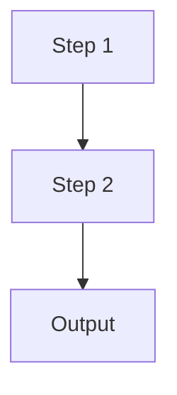
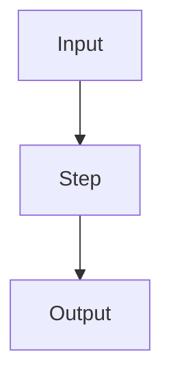

# CLAUDE.md

This file provides guidance to Claude Code (claude.ai/code) when working with code in this repository.

## Repository Purpose

An educational knowledge base covering AI/ML from zero to production — structured as a storytelling-first, visual-heavy collection of Markdown files. Not a software application; no build/test pipeline.

## Scaffold Script

`scaffold.py` — run once from repo root to create all folders and stub files:
```bash
python scaffold.py
```
Safe to re-run: skips files that already exist.

---

## Complete Repo Structure

Numbered top-level sections (00–13). Each section has topic subfolders:

| Section | Topic |
|---|---|
| `00_Learning_Guide/` | How to use the repo, learning path |
| `01_Math_for_AI/` | Probability, Statistics, Linear Algebra, Calculus |
| `02_Machine_Learning_Foundations/` | What is ML, training, evaluation, overfitting |
| `03_Classical_ML_Algorithms/` | Linear/Logistic regression, Trees, SVM, Clustering, PCA |
| `04_Neural_Networks_and_Deep_Learning/` | Perceptron → CNNs, RNNs, GANs |
| `05_NLP_Foundations/` | Preprocessing, Tokenization, Embeddings |
| `06_Transformers/` | Attention → BERT, GPT, ViT |
| `07_Large_Language_Models/` | Pretraining, Fine-tuning, RLHF, Hallucination, APIs |
| `08_LLM_Applications/` | Prompt Engineering, Tool Calling, Vector DBs |
| `09_RAG_Systems/` | Full RAG pipeline + Advanced techniques + build project |
| `10_AI_Agents/` | ReAct, Tool Use, Memory, Multi-agent, Frameworks |
| `11_MCP_Model_Context_Protocol/` | Architecture, building servers, ecosystem |
| `12_Production_AI/` | Serving, Latency, Cost, Observability, Safety |
| `13_AI_System_Design/` | Full system blueprints (support agent, RAG app, etc.) |

Legacy content: `AI-Basics/` and `AI-Gernalist/` remain for reference.

---

## Files Per Topic Folder

### Standard files (EVERY topic gets these 3)
| File | Purpose |
|---|---|
| `Theory.md` | Storytelling explanation + **inline Mermaid diagrams** (beginner → deep dive) |
| `Cheatsheet.md` | Quick-reference card |
| `Interview_QA.md` | 10+ Q&As across beginner / intermediate / advanced |

### Extra files added for specific topics
| File | When to add |
|---|---|
| `Code_Example.md` | Any algorithm or implementation topic |
| `Math_Intuition.md` / `Intuition_First.md` | Math-heavy topics |
| `Visual_Intuition.md` | Topics that benefit from animated/step-by-step diagrams |
| `Architecture_Deep_Dive.md` | Complex systems (Transformer, RAG, Agents) |
| `Comparison.md` | Topics with multiple variants to compare |
| `Code_Cookbook.md` | LLM APIs and practical code collections |
| `Common_Mistakes.md` | Tricky topics with frequent beginner errors |
| `Mini_Exercise.md` | Hands-on tasks to cement understanding |
| `Project_Guide.md` + `Step_by_Step.md` | Build chapters (RAG app, Agent) |
| `Architecture_Blueprint.md` | System design chapters |

---

## Content Template — `Theory.md`

Every Theory.md MUST follow this structure exactly:

```markdown
# Topic Name

## The Story 📖
[1–3 relatable everyday scenarios that MOTIVATE the concept]
[End with:] 👉 This is why we need **Topic** — [one-line reason].

## What is [Topic]?
[Formal definition in plain language]
[Think of it as ...]
[Bullet breakdown of how it works at high level]

#### Real-world examples
- **Use case:** description

## Why It Exists — The Problem It Solves
[2–3 numbered problems with sub-examples]
👉 Without [Topic]: [consequence]. With [Topic]: [benefit].

## How It Works — Step by Step
### Step 1: [Name]
[Description + analogy]



[Optional: condensed pipeline summary]

## The Math / Technical Side (Simplified)
[Formula if needed, plain-English explanation of what each term means]

## Where You'll See This in Real AI Systems
[Practical usage — name real products/frameworks]

## Common Mistakes to Avoid ⚠️
- Mistake 1: [description]

## Connection to Other Concepts 🔗
- Relates to [Topic X] because ...

---
✅ **What you just learned:** [one sentence]
🔨 **Build this now:** [tiny hands-on task]
➡️ **Next step:** [what to study next + link]

---

## 📂 Navigation

**In this folder:**
| File | |
|---|---|
| 📄 **Theory.md** | ← you are here |
| [📄 Cheatsheet.md](./Cheatsheet.md) | Quick reference |
| [📄 Interview_QA.md](./Interview_QA.md) | Interview prep |
| [📄 Extra_File.md](./Extra_File.md) | (include only if this folder has extra files) |

⬅️ **Prev:** [Previous Topic Name](../prev_folder/Theory.md) &nbsp;&nbsp;&nbsp; ➡️ **Next:** [Next Topic Name](../next_folder/Theory.md)
```

---

## Content Template — `Visual_Guide.md`

```markdown
# Topic Name — Visual Guide

## Big Picture
[Mermaid flowchart]



## Step-by-Step Flow
[Mermaid sequence diagram or numbered ASCII art]

## Mental Model
[ASCII representation or table]

## Key Numbers / Dimensions
[Table: component → shape/size/description]
```

## Content Template — `Cheatsheet.md`

```markdown
# Topic Name — Cheatsheet

## Key Terms
| Term | One-line meaning |

## Core Formula / Rule
...

## When to Use vs When NOT to Use
| ✅ Use when | ❌ Avoid when |

## Quick Decision Guide
[Short flowchart or bullet tree]

## Golden Rules
1. ...
```

## Content Template — `Interview_QA.md`

```markdown
# Topic Name — Interview Q&A

## Beginner Level
**Q1:** [simple conceptual question]
**A:** [clear answer]

## Intermediate Level
**Q4:** [requires understanding of internals]

## Advanced Level
**Q8:** [design / trade-off question]

## System Design Questions (if applicable)
**Q10:** How would you design a system that uses [Topic]?
```

---

## Tone & Style Rules

- **Story first, jargon second.** Every concept gets a real-life analogy before technical terms.
- **Bold key terms** on first use.
- Use `---` to separate major sections.
- Mermaid diagrams preferred for flowcharts/architecture (renders on GitHub).
- Emojis only in section headings, not body text.
- Each Theory.md ends with the ✅ / 🔨 / ➡️ block — always.
- Every file ends with a `## 📂 Navigation` block showing: files in current folder + ⬅️ prev topic + ➡️ next topic.
- Cheatsheet.md and Interview_QA.md also get the navigation block at the bottom.
